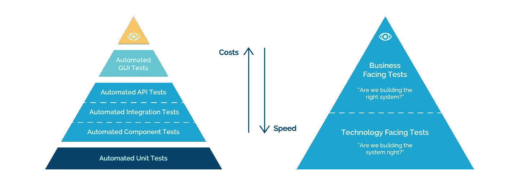

# 开发人员应该编写自动化测试吗？

> 原文：<https://medium.com/geekculture/should-devs-write-automation-tests-a23e2e838424?source=collection_archive---------6----------------------->

to write or not to write, this is the question — [src](https://memegenerator.net/img/instances/65777798/automation.jpg)

在我所在的每个团队中，都有一个关于这一点的争论:开发人员应该将自动化测试作为开发过程的一部分吗？他们刚刚完成需求的实现，并编写了一些单元测试；现在，他们也应该写自动化测试吗？

嗯，答案，“看情况”。

取决于人们的技能，团队的结构。当你有没有技能/时间/资源等的手动/探索测试人员时。要编写自动化测试，你可以依靠开发人员。因此，如果开发人员为他们正在开发的新功能编写测试，效率会高得多。

types of automation tests (Atlassian)— [src](https://3kllhk1ibq34qk6sp3bhtox1-wpengine.netdna-ssl.com/wp-content/uploads/03-Piramides-03-03-1400x531.png)

假设您的测试团队拥有开发自动化测试的技能和资源。每个组使用不同的库和设计模式。显然，在这种情况下，开发人员创建新的特性并由测试人员产生测试更实际。

话虽如此，更重要的问题是，开发人员是否可以成为唯一一个为他们正在开发的特性编写自动化测试的人？

答案很大程度上取决于您的组织、您的资源、遗漏缺陷的可能性、正在编写的自动化测试的种类、开发风格、谁的时间在哪个任务上利用得更好，当然，还有办公室政治(唉，这是不可避免的)。一般来说，至少应该有另外一个人和开发人员一起测试代码。

inattentional blindness — [src](https://memegenerator.net/instance/68771099/willy-wonka-oh-inattentional-blindness-isnt-real-bet-you-didnt-see-this-coming)

开发人员很容易想当然地认为，“这一个区域不可能引起任何问题，所以我不必测试它。”或者“我上周已经测试过了，所以应该没问题。”这被称为[疏忽盲](https://en.wikipedia.org/wiki/Inattentional_blindness)，在开发过程中对代码的熟悉导致潜在问题被遗漏。

然而，这并不意味着他们不应该创建这些测试。他们可能仍然是编写自动化的最佳人选。例如，如果开发团队的其他成员被占用。测试团队主要由手工测试人员组成。编写特性的开发人员是编写自动化的最佳人选。正因为如此，我建议最有效的实践是让测试人员帮助识别哪些测试用例提供了最大的价值，并指定参数。从那里，开发人员可以实现那些测试用例。

## 综上

我的经验是，开发人员 ***必须*** 为他们的特性编写自动化测试，特别是当这些类型的测试需要对应用程序的内部结构有深入的了解，而测试人员可能无法接触到的时候。

虽然这造成了冲突，因为，一方面，你希望有人编写公正的测试，而另一方面，开发人员将更快地编写质量测试，这将增强他们的主人翁意识。此外，请记住，不是每个团队都有招募专门的测试工程师的好处，所以最终，开发人员必须加入这个团队。

相反，如果那些测试不需要任何内部知识，就像在功能、API 或 GUI 测试的情况下，那么雇用测试人员来完成这项任务会更有效。此外，开发团队的时间限制也会发挥作用，比如当一个新项目开始时，因此更明智的做法是分散精力来防止瓶颈。

code quality — [src](https://i1.wp.com/mlinproduction.com/wp-content/uploads/2020/05/tests-cant-fail.png?w=700&ssl=1)

无论谁编写自动化测试，其他人都应该检查代码质量、遗漏的场景和高代码覆盖率。

记住，最终的目标是创造出**高质量的**软件。你做的任何能让你更接近那个目标的事情都会很棒。

if you liked it…