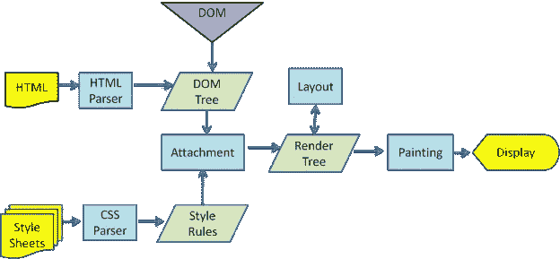

# 浏览器中的 HTML 解析是否应该标准化？

> 原文：<https://medium.com/geekculture/should-html-parsing-in-browsers-be-standardized-50f5012ae9f7?source=collection_archive---------29----------------------->

答案可能在现代浏览器的词法分析和解析与过去 XHTML 的僵化之间。


A good HTML parser puts lipstick on a pig.

在 20 世纪 90 年代早期图形 web 浏览器的出现中，Netscape Navigator 做出了一个重要的决定——在像 XHTML 这样的更严格的推动下，它已经用 HTML5 模拟了我们今天所知道的互联网:

# 他们认为浏览器实现的 HTML 解析器不能严格解析标记。

*严格解析？这意味着什么呢？*当你访问一个网页时，HTML 解析器有一项重要的工作。这些由数百万行 C++代码组成的浏览器不仅利用 HTTP 来代表您请求资源，而且还要在您的屏幕上显示返回的内容——更具体地说，是在您的浏览器窗口中。

这个过程看起来有点像下图



Note: this is a WebKit model but all modern browsers share the HTML parsing step.

任何 HTML 文件形式的资源都是通过 HTML 解析器运行的，解析器构建了一个由称为节点的元素组组成的 DOM 树。一个单独的 CSS 解析器将样式应用于每个节点。布局过程准确地确定了每个节点在浏览器中的显示位置。最后，一幅内容丰富的画面出现在你所请求的网站的屏幕上。但是如果 HTML 文件是…嗯..*不好，语义 HTML* ？

**不管怎样，这是有效的。**没错——它确实有效。这些底层的 HTML 解析器已经变成了一种黑盒，它会接收无数行 HTML，宽容地解释其中的所有错误，并且不管它是不是有效的标记，都会组装一个作为该标记结果的 DOM 树。也就是说，即使这个标记…

```
<html>
  <mytag>
  </mytag>
  <div>
  <p>
  </div>
    Really lousy HTML
  </p>
</html>
```

…会工作得很好。

# 那么问题是什么呢？

在我看来，问题是 HTML 规范从来没有真正给出任何关于浏览器应该如何处理这些不同错误的硬性规则。在一个每个人都参与建设一个更好、更快的互联网的世界里，我认为我们忽略了一个事实，即解析标记是一个问题，原因有几个。

## 1.解析器本身需要解决这些错误，这并不总是容易做到的。看看 WebKit 关于错误处理的评论:

> “……我们必须至少注意以下错误情况:
> 
> 被添加的元素在一些外部标签中被明确禁止。在这种情况下，我们应该关闭所有标签，直到禁止该元素的标签，然后再添加它。
> 
> 我们不允许直接添加元素。可能是写文档的人忘记了中间的某个标签(或者中间的标签是可选的)。以下标签可能就是这种情况:HTML HEAD BODY TBODY TR TD LI(我忘记了什么吗？).
> 
> 我们希望在内联元素中添加一个 block 元素。关闭所有行内元素，直到下一个更高的块元素。
> 
> 如果这不起作用，请关闭元素，直到我们被允许添加元素——或者忽略标签。你有没有见过互联网发展到这样的地步…

## **2。由于浏览器之间没有标准化，不同的解析器可以用不同的方式解决这些错误。**

让我们再来看一下前面的例子。

```
<html>
  <mytag>
  </mytag>
  <div>
  <p>
  </div>
    Really lousy HTML
  </p>
</html>
```

由于每种主流的现代浏览器对这些日益复杂的解析器都有不同的实现，人们可能会将上面的标记与此相协调:

```
<div>
  <p>
    Really lousy HTML
  </p>
</div>
```

…另一个，这个:

```
<p>
  Really lousy HTML
</p>
```

…第三，这个:

```
Really lousy HTML
```

…完全没有包装标签！因为是由浏览器来决定最终产品应该是什么，这增加了开发人员和用户在浏览器之间的不一致性。

# 3.它是懒惰的，并且没有朝着更好、更快的互联网努力

HTML5 侧重于语法特性和语义元素、对 SVG 的支持以及其他改进中的新属性。他们甚至就[如何在解析器](https://www.w3.org/TR/2011/WD-html5-20110113/parsing.html)中解决错误提出了一些建议。我们非常愿意建立一个更好、更快的互联网，但在我看来，通过重新审视我们在标记中的僵化和控制，使互联网标准化，并在我们为 web 应用程序创建的结构中，使从语义 html 到可访问性功能的一切都成为一种要求，而不是一种功能，可以做出巨大的改进。