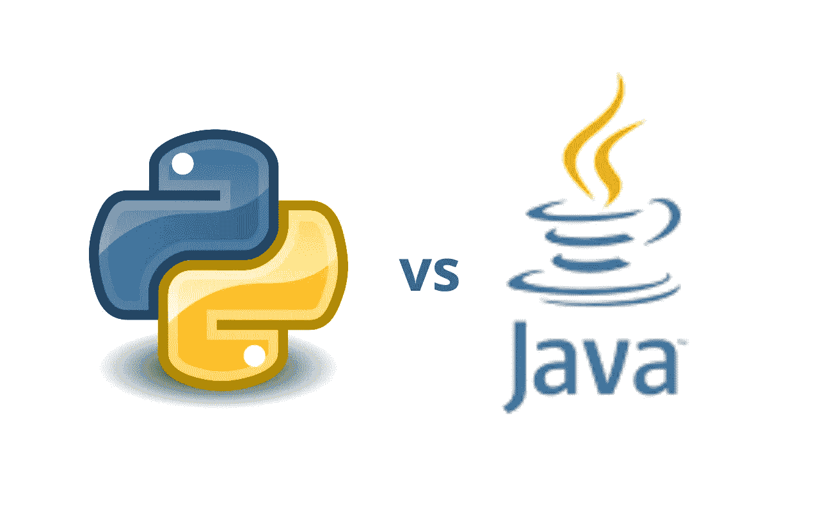

# 我该学 Java 还是 Python？

> 原文：<https://medium.com/geekculture/should-i-learn-java-or-python-a849b9eb29df?source=collection_archive---------9----------------------->

## 如果我们可以走捷径，为什么要走长路呢？

Should I learn Java or Python?

许多人放弃了软件工程领域，因为他们发现编程太难了。第一编程语言的选择可以决定你是否喜欢这个职业。“我该学 Java 还是 Python？”是一个很好的问题。

## 我的第一次编程经历