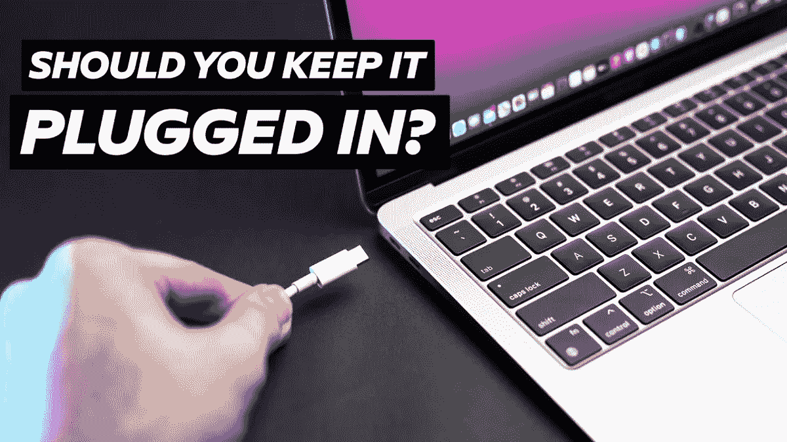

# 你应该让你的 Mac 保持接通电源吗？终极电池指南！

> 原文：<https://medium.com/geekculture/should-you-keep-your-mac-plugged-in-ultimate-battery-guide-a09ebca1cf5f?source=collection_archive---------0----------------------->

## 但是“永远不要”这样做

Source — Author

> *对你的 MacBook 的电池感到困惑，我来为你解惑！*

我先来讨论一下 MacBook 电池背后的技术。传统上，苹果将锂离子电池放在他们的 MAC 电脑和普通设备中，因为它们拥有大量的电荷，可以让机器工作很长时间…