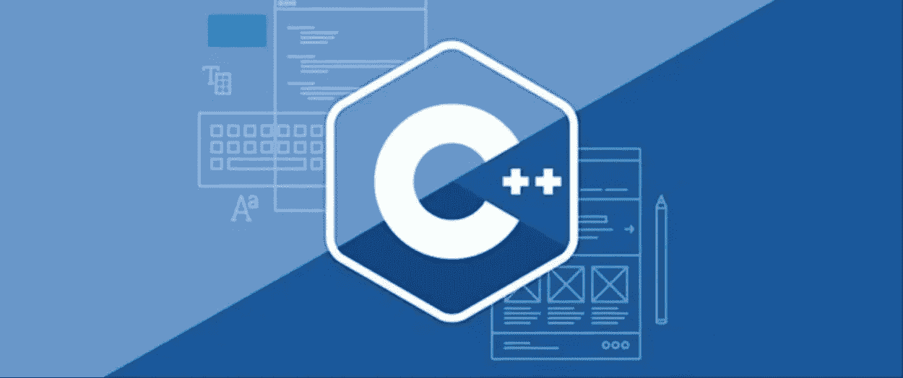

# 2022 年该不该学 C++？让我们听听亚马逊、谷歌、领英、苹果、微软怎么说…

> 原文：<https://medium.com/geekculture/should-you-learn-c-in-2021-d13b6d8efec1?source=collection_archive---------13----------------------->

C++创建于 80 年代，2021 年学习 C++还有价值吗？

[https://res.cloudinary.com/practicaldev/image/fetch/s--3u1aWUCM--/c_imagga_scale,f_auto,fl_progressive,h_420,q_auto,w_1000/https://dev-to-uploads.s3.amazonaws.com/i/stfvlecgmmp4dso3v0iv.jpg](https://res.cloudinary.com/practicaldev/image/fetch/s--3u1aWUCM--/c_imagga_scale,f_auto,fl_progressive,h_420,q_auto,w_1000/https://dev-to-uploads.s3.amazonaws.com/i/stfvlecgmmp4dso3v0iv.jpg)

C++是一种通用语言，它不专注于一个领域，旨在解决各种各样的问题。