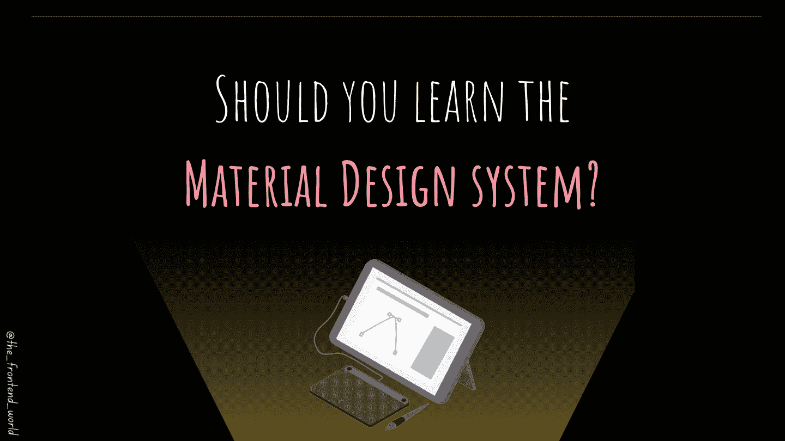

# 该不该学材料设计系统？

> 原文：<https://medium.com/geekculture/should-you-learn-the-material-design-system-3a249f4aa6d9?source=collection_archive---------9----------------------->

## 我对材料设计系统的反馈

By FAM

你可能学过或者听说过材料设计或者犹豫该不该学。

# 什么是材料设计的简短定义:

材料设计是谷歌在 2014 年创建的一个 UI(用户界面)系统。像任何…