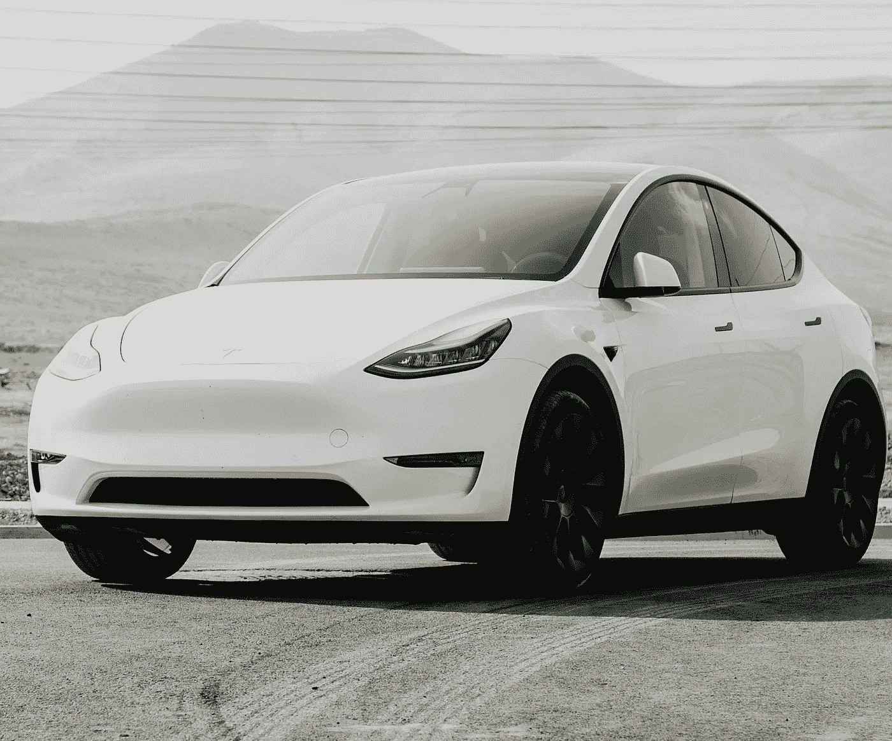
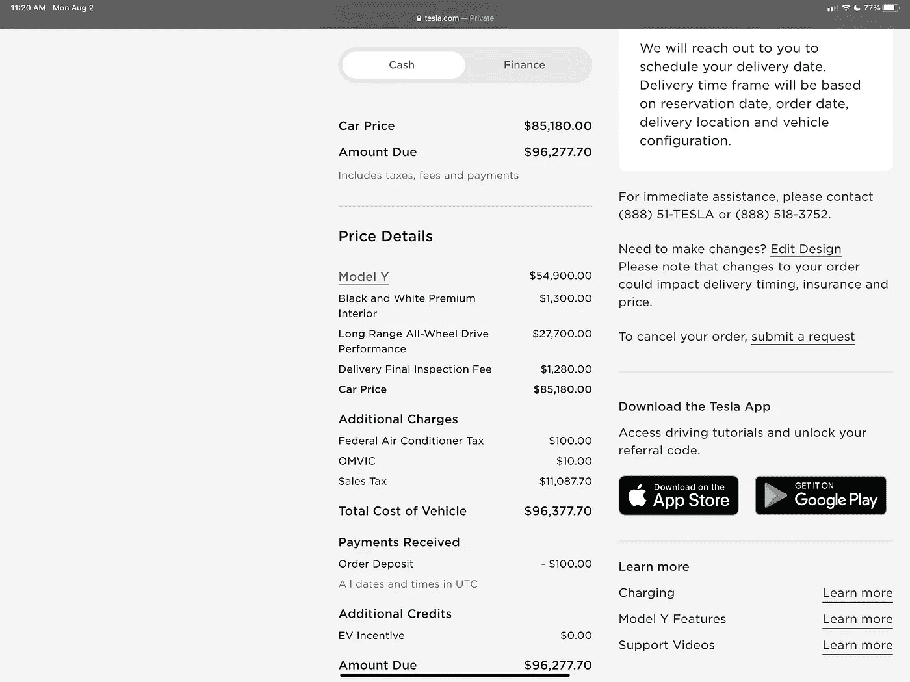
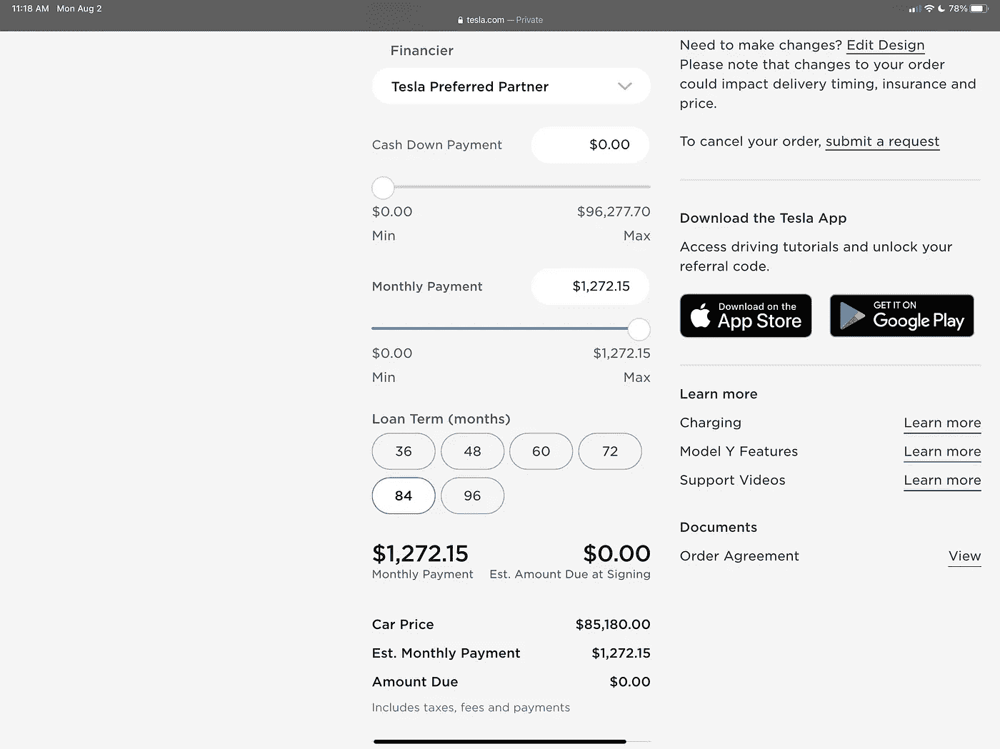
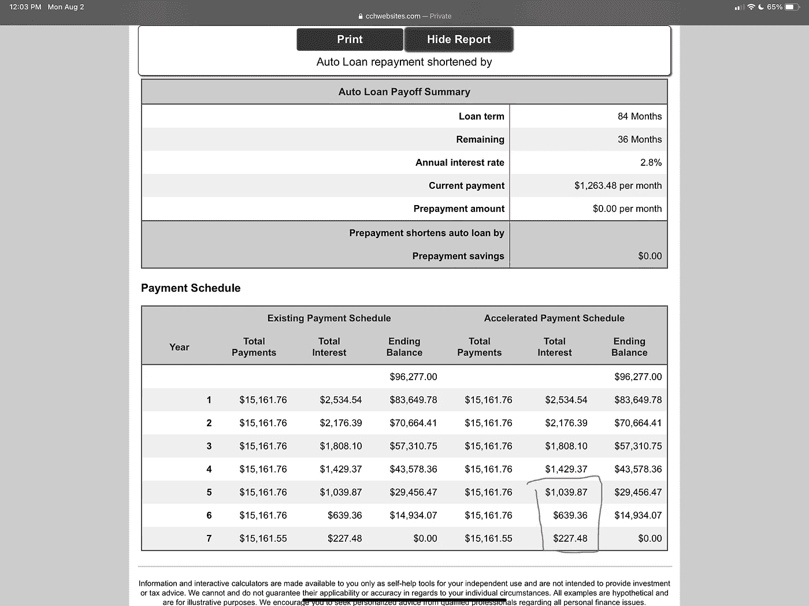
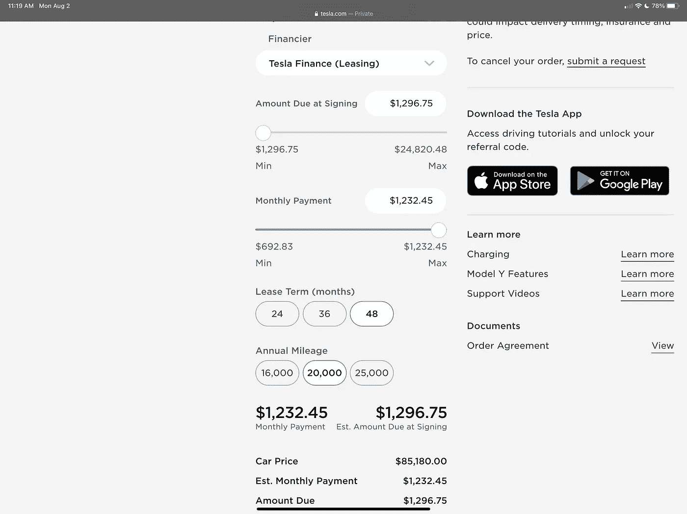

# 你应该租还是买一辆特斯拉——结果出来了

> 原文：<https://medium.com/geekculture/should-you-lease-or-buy-a-tesla-10b105f35be8?source=collection_archive---------2----------------------->

## 这是一种数据驱动的方法

Photo by [Craventure Media](https://unsplash.com/@craventure?utm_source=unsplash&utm_medium=referral&utm_content=creditCopyText) on [Unsplash](https://unsplash.com/s/photos/tesla-model-y?utm_source=unsplash&utm_medium=referral&utm_content=creditCopyText)

在我成长的过程中，我和父亲总是喜欢看着汽车，谈论它们的特点，以及开着其中一辆车进行家庭旅行是多么酷。在 90 年代末，我们总是走进福特经销商，看着像皇冠维多利亚这样的大型汽车，甚至盯着野马，意识到它可能不会是我爸爸的老板，我妈妈认可的家族产品。

从小到大，我们很少买新车，以前我们会拿起当地报纸，圈出我们感兴趣的二手车。为什么？对我们来说，钻研一款全新的汽车太贵了，而且从财务上来说，这也没什么意义。在这个过程中，我父亲总是向我灌输不要负债，不要购买融资或租赁汽车，因为现在你拥有一项资产。我从来没有质疑过他，因为他说的任何话在我心里都是正确的。

我没有在富裕的家庭中长大，所以我生活中的一切都来之不易，包括我在 2000 年初的第一辆车。我买了一辆新的宝马 coupe 跑车，并立即买了下来。我拥有这辆车大约 8 年了，但在最后的 3 年里，我对拥有这辆车感到非常后悔。自掏腰包保修的经历和相关费用令人紧张和不愉快。我告诉自己，我永远不会再买一辆车，而是租一辆，而且我从未回头。此后我租了几辆车，好处是我的车总是在保修期内，我每隔几年就要换一辆车，我受益于未来汽车中嵌入的最新最伟大的技术。

快进到 2021 年，我看到了特斯拉 Model Y 的性能，白色座椅，税后价格约为 9.6 万加元。我的第一反应是租辆车，直到我在 reddit、特斯拉论坛和 YouTube 上到处寻找其他人的意见。绝大多数人暗示，购买特斯拉肯定是更好的选择。然而，一些原本选择购买的用户在保修期过后就后悔了，因为一些天文数字的维修费用。那么更好的选择是什么呢？我们来深入研究一下这些数字。

购买新车时，潜在买家有三种选择

1)直接购买

2)金融

3)租赁—(目前特斯拉不允许在租赁结束时买断 Model 3/Y)

所以让我们为一个有以下人的买家设置一些假设。

*   买家喜欢每隔几年换一辆车
*   买家不想持有超过保修期的汽车
*   买家希望在 4 年标记时评估选项，因为这是保修通常到期的时间，除非您查看里程数

神话和模型假设:

*   如果我为车辆融资并选择转售，我就不必担心里程数。这其实是不正确的。特斯拉折旧也受里程数的影响，折旧率**基于每年 12k 英里**。任何过度的东西都会使你的汽车进一步贬值。
*   特斯拉保持其价值，我可以得到更多的方式比剩余。并非所有车型都是如此，这只是暂时的，直到芯片短缺问题得到解决，新车上市时，这可能会影响长期价值。阅读下文了解更多详情
*   我们将以 12k 英里(在加拿大每年大约 20K 公里)的速度进行租赁，定金为 0 美元。
*   比较月租赁费率，并确定计算可比的财务月付款
*   税后汽车购置成本为 96，277.70 美元
*   在加拿大安大略省，84 个月的贷款利率是 2.8%
*   租赁资金系数为 0.0015917，约为 3.82%
*   我们将假设 4 年后转售价值接近剩余价值
*   基于[CarEdge.com](https://caredge.com/tesla/model-y/depreciation)，每年 2 万公里(12 万英里)的剩余价值为 58.49%
*   不是每个人都能获得政府退税(就像在安大略省，PC 政府取消了他们——SMH！)所以他们被排除在这个分析之外

我将从我的特斯拉订单中提供一些图片，以便您在分析中了解这些数字的来源

**选择一:直接购买**

Image by Author

我一般不鼓励全盘收购。鉴于不这样做的机会成本，相对较低的利率实际上会将购买和租赁作为更好的选择。如果你和一个好的财务顾问一起工作，他们应该能让你每年获得至少 5%的投资回报，这比你支付给特斯拉的融资或租赁费用要高。这样你就可以把差价装进口袋了。你也可以投资一些特斯拉股票:)然而，如果你绝对想买断这辆车，4 年的拥有成本就是 96，277.70 美元减去残值(85，180 美元建议零售价* 58.49%) = **$46，491.01**

**选项 2:财务**

Image by Author

这辆车的价格是 96，277.70 美元。借贷成本是 2.8%，所以你在 84 个月内购买汽车的成本是 106，106.07 美元(扣除利息)。选择这个时间是为了保持每月付款类似于租赁。因此，基于 2.8%的利率，每月的财务付款为 1263.17 美元。在上图中，你看到的是 1272.15 美元，这是基于 3%。特斯拉告诉我网站没有更新新的价格。如果您选择在 4 年内出售汽车，您将根据建议零售价计算剩余价值，实际价值为 85，180 美元(税前成本)。剩余的 58.49%使剩余价值约为 49，821.78 美元。现在，如果你提前还清贷款，可以节省 36 个月的利息。为了使分析简单，让我们基于在线计算器将它添加回来。

Image from [CCH Websites](https://www.cchwebsites.com/content/calculators/AutoPayoff.html)

因此，在第 4 年，您的拥有成本为 106，106.07 美元-49，821.78 美元-1906.71 美元= **$54，377.58**

**选择三:租赁**

根据 Tesla 计算器，以 48 个月、每年 20，000 公里、零首付的租车成本为每月 1232.45 美元。交付的到期金额只是第一个月的付款加上费用

拥有成本为$1232.45*48 = **$59，157.60**

所以总结一下:

方案一(购买):46，491.01 美元
方案二(融资):54，377.58 美元
方案三(租赁):59，157.60 美元

目前，所有的 Model Y 和 3 必须在租赁结束后归还给特斯拉，但是有传言说这将会改变。亚洲和欧洲的部分地区现在能够买断他们的汽车，如果你选择这样做的话。在我的情况下，有一个保证是非常重要的，所以这是一个有争议的问题。目前，没有为型号 Y 或 3 购买延长保修的选项。只有 X 型和 S 型有大约 4000 美元的延长保修选项。如果你想长期拥有这辆车或者和一个真正优秀的机械师交朋友，这是你需要考虑的事情。此外，如果你每天通勤时间很长，租赁可能不适合你。每增加一公里，我的报价是 15 美分，所以它可以很快增加。

所以这是一个简单的决定，对吗？没那么快！

## 车祸怎么办？

根据 carvana 的数据，如果发生可索赔的车祸，汽车将承受的平均增量折旧是 5-8%。这意味着，如果我们采取保守的方法，你的残差从 58.49%变为大约 53.49%。结果是 4 年的拥有成本如下:

方案一(购买):50，714.92 美元
方案二(融资):58，670.65 美元
方案三(租赁):59，157.60 美元——不变

任何车祸都会影响我们的转售价值和租赁的美丽，这没关系，因为你的承诺在 48 个月结束时结束。在任何情况下，你都必须把车修好，但是从你买车的时候起，车的残值就已经确定了。当特斯拉的精算师计算时，这些风险显然已经包含在租赁付款中，但坦率地说，汽车离开停车场后，对选项 1 和 2 的影响与他们无关。所以如果你有很好的驾驶记录，那就太棒了。如果没有，可以考虑一下。

## 分割销售

疫情肯定会让一些制造商购买我们的电动汽车，但肯定会在未来 4 年内推出 pleathera。即使是特斯拉赛博卡车或未来的 Model 2 也可能与 Model Y 竞争，并影响 Model Y 的销售。宝马、沃尔沃、福特和瑞文等汽车制造商也将在 2022/2023 年推出电动汽车。在选项 1 和 2 的情况下，如果你的销售远低于预期的剩余价值，你的拥有成本就会上升。

## 新技术

当你得到一辆新车时，你还可以受益于最新最伟大的技术，无论是自动驾驶，还是一些老款车型需要改造，随着时间的推移，更好的安全测试，以及与其他物联网设备的集成。特斯拉引以为豪的是通过无线更新汽车，但现实是，并非所有的新功能都是软件支持的。对于某些产品来说，肯定有一个额外的硬件组件。例如，为老款车安装 [FSD，升级](https://electrek.co/2021/07/20/tesla-reduces-price-of-fsd-computer-upgrade-to-1000-but-not-zero-after-criticism/)需要花费 1000 美元，在老款车主的强烈反对下，这一价格从 1500 美元下调。

## 电池技术

Elon Musk 还谈到了一种即将上市的新电池，这种电池将降低电动汽车的成本，但也有助于提高汽车的效率，增加里程。虽然目前的计划是将这些电池放在选定的汽车上，但特斯拉在 4 年内开始建立现有的 S3XY 系列而不采用新的电池技术是不明智的。较低的范围可能会使买方不愿支付今天的残值，并进一步降低您选择 1 和 2 的拥有成本。

## 额外成本—冬季轮胎和改装

当我做这个分析的时候，我考虑到了这样一个事实，考虑到我们寒冷的气候，我需要冬季轮胎。然而，有人可能会说，在使用冬季轮胎 4 年后，无论你是融资、租赁还是购买，你都可能需要在 4 年内更换轮胎。所以这是一个有争议的问题。至于轮辋，你可以在网上出售，差别并不重要。

您也可以选择为您的汽车添加改装，如包装、着色或售后轮胎，但在选项 3 中，您需要在将汽车还给特斯拉之前撤销这些更改。

因此，让我们再次评估原始选项:

方案一(购买):46，491.01 美元
方案二(融资):54，377.58 美元
方案三(租赁):59，157.60 美元

不是每个人都能负担得起提前购买一辆近 10 万美元的汽车，但如果你能，也许选项 1 是最好的。一定要评估在汽车上预先投资的机会成本和你通过融资或租赁支付的利息。

就租赁和融资而言，在上述场景中，我支付了大约 4780 美元的溢价(+/-浮动利率)。我愿意支付溢价来对冲我对上述几点的押注。如果特斯拉确实允许租赁持有人回购汽车，就有机会获得汽车的正资产净值。如果你想在 4 年后保留这辆车，那么你必须在选项 1 和选项 2 之间做出选择。一些特斯拉车主有很好的长期体验，但维修特斯拉的成本相当高。可以在 reddit 和 teslamotors 论坛上看一些故事。

## Y 型远程怎么样？

长期的财务分析将是相似的，我预计融资和租赁之间的差异将是相似的或稍小一些，因为您没有融资/租赁性能升级成本。我又为你算了一下，假设你在 4 年内会放弃它。这是绝对基础型号，建议零售价为 69，990 美元

选项 1(购买):38，275.85 美元
选项 2(融资):44，815.45 美元
选项 3(租赁):47，134.56 美元

这不是一个银弹分析，除了市场上发生的事情之外，还有其他几个因素需要考虑，如里程超额，当前利率，事故数量，你在选项 2 中投入多少。然而，这确实说明了关于租赁与购买的一些误解以及与每种选择相关的风险。

你会选择哪个选项？