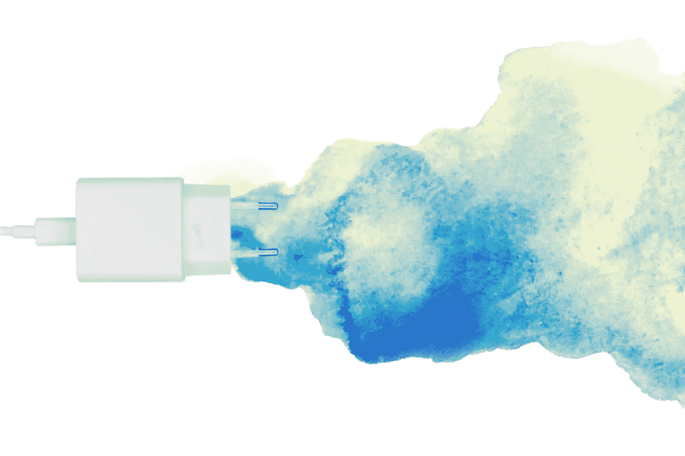

# 你应该拔掉充电器以节约能源吗？

> 原文：<https://medium.com/geekculture/should-you-unplug-chargers-to-save-energy-5ba0bdfbda83?source=collection_archive---------6----------------------->

## 有一个概念名为*吸血鬼能量，*是设备在待机模式下消耗的能量。

Image from **Canva**.

我以前讲过移动设备电池的[神话](/geekculture/4-myths-about-smartphone-batteries-33ecb347fedc)和[使用错误](/geekculture/4-mistakes-that-damage-your-smartphone-battery-6d9060f8c835)。现在让我们来解决他们的能源消耗问题。