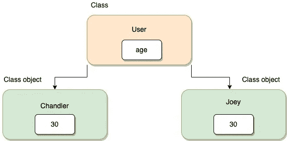

# Scala 中应该使用单例对象吗？

> 原文：<https://medium.com/geekculture/should-you-use-singleton-objects-in-scala-974f40e64b1?source=collection_archive---------7----------------------->

## 理解 Scala 中的单例对象


Photo by [Volodymyr Hryshchenko](https://unsplash.com/@lunarts?utm_source=unsplash&utm_medium=referral&utm_content=creditCopyText) on [Unsplash](https://unsplash.com/s/photos/object?utm_source=unsplash&utm_medium=referral&utm_content=creditCopyText)

嘿，伙计们，周末快乐！

如果你熟悉面向对象编程，你一定熟悉类的概念，它被广泛定义为

> 一个**类**是一个蓝图，它定义了某种类型的所有对象共有的变量和方法。



Image by author

在本文中，我们将讨论 scala 中一个有趣的类类型——单例对象。此外，如果您不熟悉面向对象编程的详细概念，也不要担心，您会一路了解！

## 什么是单例对象？

所以，让我们从理解单例对象开始:

> singleton **对象**是一个只有一个实例的类。

现在你一定在想(至少我第一次读的时候是这样的):

> 等等什么？所以，object 是一个类，但是类不应该有 object 吗？这到底是什么，为什么需要这样的东西？

嗯，是的！这些 ***对象*** 是一种特殊类型的类，它只有一个实例，可以跨包使用——这意味着这个类中的所有方法和变量都可以跨包访问。(如果您知道静态关键字，您可以在这里关联相同的概念)

让我们看看单例对象是什么样子的:

```
// ArticleUtility is a singleton object hereobject ArticleUtility {
  var *platform* = "Medium"

  def publish(article: String): Unit = {
    *println*(article)
  }
}
```

这个定义看起来就像你将如何定义一个类(当然，除了关键字 difference)，非常简单，对吗？

这里的单例对象有一个变量和一个方法，现在我可以在任何地方访问这个属性或方法

```
**import** ArticleUtility.platform
**import** ArticleUtility.publishpublish("Should you use singleton objects in scala?")println(s"This article will be published on $platform")
```

看，我们能够在不创建任何实例的情况下访问方法和属性。这里要问的问题是，

> 如果它实际上是一个类，它是如何工作的？它什么时候被实例化？

答案是——它是在被引用时被延迟创建的。我不会详细说明如何实现，但是知道一个对象如何工作是很好的。

那么，定义了单例对象之后，可以使用单例对象的用例有哪些呢？

*   scala 中的 main 方法总是写在一个 singleton 对象中
*   适用于常见的实用程序
*   常数

上面定义的是对象的一些用例，编写伟大的模块化代码看起来很酷，但是记住——强大的能力意味着巨大的责任！

## 使用单例对象时要注意的事项

记住它只有一个实例，所以无论在哪里访问`platform`，都将访问同一个变量——这意味着如果您在一个文件中导入并修改`platform`,它将在整个模块中被修改。

它既有好处也有坏处。好处是，更干净的代码和坏处是，当你开始在泛型方法中使用它们作为全局变量时，我们都知道全局变量有这样一个坏名声！

总而言之，单例对象真正支持 Scala 的面向对象特性。这确实有助于保持代码模块化，但记录它们的工作和行为方式也非常重要。

嗯，就是这样。如果你有兴趣阅读更多关于单例对象的内容——下一步是`Companion objects`

如果你想让我写伴侣对象或者你如何在 Scala 中使用单例对象，请在评论中告诉我。最后，如果你喜欢这篇文章，请鼓掌表示你的支持

快乐编码，
JD