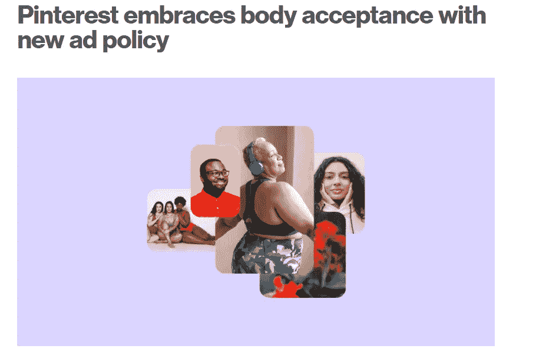
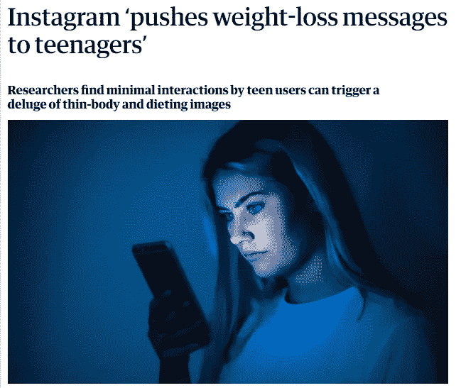

# 肩负着世界不能动摇的肩膀

> 原文：<https://medium.com/geekculture/shoulders-that-carrying-the-world-can-not-falter-8d706e414380?source=collection_archive---------42----------------------->

## 科技带来的力量和我们给予的力量

Photo by [Bill Oxford](https://unsplash.com/@bill_oxford?utm_source=unsplash&utm_medium=referral&utm_content=creditCopyText) on [Unsplash](https://unsplash.com/?utm_source=unsplash&utm_medium=referral&utm_content=creditCopyText)

我是看着电视广告长大的。他们中的许多人想让印第安人的皮肤变得白皙可爱。

宣传“公平”的日子早已过去，但我敢打赌，许多印度妈妈仍然在为他们的儿子寻找公平的新娘。这些广告对印第安人易受影响的头脑的影响即使不是永久的，至少也是持久的。

这是来自过去的爆炸。

Source: Created using public advertisements

时代变了，技术也变了。
我们已经从电视转向社交媒体。

随着社交媒体和技术迅速加快信息传播的步伐，趋势和痴迷变得很容易。这是没有额外的集中目标。

趋势似乎来来去去，但它对人们生活的影响是广泛的、多样的和深刻的。它们对更多尚未完全适应外面的野生世界的无辜生命的影响更深、更危险。

我最近开始跑步。这意味着我决定全力疯狂地购买装备，并在所有社交媒体渠道上追踪相关账户。
我没花多少时间就意识到这些照片都有完美的腹肌和健美的双腿。
这可能会鼓舞人心，鼓舞人心。

但它也可能被解读为伤害一个人的自尊，阻止一个人做出健康的选择，或者更糟糕的是，比你预想的更容易放弃。

身体积极对于健康的自我意识很重要。

这就是为什么当我看到 Pinterest 推广健康身体形象的新政策时，我再高兴不过了。

Credits: [https://newsroom.pinterest.com/en/post/pinterest-embraces-body-acceptance-with-new-ad-policy](https://newsroom.pinterest.com/en/post/pinterest-embraces-body-acceptance-with-new-ad-policy)

根据 [Pinterest 的新政策](https://newsroom.pinterest.com/en/post/pinterest-embraces-body-acceptance-with-new-ad-policy)，他们打算禁止所有带有减肥语言和图像的广告。禁止的内容包括之前和之后的图像，任何参考身体质量指数(身体质量指数)，减肥产品，等等。

我认为这是业内其他人效仿的希望。

在如此乐观之后，我对我得到的下一条消息感到无比惊讶。

Credits: [https://www.theguardian.com/society/2021/jul/20/instagram-pushes-weight-loss-messages-to-teenagers](https://www.theguardian.com/society/2021/jul/20/instagram-pushes-weight-loss-messages-to-teenagers)

Instagram 不仅没有向积极的方面迈出一步，反而放大了消极的影响。

结果发现，与一个运动服装品牌[的单个帖子互动的青少年会被分发关于节食和减肥的内容。](https://www.theguardian.com/society/2021/jul/20/instagram-pushes-weight-loss-messages-to-teenagers)

成年人意识到了回音室的影响，被困在 T2 过滤气泡中，通常无助于采取纠正措施，他们谈论的是尚未目睹更大世界的更脆弱的青少年。

# 技术的作用

在印度，父母会说“回到我们的时代…”“现在的孩子被科技宠坏了”是很常见的。

对我来说这很有趣(一个在这样的陈述中出生和长大的印度人)，但它也显示了隐藏的情绪。

是的，科技让某些事情变得更加复杂。但它也让某些事情变得极其容易。

> 这是一个相当有趣的人类反应，把人类所有的好与上帝联系在一起，把坏与技术联系在一起。

我不会因为观察到的行为而谴责 Instagram。如果有的话，有可能这是由他们的算法触发的未被注意的行为。很容易理解一段代码如何根据行为解释一个人对运动感兴趣，并向他们推荐更多类似的东西。

错误还在于创作者，他们负责创作对社会道德纤维没有多大帮助的内容。

但完全免除科技行业的所有指控是负责任的。他们确实欠社会一笔债，应该为没有摧毁为他们服务的东西负责。

# 最后的想法

当人类发现火时，我确信有人宣称这将是人类的末日。它所做的只是让食物变得更美味，但它可能会烧毁森林。

技术也不例外。它帮助我们预订出租车，书籍停留，并从世界各地购买物品，但它也有可能破坏。
科技行业肩上的担子是巨大的，它需要得到承认、承担和公正对待。