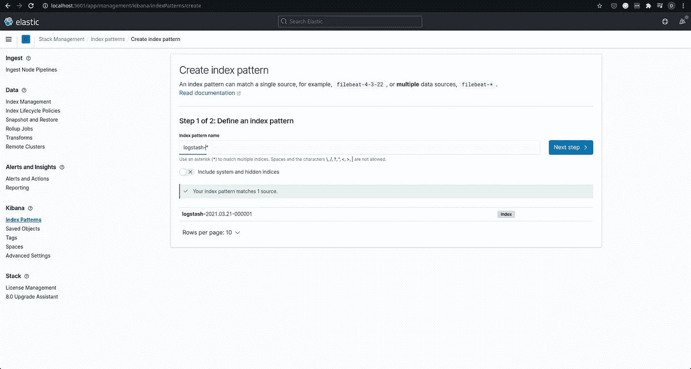
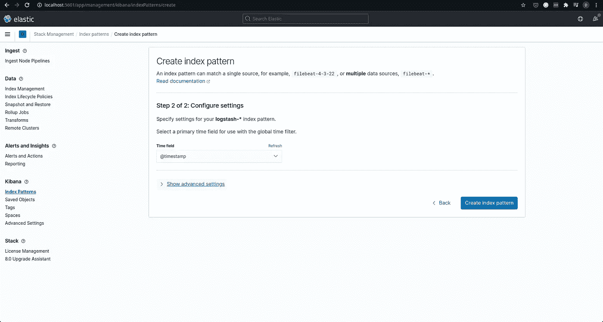
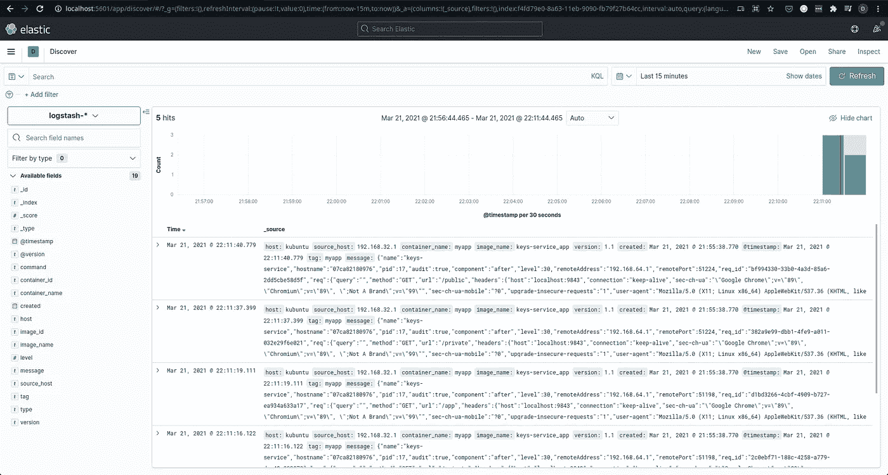
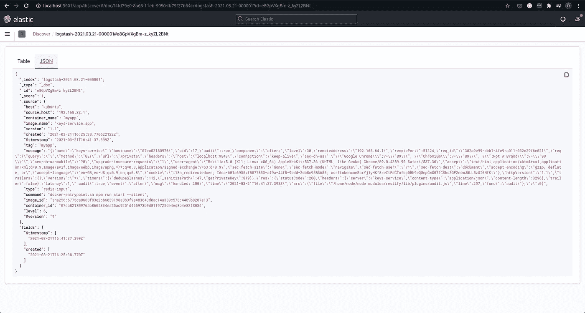

# 推你的码头集装箱日志到麋鹿变得简单

> 原文：<https://medium.com/geekculture/shoving-your-docker-container-logs-to-elk-made-simple-882bffdbcad6?source=collection_archive---------3----------------------->

## 因为管理日志很重要。句号。


在本文的其余部分之前，让我们都同意生成适当的日志对于生产中的任何应用程序都是至关重要的。无论是结构化的日志记录，比如 JSON 格式，还是打印的普通字符串，都必须有某种形式的跟踪软件正在做什么，以便在应用程序出现问题时使用。在这里，我将“应用程序”作为一个通用术语来描述任何一种可能会出现意外行为的软件、代码或工具。

当然，生成日志是不够的。当你需要的时候，日志却不在那里，这有什么用呢？生成的日志必须以某种方式持久化，并在需要时随时提供给风险承担者，如软件工程师、系统管理员和其他可以访问系统的人。根据日志的数量和生成日志的速度，它们的持久化方式会有所不同。

*   如果应用程序以慢到中等的速度记录日志，这样写入磁盘是可行的，那么您只需要日志文件。设置您的 Linux 系统，按计划轮换日志文件，并将文件发送到永久存储，如备份磁盘或 AWS S3，这样就可以了。需要时，可以使用工具`grep`或常规文本编辑器来访问和查询日志。
*   有时，记录到文件中并不会删除它。没有多少人是 Linux 命令行工具的奇才，能够剖析和搜索大量的日志文件，在终端中找到他们想要的东西。即使是这样，也很难在命令行上复制一个 SQL 查询所能做的事情。如果您认为查询日志是一项重要的需求，那么即使日志记录变得有点慢，将日志存储到数据库中也是理想的。无论是关系数据库(如 MySQL)还是基于文档的数据库(如 MongoDB ),写入速度都会比写入磁盘慢。然而，任何熟悉这些数据库查询语言的人都应该能够快速形成相当复杂的查询，以便能够准确地获得他们想要的数据。

即使在使用 Docker 的时候，上述两种方法都是可行的。对于记录到文件，您可以向容器添加一个卷装载，以便从容器外部访问日志。对于使用数据库，您可以启动一个数据库容器并持久存储数据(以防您的应用程序还没有使用数据库)。

然而，上述两种方法都将实际保存日志(到磁盘或数据库)的工作交给了应用程序本身。虽然现代日志库已经很好地优化了并发处理多个流和大量数据的能力，但是如果创建了太多的数据库连接或者系统磁盘本身很慢，日志仍然可能成为应用程序性能的瓶颈。有时让其他工具为您的应用程序处理日志可能是有意义的，而应用程序本身除了将日志扔给`stdout`之外什么也不做，这是 Docker 的日志记录方式。

这种方法是如何工作的？简单。

*   您的应用程序生成日志并将其发送到`stdout`或`stderr`。
*   docker 日志记录驱动程序将这些日志发送到一个 UDP 端点(实际上是一个 Logstash 实例)。
*   Logstash 将这些日志发送到 Elasticsearch，在那里它们被索引和持久化。

为什么采用这种方法？因为基巴纳。使用 Kibana 带来的易用性和查询性是不言而喻的。当然，弹性**搜索**非常快，说到**搜索** ing。明确地说，我理解，你也应该理解，Kibana 是一个通用的可视化工具，用它来分析日志只是它能做的事情之一。您可以通过生成过滤器日志的容器、时间戳来查看过滤器日志，甚至可以添加自定义过滤器。Kibana 的全部功能超出了本文的范围，我将它留给感兴趣的读者作为练习。

我们如何做到这一点？首先，您需要设置一个 ELK 堆栈，我们可以将日志放入其中。如果您愿意，您可以安装并配置这些组件。然而，对于本文，我将使用 docker-compose 来运行 docker 容器中的所有服务。

堆栈是这样工作的:

*   我们有一个运行弹性搜索的容器。
*   我们有一个运行 Kibana 的容器，它连接到 Elasticsearch 实例。
*   我们有一个 Logstash“代理”，它唯一的工作是获取任何来自于`gelf`接口的日志，并将它们放入 Redis 实例中，该实例的作用类似于日志缓冲区。
*   一个“中央”Logstash 容器从 Redis 缓冲区读取日志，并将它们放入 Elasticsearch，从那里它们可供 Kibana 服务使用。

够直白了吧？让我们把它写在 Docker-compose 文件中。谢天谢地，完成所有这些设置并不需要太多时间。让我们逐个检查 docker-compose 文件中的服务。

# docker-撰写

## **弹性搜索:**

```
elasticsearch:
  image: elasticsearch:7.11.1
  environment:
    - discovery.type=single-node
  volumes:
    - ./elasticsearch_data/:/usr/share/elasticsearch/data
  mem_limit: "1g"
```

简单。环境变量`discovery.type`告诉 elasticsearch 引擎它是作为单个节点而不是集群运行的。卷装载确保了 elasticsearch 数据在容器重启后仍然存在。这是因为我简陋的笔记本电脑无法处理一个弹性搜索引擎的全部力量。你的可能能够处理 2g 的内存限制，但是你要自担风险。

## **Redis:**

```
redis-cache:
  image: redis:6.2
```

出于本文的目的，我们将保留 Redis 的默认配置。

## 日志存储(代理):

```
logstash-agent:
  image: logstash:7.11.1
  volumes:
    - ./logstash-agent:/etc/logstash
  command: logstash -f /etc/logstash/logstash.conf
  depends_on:
    - elasticsearch
  ports:
    - 12201:12201/udp
```

代理公开了 UDP 端口`12201`，我们的应用程序 docker 容器将把它的日志发送到这个端口。我们挂载一个包含我们的`logstash.conf`的目录`logstash-agent`，它将配置 logstash 实例实例，以便将传入的数据发送到我们的 redis 实例。logstash.conf 可能是这样的:

```
input {
  gelf {
    port => 12201
  }
}output {
  redis {
    host => "redis-cache"
    data_type => "list"
    key => "logstash"
  }
}
```

Gelf 是一种日志格式，我们将通过 gelf 日志驱动程序将它用于我们的应用程序 docker 容器的日志输出。你可以在这里了解更多关于 gelf [的信息。](https://www.graylog.org/features/gelf)

## 日志存储(中央)

“中央”logstash 实例执行实际的工作，它从 Redis 获取日志并将其推送到 elasticsearch，在那里它们被索引并可供使用。

```
logstash-central:
  image: logstash:7.11.1
  volumes:
    - ./logstash-central:/etc/logstash
  command: logstash -f /etc/logstash/logstash.conf
  depends_on:
    - elasticsearch
```

配置文件`logstash.conf`安装在`logstash-central`目录中。

```
input {
  redis {
    host => "redis-cache"
    type => "redis-input"
    data_type => "list"
    key => "logstash"
  }
}output {
  elasticsearch {
    hosts => ["elasticsearch:9200"]
  }
}
```

## 基巴纳

基巴纳只需要知道 Elasticsearch 在哪里。我们公开端口`5601`来访问 web 接口。

```
kibana:
  image: kibana:7.11.1
  ports:
    - 5601:5601
  environment:
    - ELASTICSEARCH_HOSTS=http://elasticsearch:9200
  depends_on:
    - elasticsearch
```

完整的 Docker-compose 文件如下所示:

我们的目录结构如下:

```
| elasticsearch_data/
| logstash-agent/
|     logstash.conf
| logstash-central/
|     logstash.conf
| docker-compose.yml
```

这里的一个`docker-compose up`应该可以做到这一点，旋转你自己的麋鹿堆，准备好吃掉你扔给它的任何木头！要访问 Kibana 仪表板，请在浏览器中转至 [http://localhost:5601/](http://localhost:5601/) 。但是，还没有任何日志可供查看。请注意，该服务可能需要一两分钟来初始化，所以如果网页上还没有任何内容，请不要担心。

让我们来解决这个问题——创建一个容器，放一些新鲜的日志。

让我们保持简单。我的服务将是一个有三个端点的小节点服务器。在这个上下文中，服务器做什么和端点做什么无关紧要。我们将考虑这个服务在一个单独的 docker-compose 环境中运行，它将通过暴露的端口`12201.`访问 Logstash

docker-compose 文件如下:

本质上，我们在与这个 docker-compose 文件相同的目录中构建一个 Dockerfile，它在内部启动端口`9843`上的一个服务器，我们将它暴露给主机上的端口`9843`。有一些环境配置，作为读者，您不需要关心。我们的测井配置都在那个叫，请击鼓，**测井**的区块内。

```
logging:      
  driver: gelf      
  options:        
    gelf-address: "udp://localhost:12201"        
    tag: "myapp"
```

我们告诉 docker-compose 使用“gelf”驱动程序，而不是默认的(我认为是“本地”驱动程序)。我们在选项块下配置驱动程序。我们指定需要将日志发送到的 UDP 端点，以及来自该服务的所有日志的标记，该标记将被添加到以 GELF 格式发送的日志中。

实际上，您可以拥有任意数量的 docker-compose 服务，像这样配置它的日志驱动程序，并将所有服务的所有日志集中到一个位置。多牛逼啊！？

# 查看结果

现在，进入 Kibana，当您第一次进入 Elasticsearch 日志部分时，您必须指定一个默认索引。因为我们使用的是 Logstash，所以索引的形式是`logstash-*`,除非你自己弄乱了 logstash 的配置(在这种情况下，你可能理解要指定的索引，对吗？).



Specifying the default index

您还必须在下一步中指定时间字段。由于我们使用 GELF 输入，这将是`@ timestamp`字段。



Specifying the time field.

点击`Create index pattern`，您现在应该能够转到[http://localhost:5601/app/discover/](http://localhost:5601/app/discover/)查看来自服务器应用程序的日志。如果您没有看到日志，请尝试调整持续时间过滤器，或者确保某些日志确实是由应用程序生成的。尝试向应用程序发送一些请求来获取一些日志。



这不是很好吗？在这里，您拥有所有的日志，并且可以随时进行分析。如果你是 Logstash 和 Kibana 的新手(像我一样)，试试看 Kibana 能为你做些什么是很好的。给定当前配置，您的应用程序创建的实际传入日志在“message”键中作为一个字符串提供。



A sample log

我相信，可以对日志“消息”本身进行解析并使其可过滤。会给你最终的力量。或许试着解决这个问题。或许也让我知道。或者，一旦我搞清楚了，我会更新这篇文章。

# 关于可扩展性

这个 ELK 设置可以扩展吗？我认为在很大程度上是可能的。我们可以有多个中央 Logstash 实例从 Redis 数据库接收日志，该数据库本身可以通过复制扩展到多个节点。Elasticsearch 本身可以设置为在多个节点的集群中运行，以帮助实现高可用性。Redis 缓冲区确保对传入日志进行一定程度的速率限制，因为消费者 Logstash 实例可以按照自己的速度获取日志，从而让 Elasticsearch 引擎有足够的时间来索引数据。

下次见，快乐学习。

如果你想讨论一些关于这篇文章或一般技术的东西，请随时联系 [me](https://www.linkedin.com/in/sharmarajdaksh/) ！