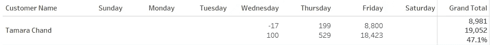
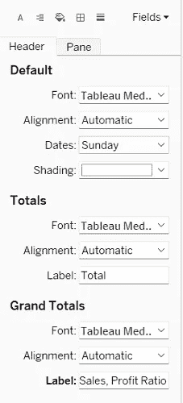
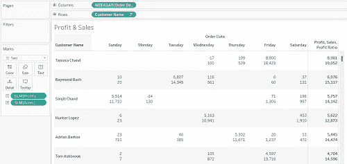
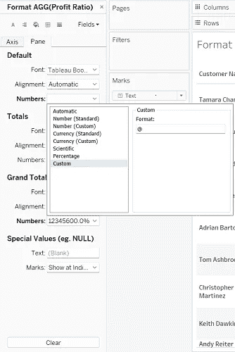
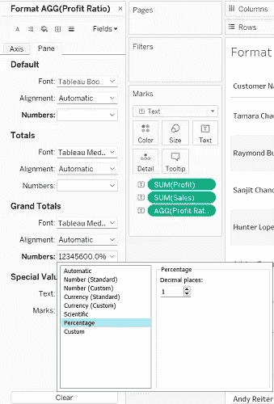
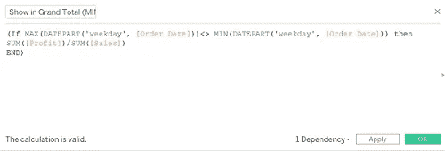
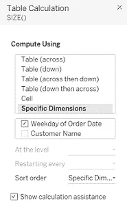
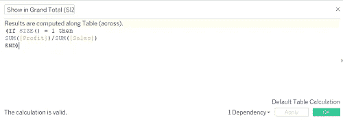

# 在表格中显示/隐藏行/列/总计中的数据

> 原文：<https://medium.com/geekculture/show-hide-data-in-rows-columns-grand-total-in-tableau-cb6adad046ef?source=collection_archive---------4----------------------->

Calculated field in Grand Total in Tableau (Pic Credit: Author)

您是否遇到过这样的要求:一个计算字段应该出现在行/列中，而不是出现在总计中，或者反之亦然？让我们直接进入 3 种方法。

**案例:**需求是查看客户在每个工作日产生的利润和销售额。其次是利润总额、销售额和利润总额中的比例。为此，我们将使用 Tableau 的示例超市数据。

在列栏中输入订单日期。右键单击并选择工作日。

将客户名称拖放到行栏中

将利润和销售额填入文字标记卡。

从分析->总计菜单中选择“显示行总计”。

右键单击总计并选择“格式”。更改总计下的标签。

Label Change of Grand Totals (Pic Credit: Author)

我已经更改为利润、销售额和利润率，如下图所示。最初的布局将是这样的。

Initial Layout (Pic Credit: Author)

**1。格式设置**

创建一个名为“利润率”的计算字段。

总和([利润])/总和([销售额])

将此计算字段放在文本标记卡中。

你会看到利润率字段处处都是第三个值。我们需要把这个限制在总数以内。因此，右键单击该字段并选择 Format。在默认->数字->自定义中，输入“@”符号。

Removing data from rows (Pic Credit: Author)

但是，在总计->数字中，选择自定义并删除“@”符号。然后选择百分比并指定小数位数。

Formatting Grand Total Value (Pic Credit: Author)

如果您希望以行或列的形式查看该字段，而不是以总计的形式查看，请执行相反的操作:

默认->数字->百分比并选择小数位数

总计->数字->自定义并输入' @ '符号。

**2。部..最大功能**

创建一个名为“显示总计(最小值..MAX)并输入以下内容:

Profit Ratio Calculation for MIN MAX Function (Pic Credit: Author)

这里，通过比较订单日期的最小值和订单日期的最大值，我们保证利润率的计算将只出现在总计中。但是，如果您希望计算出现在行或列中，而不是总计中，请使用=符号代替<>。

**3。尺寸功能**

将尺寸()放在详图标记卡中。确保该字段出现在工具提示中。

右键单击并选择编辑表格计算

选择特定维度，然后仅选择“订单日期的工作日”。

SIZE Function Table Calculation Setting (Pic Credit: Author)

当您将鼠标悬停在表格上时，请注意，当鼠标出现在周一或周日等工作日时，SIZE()的值是 7，但在总计中它变成了 1。我们将在计算中使用这个值 1。

创建另一个名为“显示利润率(大小)”的计算字段。

Profit Ratio Calculation for SIZE function (Pic Credit: Author)

这里，如果 SIZE()的值为 1，那么应该会出现利润率计算。

因此，将此计算字段放在文本标记卡中。

右键单击并选择“编辑表格计算”,执行与我们对 SIZE()表格计算相同的操作。选择“特定维度”，然后选择“订单日期的工作日”。

所以，利润比率的计算只会出现在总计中。但是如果您希望行中有一个利润率，那么将 SIZE()的值指定为等于 7。这导致该值出现在行中，而不是总计中。

直到最近，我才意识到第一种方法是所有方法中最简单的，因此有了这个博客。如果你有其他方法，请分享。就目前而言，仅此而已。谢谢。