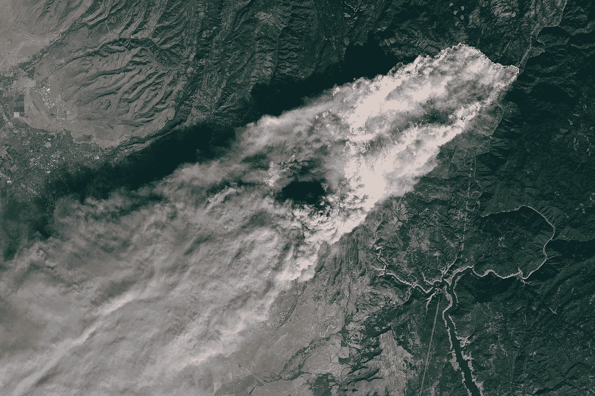
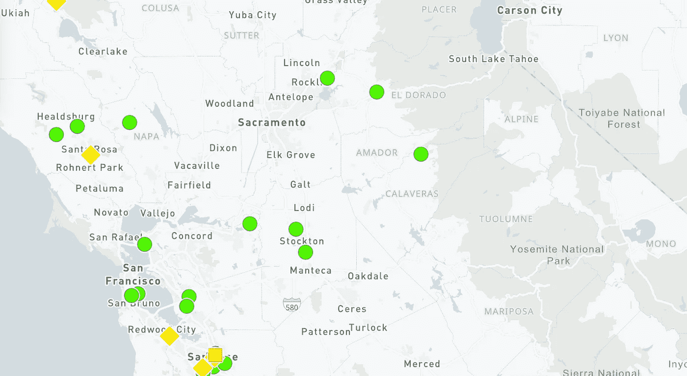
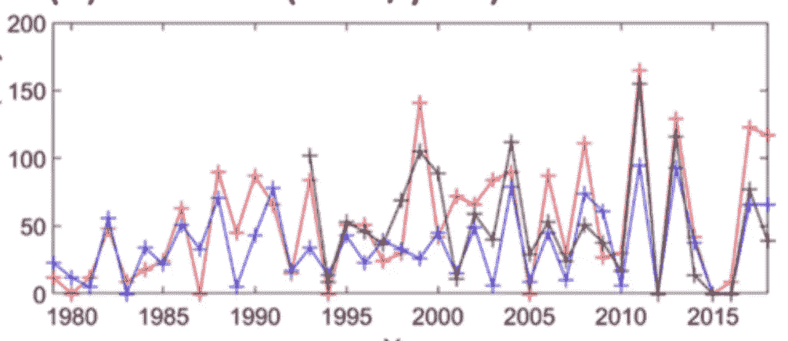
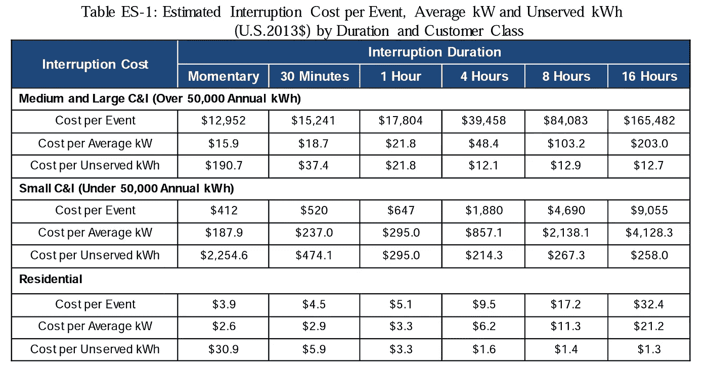
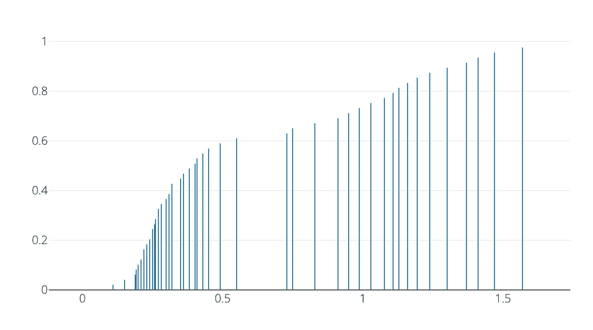
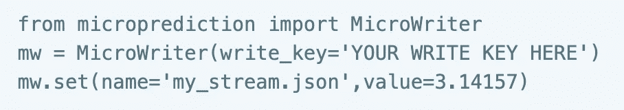
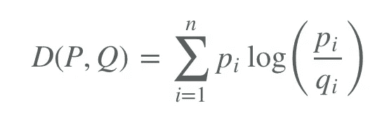
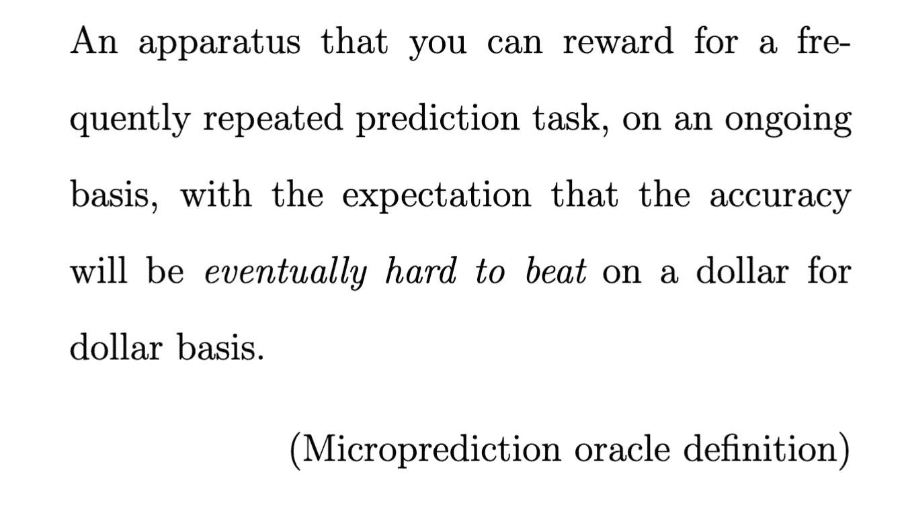
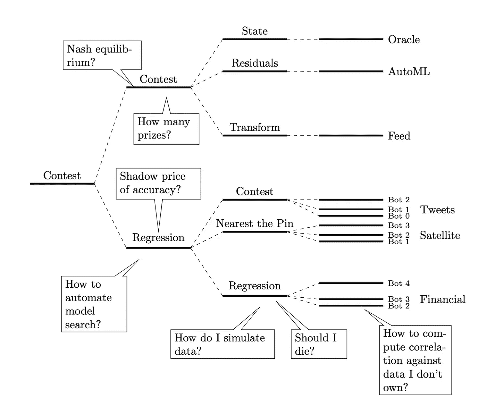
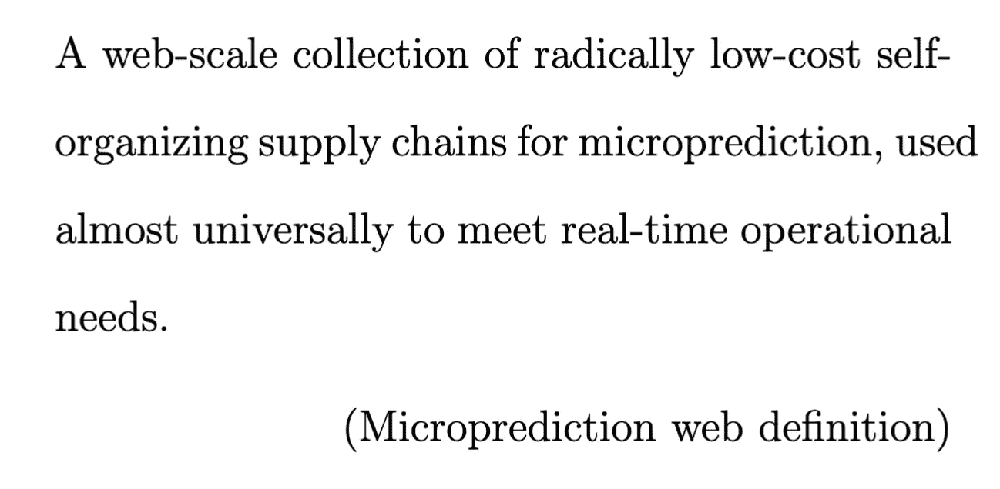

# 关闭加州——十亿美元的预测问题

> 原文：<https://medium.com/geekculture/shutting-down-california-the-billion-dollar-prediction-problem-5d8cadf9ed23?source=collection_archive---------5----------------------->

2018 年，营地大火导致 85 人死亡，并造成了巨大的破坏。受害者团体后来估计太平洋煤气电力公司(PG&E)的赔偿责任为 540 亿美元。这是一场可怕的悲剧，仅发生在 22 人丧生的“葡萄酒之乡”大火一年之后。

The Camp Fire, which began in 2018 on Camp Creek Road in Butte County, CA

糟糕的维护是罪魁祸首。注意力将集中在 2012 年 12 月受损的输电线路上。2018 年，在检测到线路损坏后约 15 分钟，同一根电线下报告了火焰。在这种情况下，冒烟的枪更像是一个冒烟的钢钩。它的工作是支撑高压输电线路。

# 公共安全电源关闭

加利福尼亚未来火灾的确切原因不得而知。但正如鲍勃·迪伦的歌曲提醒我们的那样，至少部分答案在风中飘荡。树木离电线太近，一旦接触，悲剧就可能接踵而至。

理论上，修剪树木、掩埋线路、更换疲劳部件可以大大降低灾难发生的概率。但这一点在十几年前就已经知道了(2019 年《旧金山纪事报》曾[报道过](https://www.sfchronicle.com/business/article/PG-E-is-less-than-one-third-done-with-its-2019-14483596.php)进展缓慢)。与此同时，加州人生活在一种必然被称为公共安全断电的邪恶之中(PSPS)。

PG&E Potential Outage Map

PG&E [信息页面](https://www.pge.com/en_US/residential/outages/public-safety-power-shuttoff/learn-about-psps.page)上解释了 PSPS，因此

> 强风可能会使树枝和碎片接触到带电线路，损坏设备并引发野火。因此，我们可能需要在恶劣天气下关闭电源，以帮助防止野火。这被称为公共安全电源切断。

根据 Gabrielle Wong-Parodi ( [论文](https://www.sciencedirect.com/science/article/abs/pii/S2214629622000032))的调查，这些对权力的自愿限制得到了公众的支持。然而，为了拯救生命和保护财产，它们并非没有自身的风险。在埃尔多拉多县，居民罗伯特·马迪斯无法切换到备用氧气系统。福克斯新闻频道报道了他的死讯。

加州公共事业委员会(CPUC)从 2012 年开始允许关闭。该计划现在对所有供应商开放，这些中断的成本和频率正在上升。2013 年只有一次电力供应限制。2019 年有 19 个。2020 年，这样的活动一共 20 个。

为向客户提供各种类型的警告制定了规则，最终以紧急短信和电话的形式出现，这些短信和电话可能会在断电前一小时到达。电力通常在一两天后恢复，但在最糟糕的情况下，停电会持续一周。

The suggestive symbology of the PG&E timeline for Public Safety Power Shutoffs (PSPS)

# 恶魔之风

事情只会变得更糟。帕特里克·墨菲在最近为政策智囊团 PSE 撰写的一篇文章中考虑了导致火灾风险增加的主要因素。其中包括报道的最高温度逐渐上升，以及上个世纪干旱严重程度的明显趋势。

但是同样重要的是所谓的*暗黑风*——来自东北的干热阵风袭击海湾地区及更远的地方。当空气经过海岸山脉并下降时，压力上升，温度高达 20 华氏度。

当风速达到每小时 40 英里时，就会产生危险的情况——不仅增加着火的几率，还会妨碍后续的防御。正如 Murphy 指出的，即使在过去几十年里，暗黑风也显示出令人担忧的趋势(y 轴是每年的小时数)。

Reported Diablo Winds by Year. Units are Hours per Year.

# 加州分布函数

Murphy 还报告了按年份和提供商划分的停电持续时间的累积分布函数。例如，在 2020 年:

The cumulative distribution function for Californian public safety power shutoff duration (hours)

劳伦斯·柏克莱国家实验室和莱森特开发了一种叫做中断成本估算(ICE)的[计算器](https://icecalculator.com/build-model?model=interruption)，可以估算任何中断的经济成本(你可以输入受影响的商业和非商业用户的数量)。沙利文、舍伦贝格和布伦德尔在 2015 年更新的荟萃分析中证明了这些数字的合理性。

这些作者提供了以下计算，以及基于季节和时间以及受影响行业的更详细的分解。他们的数据基于对 3000 多名居民和中小企业消费者的调查，以及对 100 家大型企业客户的深入采访。

Sullivan, Schellenberg, and Blundell interruption cost estimates by kWh

作者发现，在中断的持续时间内，成本大致是线性的。这些数字加起来。仅在 2019 年，关灯的经济成本可能在 20 亿至 30 亿美元之间。

# 社区分布功能

显然，必须做出一个关键的实时决策来平衡双方:是否应该切断电源？由于决策的复杂性，浮现在脑海中的最高度程式化的功利正交法可能是不够的。

但显而易见的是,*任何方法*都将受益于更精确的短期风速分布估计——更不用说直接通知风或火灾几率的其他测量量了。一小时前风速累积分布函数的示例如下所示。现场版可以看[这里](https://www.microprediction.org/stream_dashboard.html?stream=noaa_wind_speed_44005&horizon=70)。

Example of a one-hour ahead wind-speed cumulative distribution function (CDF). It is the result of fierce competition between prediction algorithms whose authors are free to use whatever exogenous data they can find. Perhaps these should be called “Community Distribution Functions”, “Competitive Distribution Functions”, or “Collective Distribution Functions”.

你所看到的并不容易被打败。在提出相反的观点之前，你应该看看你是否可以通过运行自己的算法来改善它，看看你最终在排行榜上的位置。(几行 Python 代码可能足以将您最喜欢的方法加入争论——参见[文档](https://microprediction.github.io/microprediction/predict-using-python.html))。

即使你在这场比赛中成功地赢得了比失去的更多的分数，请记住，仅凭你自己的模型*不会打败世界上的每一位数据科学家，当然也不会永远打败*。E* 即使你在某种程度上是“最好的”*“你的输入与其他人的组合将是最优概率估计，这就是可以从这些 CDF 中得出的结果。**

*这些风速预测是在一段时间前开始的，当时我决定花几个小时编写一个脚本，将 NOAA 发布的数字发送到创建这些 CDF 的[高速预测市场](https://www.microprediction.org/leaderboard.html)(完全公开，我编写并维护了这些 CDF)。*

*这些 CDF 没有什么神秘的——当它们应用于暗黑风速时，让我们称之为加州分布函数。相应的密度函数只是对未来测量量的所有猜测的集合。所有参与算法发送到 API 中的所有数字，也就是说，至少在一个小时之前。*

*顺便说一下，人们并不局限于基于陆地的测量，上面的例子实际上是在缅因湾浮动——浮标有自己的网页[这里](https://www.ndbc.noaa.gov/station_page.php?station=44005)。发布来自加利福尼亚的风速或风向数据，或者地球上某个地方的[水的高度](https://github.com/microprediction/microprediction/blob/master/hello_world/create_a_stream.py)，或者去你餐馆的游客数量，或者*任何仪器化的过程都是微不足道的。**

*预测的目标也可以是多个公共和私人数字的函数——任何你想设计的东西。人们可以[向通用预测 API 发送](https://microprediction.github.io/microprediction/publish.html)一个内部数据科学团队(比如一个使用高级气象模型的团队)报告的风速和之前做出的预测之间的*差异*。通过发布模型错误,“连续空间抽奖”(它可以被称为许多事情)可以立即充当模型审查功能，而且还可以改进模型本身。*

# *需要做些什么？(不多)*

*这些天来，我们习惯于听到没完没了的流行词汇，我们收到了大量关于在该领域部署预测分析的所谓最佳实践的建议——通常是一个非常昂贵的项目，有许多阶段和人员。有数据收集、清理、离线模型估计、模型漂移的检测、用于异常检测的各种侧管道，等等。*

*不用麻烦了。*

*开源微观预测信息市场的机制迟早会成为这种成本模型的笑柄。“加州”——指私人和公共角色中的利益相关方——不需要做任何事情。估计指定测量站的风速超过 30 英里/小时的可能性只需要以下步骤。*

1.  *开始[发布](https://microprediction.github.io/microprediction/publish.html)相关量(风速)*

# *为什么迟早会起作用*

*没错，只有*一个*步骤，而且有可能在几分钟内完成。如果有第二步，它可能包括宣传直播流的存在，并鼓励有公民意识的统计学家和机器学习爱好者加入战斗并运行预测算法。*

*即使他们不这样做，也已经有数百个时间序列算法已经在通过 API 观看了。他们迟早会发现新的加州流(尤其是如果提供了奖金，步骤 1.5)，并开始预测发送的内容。风速分布预测质量的提高可能只需要三行 Python 代码。*

**

*Three lines of Python that make the traditional “data science project” see odious.*

*由于进入门槛如此之低，只要数据科学家或工程师的一点点帮助，就没有什么可以阻止最先进的预测算法进入数据流。具体来说，做一个更技术性的评论，仅仅通过子类化 StreamSkater，就可以将当前[离线基准测试](https://microprediction.github.io/timeseries-elo-ratings/html_leaderboards/univariate-k_008.html)和指定 Elo 等级的一百个算法中的任何一个插入到一个实时算法中，如这里的[所解释的](https://microprediction.github.io/microprediction/predict-using-python-streamskater.html)，然后改变一行代码，并运行它。*

*你可以把所有这些算法想象成小弹丸枪，在未来事件的分布中发射概率原子。如果“Q”度量代表当前的市场分布，一些非常聪明的人知道真相“P”，那么可以向[展示](https://www.microprediction.com/blog/lottery)当他们在分布中发射“P”时，他们将随着时间的推移得到与“P”和“Q”之间的 Kullback-Leibler 距离成比例的奖励。*

**

*Points gained are, on average, proportional to KL-distance between true (P) and market (Q) probability if one is somehow able to identify P and then submit it to the live market on a regular basis.*

*当然，这并不是取胜的唯一途径。算法也可以尝试填补缺失的质量，如果它们察觉到一些缺失的话，就像它们在任何市场中可以做的那样。当 P > Q 时，它们提供更多的蒙特卡罗样本，从而帮助后者收敛于前者。*

# *效用预测能点燃预测效用吗？*

*在我的书[微预测:建立一个开放的人工智能网络](https://mitpress.mit.edu/9780262047326/microprediction/)中，我将微预测甲骨文定义如下:*

**

*我还提出了这样一个论点，即像[这样的 API 可能在两倍的成本内满足这个定义。撇开这种(有些松散的)逻辑不谈，加州可以从这一特定预言中受益的案例也可以建立在与市场相关的大量文献之上。甲骨文是一个非常轻量级的市场机制。](http://api.microprediction.org/)*

*更有趣的问题是“深度竞争”是否会出现，它被定义为当一个竞争算法使用 oracle 进行子任务时启动的多层竞争预测。此外，在未来，这可能不一定是实现类似于复杂消费品供应链的任务扇出的唯一方式。没有什么能阻止其他人创造他们自己的竞争预测神谕。*

*像加州风速预测一样重要的东西可能正是刺激这一发展所需要的——以及随之而来的专业化、外源数据搜索和重复使用的好处。为了看到这种更高级的可能性的最终状态，你需要想象一个模型的“微观管理者”网络，这些模型在为上游管理者服务的过程中结合了他们同事的输出，并相应地补偿他们。他们会有大量的经济统计学和统计经济学需要思考。*

**

*“Deep” real-time statistical contests and some theoretical issues they throw up*

*我的书通过这种类型的镜头考虑了“AI”的成本。在加州，对“公共安全概率”的应用是非常清晰的。但是，由于安全多方计算等方面的进步，秘密公司内部更多的私人预测也成为可能。最终，正如你们所预言的那样，像加利福尼亚所面临的实时运营挑战将会以一种真正的集体方式得到解决。他们将接入一个“预测网”。*

**

*然而，要实现这一点，组织和企业需要看穿“人工智能”的外表——这可能是近代史上发明的最无用的短语——并认识到，这种描述的大多数事情要么是“捆绑的微观预测”，要么是对数据饥渴方法的糟糕使用。*

*通过将快速重复的量化任务从其他业务逻辑中分离出来，我们可以将成本推向零，这是因为共享所有人使用的实时特征空间的好处，也是因为算法*重用它们自己*的成本可以忽略不计。*

*总之，加州公用事业面临的挑战可能是整个经济所需的预测公用事业类型的完美催化剂。*

***关于我***

*作为最近[任命的](https://www.linkedin.com/posts/richadbecker_there-are-only-4-data-science-people-on-li-activity-6975483922784612352--JmQ/)微影响者，我是 GitHub 上的“[微预测](https://github.com/microprediction)”，在这里你可以找到联系我的方法，试图向我出售可疑的非基准人工智能产品。如前所述，我也是麻省理工学院出版社出版的[微预测:建立一个开放的人工智能网络](https://www.amazon.com/Microprediction-Building-Open-AI-Network/dp/0262047322)的作者。我刚刚开始了一项 1664 公里的自行车挑战，为儿童癌症研究筹集资金。*