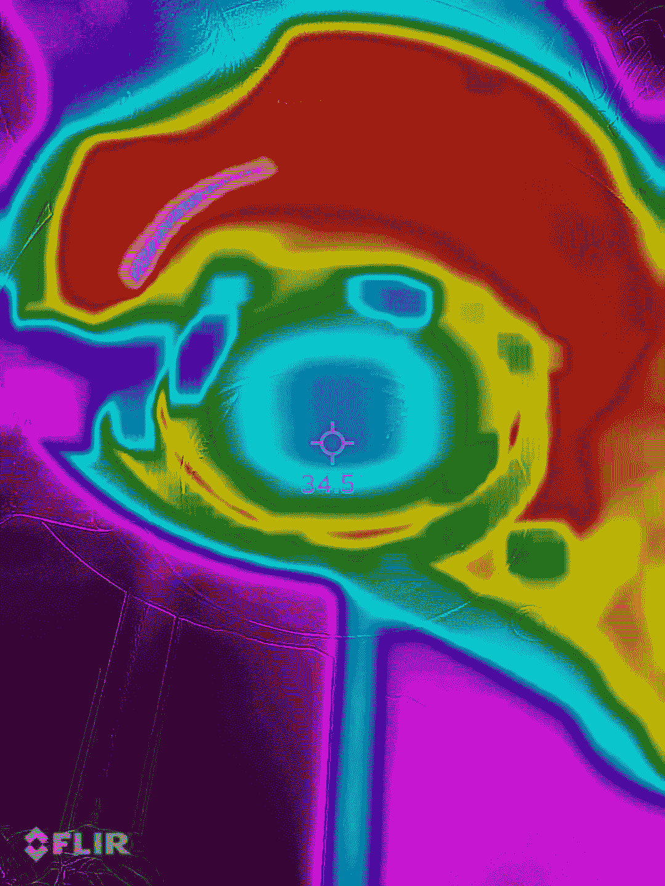
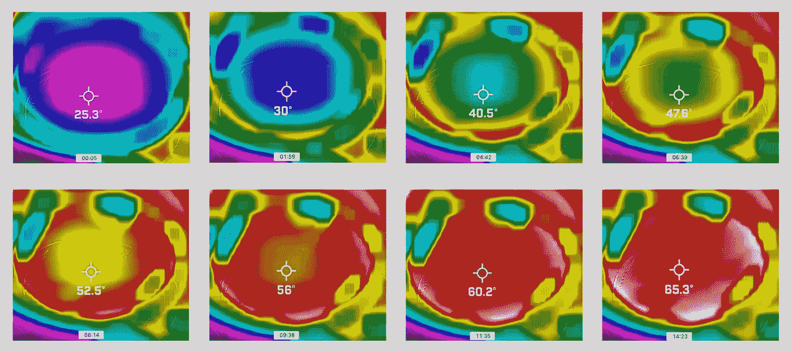
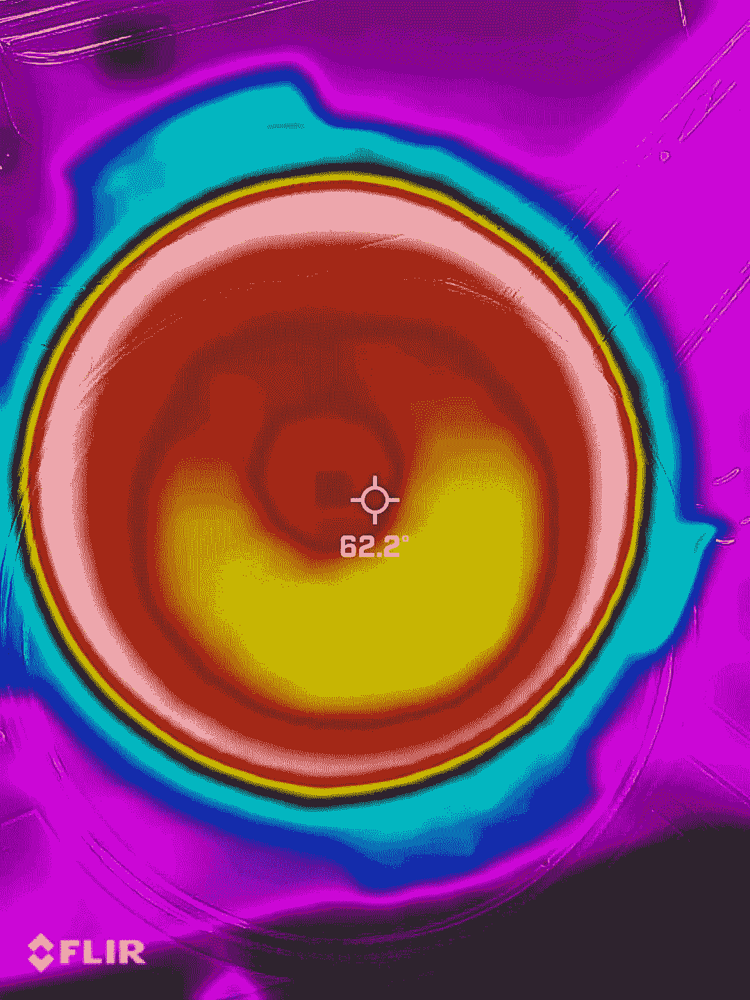
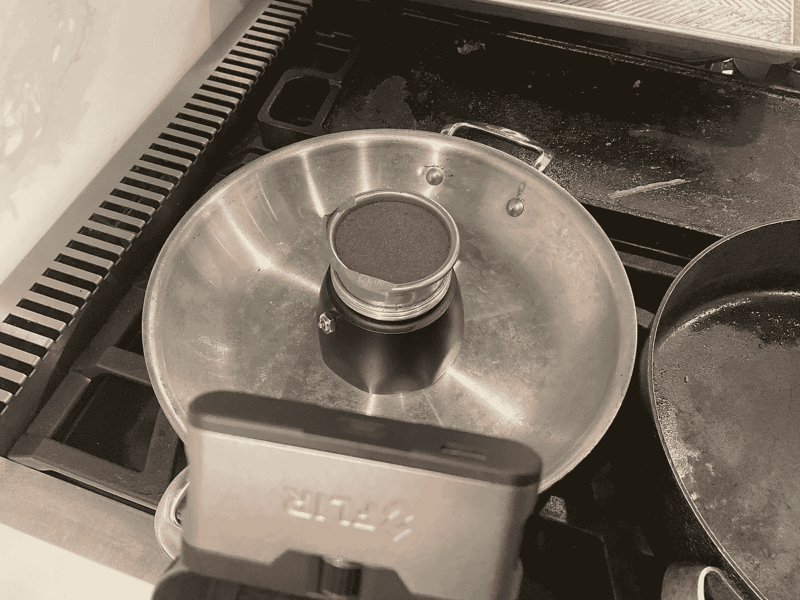
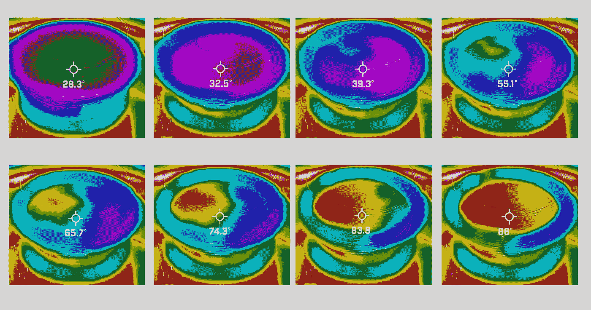
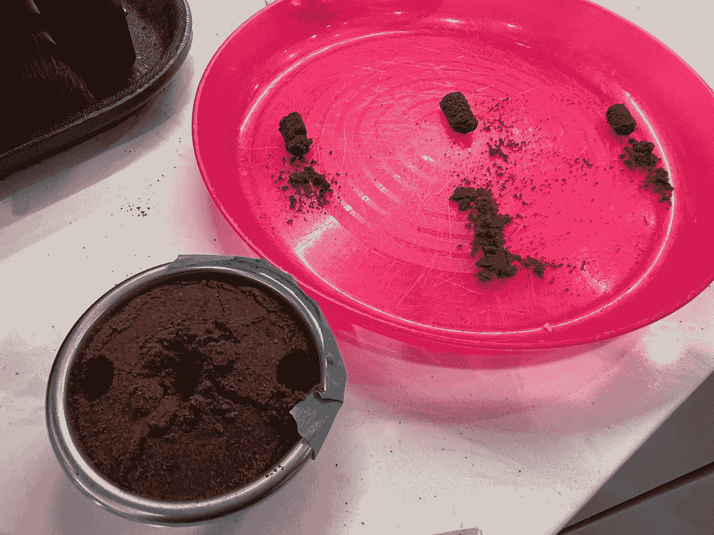
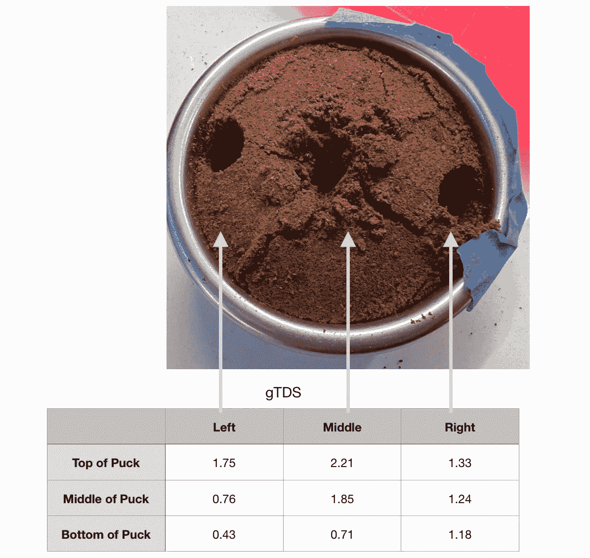
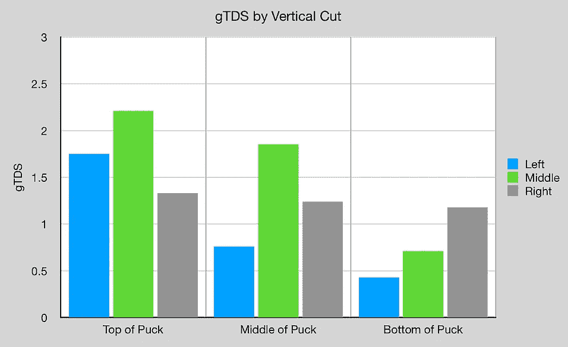
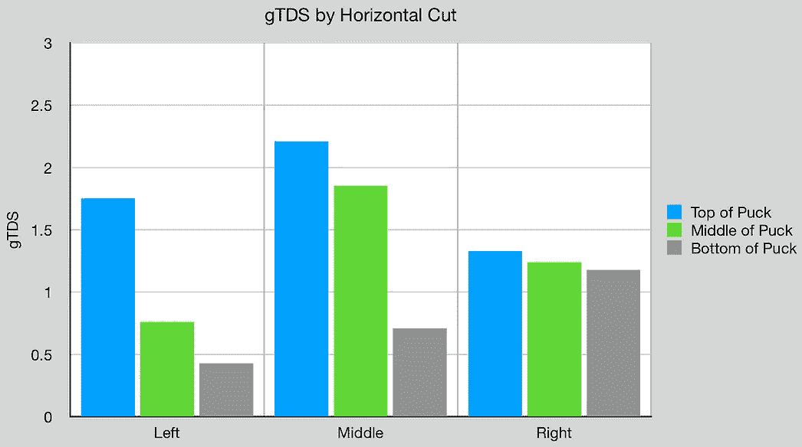

# 浓缩咖啡中的侧沟:热影响

> 原文：<https://medium.com/geekculture/side-channeling-in-espresso-thermal-impacts-88db375b472?source=collection_archive---------11----------------------->

## 咖啡数据科学

## 检验侧沟理论

当讨论通灵时，我首先想到的是侧通灵。很长一段时间，我认为侧沟主要是由杠杆机器和 E61 机器将水推到篮筐两侧的配水造成的。这种水的分散导致水在咖啡的边缘比中心更快地通过。也许有一些咖啡包装的问题，水如何对金属和咖啡流动。然而，我没有考虑的一个变量是热能。

在随机拍摄的过程中，我开始跟踪篮子的温度，因为有几次，我把便携式过滤器留在机器里，咖啡的流量变得更多地来自中间。很难确定原因，但当考虑篮子的动力学时，热能似乎是关键。

> 理论:侧沟部分是由金属篮比咖啡更高的导热率引起的。

如果篮子的侧面加热得更快，那么它会在加热冰球内部之前加热最靠近侧面的咖啡。[之前的数据](https://towardsdatascience.com/water-temperature-for-espresso-1abe656b54d3)显示，温度越高，咖啡可溶物的提取速度越快，因此，随着研磨温度的升高，圆盘边缘的提取速度将高于圆盘中心。

为了更好地理解这些热效应，我用热感相机(FLIR)收集了数据。我知道在闪亮的金属上热成像效果不如其他表面。对于浓缩咖啡篮来说，考虑到我是在寻找相对而非绝对的温差，它似乎已经足够好了。

# 第一个测试:Portafilter

我测试了导致我考虑这些变量的原始实例，方法是将一个 portafilter 锁定到机器中，然后等待。我在里面装满了用过的咖啡渣，然后拍了一段延时录像。

All images by author

过滤篮最终被加热到一个更均匀的温度，但在几分钟的时间里，你可以看到篮子的内部因为咖啡渣而需要更长的时间来加热。

The time stamp is at the bottom of each image.

我把咖啡球从便携式过滤器中取出后，给它的顶部拍了张照片:

甚至高温也有甜甜圈效应。

# 第二项测试:顶部带有过滤篮的陆丹蓝

金属篮筐的问题是，热感相机离开金属就不能很好地工作。我想看看咖啡怎么了。所以我在陆丹蓝的底部放了一篮咖啡。我在一边贴了些胶带来帮助热成像。

然后我抓拍了一段视频。有一个轻微的不均匀，导致蒸汽在篮子的左上方一侧上升。这导致一个热量岛从那一侧扩展开来。

# 额外学分

这个篮子里装的是用过的咖啡，在那个时候，用来生产这些用过的咖啡渣的原料大约含有 20%的 EY。所以咖啡里还有一些可溶物。我决定测试蒸汽如何影响可溶物的位置。注意，我在准备篮子之前重新混合了用过的咖啡，所以我假设可溶物在咖啡渣中均匀分布。

我采取了核心，并测量了地面 TDS (gTDS)。

我惊讶地发现可溶物似乎被推到了冰球的顶部。我在蒸汽通过咖啡球时看到过这种效果。

这项研究提供了初步的证据，表明咖啡篮与咖啡相比的热特性是影响侧沟的一个变量。我不确定如何做出相应的调整，但如果不首先确定变量，就很难解决问题。

如果你愿意，可以在推特、 [YouTube](https://m.youtube.com/channel/UClgcmAtBMTmVVGANjtntXTw?source=post_page---------------------------) 和 [Instagram](https://www.instagram.com/espressofun/) 上关注我，我会在那里发布不同机器上的浓缩咖啡照片和浓缩咖啡相关的视频。你也可以在 [LinkedIn](https://www.linkedin.com/in/dr-robert-mckeon-aloe-01581595) 上找到我。也可以关注我在[中](https://towardsdatascience.com/@rmckeon/follow)和[订阅](https://rmckeon.medium.com/subscribe)。

# [我的进一步阅读](https://rmckeon.medium.com/story-collection-splash-page-e15025710347):

[我的书](https://www.kickstarter.com/projects/espressofun/engineering-better-espresso-data-driven-coffee)

[我的链接](https://rmckeon.medium.com/my-links-5de9eb69c26b?source=your_stories_page----------------------------------------)

[浓缩咖啡系列文章](https://rmckeon.medium.com/a-collection-of-espresso-articles-de8a3abf9917?postPublishedType=repub)

工作和学校故事集