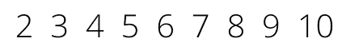

# 厄拉多塞之筛:最古老的算法之一，仍然流行，仿佛它是昨天才诞生的

> 原文：<https://medium.com/geekculture/sieve-of-eratosthenes-one-of-the-oldest-algorithms-still-prevalent-as-if-it-were-born-yesterday-c3e854df5dc6?source=collection_archive---------30----------------------->

## 厄拉多塞筛是当今已知的最古老的算法之一。然而，不管它的年龄和它的工艺，为什么人们仍然使用它，我们如何优化这个算法以匹配今天的工艺？

这个世界上有很多算法。当我们想到算法的例子时，我们会想到二分搜索法、A* Search、BFS 和 DFS，以及更多的算法。我们今天知道的算法是迄今为止人类发现的最好的理论计算机科学计算之一(这就是为什么今天的算法如此著名！).然而，这并不意味着古代文明使用的算法效率不高。我们的大多数发现都是建立在古代作品的预先陈述和理论之上的。我们可以拿几何学作为一个简单的例子。几何首先由欧几里得介绍给世界，然后由其他数学家和物理学家推进，带来了新概念，如 n 维超球的*体积。但是不仅仅是数学超越了以前的工作。计算机科学可以说是一门深受古代文明影响的学科。我们的许多算法，如果不是所有的算法，都是受到古代文明的过程和理论的启发。尽管如此，仍有一些我们今天仍在使用的算法没有任何改变。其中一种算法被称为厄拉多塞筛。*

厄拉多塞之筛是人类文明已知的最古老的算法之一，用于寻找任何给定极限的质数。该算法归功于公元前三世纪的希腊天文学家、数学家、地理学家和历史学家厄拉多塞。算法的工作方式非常直观。他指出，对于任何给定的上限， *n* ，我们从 2 开始，迭代地将素数的倍数标记为合数。一旦 2 的所有倍数都被标记为复合，下一个素数(即 3)的倍数就被标记为复合。这个过程会一直持续到 *p* ≤ *n，*其中 *p* 是一个质数，这将使所有未标记的数都是质数。

例如，假设我们想找出 10 之前的所有素数。我们的第一步是列出从 2 到极限的所有数字(在本例中是 10)作为素数。

Numbers from 2 to 10 | Image by Author.

现在，从 2 开始，我们将所有 10 以下的倍数标记为非质数:

Notice how the multiples of 2 have been marked as composite.

既然我们已经将 2 的所有倍数都标记为合数，那么我们可以继续处理序列中的下一个数字 3。就像第二个，我们重复同样的过程。不过注意，6 已经标记好了，不用再标记了。

The multiples of 3 have been marked as composite.

我们继续比较每一个未标记数字的倍数。在这种情况下，5 的所有倍数都已被标记，7 的第一个倍数大于极限。因此，我们可以得出结论，我们已经找到了所有的素数，直到 10: 2 和 7。

这个寻找质数的过程被应用在许多概念中，使它变得非常重要。有时候，甚至我们使用它，但我们并不自觉地知道它(后面会详细介绍)。然而，这种算法的基本实现在寻找大数字的素数时效率不高，因为它花费的时间太长。对于我的计算机科学爱好者来说，这将被认为是一个幼稚的解决方案。无论你在什么领域使用这种算法(我很快会谈到这一点)，这种通过检查每个*和每个*数的*和*的倍数来寻找素数的过程是没有效率的，因为对于超过 10 的极限，这将花费太长的时间。对，10！然而，总有改进的余地。

我们可以实现三种优化，将我们的搜索减少大约一倍 *log (log n)* 。为了说明这些更新，我将使用 Python 创建一个更有效的算法，因为毕竟这些优化最初是针对计算机科学领域的。让我们先来看看算法在 Python 中的基本实现:

# 优化 1-设置结束边界

在我们的基本实现中，外部循环从 2 迭代到 *n* 。换句话说，我们的基本迭代是从 2 到极限。因为我们标记的是基值的倍数，所以我们只需要检查低于极限平方根的单个数字( *n* )。让我们回头看看我们的例子，限制为 10。

与基本实现类似，我们将首先标记所有 2 的倍数。

Multiples of 2 have been marked composite.

然后我们可以继续标记 3 的倍数。

Multiples of 3 have been marked composite.

现在请注意，我们接下来要看的数字是 4。然而，4 大于我们的极限(10)的平方根，所以我们可以在这里结束我们的遍历。此外，如果你看看上一步，我们标记所有的 3 的倍数，所有的非质数确实已经观察到了。

# 优化 2 —寻找第一个倍数

第二个优化围绕以*(当前数量)*的因子跳过遍历。本质上，在我们的基本实现中，内部循环开始检查两倍于当前数字的倍数。但是，我们可以跳过一些检查，从当前数字的平方开始遍历。

回到 10 的例子，我们从标记 2 的倍数开始。

Multiples of 2 are marked.

然后，把 3 的倍数都标出来。因为已经标记了 6(3 的第一个倍数),所以不用标记它，我们可以从 9 (3)开始遍历。

After starting our traversal at 9, we have found all our primes.

平均而言，通过仅使用这种优化，我们已经通过少一个比较完成了检查。

# 优化 3 —预先标记所有偶数

这种优化似乎是常识。然而，许多人忘记了这种方法甚至是作为一种优化方法而存在的！当我们从 2 到极限构建或列出我们的数字时，这种优化就出现了。甚至没有必要检查两个之后的偶数，因为它们永远不会是质数。最多，所有偶数都至少是 2 的倍数。因此，不是通过在列表中留下偶数来增加额外的迭代，我们可以通过将迭代次数减半来移除它们！简单却有效，不是吗？

实现这些优化后，我们的算法如下:

我们新的优化算法的搜索时间是 *O(n log (log n))* 时间。这是对我们天真的 *O(n )* 时间方法的巨大改进！但是我们是如何把时间复杂度降低那么多的呢？有三个操作需要考虑:创建数组、递增和标记循环。我们的创建发生在线性时间中，因为它为从 2 到 *n* 的每个数字创建一个元素。这相当于手工列出了从 2 到极限的所有数字。因此，没有比将每个数字一个接一个地写入或添加到数组中直到达到极限更好的解决方案了。现在是定义的复杂部分。多重标记发生在*日志*时间*时间*因为它归结为某种[复杂的数学*时间*时间](https://www.geeksforgeeks.org/how-is-the-time-complexity-of-sieve-of-eratosthenes-is-nloglogn/)。根据定义，你可以标记一个非质数的次数是 *n/2 + n/3 + … n/(√n)。*它以 *n/2* 开始，因为最初，2 的所有倍数都被标记为非质数(这将发生大约 50 次，每次限制为 100，因为每个偶数都被标记)。这个过程一直持续到极限的平方根( *n* )。此外，通过一些数学证明，这算出了 *O( n log (log n))* 的整体复杂度，因为这大于 *O(n)* 的数组创建时间。

查看我的 Github，了解关于我的算法 Python 实现以及我如何包含这些优化的更多信息:[https://Github . com/geegabyte 1/interview questions/tree/master/Sieve _ of _ Er](https://github.com/GEEGABYTE1/InterviewQuestions/tree/master/Sieve_of_Er)

但是为什么这些优化很重要呢？正如我前面提到的，这些优化允许我们在今天的过程中更有效地使用这个算法。不过，你可能会问，“为什么我们不能创造另一种算法来计算素数？”。很棒的问题！尽管数学取得了许多进步，但使厄拉多塞筛仍然适用的是它的精确性和简单性。没有多少算法两者兼得。例如，尽管很简单，但筛子在 31.2 秒内找到了所有高达 1 亿的素数，并且在 6 分 30 秒内找到了所有 26，355，867 个高达 5 亿的素数！

厄拉多塞的筛子主要用在质数起作用的地方。在当今世界，安全是一件大事，现代加密算法是让我们远离危险网络的东西。目前最流行的现代加密算法之一是 sha256。如果你还不知道，sha256 保护各种加密货币的交易。技术领域的另一个例子是公钥加密，它依赖于将大数分解为特定密钥的质因数的复杂性。在技术世界之外，筛子主要用于数学，特别是抽象代数和初等几何，其中对物体(形状)的研究反映了素数的行为。甚至生物学家也使用筛子来模拟各种物种的种群增长(例如，昆虫及其与蛴螬的种群比例)。在音乐的世界里，作曲家用质数来创作格律音乐。例如，一位法国作曲家*奥利维亚·梅西安*利用质数来创造非正统的节奏，让他的作品听起来更好；《T2》和《T4》分别于 1935 年和 1949 年和 1950 年出版。

筛子的应用多种多样，信不信由你，我只列举了几个！只要记住一件事，有素数的地方就是用筛子的地方。质数每天都在使用，因为它们有一些有趣的性质，可以描述自然、宇宙和人类的独特行为。因此，由于素数及其在理解世界和现实中的重要性，筛子被用来有效地计算素数，以使我们更好地了解我们生活的宇宙和时间。

# 资源/引用

德特普尔，杜恩和卡尔文·朗。小学教师的数学推理。艾迪森-韦斯利。纽约；1996.

[昔兰尼的厄拉多塞。](http://www-groups.dcs.st-and.ac.uk/%7Ehistory/Mathematicians/Eratosthenes.html)[http://www-groups . DCS . ST-and . AC . uk/~ history/mathematics/eratosthenes . html](http://www-groups.dcs.st-and.ac.uk/~history/Mathematicians/Eratosthenes.html)

Goles，e；舒尔茨，o；Markus，M. (2001 年)。"捕食者-食饵模型中周期的素数选择."*复杂*。**6**(4):33–38。[bib code](https://en.wikipedia.org/wiki/Bibcode_(identifier)):[2001 cmplex…6d..33G](https://ui.adsabs.harvard.edu/abs/2001Cmplx...6d..33G) 。[doi](https://en.wikipedia.org/wiki/Doi_(identifier)):[10.1002/cplx . 1040](https://doi.org/10.1002%2Fcplx.1040)。

idlecodi_matta。(2020 年 10 月 18 日)。厄拉多塞的一个更快的筛子。空闲编码。[https://idlecoding.com/making-eratosthenes-go-faster-1/.](https://idlecoding.com/making-eratosthenes-go-faster-1/.)

生病，彼得·詹森，编辑。(1995). [*梅西安的同伴*](https://books.google.com/books?id=7ag3ymWqvfgC&pg=PT225) 。俄勒冈州波特兰市:阿马德乌斯出版社。《出埃及记》13.2 *五旬节餐厅*1‘主菜’。[ISBN](https://en.wikipedia.org/wiki/ISBN_(identifier))[978–0–931340–95–6](https://en.wikipedia.org/wiki/Special:BookSources/978-0-931340-95-6)。