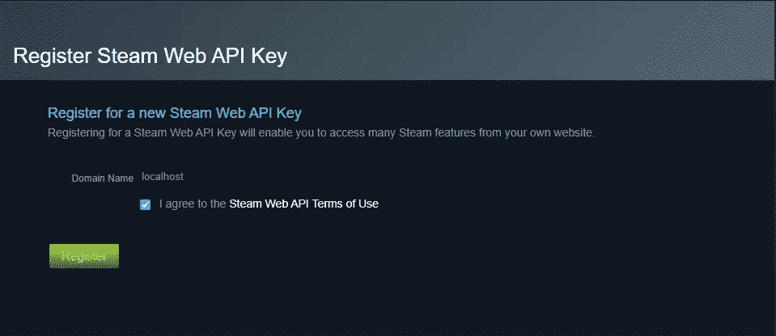
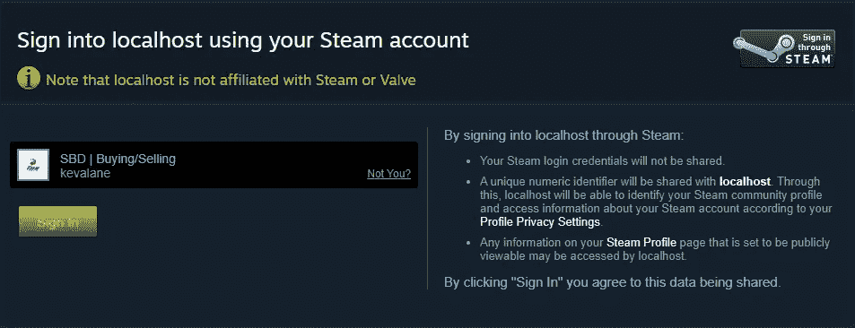
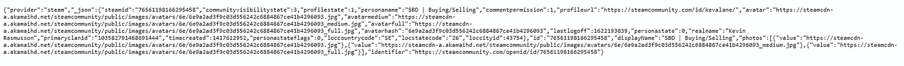

# 使用 NodeJS 通过 Steam 登录

> 原文：<https://medium.com/geekculture/sign-in-through-steam-using-nodejs-e3202d4719?source=collection_archive---------3----------------------->


Valve’s preferred “Sign in through Steam” image.

如果你正在运营一个以任何方式连接到 steam 服务的网站，那么允许你的用户通过 Steam 登录是必不可少的。这种认证方式允许你无缝地收集用户的 SteamID64，从而允许你看到他们的 Steam 清单，个人资料图片等。在这篇文章中，我将教你如何使用 NodeJS 在你的网站上建立一个“通过 Steam 登录”系统。

# NPM 安装

首先，我们需要安装一些 npm。需要进行以下安装:

```
npm install expressnpm install express-sessionnpm install passportnpm install --save passport-steam
```

没有安装 npm？前往[nodejs.org](https://nodejs.org/en/)安装你选择的操作系统。

# 开始构建服务器

假设我们正在处理一个普通的项目，我们将需要从构建一个简单的服务器的必要代码开始。所有代码都可以在 [GitHub](https://github.com/kevalane/sign-in-through-steam) 上找到。

```
// Require all the installs
var express = require('express');
var passport = require('passport');
var session = require('express-session');
var passportSteam = require('passport-steam');
var SteamStrategy = passportSteam.Strategy;
var app = express();// Let's set a port
var port = 3000;// Spin up the server
app.listen(port, () => {
 console.log('Listening, port ' + port);
});
```

您可以使用(假设您将应用程序文件命名为 app.js)来运行这段代码:

```
node app.js
```

如果此时出现任何错误，请确保所有软件包都已正确安装。

# 设置 API 密钥

若要继续，您需要使用您的 steam 帐户设置一个 API 密钥。头转向 https://steamcommunity.com/dev/apikey 的，它看起来会是这样的:



键入“localhost”作为域名，同意条款并点击“注册”您将被重定向到一个带有您的 steam API 密钥的页面，复制它(您将在下一步中需要它)。

# 建立蒸汽策略

现在，我们需要添加大量代码来使身份验证正常工作。以下是必需的:

```
// Required to get data from user for sessions
passport.serializeUser((user, done) => {
 done(null, user);
});passport.deserializeUser((user, done) => {
 done(null, user);
});// Initiate Strategy
passport.use(new SteamStrategy({
 returnURL: '[http://localhost:'](http://localhost:') + port + '/api/auth/steam/return',
 realm: '[http://localhost:'](http://localhost:') + port + '/',
 apiKey: 'YOUR_API_KEY'
 }, function (identifier, profile, done) {
  process.nextTick(function () {
   profile.identifier = identifier;
   return done(null, profile);
  });
 }
));app.use(session({
 secret: 'Whatever_You_Want',
 saveUninitialized: true,
 resave: false,
 cookie: {
  maxAge: 3600000
 }
}))
app.use(passport.initialize());
app.use(passport.session());
```

简而言之，下面这段代码允许我们对用户进行身份验证，并将他们存储在一个会话中，这对于构建一个具有持久登录会话的网站是必不可少的。我鼓励进一步阅读 [Passport.js](http://www.passportjs.org/) 和 [Express Sessions](https://www.npmjs.com/package/express-session) 以加深理解。

请注意“YOUR_API_KEY ”,您需要在这里添加上一步中的 API 密钥。“Whatever_You_Want”只是快速会话的一个秘密字符串，它可以被更改为您想要的任何内容。

# 创建路线

我们最不需要的是处理来自前端的请求的路由。

```
// Routes
app.get('/', (req, res) => {
 res.send(req.user);
});app.get('/api/auth/steam', passport.authenticate('steam', {failureRedirect: '/'}), function (req, res) {
 res.redirect('/')
});app.get('/api/auth/steam/return', passport.authenticate('steam', {failureRedirect: '/'}), function (req, res) {
 res.redirect('/')
});
```

“/”路由仅作为我们在身份验证后重定向到的备用路由。

“/api/auth/steam”路径是我们使用一个简单的 href 从前端将用户重定向到的路径:

```
<a href="http://localhost:3000/api/auth/steam">Sign in</a>
```

添加完这段代码后，启动您的服务器并导航到上述 URL，您应该会看到以下熟悉的官方 steam 页面:



现在，使用您自己的 Steam 帐户登录，您将被重定向到主页面 localhost:3000/，在这里您将看到以下内容:



这只是' req.user '的主体(见'/'路由，这里可以看到 res.send())。从这些 JSON 数据中，你可以得到用户的 Steamname，Avatar(不同大小)，SteamID64 等等。

这个示例只是作为一个简单的设置供您构建。例如，一个真实的网站可能会有一个存储用户信息的数据库，因此您需要在认证后操作 JSON 数据，并将必要的信息插入到您选择的数据库中。

如果您有任何问题，请留下您的评论，我将确保回复。如果你的故事提供了任何价值，考虑一下**在媒体上关注**我——他们不再向拥有< 100 名关注者的创作者支付报酬