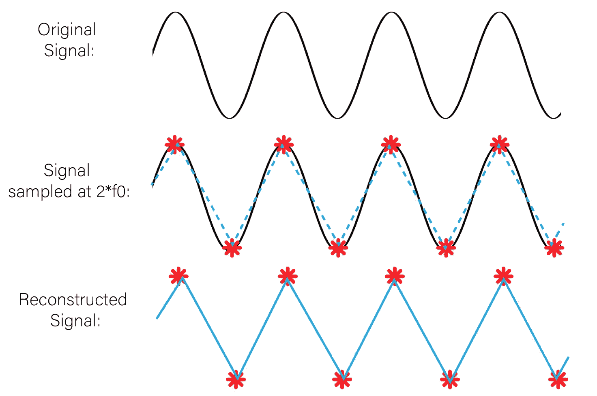

# 信号处理:奈奎斯特频率

> 原文：<https://medium.com/geekculture/signal-processing-the-nyquist-frequency-683269ca70fb?source=collection_archive---------2----------------------->

收集时间序列数据？需要知道需要多快采样才能理解信号——别再犹豫，这篇文章就是为你准备的！

例如，考虑大多数电子设备的频率— 60 赫兹，缩写为(Hz)。这意味着信号每秒振荡 60 次或每秒完成 60 个周期。执行模数(A/D)转换意味着我们需要…