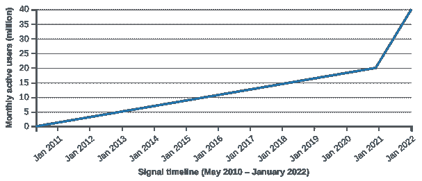
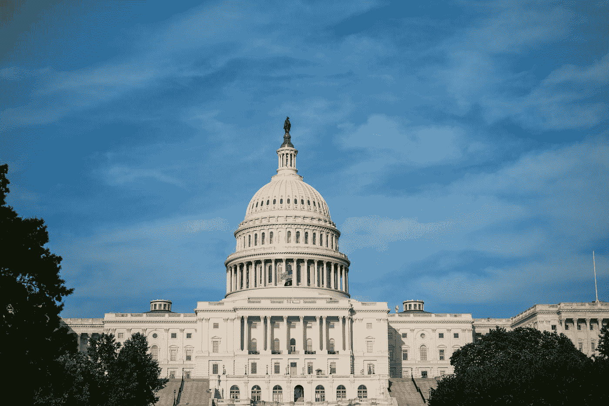
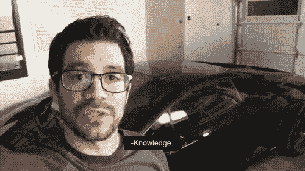

# 信号会受到影响

> 原文：<https://medium.com/geekculture/signal-will-be-compromised-eb18a91fd51f?source=collection_archive---------1----------------------->

## 为什么你会停止使用信号？

Photo from [https://ocdn.eu/](https://ocdn.eu/)

本文于 2022 年 3 月 29 日提交出版。

在 Elon Musk 发布关于 Signal 的推文后，该应用程序的用户数量激增就不足为奇了。

Figure 1 from Wikipedia

他们声称自己是一个端到端加密的私人信使，这使他们成为最受欢迎的消息应用之一。对于 Whatsapp 和 Telegram 这样的应用，隐私政策往好里说是奇怪的，往坏里说是侵犯隐私。难怪人们会迅速转向信号。但是如果我告诉你信号会被破坏。

这就是为什么信号会被破坏。

## 《挣得它法案》

Photo by [Elijah Mears](https://unsplash.com/@elijahjmears?utm_source=medium&utm_medium=referral) on [Unsplash](https://unsplash.com?utm_source=medium&utm_medium=referral)

自 2020 年以来,《挣得它法案》一直试图在美国国会获得通过。经过不断的反复，它终于比以往任何时候都更好地回来了。根据斯坦福大学法学院对《挣得它法案》的[分析。](https://cyberlaw.stanford.edu/blog/2020/01/earn-it-act-how-ban-end-end-encryption-without-actually-banning-it)

> 实际上，该法案将允许不负责任的委员制定最佳实践，使在线服务提供商(聊天、电子邮件、云存储等)违法。)来提供端到端加密

这反过来使得任何**在线服务**提供商为其客户提供真正的端到端加密成为非法成为可能。这一切都是以保护儿童的名义做的。

> 有些母亲“想想那些可怜的孩子”

我们以前在哪里听过这个？出于某种原因，联邦政府认为将管理儿童安全的责任从家长和学校直接转移到这些公司是个好主意。似乎这些科技公司一开始就有着孩子们最好的意图。

## 只要让 Signal 成为一家非美国公司

作为一家美国公司，Signal 必须遵守美国法律。然而，为了便于讨论，我们假设 Signal 像 Protonmail 一样成为一家瑞士公司。为了减少美国用户的延迟，Signal 托管在亚马逊网络服务和微软 Azure 上。两家最大的美国公司将遵守美国法律。这些公司将迫使他们的用户遵守政府法规和公司政策。Signal 将不得不将其服务器移出美国。

你可能不想使用有延迟问题的应用程序。而且就算你做了，别人也不会。而这些[app 都是靠联网效果存在的](/geekculture/the-state-of-digital-peasantry-2f6326da88f7)。这一举措将有效地扼杀他们的用户群。

## 你能做些什么呢？

参议院司法委员会已经通过了收入法案。

> 这项法案正被快速推进，以尽快在国会两院获得通过，我非常担心这一次它会在前任没有成功的地方获得成功。

对于那些想在美国保持互联网自由开放的人来说，T2 还有希望。然而，如果法律通过，它只会加强对社区驱动的开源项目的兴趣。

[皮尤研究中心称](https://www.pewresearch.org/internet/2019/11/15/americans-and-privacy-concerned-confused-and-feeling-lack-of-control-over-their-personal-information/pi_2019-11-14_privacy_0-02-2/)

> 81%的美国人觉得他们对从公司收集的数据几乎没有控制权。对于政府数据收集来说，这个数字增加到了 84%。

大多数美国人，无论是民主党人、共和党人、自由主义者还是无党派人士，都会同意我们现有的数字隐私法是不够的。《挣钱法案》的通过只会增加这个数字。

法律会随时改变。这就是我提倡技术自给自足的原因。[用会话代替信号](https://getsession.org/)。因为[会话允许任何人托管一个公牛节点](https://docs.oxen.io/about-the-oxen-blockchain/oxen-service-nodes)。我[教人们如何自己托管自己的 Google Workspace 服务](/@dretechtips/how-to-dismantle-the-google-empire-e652bff6d2)。我还教人们如何停止为电影、电视节目和音乐等内容付费。我教学校和企业如何远离大型科技公司。我教每个人如何停止使用收集和出售广告数据的操作系统。

所有这些

Photo from moneydoneright.com

实际上是免费的。

尽管有科技公司的营销，你并不需要公司来促进许多消费者在线服务。这些科技公司利用消费者的无知，提供免费便捷的在线工具。记住当产品免费时，你就是产品。

## 最后

在线隐私是 21 世纪面临的最紧迫的问题之一。[订阅免费电子邮件列表，获取更多关于在线隐私的内容。](/subscribe/@dretechtips)遵循以下指南，前往[保护您的电子邮件隐私](/geekculture/protect-yourself-with-email-alias-f10ce787cae)。

**加入我们，成为 50 多位想要改善在线隐私的人。**

达到这一点可能意味着你同意大部分已经写了。留下大量的掌声和分享，以获得向大众推广不受欢迎的在线隐私信息的算法。

**相关内容:**

*   [没有 YouTube 怎么看 YouTube？](/geekculture/how-to-watch-youtube-without-youtube-b015da2790eb)
*   [JavaScript:安全和隐私噩梦](/geekculture/the-javagate-scandal-fead695c4830)
*   [你的邮件:最大的数据泄露](/@dretechtips/your-email-the-greatest-data-leak-149eacd35246)