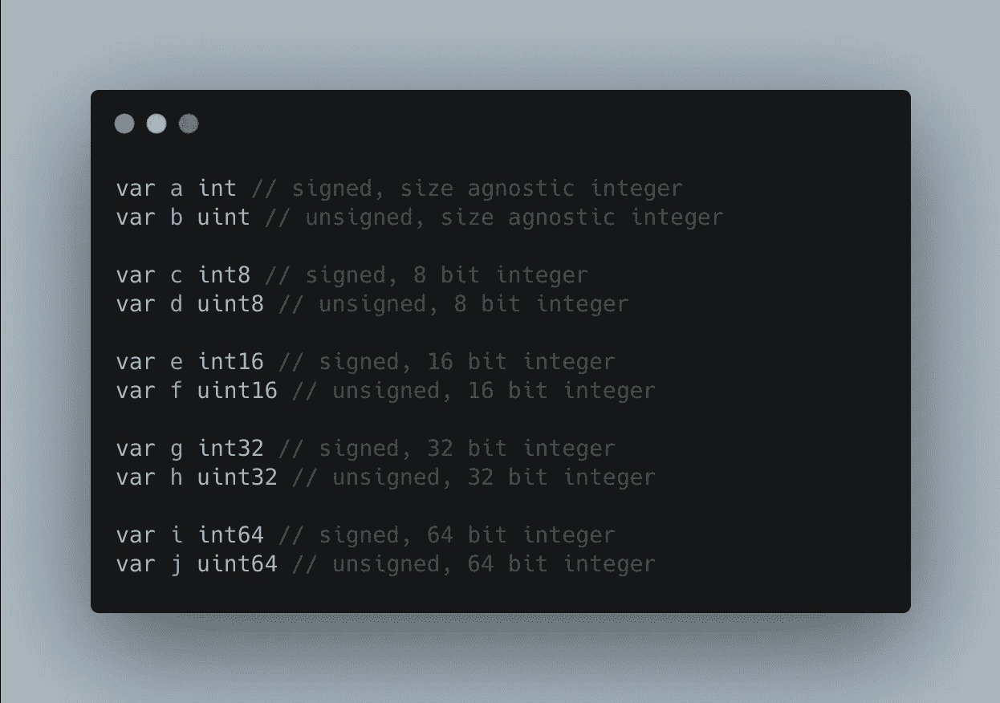
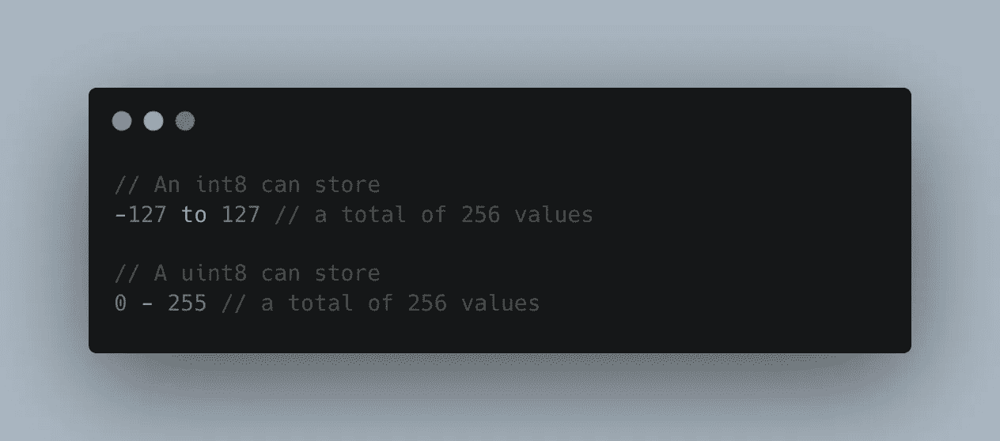
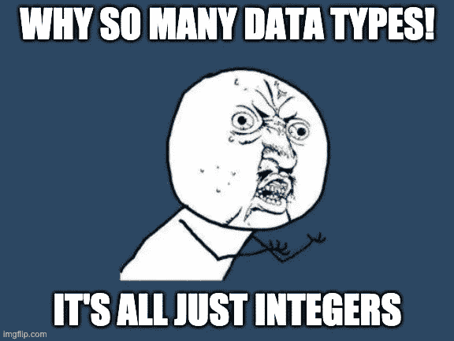

# 有符号和无符号整数

> 原文：<https://medium.com/geekculture/signed-and-unsigned-integers-b5d4e7f0369f?source=collection_archive---------10----------------------->

## 那是什么意思！😭Golang 底漆

编程中的`Signed`变量是指可以同时保存正值和负值的变量，无符号是指只能保存正值的变量。

在像 Golang 这样的语言中，你可以指定你希望一个变量能够保存哪些类型的整数，当你开始担心内存优化时，这是特别重要和有帮助的。

如果你明白什么是位，什么是字节，你就会明白下一部分，否则，[查看我的文章](http://google.com)关于[位和字节](http://google.com)的主题。如果你想深入研究，一个比特可以代表任何东西，但是为了清楚起见，我们可以说一个比特可以有两个值，一个 1 和一个 0

这意味着对于每一位，你可以产生 2 个可能的数字。这意味着 2 位可以产生 4 个可能的数字，8 位可以产生 255 个数字，依此类推。有了这些知识，8 位数字的范围从 0 到 255 就不足为奇了。

现在 Golang 为我们提供了一些整数类型:

`uint`、`int`、`uint8`、`int8`、`uint16`、`int16`等等，直到两种整数类型(有符号和无符号)的 64 位变体，此外还有浮点和复数变体(我们今天不会讨论它们😉)

每个变量前面的“u”表示无符号，这意味着它们只能保存正的*值，没有“u”的变量是有符号的，这意味着可以保存负值和正值。*

Let’s go! 🚀

进一步理解，每个变体末尾的数字描述了每个变体可以容纳多少位数据。如果你还记得这篇文章中的[，8 位可以保存 256 个值，这就意味着一个`int8`和一个`uint8`变量可以分别保存 256 个值，但是可能性的范围不同。](http://google.com)

Integer types in Golang

一个`unigned` 8 位整数`uint8`，可以保存值`0-255`，总共 256 个值，但是我们可以在一个 8 位有符号变量`int8`中存储什么呢？我们将 256 在两极中间分开，所以负方向的`127`和正方向的`127`，当然，在中间，我们有一个`0`👇🏽

按照同样的逻辑，我们可以说一个`uint16`可以保存 2 个⁶可能值，也就是说`0-65535`。

此时，您大概可以猜到一个`int16`数据类型可以通过正数`32767`保存`32768`😉诸如此类。

# 为什么整数有这么多数据类型？

现在有趣的部分是知道何时使用每种数据类型。如果你还没有在这里阅读我的文章，或者你不明白 RAM 是如何工作的/数据是如何从 RAM 中存储和访问的，你可能需要做一些研究。你可能会想，为什么我们不总是使用最大可能的变量呢？一个`int64`大概就能搞定一切不是？💪

嗯，是的，但是还有一个记忆有限的问题。如果您了解数据是如何存储在 RAM 中的，您可能会明白，您机器上的所有程序都运行在共享内存空间中，这意味着它们都会占用 RAM 的一部分，如果您有兴趣，可以看看这篇文章。了解了这一点，您可能还会理解，当没有足够的空闲内存来执行那些超快速、复杂的操作时，您的机器和程序可能会开始变慢，并且可能会考虑优化内存使用，理解不同大小的整数构造的概念可能会对您有所帮助，原因如下。

假设你分配了一个变量`var a int`，这个变量将立即封锁 32 位或 64 位的 RAM 空间，不管你实际上是否存储了一个足够大的数字来占用那个空间，这都是浪费，也就是说，在你的程序通过垃圾收集或其他一些奇特的操作释放那个内存之前，你机器上的其他程序将不再拥有 32 位的空间。

现在，这并不意味着您应该过早地通过调整整数变量来优化内存分配，但是如果您绝对需要它，并且您绝对确定变量中将存储多少空间或什么类型的数字，那么就去做吧！你的机器会爱你的，️❤️

如果您设计处理非常大的数据集并存储大量数据的系统，这可能对您也很重要，想象一下在`uint64`空间中存储 1000 万条可能是`uint8`整数类型的记录😭浪费了 560MB 的空间。

所有这些？这就是为什么这很重要。有时候记忆是游戏的名字，你想把它放在胸口。再说一次，这是非常重要的知识，但是一个优秀的工程师和一个伟大的工程师之间的区别在于知道什么时候优化。

感谢您的关注！直到下次👋