# 用 NodeJs、Express 和 MongoDB 注册/登录应用程序(第 1 部分)

> 原文：<https://medium.com/geekculture/signup-login-application-with-nodejs-express-and-mongodb-658498e580cf?source=collection_archive---------0----------------------->

在本文中，我将讲述如何用 NodeJs 和 MongoDB 创建一个注册项目。我们开始吧。

我将使用 Visual Studio 代码作为编译器。在这个项目中，我们需要一个 package.json 文件。为此，在终端中，我们将编写

**npm 初始化**

命令。在这个命令之后，为了填充我们的 package.json，它需要一些信息。我让它保持原样，然后按回车。我只需要在 package.json 文件中，将“main”:“index . js”文件改为“server.js”。

比用 **npm 安装 Express dotenv** 命令将构建 Express 和 dotenv 模块。所以这个命令创建 node_modules 和包锁. json 文件。

之后，我编写 **npm install -D nodemon** 并安装 nodemon。

我们的模块，见 package.json 文件的“依赖”部分。我需要对这个文件做一些修改。在文件的“脚本”部分，我将“测试”改为“启动”，并编写**:“节点服务器”**。因此，当我写 npm start 时，我们的服务器启动。我这样写**“dev”:“nodemon server”**。

在主文件夹中，我将创建 server.js 文件。这个文件将是我们后端部分的主文件。比我要求的还要快。之后，我将创建 Config 文件夹，并在这个文件夹 Config . env . Config . env 中，只写 PORT=5000，因为这个端口是我们服务器的运行端口。

所以我们可以转到 server.js 文件。我将需要带有 **dotenv.config({path:')的 env 变量。/config/config.env'})** 。

我创建名为 app 的变量，并使用 Express 方法，然后用另一个名为 PORT 的变量写服务器的运行端口。

之后，在 app.listen()中，我将给出端口信息，并在 console.log 中写入“服务器在${PORT}上运行”。它动态地获取端口信息。

我们的 server.js 文件如下所示:

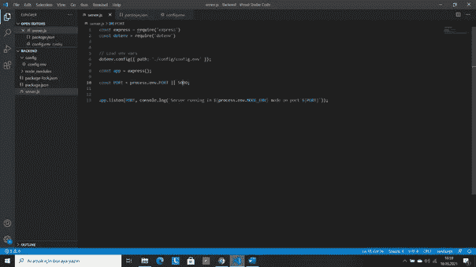

server.js

然后我会写 **npm run dev** 并且服务器正在运行。

现在，我们需要邮递员。在 Postman 中，我将创建一个请求并写入服务器的运行地址。在本教程中，我将使用 [http://localhost/5000](http://localhost/5000) 。

我将转到 server.js 文件并在 Express 中使用 get 方法。用 app 变量我来写

app.get('/'，(req，res) => {

研究现状(200)。json({success: true，msg:“显示所有用户”})；

});

。我将使用 npm 运行服务器，运行 dev 并转到 Postman。

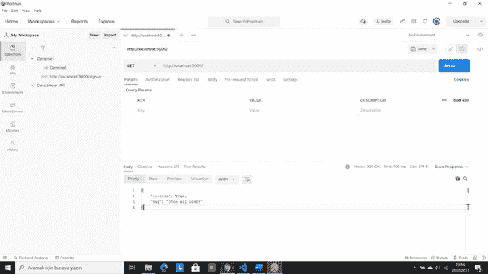

Postman

这意味着，我们的代码就是成功。就像那样，我们也要写另一个方法。所有方法看起来都像:

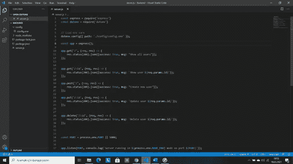

server.js

带有/:id 的方法的工作方式类似于[http://localhost:5000/1](http://localhost:5000/1)，其他类似于 [http://localhost:5000](http://localhost:5000) 。

到目前为止，我运行了 server.js 中的每一个方法，但都不是真的。因此，我在这个 user.js 文件中创建了 controllers 文件夹，并移动了所有方法，做了一些更改。user.js 文件如下所示:

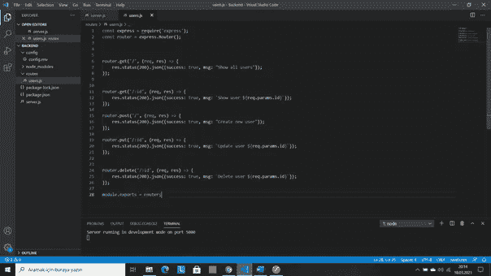

routers/user.js

为了更新我们的项目，我们必须将 routes/user.js 中的代码移动到 controllers/user.js 文件中，并在第一个文件中做一些更改。你可以在 server.js 中运行任何东西，但是如果你的项目比这个项目更复杂，你必须做些改变。

controllers/user.js 文件如下所示:

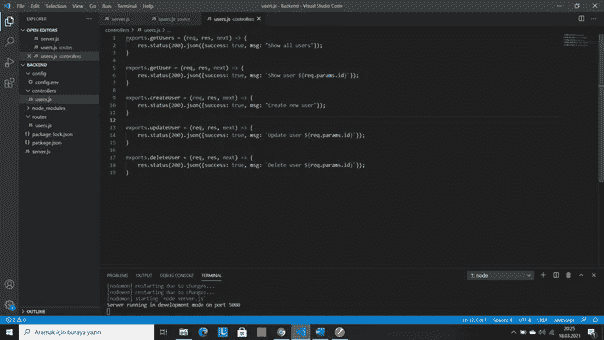

controllers/user.js

那么，我们将如何处理 routes/users.js 文件呢？首先，我们删除这个文件中的方法。我们需要 controllers/users.js 文件，第一个 users.js 文件包含这些方法。

常数{

getUser，

获取用户，

创建用户，

更新用户，

删除用户

} =要求('../控制器/用户’)

routes/users.js 文件如下所示:

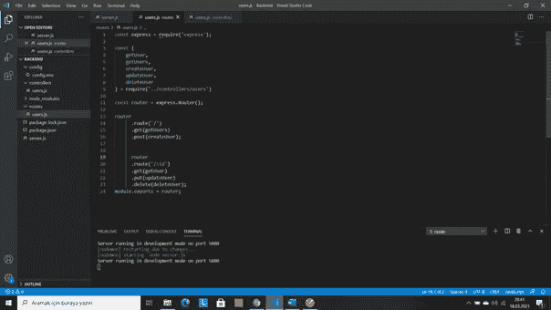

routes/users.js

现在，我们回到 server.js 文件，因为我们的发送请求似乎在控制台中。为此，我们创建了一个名为 middlewares 的文件夹，其中包含一个名为 logger.js 的文件。该文件包含以下代码:

Const logger = (req，res，next) => {

console . log(`$ { req . method } $ { req . protocol }://$ { req . get(' host ')} $ { req . priginalurl } `)

next()；

}

req.methods 是(get，put..)，req.protocol 是 http，req.get('host ')是 localhost，req.originalUrl 是/ part。在 server.js 文件中，我们编写 app.use(logger)并使用这个中间件。如果你回到邮递员身边

，发送请求，您可以在终端中看到方法和 url。

所以我们必须连接数据库。在本教程中，我们将使用 MongoDB。为此，我们将在 MongoDB 中创建一个帐户，生成一个数据库，安装 MongoDB Compass，复制连接字符串。连接字符串是这样的:

MongoDB+SRV://<username>:<password>@ cluster 0 . fxdx . MongoDB . net/test</password></username>

我们更换<username>、<password>和测试零件。Test 将是我们数据库的名称，所以您可以根据需要给它起一个名字。</password></username>

完成这些设置后，我们就可以连接数据库了。

NPM install mongose 命令将安装整个软件包。我们将创建 config 文件夹，并在其中创建 db.js 文件。我们将转到 config.env 文件，创建 MONGO_URI 变量，复制连接字符串。db.js 文件类似于:

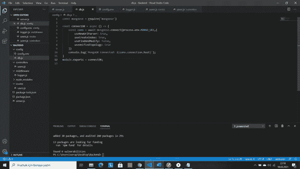

config/config.env

在这个文件之后，我们将转到 server.js，因为我们需要 db.js 文件。

const connectDB = require('。/config/db ')

connectDB()将连接到数据库。在终端中，您可以看到 MongoDB 已连接。

因此，我们可以生成我们的模型。我们将创建一个名为 models 的文件夹，并在其中包含 User.js 文件。你可以随心所欲地改变。我是这样创作的:

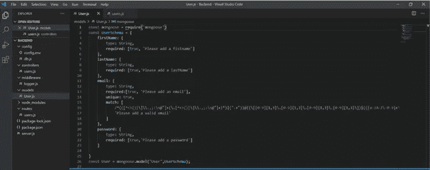

models/User.js

现在，我们必须创建用户。对于这个方法，我们将在 Postman 中做一些修改。首先，我们将转到 Headers 部分，在预置里面点击 JSON 内容类型。我们将单击身体部位的原始选项。所以我们可以向数据库请求数据。在此之前，MongoDB 罗盘看起来是这样的:

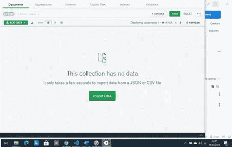

我们将转到 controllers/user.js，将 createUser 函数更改为:

exports.createUser = async (req，res，next) => {

const user = await user . create(req . body)

根据现状(201)。json({

成功:真的，

数据:用户

})

}

我们将去找邮递员并张贴一个用户。

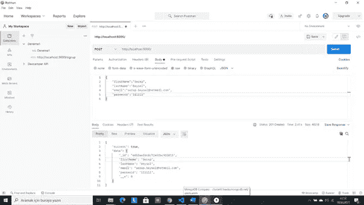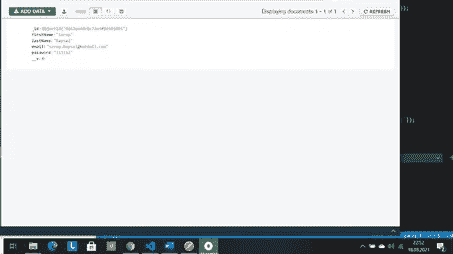

我们已经创建了用户，但我想加密密码。为此， **npm install bcryptjs** 将安装 bcryptjs 包并需要它。然后，我们将在我们的模型下编写以下代码。

UserSchema.pre('save '，异步函数(next) {

如果(！this . is modified(' password '){

next()；

}

const salt = await bcrypt . gen salt(10)；

this . password = await bcrypt . hash(this . password，salt)；

)};

所以，让我们看看如何能得到数据库中的所有记录。

exports.getUsers = async (req，res，next) => {

尝试{

const users = await user . find()；

研究现状(200)。JSON({成功:真，数据:用户})

}catch(err){

研究现状(400)。json({success: false})

}

}

getUser 函数:

exports.getUser = async (req，res，next) => {

尝试{

const user = await user . find byid(req . params . id)；

研究现状(200)。JSON({成功:真，数据:用户})

} catch (err) {

研究现状(400)。JSON({ success:false })；

}

}

getUser 和 getUsers 函数的区别在于 find()和 findById()方法。

为了更新用户，我们这样编码:

exports.updateUser = async (req，res，next) => {

const user = await user . findbyidandupdate(req . params . id，req.body，{

新:真的，

运行验证器:真

})

如果(！用户){

返回资源状态(400)。json({success: false})

}

研究现状(200)。JSON({成功:真，数据:用户})

}

和 deleteUser 函数:

exports.deleteUser = async (req，res，next) => {

尝试{

const user = await user . findbyidanddelete(req . params . id)

如果(！用户){

返回资源状态(400)。JSON({ success:false })；

}

研究现状(200)。json({ success: true，data: {} })

} catch (err) {

研究现状(400)。JSON({ success:false })；

}

}

那么，让我们看看如何进行验证。首先，我们将创建 routes 文件夹，并在其中创建一个 auth.js 文件。像这样，controller/auth.js 文件将被创建，我们将转到这个文件。

我们需要文件中的用户模型，如下所示:

const User = require('../型号/用户’)

然后，

exports.register = async (req，res，next) => {

const {名字，姓氏，电子邮件，密码} = req.body

//创建用户

const user = await User.create({

名字，

姓氏，

电子邮件，

密码

})

研究现状(200)。JSON({成功:真，令牌，id})

}

我们将保存该文件，并转到 routes/auth.js 文件并写入:

const express = require('express ')

const { register，login } = require('../控制器/授权’)

我们将转到 server.js 文件，并在那里使用。

const auth = require('。/routes/auth ')；

app.use('/'，auth)；

现在我们去 Postman，发布[http://localhost:5000/register](http://localhost:5000/register)请求。结果就是成功:没错，这意味着成功了。

我们将使用 jsonwebtoken 进行数据连接。

**npm 安装 jsonwebtoken**

将安装软件包。在 controller/auth.js 文件中，在用户要求下，我们将编写

const jwt = require('jsonwebtoken ')

const getSignedJwtToken = id => {

返回 jwt.sign({id}，process.env.JWT_SECRET，{

EXPIRE resin:process . env . jwt _ EXPIRE

})

}

然后我们去 config.env 文件，写 JST _ 秘密=任何东西，JST_EXPIRE= 30d。

同样在 controller/auth.js 文件中，我们将编写

const token = getSignedJwtToken(用户。_ id)；

和

研究现状(200)。json({success: true，token })

之后，当我们去邮递员那里发送请求时，我们可以看到令牌。复制该令牌并粘贴 [https://jwt.io](https://jwt.io) 站点，您将在 Payload:Data part id 下看到。如果你把它与数据库中的进行比较，你会发现它们是一样的。

最后我们将登录。为了比较密码，我们将再次使用 bcryptjs。我们将转到用户模型，并添加新方法:

user schema . methods . match password = async function(entered password){

return await bcrypt . compare(entered password，this . password)；

};

然后，我们将转到 controllers/auth.js 并创建登录。创建名为 utils 的文件夹和名为 ErrorResponse.js 的文件，并将以下代码粘贴到其中。

类错误响应扩展错误{

构造函数(消息，状态代码){

超级(消息)；

this . status code = status code；

Error.captureStackTrace(this，this . constructor)；

}

}

module.exports = ErrorResponse

我们将要求这个文件进入 controllers/auth.js 并返回登录。

exports.login = async (req，res，next) => {

const { email，password } = req.body

//验证 emil 和密码

如果(！邮箱||！密码){

返回 next(new ErrorResponse('请提供电子邮件和密码'，400))；

}

//检查用户

const user = await user . find one({ email })。选择('+密码')；

如果(！用户){

返回 next(新的 ErrorResponse('无效凭据'，401))；

}

//检查密码是否匹配

const is match = await user . match password(密码)；

如果(！isMatch) {

返回 next(新的 ErrorResponse('无效凭据'，401))；

}

const token = user . getsignedjwttoken()；

const id = user . getid()；

研究现状(200)。JSON({成功:真，令牌，id})

}

当我们向 Postman 发送登录请求时，我们可以看到成功:true、token 和 id。

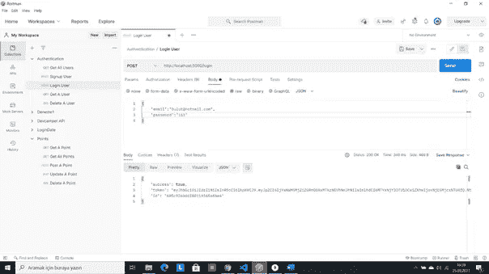

这就是本教程的最后一点。感谢阅读！