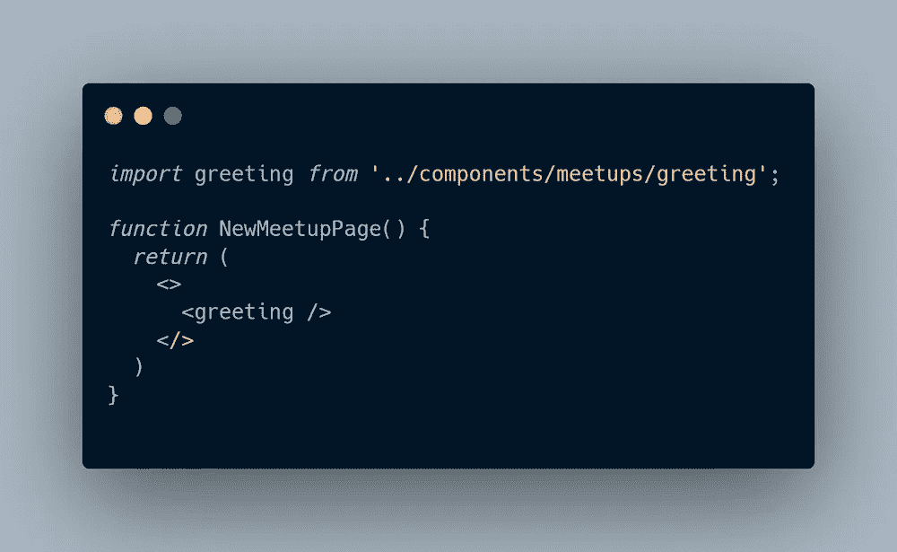
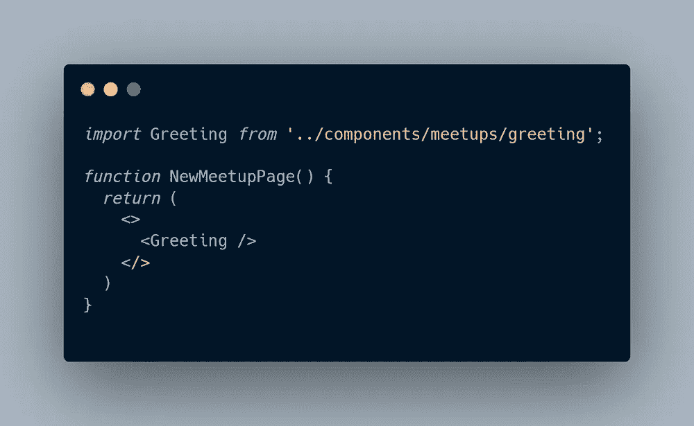
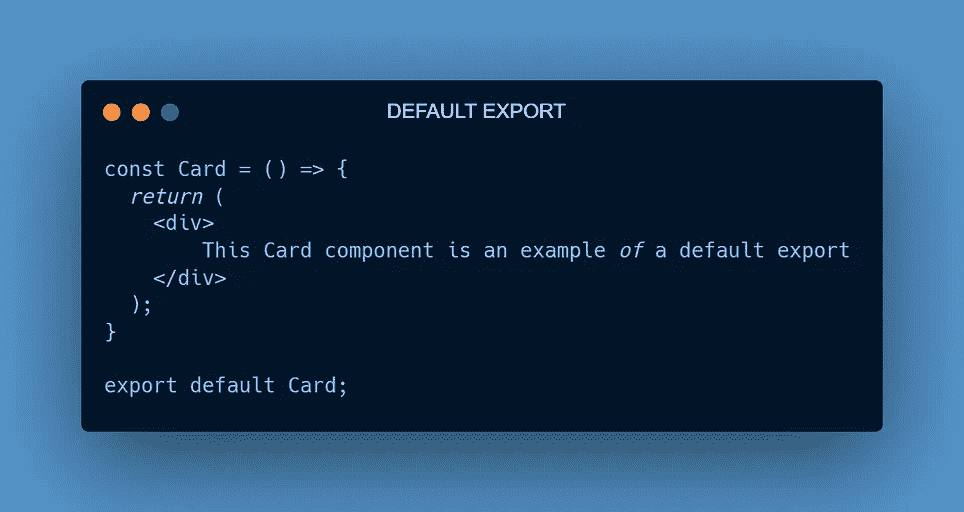
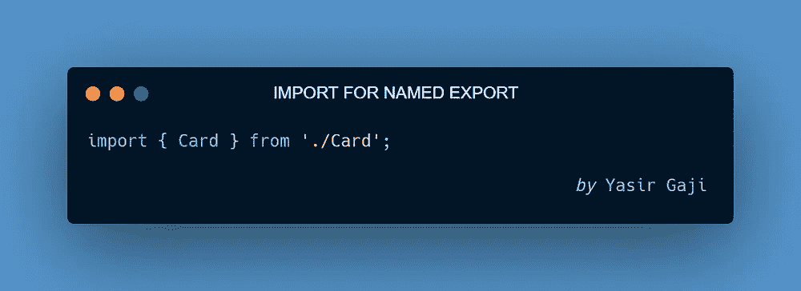
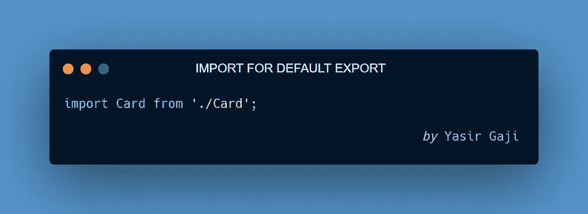
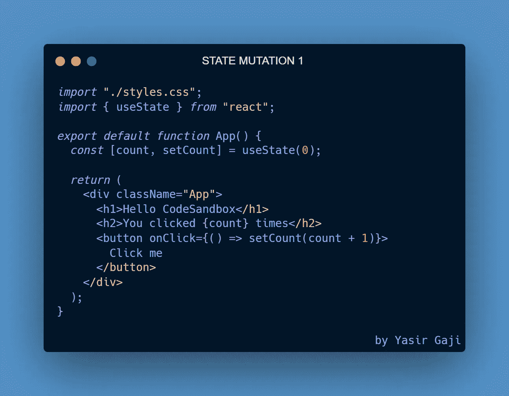

# 愚蠢的反应文章(第一部分)

> 原文：<https://medium.com/geekculture/silly-react-articles-part-1-828db5e4dd0b?source=collection_archive---------7----------------------->

React Mistakes Image By [Yasir Gaji](https://yasirgaji.com)

让我们回顾一下作为一名开发人员，在编写 [**React**](https://reactjs.org/) 的每个阶段，你最有可能犯的愚蠢错误。

# 初学者的错误

在这一点或阶段，你会犯“最”愚蠢的错误，相信我，这是无法逃避的。但是这里有一些你至少会犯一到两次的错误。

## 引起错误的组件

React 是一个基于组件的 javascript 库，这意味着在编写时，我们将它们编写在小文件中，然后将它们耦合到另一个文件中。这个过程称为组件调用过程，是的，导入和导出组件，就是这样。

**愚蠢的错误**

Component invocation error representation by [Yasir Gaji](https://yasirgaji.com)

考虑上面的表示，注意到任何差异了吗？如果你没有(傻笑),那么你就是 react 初学者类别的真正成员，在 react 中调用组件的正确方式是右边的图片，其中组件“Greeting”以大写字母“G”开始。

## 零部件进出口错误

将命名导出作为默认导出导入是您会犯的另一个愚蠢的错误。下面是命名导出组件和默认导出组件之间的区别

Default export & Named export component image representation By [Yasir Gaji](https://yasirgaji.com)

**愚蠢的错误**

您可以将指定的导出组件作为默认组件导入，有时反之亦然，至少一次或两次。因此，为了避免这种情况，下面是导入它们的正确方法，不同之处是在导入命名导出时用花括号将组件括起来。

Representation by [Yasir Gaji](https://yasirgaji.com)

## 状态突变错误

First state mutation representation by [Yasir Gaji](https://yasirgaji.com)

考虑到上面的代码表示，我们用一个使用`usestate`钩子的`setCount`函数来改变`count`状态，它所做的就是当我们点击按钮时，它会将计数值加 1。

**这个愚蠢的错误**

你大概觉得上面的代码表示是对的，当然是从执行的角度。但是，只要有一个状态会根据其先前的值发生变化，就不应该通过使用其默认值来访问这样的状态，原因是当默认状态的值被改变时，它不会立即改变，而是等待组件中所有代码的执行，然后它会改变并重新呈现整个组件。

那么，我们如何解决这个问题，而不是利用`count`状态函数来访问值，我们实际上可以使用一个回调函数来访问确切的值，这个回调函数接受一个关键字作为参数，在这种情况下，我们使用一个`prev`值。这样，状态函数将利用状态的实时值，请参见下面的代码表示。

Second state mutation representation by [Yasir Gaji](https://yasirgaji.com)

# 结论

别担心，你并不孤单，每个人都会犯至少一两次这样的错误。

我期待问题的澄清。请批评指正。分享谢谢。