# Unity 中的简单弹药计数系统

> 原文：<https://medium.com/geekculture/simple-ammo-count-system-in-unity-af48844c0dd6?source=collection_archive---------25----------------------->

显示我们玩家的弹药数量不仅非常有用，而且为游戏增加了全新的深度。有限的弹药让玩家更加小心，能够主动看到他们还剩多少弹药可以帮助他们准备更好的策略。

目标:在这篇文章中，你将学习如何添加一个弹药计数界面，当玩家开火时它会自动更新。一旦弹药耗尽，玩家将无法射击，一个“空弹药”的音频将播放。

> **编辑注:** [弹药收藏篇](https://dennisse-pd.medium.com/refill-player-ammo-without-overshooting-the-clip-capacity-1e9a890857d2)已经发布！如果你想学习如何增加弹药，看看这篇文章。在这里，你可以学习如何制作弹药收藏品来补充玩家的弹药！它添加到了本文的代码中，所以请务必看一看！

我以前在这篇文章中讨论过如何设置 UI 文本，这篇文章将集中在编程方面。

# 编程弹药计数行为

1.  为弹药数量创建一个全局变量。如果您希望从检查器中调整值，这可以是一个 SerializeField。

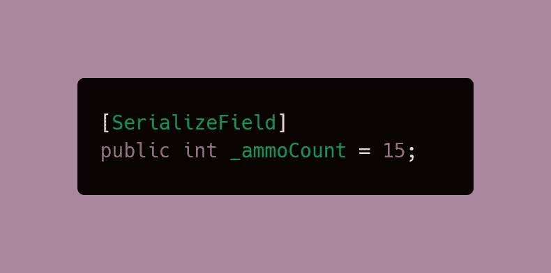

2.创建一个计算金额的方法。它将有一个 int 参数变量，我们可以在调用该方法时将它设置为任何值。在这个方法中，我们声明弹药计数的值将是弹药计数加上子弹数(这是我们的参数变量)。

> **注意**:这个参数变量可以用来增加或减少你弹药数量中的子弹数量，但是我们现在将重点放在减少上。

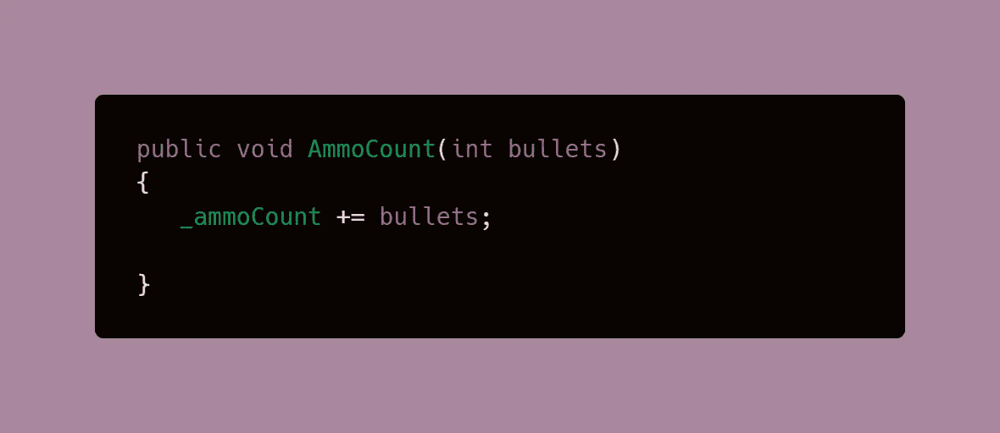

3.每当玩家开火时调用该方法。在我的例子中，我将从 FireLaser()方法中调用它，然后每当玩家按下空格键时就会调用它。

下面的代码显示了前面提到的 FireLaser 方法，但是我突出显示了弹药计数代码所必需的部分。如您所见，当我调用该方法时，参数变量被设置为-1，因此项目符号减少了所述值。

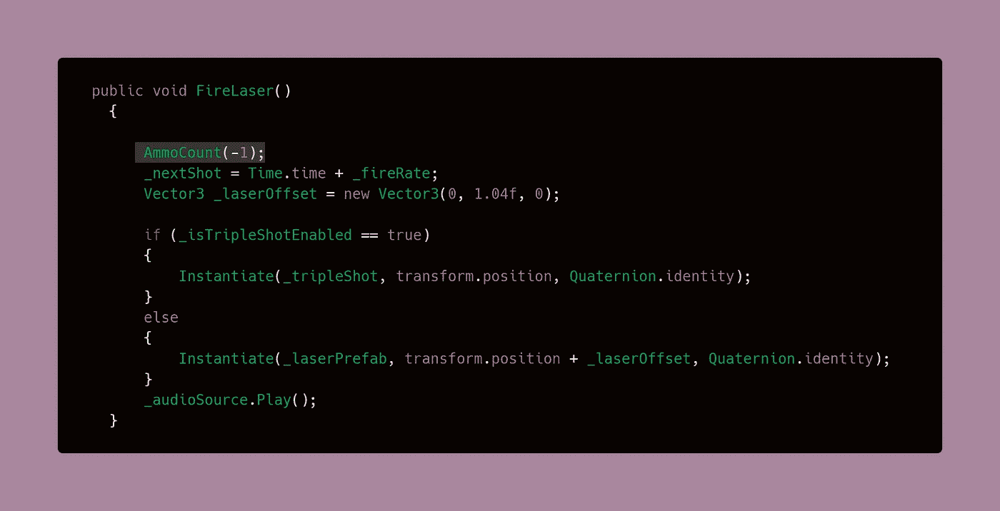

4.确保玩家在弹药耗尽时不能继续开火，这可以通过使用 return 来实现；在 if 语句中。Return 是一个语句，只要它在同一个方法中，它就终止后面任何东西的执行。因为我的 FireLaser()方法是直接调用的，所以如果没有我们想要的弹药，它就不会运行开火逻辑。或者，您可以使用您的触发逻辑，而不包含在这里的方法中，它应该以相同的方式工作。

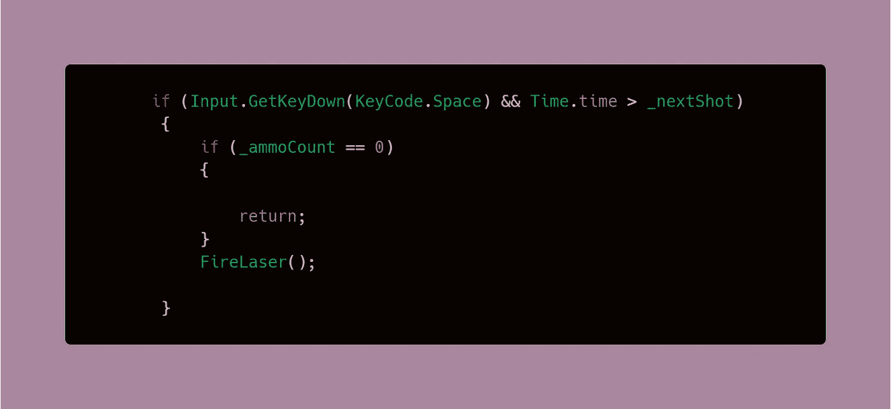

# 弹药耗尽时增加音频反馈

1.  用 SerializeField 创建一个全局变量。然后，在检查器中设定音频。

> **注**:我在这里得到了我的音频[，这是一个免费使用的剪辑。](https://freesound.org/people/PacmanGamer/sounds/165660/)

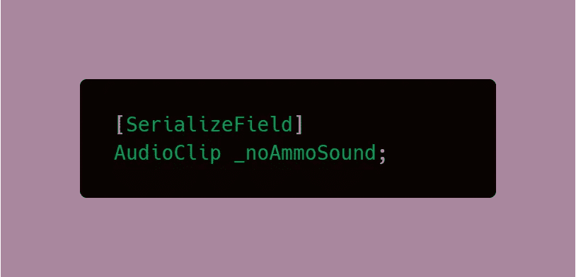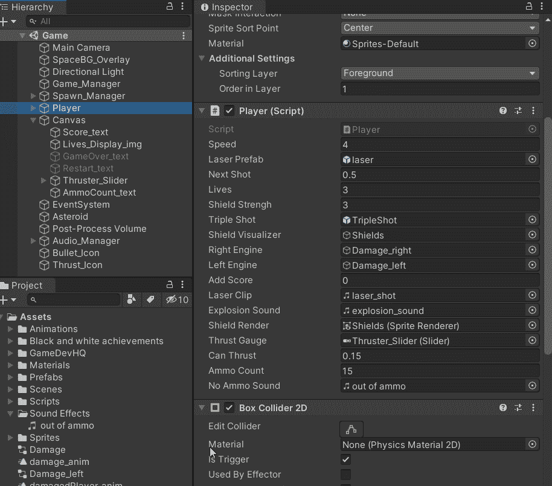

2.现在，你可以在我们之前设定的 if 语句中，让玩家在弹药耗尽时播放音频。

这里我用的是[音源。PlayClipAtPoint](https://docs.unity3d.com/ScriptReference/AudioSource.PlayClipAtPoint.html) ，正如它所说，在它被激活的点或位置播放剪辑(在这个例子中是从我们的播放器)。这对于一次性来说是极好的，因为该功能创建音频，但是当剪辑播放完毕时会自动处理它。

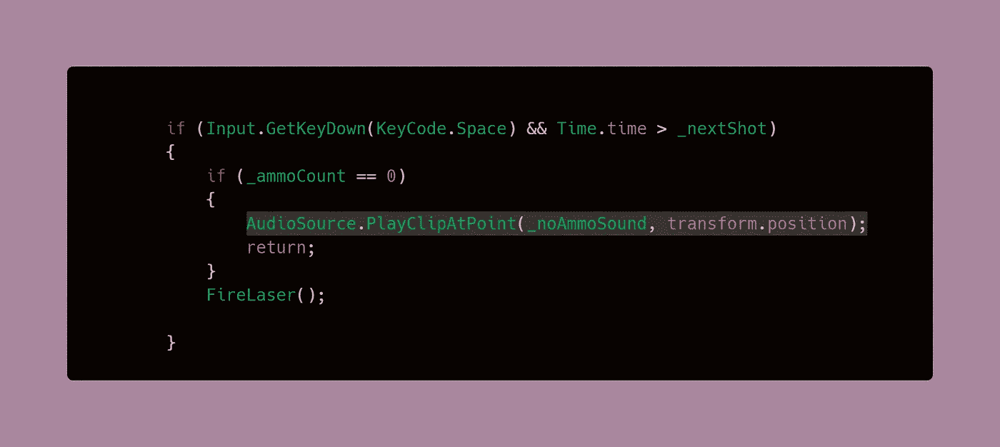

# 在用户界面中显示弹药

在这一节中，我使用了我在[上一篇文章](https://levelup.gitconnected.com/ease-of-building-ui-elements-in-unity-4f501c7e7c5e)中创建的 UI 管理器脚本，但是，您可以在任何您认为合适的地方实现相同的逻辑。

1.  创建弹药计数文本的控制柄，然后在检查器中设定它。

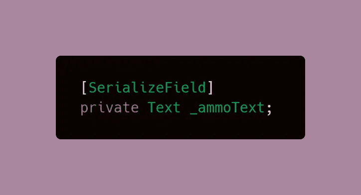

2.在 Start 方法中设置 Amm 计数。这个值实际上会显示在屏幕上，因为它是一个 int 值，我们需要使用 *ToString()* 来将它转换成一个可以显示的字符串。

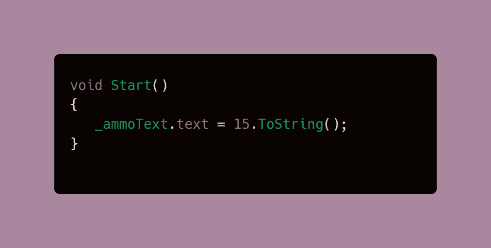

3.创建一个方法来更新弹药计数文本，这类似于我们之前创建的方法，但这一次将集中在文本上。

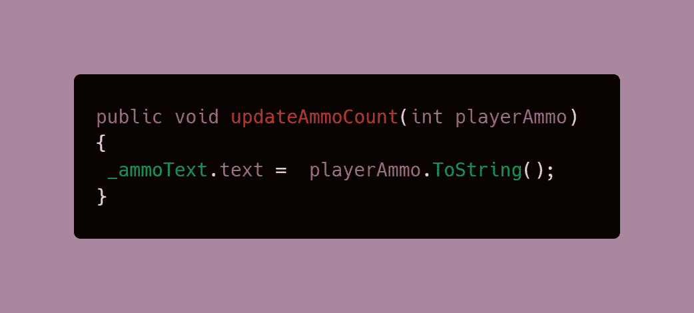

4.从我们之前创建的 AmmoCount 方法中调用 updateAmmoCount 方法。如果您使用单独的文本脚本，您将需要[脚本通信](/codex/script-communication-in-unity-using-getcomponent-ca4444bfec6)来完成。

请注意，参数变量与通过减去或增加子弹数来记录弹药数量的变量是相同的。

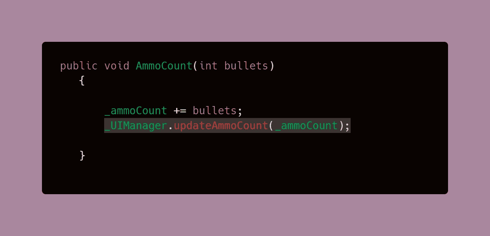

**结果**

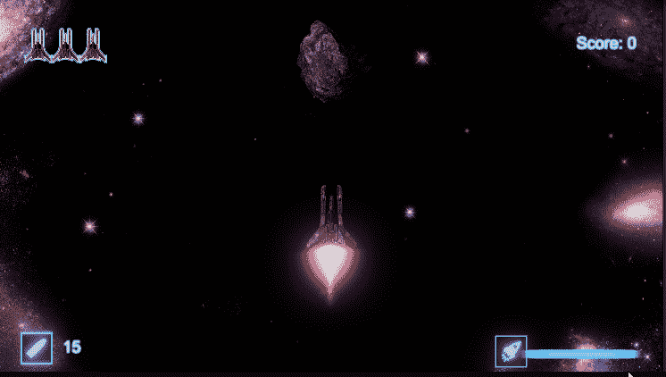

在下一篇文章中，我将介绍如何创建一个[弹药收集来补充弹药！](https://dennisse-pd.medium.com/refill-player-ammo-without-overshooting-the-clip-capacity-1e9a890857d2)