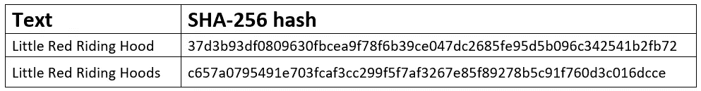
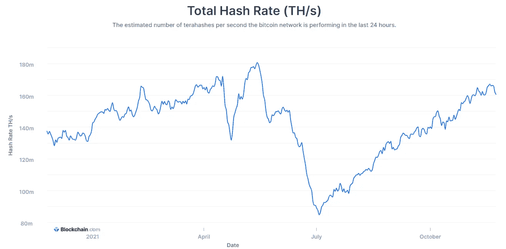

# 简单而有趣:采矿

> 原文：<https://medium.com/geekculture/simple-and-interesting-mining-fce51f4a025b?source=collection_archive---------16----------------------->

## 证明结果

由于有矿，区块链网络可以不需要中间人。事实上，加入一个新的事务需要来自网络的能量来解决一个密码问题。

也就是说，不可能简单地将一项交易添加到注册表中——您仍然需要花费大量的实际资金(例如，支付电费、购买设备)来解决加密问题。

## 散列函数

采矿与区块链密不可分，加密任务也是如此。

在密码学中，有一个单向或散列函数的概念。这是一个形式为 ***F(X) = H*** 的函数，其中 ***X*** 是任意长度的字符集。而 ***H*** 只是一个大数字。

比特币区块链采用 **SHA256 哈希算法**，其中 h 为 256 位长(从 0 到 2^256).的数字

> 因为在数字世界中，任何事物都被表示为一组符号和数字，所以你可以获取任何数字对象(文本、图片、视频文件)，对其应用 **F (X)** 函数并获得一个长数字。有趣的是:文本或图片的大小可以是任意大的，数字的长度总是一样的。

本质上，散列函数是任何数字对象的指纹。就像一个人，这个物体可以像你想的那样复杂，但它的指纹永远是独一无二的。从这个指纹中，任何数字对象都可以被唯一地识别。

哈希的主要规则是你可以从任意一个 ***X*** 中快速得到 ***H*** ，反之则不成立。如果你有一个散列函数的结果，那么你就不能得到原始的文本、图片等。

还有一个重要的性质:如果原对象 ***X*** 发生哪怕是非常微小的变化，那么哈希函数 ***H*** 也会发生非常大的变化。

这里有一个很好的例子。我拿了查尔斯·佩罗的**小红小红帽** (2892 字)全文，从他那里数了 SHA256。之后，我在整篇文章中只修改了标题中的一个字母:我把“小红小红帽”改成了“小红小红帽 **s** ”。

如您所见，仅改变 2892 中的一个字母就会导致 SHA256 算法完全不同的结果。你可以自己尝试变换任何文字— [**SHA256 计算在线**](https://xorbin.com/tools/sha256-hash-calculator) 。

有人有一个疑问:为什么这个 hash 中不仅有数字，还有字母，为什么它的长度不是 256，而只有 64。答案是——因为数字通常以十六进制表示。这样做是为了方便，所以长度不会太长。

## 密码问题

我们已经弄清楚了散列函数，现在让我们回到加密问题上来。在网络的每个块的末端，必须记录其完整的散列。

也就是说，从字面上看，该块的整个内容都被获取—从上一个块的散列函数开始，到所有服务信息结束。这些都被合并到一个大的文本文件中，SHA256 算法被应用到这个文件中，就像我们刚刚应用到整个红色小红帽文本中一样。基于这个散列，建立了一个加密问题，矿工们一直在解决这个问题。

首先，区块链算法以某个数字 **M** 作为最小边界。要求挖掘器从整个块中计算散列，并将该散列与最小界限 **M** 进行比较。

> 如果最终散列值小于界限值( ***H < M*** )，则认为问题已经解决。如果相反，那么挖掘器需要稍微改变块本身，重新计算 SHA256，哈希函数的结果会变化很大。

## 网络维度

比特币区块链的挖掘能力是以每秒的哈希运算次数来衡量的。今天，整个网络的容量约为 1.6 亿次/秒。也就是说，整个网络 1 秒钟可以统计 1.6 亿万亿次哈希。而且它像一个普通的欧洲国家(荷兰)一样消耗能源。

Source: www.blockchain.com

围绕这一点，不断有争论，把人类的资源“白白”浪费在解决一些发明的问题上是否正确，因为现代社会的全球性问题更多。

> 集体决策的替代方法已经开发出来:例如**利害关系证明算法**。在那里，交易确认和其他操作基于服务令牌的所有权原则和验证权力的比例分配来执行。

## 阻止更改

块中只有一个值可以以任何方式改变——这是 **Nonce** ，一个从 0 到 40 亿的数字。矿工将不断改变它，一遍又一遍地应用 SHA256。

将 Nonce 改变 1 将完全改变整个散列函数，并且再次与最小界限 ***M*** 进行比较。这样一来，经过数十亿次的运算，矿工会很幸运，他会找到相同的 Nonce，其中整个块的 hash 函数会小于 ***M*** 。

这样问题就解决了，这里的要点是每次散列都不可预测地改变——在 Nonce 如何改变和散列函数的结果将如何改变之间没有模式。至少到目前为止，还没有人设法找到这样的模式。

> 所以大家都在用简单的蛮力 **Nonce** 挖掘。

随着矿工人数的增加，网络的总能量也在增加。这意味着他们可以在不到 10 分钟的时间内解决密码问题。那么区块链算法干脆把 ***M*** 降下来，问题的求解就变得更加困难了。

由于整个网络已经增长，解决方案仍然在同样的 10 分钟内找到。随着网络的增长，花在寻找解决方案上的精力也在增长，而这正是你所需要的。

所以“黑”网络变得越来越难。这只能由拥有总网络容量 51%以上的人来尝试。

> 如您所见，网络中的矿工越多，加密任务越复杂，区块链对欺诈者的抵抗力就越强。所以这个系统有强大的规模收益和网络效应。

**保持更新。**

 [## 中国:对加密货币的压力——推广数字人民币

### 一种超级独立的数字货币对国家构成了威胁。政府早就决定了主要的…

digitaltime.medium.com](https://digitaltime.medium.com/china-pressure-on-crypto-money-promoting-the-digital-yuan-20ef37e68847)