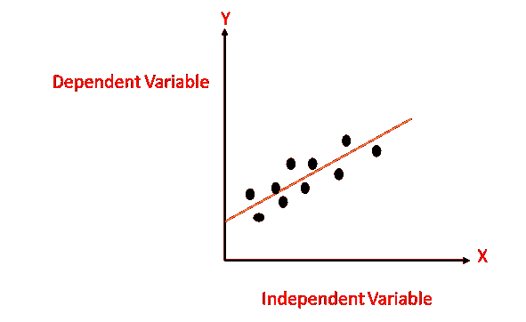
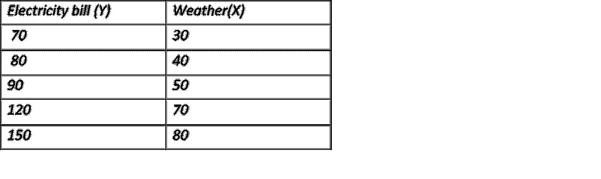
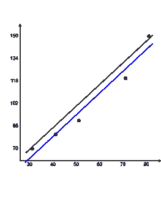
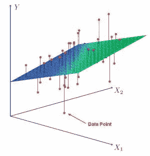

# 简单和多元线性回归

> 原文：<https://medium.com/geekculture/simple-and-multiple-linear-regression-c0bbdf9ccd14?source=collection_archive---------9----------------------->

线性回归是统计学和机器学习中众所周知和众所周知的算法之一。它是基于监督学习的机器学习算法之一。线性回归是一种统计模型，用线性方程显示两个变量之间的关系。

## 什么时候需要回归？

你需要回归来回答一些因素是否以及如何影响其他因素，或者变量之间是如何相关的。例如，你可以用它来确定经验或性别对工资的影响程度。

当您想要预测要素时，回归也很有用。例如，在给定室外温度、一天中的时间以及一个家庭中的居民人数的情况下，您可以尝试预测该家庭下一个小时的用电量。

回归被用于许多不同的领域:经济、计算机科学、社会科学等等。

## **回归分析**

回归分析是一种形式预测建模技术，它在两个或多个自变量和因变量之间建立关系。

例如，假设您想要预测房价，这将取决于各种因素，如地块大小、卧室数量、建造年份等…

*因变量的特征称为因变量或输出。*

*独立特征称为独立变量或输入*。

image by author

## 什么是线性回归

线性回归简单来说就是回答一个关于“如何用 X 预测 Y”的问题其中 X 是你有的一些信息，Y 是你想要的一些信息。

假设你想卖一栋房子，你想知道你能卖多少钱。你有关于房子的信息，那是你的 X，你想知道的卖价是你的 y。

线性回归创建了一个方程，其中输入给定的数字(X ),输出想要找出的目标变量(Y)。

## 线性回归模型表示

线性回归是如此有用和成熟的算法，它既是一个统计模型，也是一个机器学习模型。线性回归通过寻找斜率和截距来尝试绘制接近数据的最佳拟合线。

线性回归方程为:

**Y=a+bx**

在这个等式中:

*   y 是输出变量。在机器学习中也被称为目标变量或因变量。
*   x 是输入变量。它在机器学习中也被称为特征，或者被称为自变量。
*   a 是常数
*   b 是自变量的系数

让我们举个例子，看看简单的线性回归是如何工作的

假设我们需要预测我们的电费。电费将完全取决于天气。

image by author

这里的天气是用华氏温度表示的，电费是用美元表示的…

让我们绘制图表，并找到最佳拟合线

最佳拟合线:

y = 1.546512x + 18.488372。

斜率:

1.546512

最佳拟合线:

y = 1.546512x + 18.488372。

## 多元线性回归

多元线性回归假设两个或多个自变量和一个因变量之间存在线性关系。

多元线性回归的公式:

Y=B0+B0X1+B2X2+……+BnXn+e

*   **Y** =因变量的预测值
*   **B0**= y 轴截距(所有其他参数设置为 0 时的 y 值)
*   **B1X1** =第一个自变量( **X1** )的回归系数(B1)
*   **BnXn** =最后一个自变量的回归系数

多元线性回归模型可以表示为平面(二维)或超平面(更高维)。

image datacademia

## **结论**

线性回归只是众多回归技术中的一种。在预测建模领域有几种类型的这类技术，其中我们刚刚讨论了简单和多元线性回归。线性回归确实是一种简单而有用的算法。我希望这篇文章对你有帮助。

*原载于 2021 年 3 月 6 日 https://www.numpyninja.com***。**