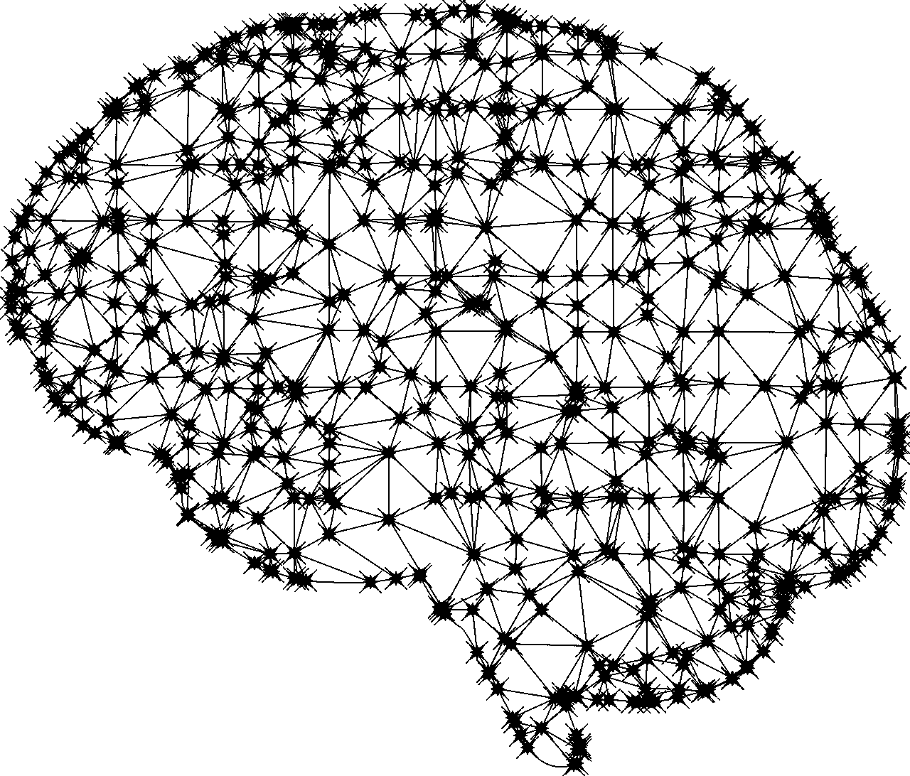

# 人工智能常见问题的简单回答

> 原文：<https://medium.com/geekculture/simple-answers-to-artificial-intelligences-faqs-48c2bee8695e?source=collection_archive---------5----------------------->

## 我很确定在这一点上你只是太害怕问。

Image by [Gordon Johnson](https://pixabay.com/users/gdj-1086657/?utm_source=link-attribution&utm_medium=referral&utm_campaign=image&utm_content=2729794) from [Pixabay](https://pixabay.com/?utm_source=link-attribution&utm_medium=referral&utm_campaign=image&utm_content=2729794)

什么是人工智能？有哪些人工智能的例子？我们应该相信它吗？人工智能有哪些危险？下一步是什么？这些都是重要的问题，我们将在下面回答。