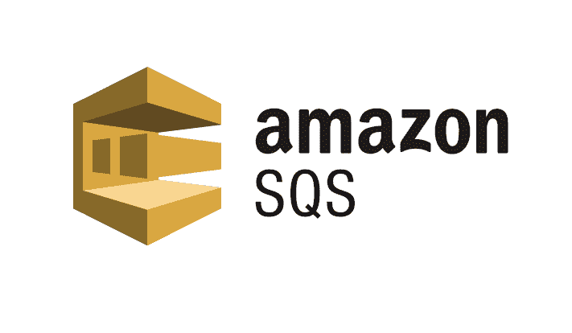
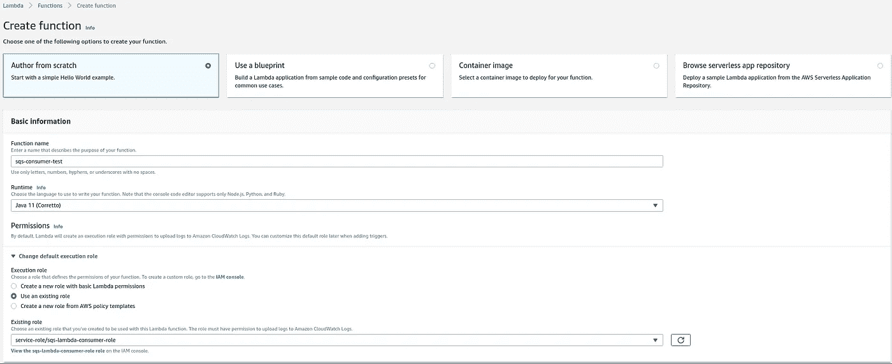
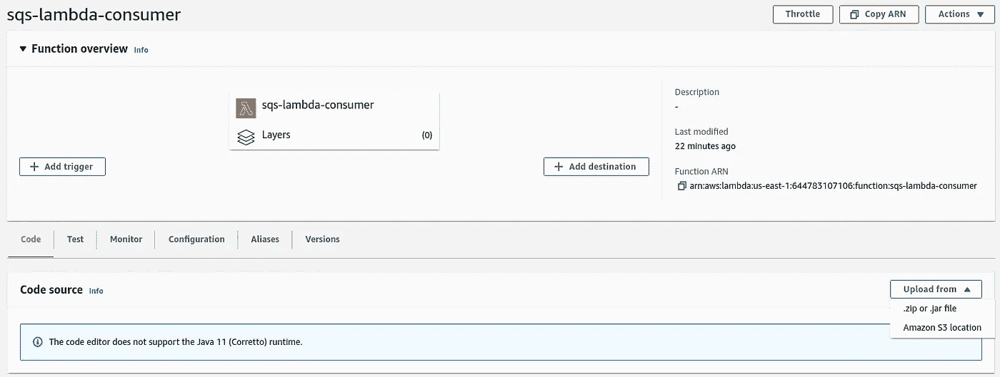
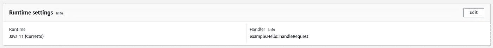
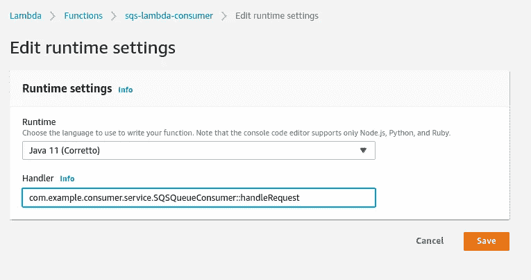
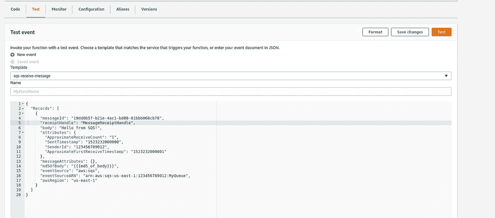
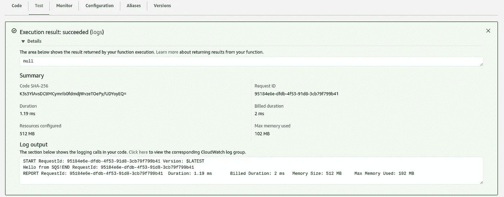
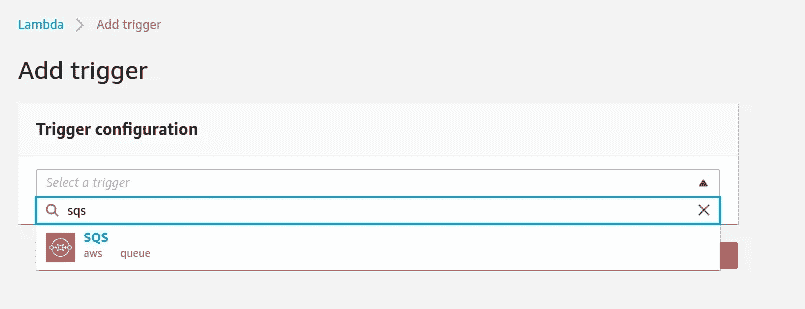
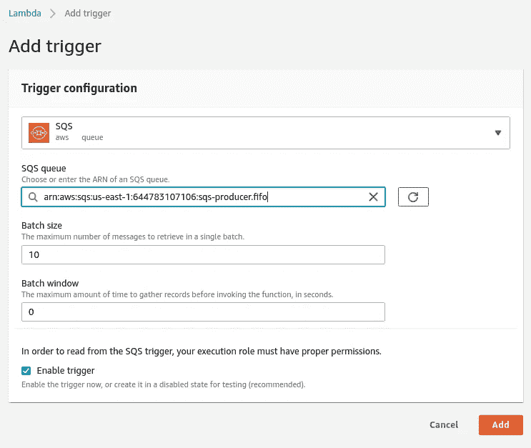

# 简单的 AWS SQS 队列生产者和消费者

> 原文：<https://medium.com/geekculture/simple-aws-sqs-queue-producer-and-consumer-95ef807f40b8?source=collection_archive---------9----------------------->



在本文中，我将解释如何使用 java SDK 创建 AWS SQS FIFO 队列，向队列发送消息，并创建一个 lambda 函数来使用队列。

# AWS SQS FIFO 队列的使用

FIFO 队列确保严格有序的消息传递和恰好一次的消息处理。(它还提供至少一次消息处理)SQS FIFO 支持发送、接收和删除消息，并在发送或接收失败时重试。可以通过提供属性“FifoQueue=true”来创建 FIFO 队列。FIFO 行为适用于具有相同 MessageGroupId 的消息。也就是说，如果所有的消息都有相同的 MessageGroupId，那么所有的消息都将根据到达情况进行排序。如果消息有多个 MessageGroupId，则每个 message groupid 的消息将分别排序。它还避免了引入重复消息，我们可以定义复制策略。如果属性“ContentBasedDeduplication=true ”,则基于消息内容，消息被视为唯一的。它还可以给出另一个 MessageDeduplicationId，其中具有相同 MessageDeduplicationId 的消息被视为重复。这是对 AWS SQS FIFO 队列的基本高级描述。更多详情可以从[官方页面](https://docs.aws.amazon.com/AWSSimpleQueueService/latest/SQSDeveloperGuide/FIFO-queues.html)了解。

让我们来看看代码。

## 生产者

在生产者内部，主要做两件事。如果不存在，则创建一个队列，并向该队列发送消息。当创建一个队列时，我们可以给这个队列几个属性。一件重要的事情是当创建一个 FIFO 队列时，我们必须给出后缀。fifo”作为队列名。关于队列的另一件事是，如果使用队列中的消息失败，我们可以将这些失败的消息移动到一个单独的队列，即死信队列。这种消息重定向可以在重新驱动策略中提供。下面是我们在创建队列时可以设置的属性。

**可见性超时(VisibilityTimeout)** :将可见性超时设置为应用程序处理和从队列中删除消息所花费的最长时间。(如果是标准队列，当一个消费者选择一个消息失败时，它将在可见性期间内对其他消费者可用。对于 FIFO:如果一条消息必须只接收一次，您的消费者必须在可见性超时的持续时间内删除它)
**交付延迟(延迟秒)**:您发送到队列的任何消息在延迟期的持续时间内对消费者保持不可见。
**接收消息等待时间(ReceiveMessageWaitTimeSeconds)**:轮询等待消息可用的最长时间。
**【消息保持期(MessageRetentionPeriod)】**:亚马逊 SQS 保留消息不被删除的时间。
**【最大消息大小(MaximumMessageSize)】**:该队列的最大消息大小。
**每条消息的最大接收数(maxReceiveCount):** 如果一条消息的接收数超过了队列的最大接收数，亚马逊 SQS 会将该消息移动到相关联的 DLQ。

Maven dependencies for producer

SQS producer class

现在我们已经创建了一个生产者，下一步是编写一个消费者来消费队列中的消息。

## 消费者

消费者被写成 lambda 函数。

Maven dependencies for consumer

Java class for consumer

写完代码后，我们可以使用下面的命令将它打包成一个 jar。这个命令将把 jar 和所有相关的库打包在一起。

```
mvn clean **package** shade:shade
```

1.  **创建 lambda 函数**

您需要有一个现有角色，或者需要创建一个具有 SQS 功能的新角色。

必需的角色-awslambdasqspolleexecutionrole、AWSLambdaBasicExecutionRole



**2。将代码上传到 lambda 函数**

选择 jar 类型并上传代码。



**3。测试代码**

更改默认请求处理程序。代码->运行时设置->编辑



粘贴处理程序类的全名并保存。



选择 AWS SQS 模板，然后选择测试。



查看测试输出中的任何错误和日志输出。这将把收到的消息记录到 CloudWatch，我们可以转到 CloudWatch 查看日志。



**4。将触发器添加到 SQS 队列**



现在，当您向源队列发送消息时，它将被 lambda 函数使用，并在 cloud watch 中创建一个日志条目。通过这些步骤，我们可以使用 AWS SQS 和 lambda 创建队列生产者和消费者。

这里要考虑的一个重要问题是，如果消费者未能处理消息，会发生什么？那将如何处理？这种情况可以通过称为死信队列的概念来处理。死信队列是另一个与我们已经创建的队列相同的队列，它可以用于在定义的重试次数后存储失败的消息。对于 FIFO 队列，死信队列也应该是 FIFO 队列。DLQ 创建与之前的源队列创建相同。一旦我们创建了 DLQ，我们需要在我们的源队列中使用这个 DLQ，否则我们需要定义一个策略来将失败的消息发送到 DLQ。下面的代码片段显示了我们如何定义策略来为给定的源队列附加 DLQ。

在这段代码中，策略有一个属性 MAX_RECEIVE_COUNT。这意味着一旦消息消费失败，它将被放回源队列。每当消息到达源队列时，计数就会增加。当接收计数超过最大接收计数时，消息将被移动到 DLQ，并保留在该队列中，直到保留期结束。稍后，我们可以检查 DLQ，分析消息失败的原因。

本文解释了如何创建 SQS FIFO 队列，如何编写 lambda 函数来使用队列中的消息，以及如何处理失败的消息。希望你能学到新的东西😊