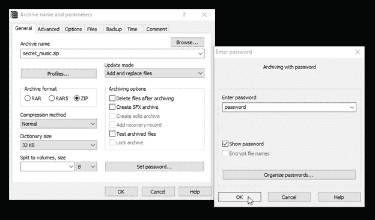
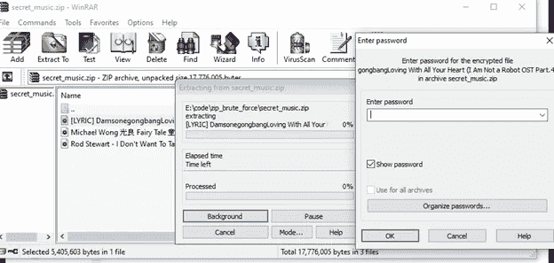
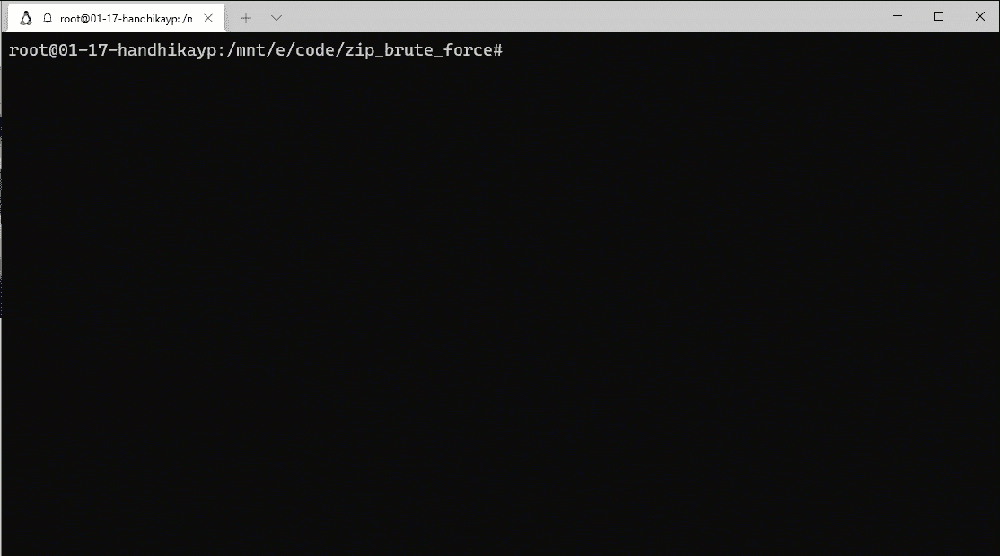

# 使用 Python 对 Zip 文件进行简单的暴力攻击

> 原文：<https://medium.com/geekculture/simple-brute-force-attack-on-zip-file-using-python-2eb10b9ab5e6?source=collection_archive---------4----------------------->


Photo by [Marcus Urbenz](https://unsplash.com/@marcusurbenz?utm_source=unsplash&utm_medium=referral&utm_content=creditCopyText) on [Unsplash](https://unsplash.com/s/photos/zip?utm_source=unsplash&utm_medium=referral&utm_content=creditCopyText)

ZIP 是一个支持数据压缩的存档格式化程序。ZIP 文件可以由一个或多个文件或目录填充。ZIP 的大小比原来的小。它还支持密码保护，以保护我们的数据免受他人。但是，如果你是一个喜欢设置新密码的人，有时你会忘记你的旧密码，即使它是最简单的一个。真的很烦对吧。

这篇文章的目的是当你忘记你的受保护的 zip 文件时如何处理你自己。请注意，**这是给你的 ZIP 文件，不是给其他人的。**任何进入他人档案的行动都超出了我的职责范围。但是，相信我，这个方法会对我们有很大帮助。尤其是当我们真的记不起之前输入的密码时。仅供参考，这是我从 [@xtremepentest](https://twitter.com/xtremepentest) 得到的文章

好吧，让我们进入代码

# 初始化

好了，让我们制作一些受保护的文件，这里是例子，我想保护三首歌曲进入 ZIP，在这种情况下我给它密码`password`



在成功保护文件后，它会要求我们在每次解压时输入密码，如下图所示



好了，我们的受保护文件准备好了，让我们进入代码部分

# 代码部分

首先，这将使用`zipfile`模块进行暴力攻击和`tqdm`模块建立一个进度条，使攻击更加真实。

```
from tqdm import tqdm
import zipfile
```

如果您还没有安装这两个模块，只需在您终端上运行即可。

```
pip install tqdm
pip install zipfile
```

接下来，我们将要求用户输入 zip 文件名和单词表来进行字典攻击。

```
protected_file = input("Zip file: ")
wordlist = input("Choose wordlist: ")
```

单词表是暴力攻击中常用的文本集合。您可以手动构建，只需将您的文件保存为`.txt`文件。这是一个例子

```
...
scooter
richard
soccer
rachel
purple
password
melissa
jackson
angela
arsenal
222222
...
```

我把上面的单词表保存为`my_wordlist.txt`。创建单词表后，我们需要检查程序是否是 ZIP 文件。如果程序是 ZIP 文件，代码将运行，如果不是，代码将停止。

```
try:
    zip_file = zipfile.ZipFile(protected_file)
    n_pass = len(list(open(wordlist, "rb")))
except:
    print("\a")
    print("File not zip, exiting...")
    exit(0)
```

在上面的代码中，我也阅读了所有的单词表，以了解有多少单词将被用于暴力攻击。最后，这里我们进入攻击发生时的最终代码。

```
print("Number of password that will be checked:", n_pass)
print('\n')with open(wordlist, "rb") as wordlist:
    for word in tqdm(wordlist, total=n_pass, unit='word'):
        try:
            zip_file.extractall(pwd=word.strip())
        except:
            continue
        else:
            print("\a")
            print("[+] Password Found:", word.decode().strip())
            print("\a")
            print('Exiting...')
            exit(0)print("\a")
print("[X] Password not found in the wordlist, try another one")
```

嗯，使用来自`zipfile`模块的`extractall`函数，暴力将运行到单词列表的末尾。如果密码匹配，它会提示出密码。但是，如果不是蛮力将退出。

# 履行

好了，这是我们之前构建的攻击场景的文档



嗯，是的，密码是`password`就像我们之前声明的那样。如果你想要一些挑战，试着找到[这个 ZIP 文件密码](https://drive.google.com/file/d/1FdnFL2wJAB7tWL40WB2ESb2QIlspOzoS/view?usp=sharing)并告诉我答案。

# 结论

在这篇文章中，我分享了如何通过实现`tqdm`和`zipfile`模块进行简单的强力 zip 文件攻击。请在你的生活中明智地使用这个教程。

以上就是我的全部内容，感谢阅读。✌