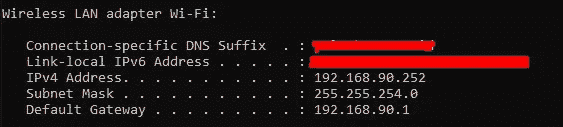
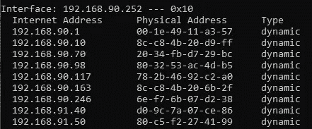
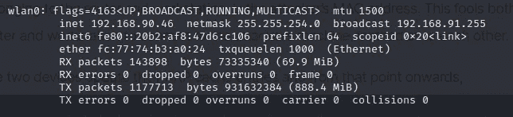
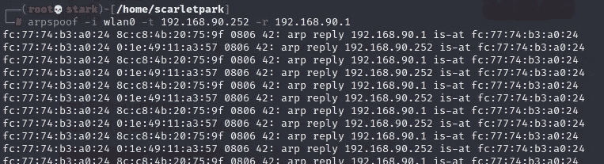
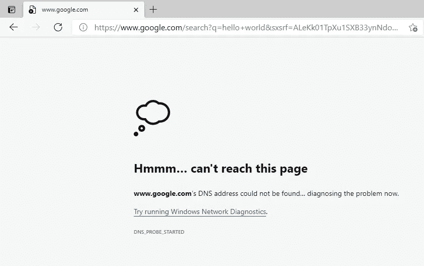
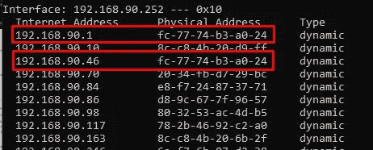

# 简单但强大的拒绝服务(DoS)攻击

> 原文：<https://medium.com/geekculture/simple-but-powerful-denial-of-service-dos-attack-8c7dfd60045f?source=collection_archive---------0----------------------->

Photo by [Clint Patterson](https://unsplash.com/@cbpsc1?utm_source=unsplash&utm_medium=referral&utm_content=creditCopyText) on [Unsplash](https://unsplash.com/s/photos/hacker?utm_source=unsplash&utm_medium=referral&utm_content=creditCopyText)

***”免责声明:此信息仅供参考。任何因此而产生的暴力，都超出了我的责任”***

如今，网络安全正成为我们生活的重要组成部分。我相信大家都知道的最著名的攻击之一是拒绝服务攻击。即使对于特别的安全工程师来说，这种攻击也确实很难防御。因为这种攻击主要针对服务。众所周知，在这个数字时代，一切都通过互联网联系在一起。因此，当服务中断时。这意味着，我们的设备只不过是垃圾(如果我们没有可以离线访问的东西)。

从 [cyberpedia 获取信息，](https://www.paloaltonetworks.com/cyberpedia/what-is-a-denial-of-service-attack-dos)拒绝服务(DoS)攻击是一种用来关闭机器或网络的攻击，因此目标用户无法访问。该网站还说，有两种 DoS 攻击的一般方法，即洪水和崩溃服务。因为当系统接收到太多流量时，就会发生泛洪，因此服务会停止，而崩溃就意味着你会想到这一点。

对我来说，还有一种方法可以攻击。我还是一个学习者，所以我不能把这个归类到那个通用的方法里。这种攻击可以通过玩弄地址解析协议(ARP)来完成。ARP 是一种协议，使网络能够到达网络上的特定设备。ARP 将互联网协议(IP)地址转换为媒体访问控制(MAC)地址，反之亦然。最简单的例子，每当我们的设备想要连接到互联网。我们的设备将首先联系路由器或网关。

ARP 欺骗，也称为 ARP 中毒，实际上用于中间人(MitM)攻击。我把这篇文章的标题定为 DoS 攻击的原因是因为只有几篇文章真正实践了 DoS 攻击。我只是想分享这些知识。所以，这取决于你，如果想要用它来攻击 MitM。但是，我不会谈论它。不多说了，让我们做吧。

# **要求**

1.  Kali Linux
2.  受害者操作系统(虚拟或真实机器)
3.  dsniff

# 袭击

## 1)安装 dsniff

> apt-get 安装 dsniff

## 2)在 Kali Linux 中启用 IP 转发

> echo > 1/proc/sys/net/IP v4/IP _ forward

Enable the IP Forward

## 3)获取受害者的 IP 地址

也许，这是其中最困难的一步。作为一名黑客，你应该只攻击目标。我会告诉你获取受害者 IP 地址的方法。这超出了我的职责范围。

对于本教程，我有两台 PC，所以我可以很容易地从受害者操作系统检查 IP 地址。对于 windows，使用`ipconfig`命令可以节省大量时间。

The output of ipconfig command

因为，这是一个教程，我想让你知道，攻击是如何工作的概念，首先检查在命令行中使用 arp -a 命令

The output of arp -a command

如您所见，我所在的网络中有许多连接的设备。这就是为什么我说这是困难的步骤，你需要面对。从上图来看，请只关注网关的物理地址 192.168.90.1。

## 4)测试受害者连接

Do simple search for connection test

## 5)检查你的互联网接口

> ifconfig

My Internet Interface as shown is wlan0

## 6)发起攻击

一切就绪后，您就可以开始攻击了，命令结构是 ARP spoof-I[您的互联网接口]-t[目标 IP 地址]-r[网关 IP 地址]，例如这是我的

> ARP 欺骗-I WLAN 0-t 192 . 168 . 90 . 252-r 192 . 168 . 90 . 1

The Attack is Launched

之后，攻击开始了，当我尝试刷新页面时，让我们再次检查来自受害者的连接。输出将是这样的

The connection is down

为什么？这是一个完美的问题。回到第三步，我使用`arp -a`命令。所以，我们可以得到我的电脑连接到路由器的方式。因此，如果我们再次运行该命令，我们将得到两个具有相同物理地址的互联网地址，如下所示。

The Reason Why Connection Down

如果你明白 ARP 是如何工作的，它会把路由器的物理地址变成你的 kali IP 地址。在那之后，你的 kali 阻止从路由器到受害者的连接，它使受害者不能连接到互联网。

# 解决办法

实际上，有一种方法可以减轻这种攻击。它将路由器的 MAC 地址更改为静态地址，因此黑客无法更改路由器的 MAC 地址。但是，这并不是很好的缓解措施。另外一个缓解我觉得，就是千万不要把路由器的 IP 当成 192.168.xx.1 当成 1，因为这让黑客很容易发动攻击。但是，是的，在网络中没有系统是安全的。

# 关闭

**记住，这只是为了提供信息**。我认为这种攻击非常简单，但是非常强大，我希望有人不仅使用它，还可以减轻这种攻击。因为，它可以在几乎所有设备上实现，我已经测试过了。

谢了。