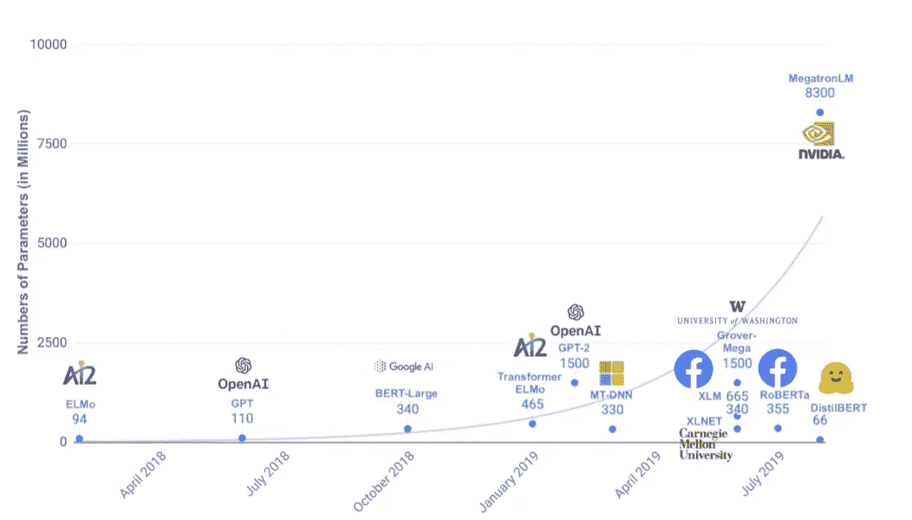
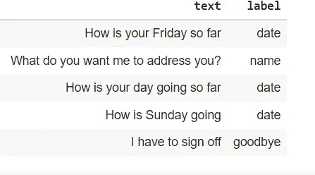
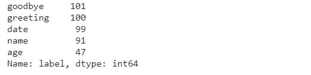
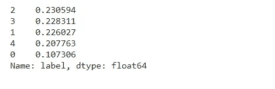

# 使用 BERT 和 Pytorch 的简单聊天机器人:第 1 部分

> 原文：<https://medium.com/geekculture/simple-chatbot-using-bert-and-pytorch-part-1-2735643e0baa?source=collection_archive---------2----------------------->


Source: [https://chatbotsmagazine.com/](https://images.app.goo.gl/PXgomMwAU3x6CYRu8)

人工智能正在迅速进入各行各业许多企业的工作流程。由于自然语言处理(NLP)、自然语言理解(NLU)和深度学习(DL)的进步，我们现在能够开发能够模仿类似人类的交互的技术，包括识别语音和文本。

在本文中，我们将使用 Transformer 和 Pytorch 构建一个聊天机器人。

我把这篇文章分成三部分。

零件(1/3): [简介及安装](/@shrinidhi.rm1990/simple-chatbot-using-bert-and-pytorch-part-1-2735643e0baa)

部分(2/3): [数据准备](/@shrinidhi.rm1990/simple-chatbot-using-bert-and-pytorch-part-2-ef48506a4105)

第(3/3)部分:[模型微调](/@shrinidhi.rm1990/simple-chatbot-using-bert-and-pytorch-part-3-a6832c50b8d1)

# 变压器

Google 在论文《注意力是你所需要的全部》中介绍了 transformer 架构。变换器采用自我注意机制，适合语言理解。

比如说“今年夏天我去了喜马拉雅山。我真的很享受在那里的时光”。最后一个词“那里”指的是喜马拉雅山。但是要理解这一点，记住前几个部分是必不可少的。为了实现这一点，注意力机制在输入序列的每一步决定序列的哪些其他部分是重要的。

变压器具有编码器-解码器架构。它们由包含前馈和注意层的模块组成。

**BERT(变压器的双向编码器表示)**

它是 Google 开发的基于 transformer 的机器学习技术，用于自然语言处理预训练。BERT 由来自谷歌的雅各布·德夫林(Jacob Devlin)及其同事于 2018 年创建并发布。

BERT 使用双向训练，即从两个方向阅读句子，以理解句子的上下文。

注意，BERT 只是一个**编码器**。它没有解码器。

最近发布的几个预训练语言模型的参数计数。



Source: Internet

# Pytorch:

PyTorch 是一个基于 Python 的科学计算包，它使用图形处理单元(GPU)的能力。自 2016 年 1 月发布以来，许多研究人员继续越来越多地采用 PyTorch。由于它在构建极其复杂的神经网络方面的便利性，它很快成为了人们的首选库。它给 TensorFlow 带来了激烈的竞争，尤其是在用于研究工作时。

PyTorch 的一些主要亮点包括:

**简单接口**:提供易于使用的 API。

**本质上的 Python 化**:这个库是 Python 化的，可以与 Python 数据科学栈顺利集成。

**张量**:基本和 NumPy 数组一样。要在 GPU 上运行操作，只需将张量转换为 Cuda 数据类型。

**计算图** : PyTorch 提供了一个优秀的平台，提供动态计算图。

**亲笔签名(自动微分)**:这个类是计算导数的引擎。

# **数据**

作为第一步，我们需要建立一个 intents JSON 文件来定义聊天机器人用户的意图。
例如:
用户可能希望知道我们聊天机器人的名字；因此，我们创建了一个名为 name 的意图。用户可能希望知道我们聊天机器人的年龄；因此，我们创造了一个叫做年龄的意图。

在这个聊天机器人中，我们使用了 5 个意图:姓名、年龄、日期、问候和再见。我们已经使用了具有属于这些意图中的每一个的话语的训练集。当用户输入任何输入时，机器人都会识别出其意图。

在这个 intents JSON 文件中，每个 intents 标签旁边都有响应。对于我们的聊天机器人，一旦识别出意图，将从与每个意图相关的静态响应集中随机选择响应。

```
# used a dictionary to represent an intents JSON filedata = {"intents": [{"tag": "greeting",
 "responses": ["Howdy Partner!", "Hello", "How are you doing?",   "Greetings!", "How do you do?"]},{"tag": "age",
 "responses": ["I am 25 years old", "I was born in 1998", "My birthday is July 3rd and I was born in 1998", "03/07/1998"]},{"tag": "date",
 "responses": ["I am available all week", "I don't have any plans",  "I am not busy"]},{"tag": "name",
 "responses": ["My name is James", "I'm James", "James"]},{"tag": "goodbye",
 "responses": ["It was nice speaking to you", "See you later", "Speak soon!"]}
]}
```

## **包的安装**

**变形金刚**:这个库汇集了超过 40 个最先进的预训练 NLP 模型(伯特，GPT-2，罗伯塔等..)

**Torchinfo** :打印模型架构。

```
# Install Transformers
!pip install transformers==3# To get model summary
!pip install torchinfo
```

## 导入库

导入对数据集执行操作所需的库。

```
import numpy as np
import pandas as pd
import re
import torch
import random
import torch.nn as nn
import transformers
import matplotlib.pyplot as plt# specify GPU
device = torch.device(“cuda”)
```

## **加载数据集**

我们在这里加载训练数据集

```
# We have prepared a chitchat dataset with 5 labels
df = pd.read_excel(“/content/drive/MyDrive/Datasets/chitchat.xlsx”)df.head()
```



```
df[‘label’].value_counts()
```



为了将这些分类标签转换成数字编码，我们使用了 LabelEncoder。

```
# Converting the labels into encodings
from sklearn.preprocessing import LabelEncoder
le = LabelEncoder()
df['label'] = le.fit_transform(df['label'])# check class distribution
df['label'].value_counts(normalize = True)
```



```
# In this example we have used all the utterances for training purpose
train_text, train_labels = df[‘text’], df[‘label’]
```

## 点击此处进入下一部分:Part(2/3): [资料准备](/@shrinidhi.rm1990/simple-chatbot-using-bert-and-pytorch-part-2-ef48506a4105)