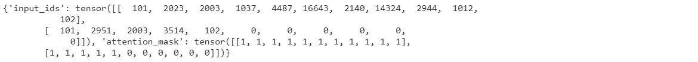
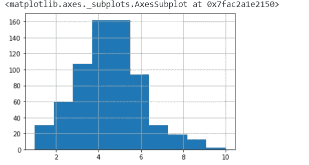
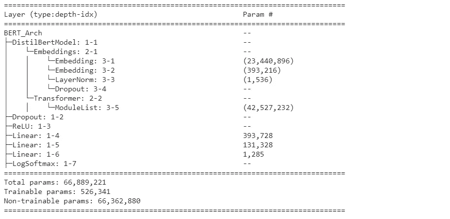

# 使用 BERT 和 Pytorch 的简单聊天机器人:第 2 部分

> 原文：<https://medium.com/geekculture/simple-chatbot-using-bert-and-pytorch-part-2-ef48506a4105?source=collection_archive---------3----------------------->

本文分为三个部分。

零件(1/3): [简介及安装](/@shrinidhi.rm1990/simple-chatbot-using-bert-and-pytorch-part-1-2735643e0baa)

部分(2/3): [数据准备](/@shrinidhi.rm1990/simple-chatbot-using-bert-and-pytorch-part-2-ef48506a4105)

第(3/3)部分:[模型微调](/@shrinidhi.rm1990/simple-chatbot-using-bert-and-pytorch-part-3-a6832c50b8d1)

在上一篇文章中，我们看到了 Transformer 和 Pytorch 概念的简要介绍。我们已经安装了所有必要的库。现在让我们进入下一部分，即数据准备。

在本例中，我们尝试使用 **Bert-base-uncased、Roberta-base** 和 **distilbert-base-uncased** 模型进行训练。

对于我们的训练数据，**distil Bert-base-un cased**模型给出了更好的结果。

## **伯特模型**

我们可以导入 **Bert** 模型如下。

```
from transformers import AutoModel, BertTokenizerFast# Load the BERT tokenizer
tokenizer = BertTokenizerFast.from_pretrained(‘bert-base-uncased’)# Import BERT-base pretrained model
bert = AutoModel.from_pretrained(‘bert-base-uncased’)
```

## 罗伯塔模型

我们可以导入 **Roberta** 模型，如下所示。

```
from transformers import RobertaTokenizer, RobertaModel# Load the Roberta tokenizer
tokenizer = RobertaTokenizer.from_pretrained(‘roberta-base’)# Import Roberta pretrained model
bert = RobertaModel.from_pretrained(‘roberta-base’)
```

## 蒸馏模型

我们可以如下导入 **DistilBert** 模型。

```
from transformers import DistilBertTokenizer, DistilBertModel# Load the DistilBert tokenizer
tokenizer = DistilBertTokenizer.from_pretrained(‘distilbert-base-uncased’)# Import the DistilBert pretrained model
bert = DistilBertModel.from_pretrained(“distilbert-base-uncased”)
```

对于这个例子，我们将使用 DistilBert 模型。

distilbert-base-uncased 标记器的示例数据

```
text = ["this is a distil bert model.","data is oil"]# Encode the textencoded_input = tokenizer(text, padding=True,truncation=True, return_tensors='pt')print(encoded_input)In input_ids:
101 - Indicates beginning of the sentence
102 - Indicates end of the sentenceIn attention_mask:
1 - Actual token
0 - Padded token
```



```
# get length of all the messages in the train setseq_len = [len(i.split()) for i in train_text]pd.Series(seq_len).hist(bins = 10)# Based on the histogram we are selecting the max len as 8
max_seq_len = 8
```



```
# tokenize and encode sequences in the training settokens_train = tokenizer(
    train_text.tolist(),
    max_length = max_seq_len,
    pad_to_max_length=True,
    truncation=True,
    return_token_type_ids=False
)
```

接下来，我们将把整数序列转换成张量。

```
# for train settrain_seq = torch.tensor(tokens_train['input_ids'])
train_mask = torch.tensor(tokens_train['attention_mask'])
train_y = torch.tensor(train_labels.tolist())
```

现在，我们将为训练集创建数据加载器。在训练阶段，这些数据加载器将成批的训练数据作为输入传递给模型。

```
from torch.utils.data import TensorDataset, DataLoader, RandomSampler, SequentialSampler#define a batch size
batch_size = 16# wrap tensors
train_data = TensorDataset(train_seq, train_mask, train_y)# sampler for sampling the data during training
train_sampler = RandomSampler(train_data)# DataLoader for train set
train_dataloader = DataLoader(train_data, sampler=train_sampler, batch_size=batch_size)
```

## 定义模型架构

```
class BERT_Arch(nn.Module): def __init__(self, bert):      
       super(BERT_Arch, self).__init__() self.bert = bert 

       # dropout layer
       self.dropout = nn.Dropout(0.2)

       # relu activation function
       self.relu =  nn.ReLU() # dense layer self.fc1 = nn.Linear(768,512) self.fc2 = nn.Linear(512,256) self.fc3 = nn.Linear(256,5) #softmax activation function
       self.softmax = nn.LogSoftmax(dim=1) #define the forward pass
   def forward(self, sent_id, mask): #pass the inputs to the model  
      cls_hs = self.bert(sent_id, attention_mask=mask)[0][:,0]

      x = self.fc1(cls_hs)
      x = self.relu(x)
      x = self.dropout(x)

      x = self.fc2(x)
      x = self.relu(x)
      x = self.dropout(x) # output layer
      x = self.fc3(x)

      # apply softmax activation
      x = self.softmax(x) return x
```

```
# freeze all the parameters. This will prevent updating of model weights during fine-tuning.for param in bert.parameters():
      param.requires_grad = Falsemodel = BERT_Arch(bert)# push the model to GPU
model = model.to(device)from torchinfo import summary
summary(model)
```



## 点击此处进入下一部分:第三部分:[模型微调](/@shrinidhi.rm1990/simple-chatbot-using-bert-and-pytorch-part-3-a6832c50b8d1)