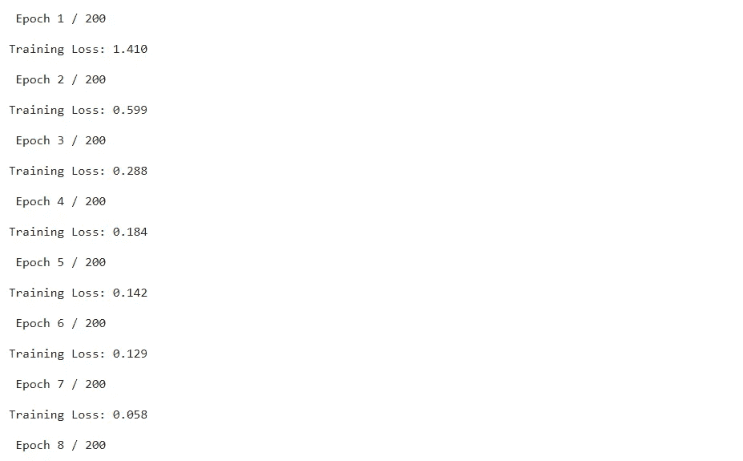
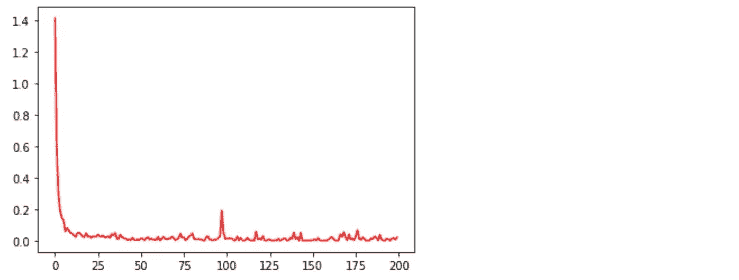

# 使用 BERT 和 Pytorch 的简单聊天机器人:第 3 部分

> 原文：<https://medium.com/geekculture/simple-chatbot-using-bert-and-pytorch-part-3-a6832c50b8d1?source=collection_archive---------5----------------------->

本文分为三个部分。

零件(1/3): [简介及安装](/@shrinidhi.rm1990/simple-chatbot-using-bert-and-pytorch-part-1-2735643e0baa)

部分(2/3): [数据准备](/@shrinidhi.rm1990/simple-chatbot-using-bert-and-pytorch-part-2-ef48506a4105)

第(3/3)部分:[模型微调](/@shrinidhi.rm1990/simple-chatbot-using-bert-and-pytorch-part-3-a6832c50b8d1)

在上一篇文章中，我们看到了 Transformer 和 Pytorch 概念的简要介绍。我们安装了所有必要的库，并为模型训练准备了数据。现在让我们微调模型，看看结果。

## 【计算机】优化程序

使用优化器，我们减少了通过网络反向传播期间的损失。

```
from transformers import AdamW# define the optimizer
optimizer = AdamW(model.parameters(), lr = 1e-3)
```

## 查找类别权重

```
from sklearn.utils.class_weight import compute_class_weight#compute the class weights
class_wts = compute_class_weight(‘balanced’, np.unique(train_labels), train_labels)print(class_wts)
```


## 计算误差时平衡重量

```
# convert class weights to tensor
weights= torch.tensor(class_wts,dtype=torch.float)
weights = weights.to(device)# loss function
cross_entropy = nn.NLLLoss(weight=weights) 
```

## 设置纪元

```
# empty lists to store training and validation loss of each epoch
train_losses=[]# number of training epochs
epochs = 200# We can also use learning rate scheduler to achieve better results
lr_sch = lr_scheduler.StepLR(optimizer, step_size=100, gamma=0.1)
```

## 微调模型

```
# function to train the model
def train():

  model.train() total_loss = 0

  # empty list to save model predictions
  total_preds=[]

  # iterate over batches
  for step,batch in enumerate(train_dataloader):

    # progress update after every 50 batches.
    if step % 50 == 0 and not step == 0:
      print('  Batch {:>5,}  of  {:>5,}.'.format(step,    len(train_dataloader))) # push the batch to gpu
    batch = [r.to(device) for r in batch] 
    sent_id, mask, labels = batch # get model predictions for the current batch
    preds = model(sent_id, mask) # compute the loss between actual and predicted values
    loss = cross_entropy(preds, labels) # add on to the total loss
    total_loss = total_loss + loss.item() # backward pass to calculate the gradients
    loss.backward() # clip the the gradients to 1.0\. It helps in preventing the    exploding gradient problem
    torch.nn.utils.clip_grad_norm_(model.parameters(), 1.0) # update parameters
    optimizer.step() # clear calculated gradients
    optimizer.zero_grad()

    # We are not using learning rate scheduler as of now
    # lr_sch.step() # model predictions are stored on GPU. So, push it to CPU
    preds=preds.detach().cpu().numpy() # append the model predictions
    total_preds.append(preds)# compute the training loss of the epoch
avg_loss = total_loss / len(train_dataloader)

# predictions are in the form of (no. of batches, size of batch, no. of classes).
# reshape the predictions in form of (number of samples, no. of classes)
total_preds  = np.concatenate(total_preds, axis=0)#returns the loss and predictions
return avg_loss, total_preds
```

## 开始模型训练

```
for epoch in range(epochs):

    print('\n Epoch {:} / {:}'.format(epoch + 1, epochs))

    #train model
    train_loss, _ = train()

    # append training and validation loss
    train_losses.append(train_loss) # it can make your experiment reproducible, similar to set  random seed to all options where there needs a random seed. torch.backends.cudnn.deterministic = True
    torch.backends.cudnn.benchmark = Falseprint(f'\nTraining Loss: {train_loss:.3f}')
```



**梯度损失曲线**



## 获得测试数据的预测

```
def get_prediction(str):
 str = re.sub(r’[^a-zA-Z ]+’, ‘’, str)
 test_text = [str]
 model.eval()

 tokens_test_data = tokenizer(
 test_text,
 max_length = max_seq_len,
 pad_to_max_length=True,
 truncation=True,
 return_token_type_ids=False
 ) test_seq = torch.tensor(tokens_test_data[‘input_ids’])
 test_mask = torch.tensor(tokens_test_data[‘attention_mask’])

 preds = None with torch.no_grad():
   preds = model(test_seq.to(device), test_mask.to(device)) preds = preds.detach().cpu().numpy()
 preds = np.argmax(preds, axis = 1)
 print(“Intent Identified: “, le.inverse_transform(preds)[0])
 return le.inverse_transform(preds)[0]def get_response(message): 
  intent = get_prediction(message)
  for i in data['intents']: 
    if i["tag"] == intent:
      result = random.choice(i["responses"])
      break
  print(f"Response : {result}")
  return "Intent: "+ intent + '\n' + "Response: " + result
```

## 现在让我们测试模型:

```
get_response(“why dont you introduce yourself”)
```


出于测试目的，我们使用 **Gradio** 部署了模型。以下是结果。


**达到更好的效果:**
1。试验不同型号的变压器
2。调整参数，如 max_seq_len，batch_size
3。使用学习率计划程序