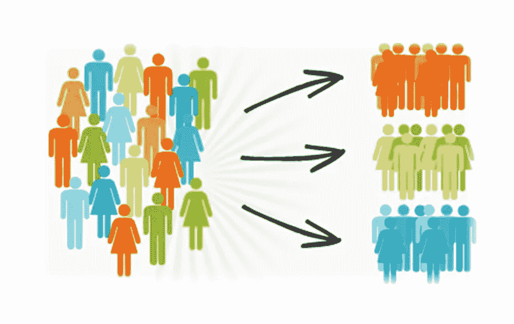
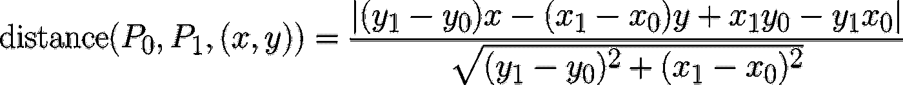
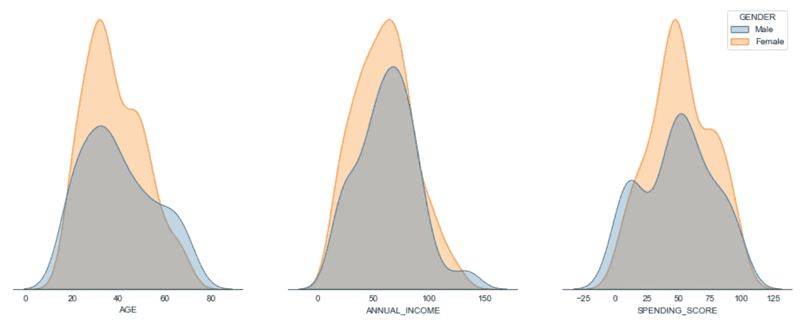
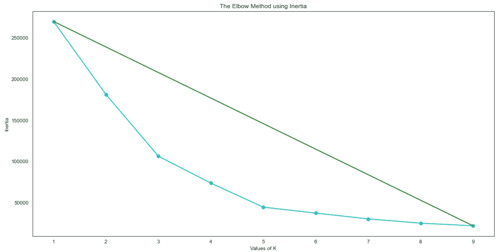
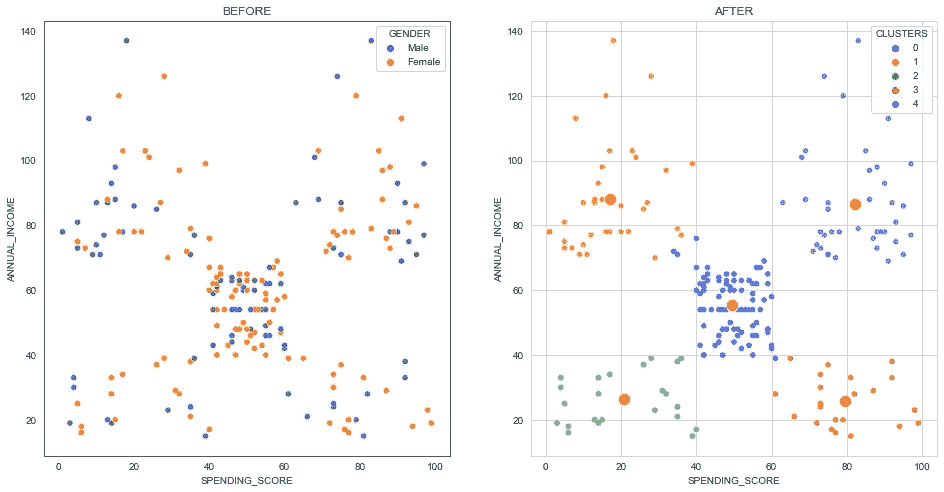
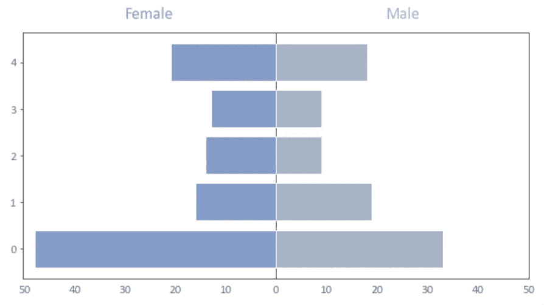

# 使用 K-Means 算法的简单聚类分析

> 原文：<https://medium.com/geekculture/simple-cluster-analysis-using-the-k-means-algorithm-72894179a54f?source=collection_archive---------45----------------------->

聚类分析使用数学模型，根据每个组中客户之间的最小差异来发现相似的客户组。

# **概述**

这篇文章旨在以简单的方式解释如何使用 K-Means 算法对你的客户进行聚类，以及这种方法如何帮助营销团队更好地开展客户活动。为此，我使用了一个简单的数据库，你可以在这里[找到](https://medium.com/r?url=https%3A%2F%2Fwww.kaggle.com%2Fvjchoudhary7%2Fcustomer-segmentation-tutorial-in-python)。

## 什么是聚类分析？

聚类是一套使用数学和机器学习模型将数据划分成组或簇的技术。聚类被松散地定义为数据对象组，这些数据对象组与它们所在聚类中的其他对象的相似性高于它们与其他聚类中的数据对象的相似性

从商业的角度来看，聚类分析的主要目标是实现更有效的营销策略，根据客户的需求和偏好，利用聚类分析为目标客户提供特定的优惠和收益。一种常见的聚类方法是数学模型 K-Means。

# K 均值方法

k-means 聚类方法是一种无监督的机器学习技术，用于识别数据集中数据对象的聚类。有许多不同类型的聚类方法，但 k-means 是最古老和最容易接近的方法之一。

> 它使用迭代技术根据聚类中心(*质心*)将未标记的数据分组到 K 个聚类中。选择每个聚类中的数据，使得它们到各自质心的平均距离最小化*。*

## *惯性*

*惯性衡量数据集被 K-Means 聚类的程度。其计算方法是**测量每个数据点与其质心之间的距离，对该距离求平方，并对一个聚类上的这些平方求和**。*

*一个好的模型是具有**低惯性和低簇数(K)** 的模型。然而，这是一种权衡，因为随着 K 的增加，惯性减小。*

## *那么，我怎么知道需要多少个 K 簇呢？*

*其中最常见的方法是使用**肘法**。基本上，有必要确定一个点，该点指示更大的同质性和聚类之间的最大差异之间的平衡，**这将是曲线上距离点 P0 和 P1** 之间绘制的直线最远的点，遵循以下等式。别担心，我们会用一种简单的方法来解决这个问题。*

**

*EQUATION 1 — Formula to find the distance between a point to a line*

# *数据分析*

## *数据背后的故事…*

*你拥有一家超市，通过会员卡，你拥有一些关于你的客户的基本数据，并希望通过了解你的客户的特征和购买行为来改进你的营销策略，并将其提供给你的营销团队来计划未来的活动。*

**

*FIG 1 — The dataset*

*以下是数据集中每个变量的模式和解释:*

*   ****用户 ID*** *—顾客 id**
*   ****性别*** *—服装师性别**
*   ****年龄*** *—服装商的年龄**
*   ****年收入*** *—客户年收入**
*   ****SPENDING _ SCORE****—客户基于行为和购买数据的得分(得分越高，客户费用越高)**

## *数据分析*

*在图 3 中，我们可以看到每个人口统计信息的客户分布情况。首先，我们有了**年龄对比** —女性在数据集中出现得更多，年龄在 35-50 岁之间的略有增加。**年收入**的分布似乎更加平均，其峰值为 7 万，而**支出得分**遵循相同的模式，在 avg 上有 50 分的最多消费者。*

**

*FIG 3 — Age, Annual Income and Spending Score distribution by gender*

# ***现在，实现 K-Means 算法***

*第一步是计算惯性，这将测量 K-Means 对数据集的聚类程度，下面的代码显示了一个计算惯性的简单函数。*

*CODE 1 — Function the calclate the inertia*

*有了惯性，我们可以绘制出图 4 所示的图表。它基本上是画出了惯性和簇数的关系。绿线代表我们在等式 1 中看到的点 P0 和 P1 之间画出的**直线。***

**

*FIG 4 — The Elbow Method*

*使用代码 1 中计算的惯性，我们将为建议的数据集确定最佳聚类数。代码 2，将找到曲线中离绿线最远的****点。*****

***CODE 2 — Find the optimal number of clusters***

***最后但同样重要的是，我们将使用代码 3 来确定聚类和每个组的质心。***

***CODE 3 — Function to calclate the clusters and the centroid***

# ***我们成功了…***

***既然所有客户都被分组，我们将使用散点图来比较分类前后的数据。即使只有一个简单的数据集，并且缺乏关于客户的信息，通过观察图 5，也有可能发现细分中的巨大差异。根据特征标记每个集群:***

*   ******聚类 0****—****重要客户*** *，中等收入和支出得分****
*   ******聚类 1****——****目标消费者*** *，高收入低消费得分****
*   ******聚类 2****——****不太重要的顾客*** *，收入和支出得分低****
*   ******聚类 3****——****预警*** *，低收入高支出得分****
*   ******聚类 4****—****最重要的顾客*** *，高收入和高支出分数****

******

***FIG 5 — Clusters comparison***

***在下面的图 7 中，我们可以看到每个集群的性别分布。对于营销团队来说，这是一个有用的信息，可以用来分析和建议具体的活动，以提高他们的支出分数，尤其是聚类 0 和 1。***

******

***FIG 7— Gender by Cluster***

***这就是你如何使用一个简单的算法来聚类你的客户，你可以添加更多的信息来进一步分析。希望你喜欢，下面是一些参考资料和我的 github 页面。***

## ***一些参考资料:***

*   ***[sci kit-learn 文档](https://scikit-learn.org/stable/modules/generated/sklearn.cluster.KMeans.html#sklearn.cluster.KMeans)***
*   ***[K 法和肘法](https://jtemporal.com/kmeans-and-elbow-method/)***
*   ***[聚类 K 均值](https://www.codecademy.com/learn/machine-learning/modules/dspath-clustering/cheatsheet#:~:text=K-Means:%20Inertia,number%20of%20clusters%20(%20K%20)***
*   ***[数据集— Kaggle](https://www.kaggle.com/vjchoudhary7/customer-segmentation-tutorial-in-python)***

****你可以在我的 github 页面获得完整代码:****

*** [## matsuch/商场-客户-细分

### 来自 Kaggle 的数据包含关于客户的信息，这里应该没有必要的库来运行代码…

github.com](https://github.com/matsuch/Mall-Costumer-Segmentation)***