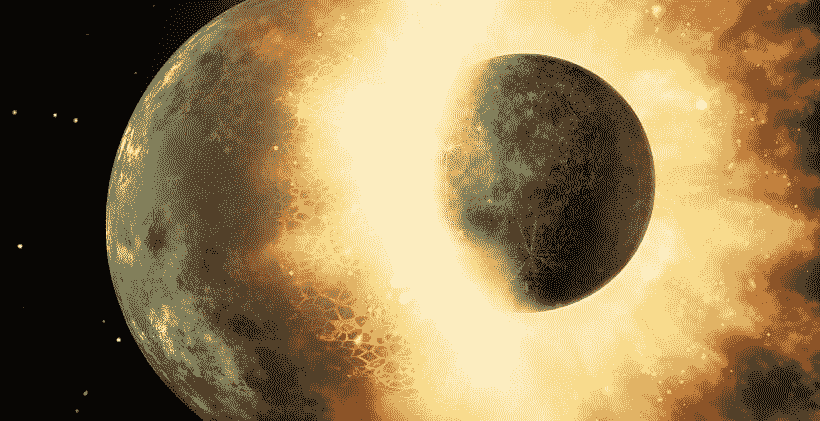

# 使用 Path2D 进行简单的碰撞检测

> 原文：<https://medium.com/geekculture/simple-collision-detection-with-path2d-b23e260431c7?source=collection_archive---------16----------------------->



Can you detect this collision? *Image by* [*NASA-Imagery*](https://pixabay.com/users/nasa-imagery-10/?utm_source=link-attribution&utm_medium=referral&utm_campaign=image&utm_content=971) *from* [*Pixabay*](https://pixabay.com/?utm_source=link-attribution&utm_medium=referral&utm_campaign=image&utm_content=971)

如何在你的 HTML5 Canvas app 或游戏中创建一个简单高效的路径间碰撞检测？在本文中，我们将创建一个迷宫，允许玩家在迷宫中导航，并检测玩家何时与墙壁发生碰撞。

# 最终目标

让我们建立一个简单的游戏。这个游戏看起来会像这样:

[https://www.youtube.com/watch?v=SSMuu-F-OBo](https://www.youtube.com/watch?v=SSMuu-F-OBo)

你可以在这里查看完整的代码并使用它:

见 [CodePen](https://codepen.io) 上 yona tank ra([@ yona tank ra](https://codepen.io/yonatankra))的笔。

# 什么是 Path2D？

Path2D 是一个轻量级的类，允许用户生成或复制二维路径，并轻松地在画布 2D 上下文中绘制它们。好的——一个句子里有这么多短语。让我们试着分解它。

本质上，当你创建一个`new Path2D()`时，你得到一个路径。路径是一种形状(可以是矩形、圆形、SVG 路径或它们的组合)。因此您可以在一个`Path2D`实例中创建整个图形。让我们看一个例子。您还可以通过使用`addPath`方法来组合几个`Path2D`实例。

最终，一旦你有了一条路径，你可以像这样把它画在任何画布上:

```
function(pathInstance) {
  const ctx = canvas.getContext("2d");
  ctx.clearRect(0, 0, CANVAS_HEIGHT, CANVAS_WIDTH);
  ctx.fillStyle = COLORS[BLACK];
  ctx.fill(pathInstance);
}
```

关于 Path2D 还有很多内容，我可能会在另一篇文章中介绍(如果人们对它有需求的话:)。

在本文中，我们将使用 Path2D 来创建我们的背景层，并看看我们如何检测背景层和动态层之间的冲突——在完全不同的画布上。更具体地说，我们将使用有用的`isPointInPath`方法来查看我们的玩家是否碰壁。

# 为碰撞设置路径

魔法始于路径的创造:

函数`generateBackgroundPaths`采用一个表示迷宫的矩阵(用[这里描述的细胞自动机算法](https://yonatankra.com/how-to-generate-a-maze-using-javascript-and-html5-canvas-and-a-cellular-automaton-algorithm/)创建)。然后它创建两个 Path2D 对象。第一个是墙，第二个是路(或无墙)。

现在我们有了路径，我们实际上可以使用`drawBackground`函数来绘制它们，该函数接受墙壁和道路路径，并将它们添加到背景画布中。

功能`generateBackground`(使用`generateBackgroundPaths`和`drawBackground`)如下所示:

# 开始游戏

函数`start`开始游戏。因为背景是静态的，我们就让它保持原样。改变的是玩家的位置。

Start 使用`generateBackground`来生成背景并得到墙壁和道路路径。然后，它会使用一些功能来帮助玩家找到一个没有墙的地方作为起点。它终于呼唤`renderPlayer`。

`renderPlayer`响应使用键盘按压进行动作(第 9-11 行响应空格键按压，第 13-19 行响应箭头)。它接受以前的`x,y`坐标，并根据按下的键改变它们。如果没有按键，坐标保持不变。

冲突检测发生在第 21 行。我们首先检查运动是否没有将我们带出画布边界:

`y - radius < 0 || y + radius >= CANVAS_HEIGHT || x - radius < 0 || x + radius >= CANVAS_WIDTH`

这是一种墙。

我们也调用函数`isCircleInPath`，它接受半径、坐标和墙壁路径。该功能将玩家的路径(一个给定半径的圆，圆心在`x,y`坐标中)与墙壁路径进行比较:

这个函数有点棘手。我们在这里做的是在可能的运动方向上检查圆上的 4 个点(我们只能上/下/左/右移动——因此是奇特的循环),并在上下文中使用本机`isPointInPath`方法来查看圆上的一个点是否在墙的路径内(第 14 行)。

回到`renderPlayer`，如果我们发生了碰撞(无论是墙壁还是画布边界)，我们只需将`x`和`y`值更改为之前的值。这导致没有运动(例如，我们撞到了墙...我们无法穿过它)。如果没有碰撞，我们就把玩家放在新的位置(第 26-29 行)。

渲染播放器使用`requestAnimationFrame`递归调用自己，所以在每一帧，如果用户点击，我们将在屏幕上看到一个动作。

# 摘要

Path2D 是对 Canvas 工具包的一个极好的补充。在这里，我们演示了如何使用 Path2D 创建一个简单的非常有效的冲突检测机制。使用 Path2D… [您可以做更多的事情，您可以查看它的文档并使用它进行试验](https://developer.mozilla.org/en-US/docs/Web/API/Path2D/Path2D)。

感谢 [Miki Ezra Stanger](https://www.linkedin.com/in/miki-stanger-153bb365/) 非常友好和有益的评论。