# 利用颤振和坚固性的简单分散应用

> 原文：<https://medium.com/geekculture/simple-dapp-using-flutter-and-solidity-b64f5267acf4?source=collection_archive---------4----------------------->

分散式应用程序或 **Dapps** 是运行在分散式计算系统上的数字程序，如区块链、p2p 网络等。不受中央政府控制的。区块链技术仍处于非常早期的发展阶段，我相信 Dapps 将在实现该技术的真正潜力方面发挥重要作用。为了理解 Dapps，我们需要知道什么是**智能合约**。

智能合同是一种自动执行的合同，买卖双方的协议条款被直接写入代码行。守则和其中包含的协议存在于一个分散的区块链网络中。

 [## 什么是区块链智能合约

### 了解智能合同以及区块链网络如何在预定条款生效时自动执行合同…

www.ibm.com](https://www.ibm.com/in-en/topics/smart-contracts) 

今天，我们将看看如何在以太坊的 testnet 上实现智能合约，以及如何通过 flutter 应用程序访问它。在实际编写智能合约之前，我们需要正确设置一些东西，以便我们可以在网络上部署智能合约。

Photo by [Nick Chong](https://unsplash.com/@nick604?utm_source=medium&utm_medium=referral) on [Unsplash](https://unsplash.com?utm_source=medium&utm_medium=referral)

# 元掩码

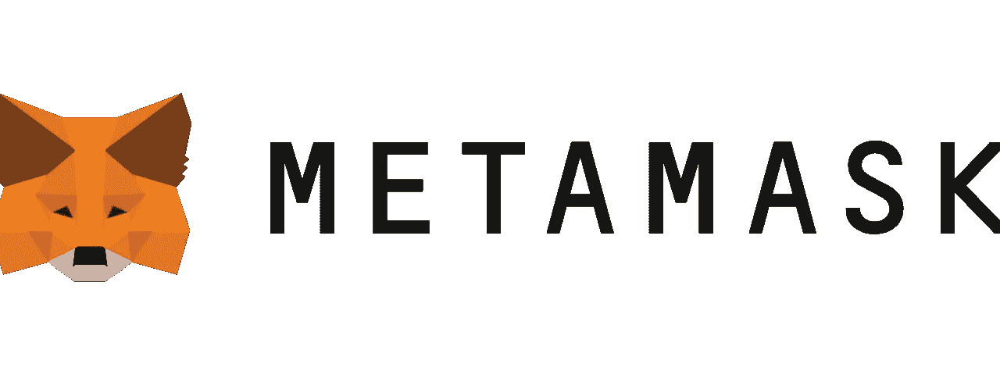

Metamask 是一种加密货币钱包，它与以太坊区块链交互，并允许用户通过浏览器扩展访问他们的以太坊钱包。您需要在浏览器中添加元掩码扩展。永远记得写下你的种子短语，因为它有助于恢复你的钱包，不要与任何人分享你的种子短语。

点击下面为 chrome 和 brave 安装 Metamask 扩展。

 [## 元掩码—扩展

### 浏览器中的以太坊钱包

chrome.google.com](https://chrome.google.com/webstore/detail/metamask/nkbihfbeogaeaoehlefnkodbefgpgknn?hl=en) 

安装后，你会得到这样的东西。

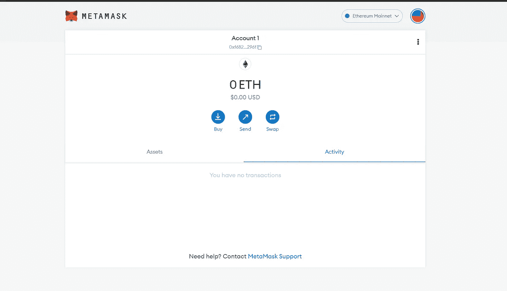

Metamask Extension expanded view.

正如您所看到的，Metamask 扩展提供了连接到除 mainnet 之外的各种以太坊测试网的选项。作为一名开发人员，我们需要首先在一个测试网上测试我们的智能合约，然后再将它部署到 mainnet 上。对于本教程，我们将使用 **Rinkeby 测试网络**。

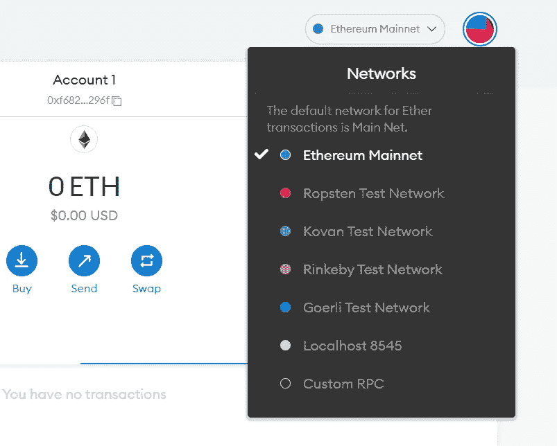

Metamask Mainnet and Testnet options.

为了在以太坊网络上部署智能合约，我们需要以以太网的形式向网络支付**天然气费**。

**Gas** 是指测量在以太坊网络上执行特定操作所需的计算工作量的单位。由于每个以太坊交易都需要计算资源来执行，所以每个交易都需要费用。气是指在以太坊上成功进行交易所需的费用。

因此，即使我们在测试网络上进行测试，我们也需要汽油费来在网络上部署合同。但是不要担心！你不需要使用真正的乙醚，我们可以要求**测试乙醚**。

在 Metamask 上将网络改为 Rinkeby，点击购买。你可以看到它问你是想直接存乙醚还是请求**测试龙头**。

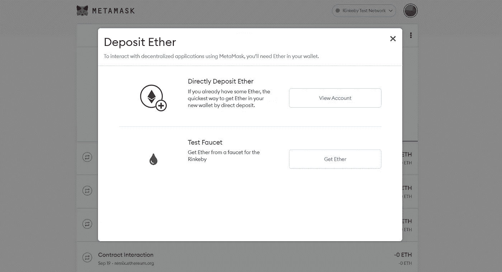

Deposit or Get Ether

**加密龙头**是网站和移动应用程序，允许用户以完成特定任务为交换获得少量加密货币。当你点击“获取以太”按钮时，你将被重定向到 rinkeby.io。

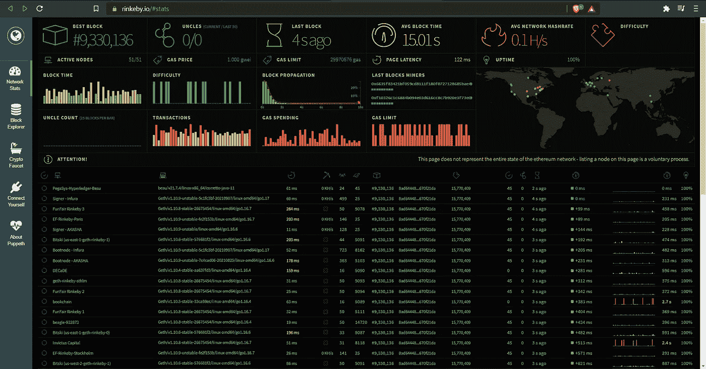

Rinkeby.io

要获得免费的测试乙醚，你需要通过 twitter 或脸书申请。

要通过 **Twitter** 申请资金，从你的 Metamask 钱包中用以太坊地址发一条推文，然后将推文的 URL 复制粘贴到 Rinkeby.io 的加密龙头提供的输入框中。

Make a tweet with the Metamask wallet address like this.

要通过**脸书**申请资金，从你的 Metamask 钱包中发布一个带有以太坊地址的新**公共**帖子，并将帖子的 URL 复制粘贴到 Rinkeby.io 的加密龙头提供的输入框中。

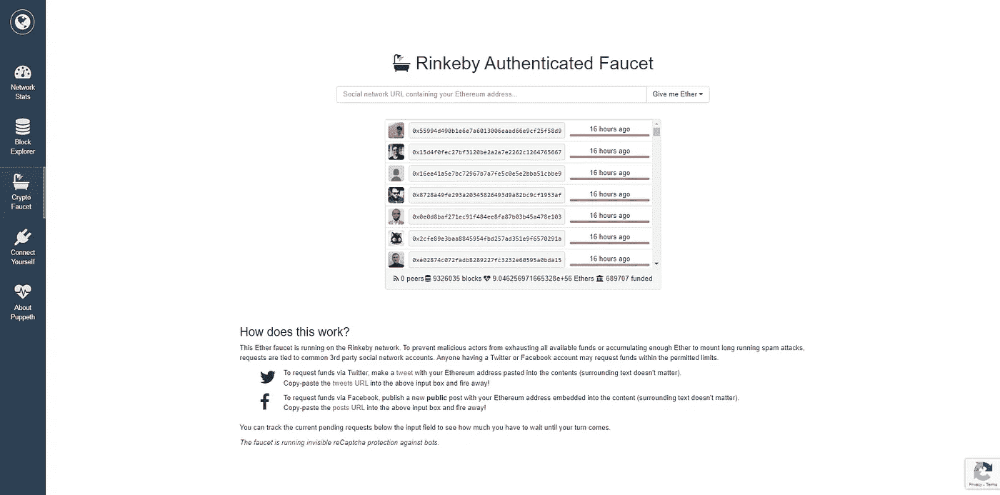

Enter the tweet or post URL in the input box and press Get Ether.

如果你做了以上所有正确的步骤，那么你的 Metamask 钱包里将会有一些免费的测试乙醚。

恭喜你！现在你可以开始写智能合同了。

# 智能合同

我们将使用 solidity 编写一个简单的智能合同。你可以在你选择的任何 IDE 上编写智能合同，但是我推荐在线 IDE，remix.ethereum.org，在那里我们可以编写智能合同，编译它，然后在网络上部署它。

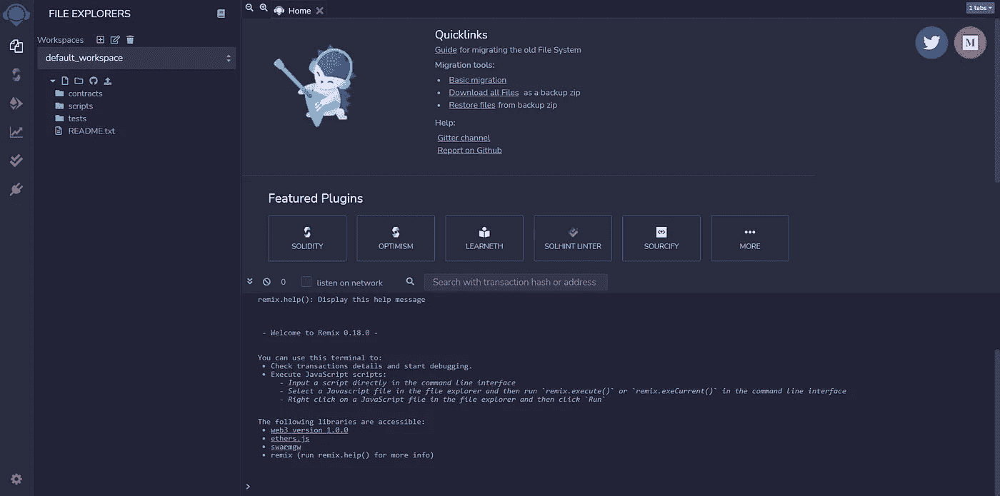 [## Remix -以太坊 IDE

### Remix IDE 是一个开源的 web 和桌面应用程序，它通过直观的图形用户界面促进了快速开发周期和丰富的插件集。Remix 用于部署智能的整个过程…

remix.ethereum.org](https://remix.ethereum.org/) 

如果需要，创建一个新的工作空间，并在 contracts 文件夹下创建一个新的 solidity 文件。我将把我的合同命名为“Xcoin.sol”。现在我们写一个简单的智能合同！

智能契约的第一行代码是一个 **pragma 指令**。

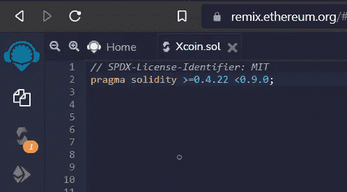

Pragma Directive

Pragma 指令告诉编译器包含和不包含哪个版本的实体。pragma 指令始终位于源文件的本地，如果您导入另一个文件，该文件中的 pragma 不会自动应用于导入的文件。

现在我们用三个函数来定义我们的契约“Xcoin”，**get balance()**,**deposit balance()**和【withdrawBalance()。

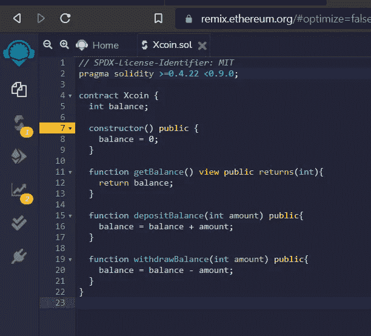

Simple Smart Contract.

Solidity 中的契约**类似于面向对象语言中的类。它们包含状态变量中的持久数据，以及可以修改这些变量的函数。**

整数“balance”是**状态变量**，上述三个函数修改“balance”变量中的数据。

## getBalance()

这个函数只是返回存储在状态变量中的值。我们将该函数声明为一个**视图**，这意味着该函数承诺不修改变量。

默认情况下，对契约的读访问是受限制的，但是我们需要将函数**设为公共函数**，以便访问状态变量。

## 存款余额()

顾名思义，这个函数存放 Xcoins。

该函数采用参数' **amount'** ,这是您要存入的 Xcoins 的数量。该函数只是将金额添加到余额中。

## 提款余额()

这个函数提取 Xcoins。它还接受参数'**金额**，并从余额中扣除该金额。

这是你的简单智能合同。现在我们需要使用 remix.ethereum.org 提供的 Solidity 编译器来编译我们的智能合同。

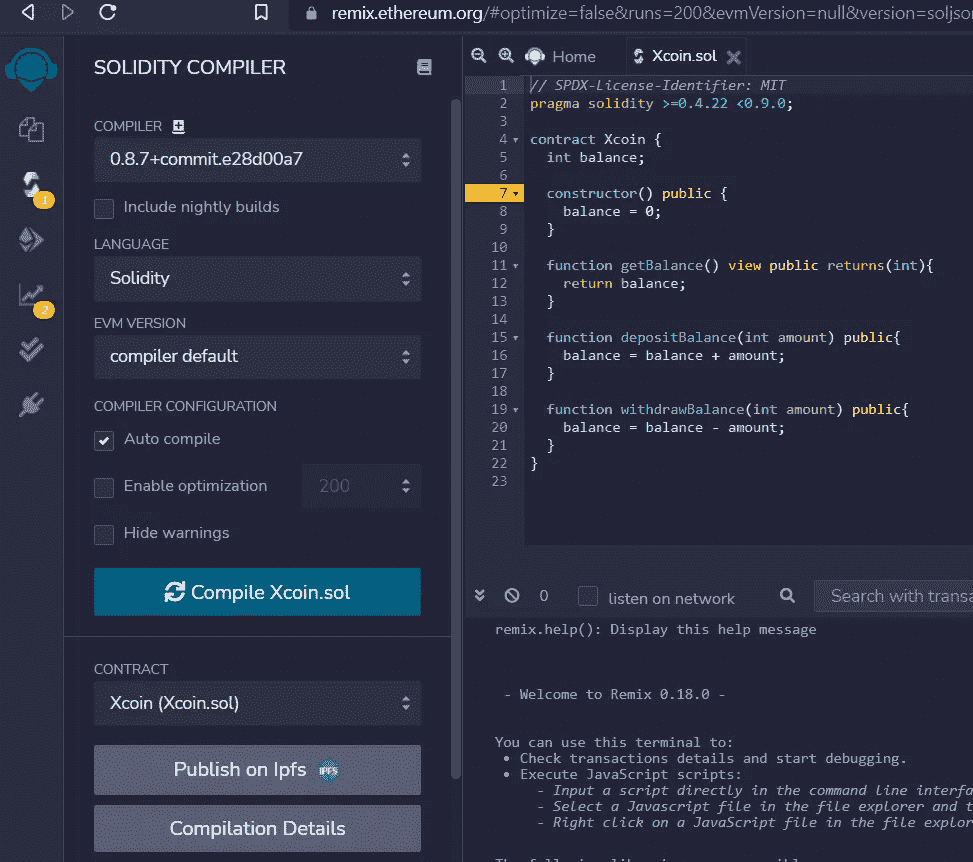

Compile the Smart Contract.

现在，我们将在 Rinkeby 测试网络上部署智能合约。选择“部署并运行事务”并选择环境。

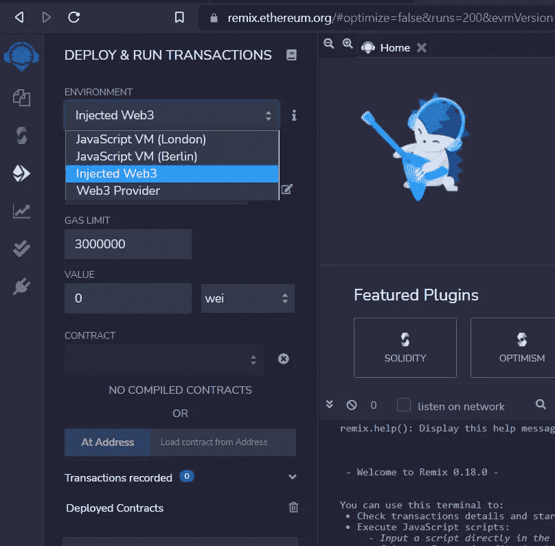

Selecting Environment and deploying.

我们可以看到它提供了各种环境供我们选择。

前两个选项是 **JavaScript VMs** ，其中所有事务都将在浏览器的沙盒区块链中执行。JsVM 是它自己的区块链，每次重新加载它都会启动一个新的区块链，旧的不会被保存。

第三个选项是**注入的 Web3** ，其中 remix 将连接到注入的 Web3 提供者，如 Metamask。

第四个选项是 **Web3 Provider** ，其中 remix 将连接到一个远程节点，您需要提供所选提供者的 URL:geth、parity 或任何以太坊客户端。

对我们来说，我们将使用注入的 Web3，因为我们将使用 Metamask。一旦你选择了这个选项，你会看到混音已经自动检测到测试网络和你的元掩码地址。点击部署，您的 Metamask 钱包将弹出，要求您确认汽油费。

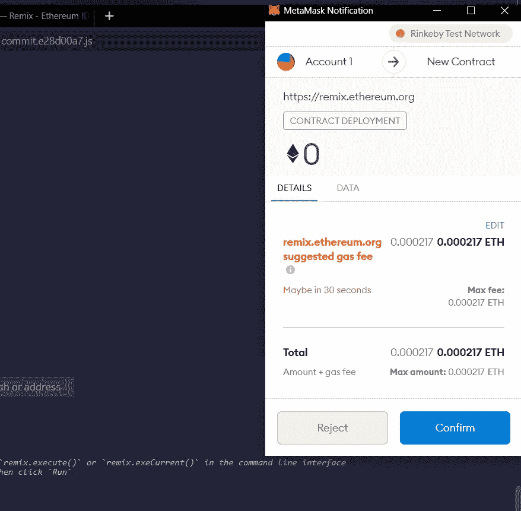

Gas fee Confirmation popup.

确认气费后，智能合约会在几秒钟后部署在 Rinkeby 网络上。部署合同后，您可以选择**已部署的合同**与智能合同进行交互。

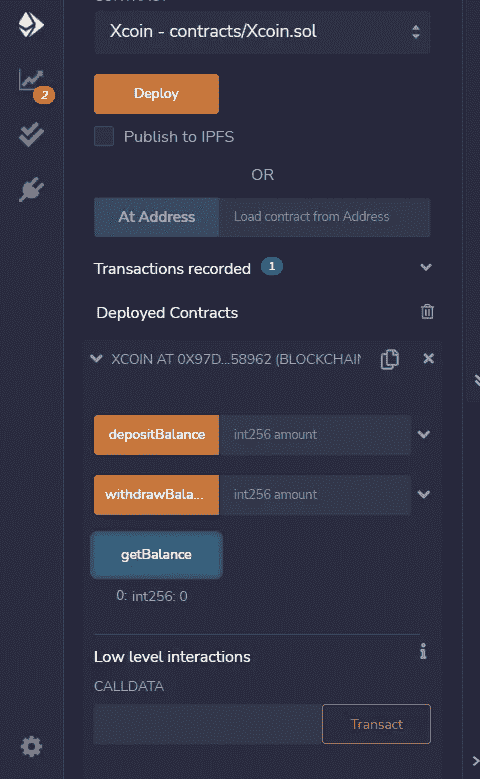

我们可以看到，当我们点击 **getBalance** 时，余额为 0。现在让我们投入 20 枚硬币。由于 **depositBalance()** 进行了交易，Metamask 将再次要求确认燃气费。

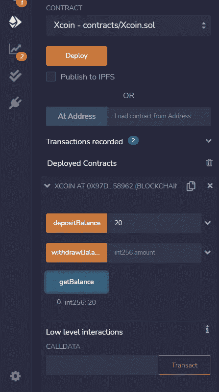

depositBalance(20)

我们看到现在我们的余额是 20。让我们通过提取 5 枚硬币来检查**提取余额()**。由于该函数执行交易，因此将再次要求确认。

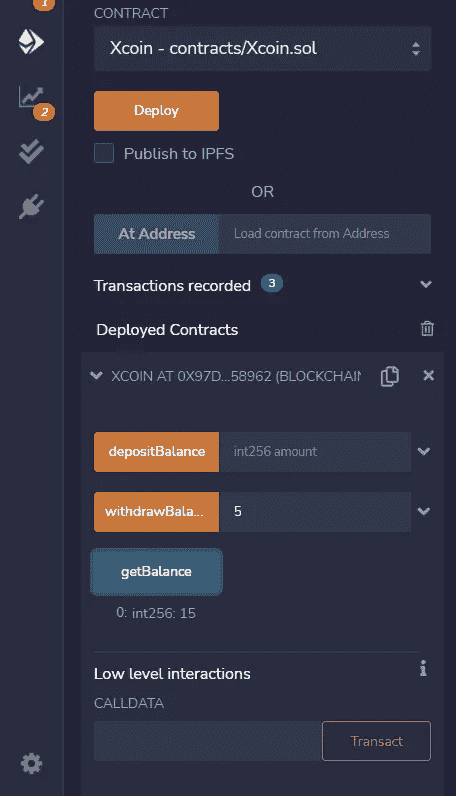

withdrawBalance(5)

现在我们看到，在提款后，我们有 15 的余额。我们已经成功地在测试网络上部署了合同，并与合同进行了交互。

现在，我们的目标是在 flutter 上构建一个移动应用程序，与我们刚刚部署的智能合约进行交互。让我们看看如何！

# 颤动 Dapp

我们将构建一个具有简单 UI 的 flutter Dapp，让用户与智能合约进行交互。在我们开始编写 flutter Dapp 之前，我们需要设置一个 API 来处理 Dapp 与智能契约交互的请求。为此，我们将使用 **Infura，**一个以太坊 API。

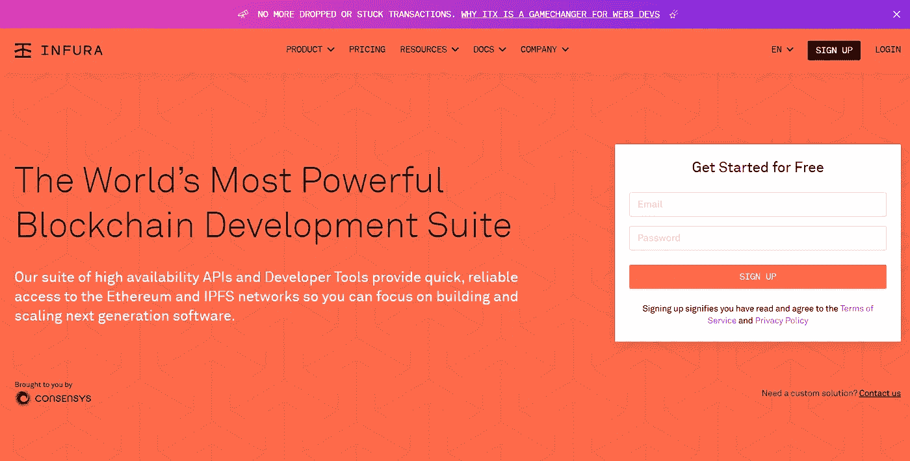

Infura.io

您也可以使用其他方法，比如使用 **Ganche** ，这是一个用于快速以太坊和 Corda 分布式应用程序开发的个人区块链。

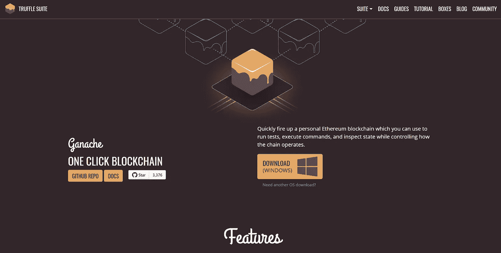

Ganache | Truffle

在 Infura 上创建一个帐户，

 [## 以太坊 API | IPFS API 和网关|以太网节点即服务| Infura

### 我们的高可用性 API 和开发工具套件提供了对以太坊和 IPFS 的快速、可靠的访问…

infura.io](https://infura.io/) 

创建帐户后，您将被重定向到仪表板，在那里您必须创建一个新项目。

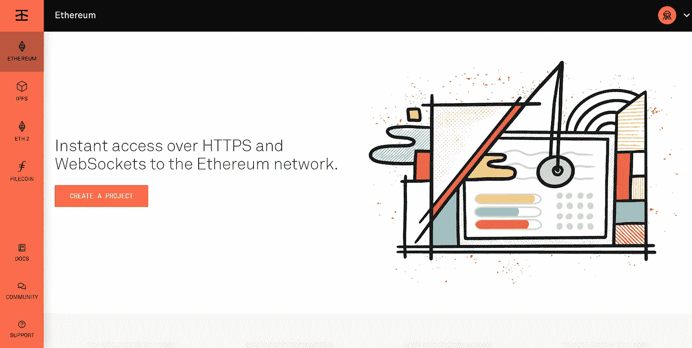

Create Infura Project.

创建一个新项目后，您需要转到设置并将端点更改为 Rinkeby，因为我们需要与之交互的契约位于 Rinkeby 测试网络中。

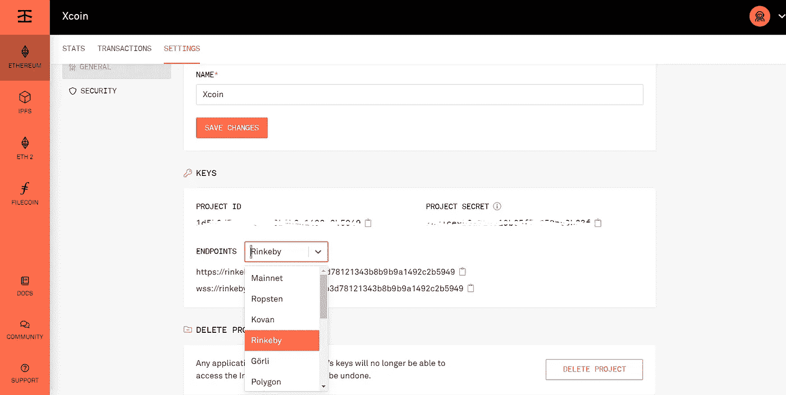

Change Endpoints to Rinkeby.

不，API 已经设置好了，让我们开始使用 flutter 编写 Dapp。

## 属国

创建了 flutter 项目后，我们需要一些来自 **pub.dev** 的依赖项来正确实现我们的 Dapp。

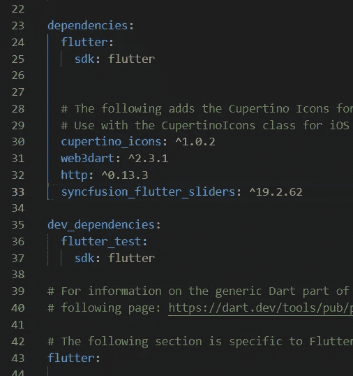

pubspec.yaml dependencies.

我们需要的第一个依赖项是 **web3dart** 。它是一个 dart 库，连接到一个以太坊节点来发送交易，与智能合约交互等等。

 [## web3dart | Dart 包

### 一个 dart 库，用于连接以太坊区块链并与之交互。它连接到以太坊节点发送…

公共开发](https://pub.dev/packages/web3dart) 

我们需要的第二个依赖项是 **http。**这个包包含了一组高级的函数和类，使得消费 HTTP 资源变得很容易。

 [## http | Dart 包

### 一个可组合的、基于未来的库，用于发出 HTTP 请求。这个包包含一组高级功能和…

公共开发](https://pub.dev/packages/http) 

第三个包**sync fusion _ flutter _ sliders**只是一个滑块的库。你可以使用任何你想要的滑块包。

 [## sync fusion _ Flutter _ sliders | Flutter 包

### Flutter Sliders 包是用 Dart 原生编写的，用于为…创建高度交互式和 UI 丰富的 slider 小部件

公共开发](https://pub.dev/packages/syncfusion_flutter_sliders) 

# 颤动代码

我们正在创建一个简单的 Dapp，所以我们不会严重依赖 UI，而是我们只对通过我们的 Dapp 访问智能合同感兴趣。

## 头球

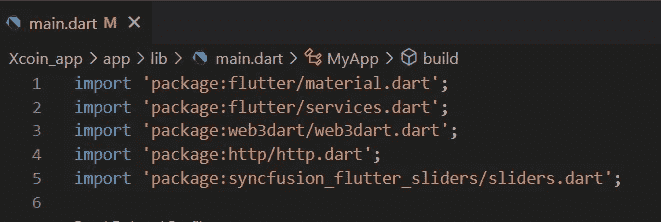

Headers.

我们需要 **services.dart** 文件来调用 rootbundle。我们将很快看到为什么我们需要调用 rootbundle。我们还为 **web3dart** 、 **http** 和**sync fusion _ flutter _ sliders**导入文件。

## 主()

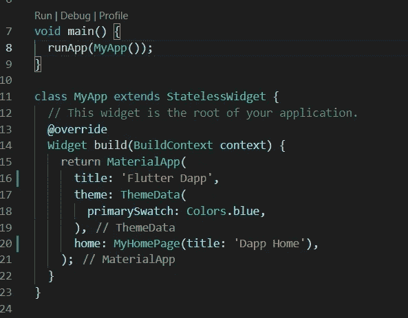

Main function.

我们将创建一个单页面 Dapp，所以我们将在 MyHomePage()类中编写所有的实现过程。

在解释 MyHomePage()类的实现之前，我们还需要做一件事。我们需要部署的智能合约的 ABI。

**合同应用二进制接口(ABI)** 是与以太坊生态系统中的合同进行交互的标准方式，包括来自区块链之外的以及合同对合同的交互。

我们可以从 remix.ethereum 的**编译细节**中获得 ABI，我们使用它部署我们的合同。

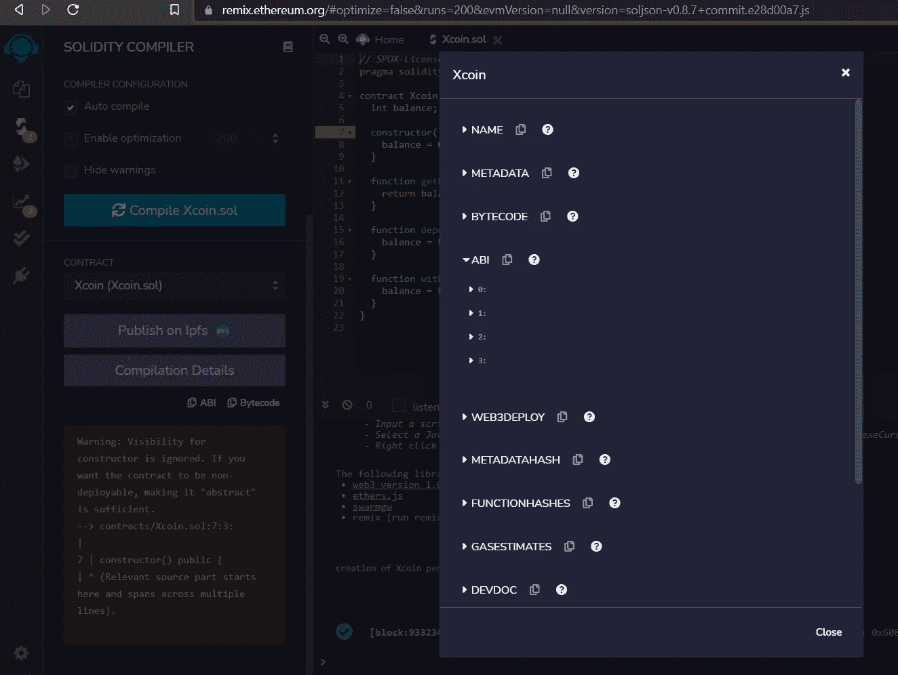

复制 ABI 并在我们的 flutter 项目中创建一个资产文件夹，在这里我们必须创建一个 **abi.json** 文件。

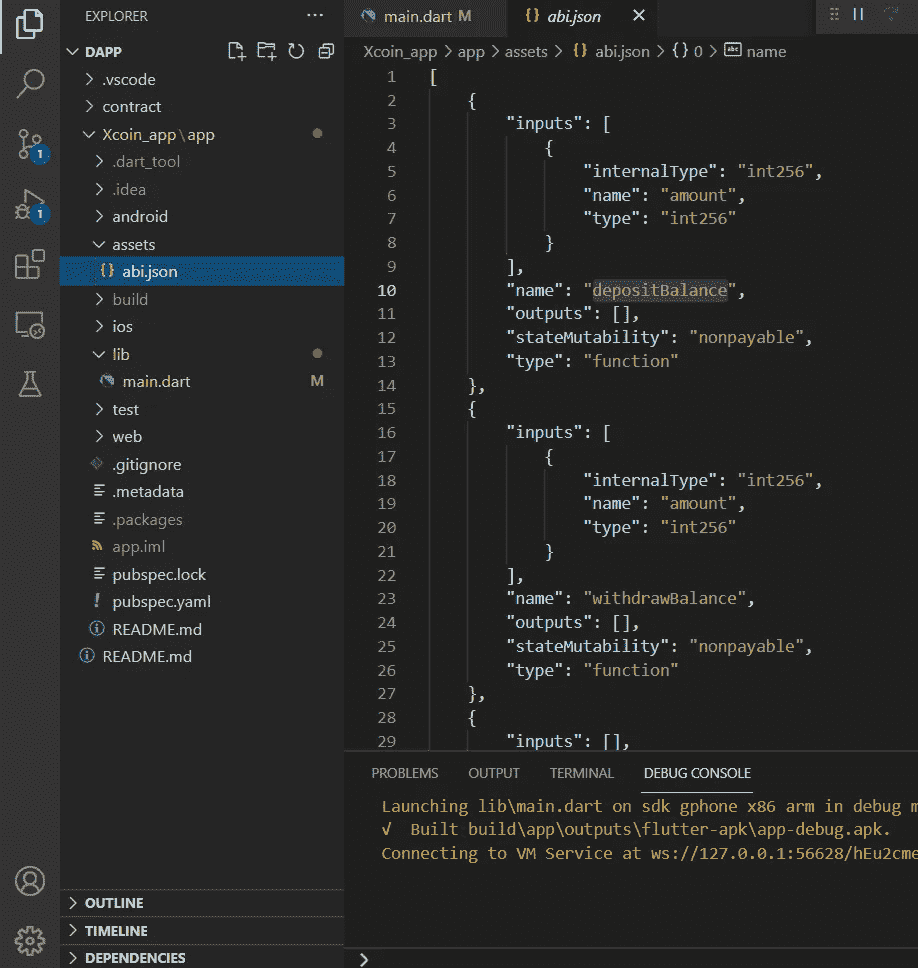

## 我的主页()

我们将创建一个 StatefulWidget，MyHomePage()。

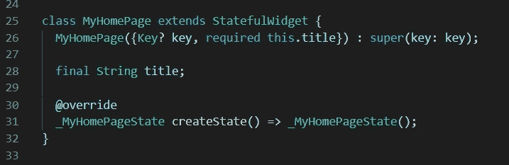

class MyHomePage()

首先我们声明一个 http 客户端， **httpclient。**然后我们需要一个 Web3Client， **ethclient** 。

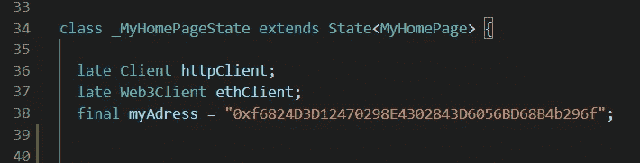

http client, web3client and Metamask address.

**客户端**类来自 http 库。它是 HTTP 客户端的接口，负责维护对同一服务器的多个请求之间的持久连接。

**Web3Client** 类来自 web3dart 库。它用于通过 HTTP JSON-RPC API 端点向以太坊客户端发送请求。这个库不会使用客户端的帐户功能来创建交易，我们将不得不自己获取帐户的私钥。

**my address**变量存储元掩码的 Rinkeby Testnet wallet 地址。

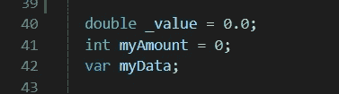

More variables.

我们将声明我们需要使用的另外三个变量。下面是 UI 的代码，我们将在后面看到这些函数的实现。

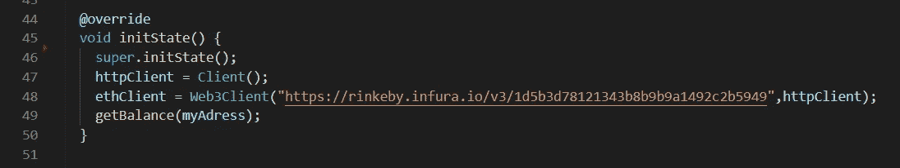

initState()

我们将在 **initState()** 方法中初始化 **httpClient** 和 **ethCLient** 。需要为 Web3Client 提供的 URL 可以在 Infura 设置中找到。

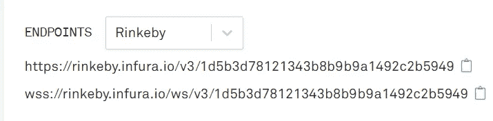

Endpoints

我们还将在 initState()中调用 getBalance()函数，这样当我们启动 Dapp 时，我们将总是获得当前余额。

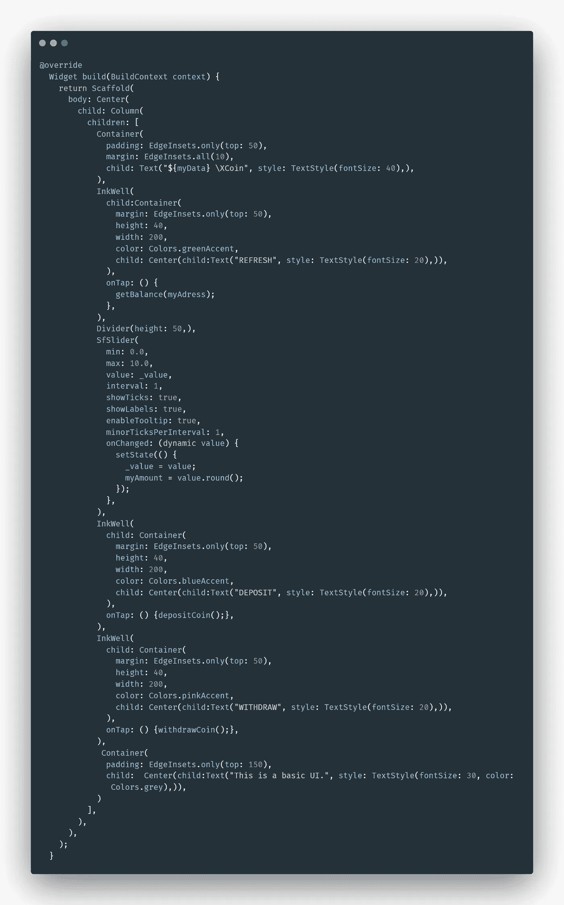

**SfSlider** 类来自 syncfusion_flutter_sliders 库。我们将滑块的最小值设置为 0.0，最大值设置为 10.0，我们使用这个滑块来获得我们需要存款或取款的金额。我们将滑块的舍入值存储到变量 **myAmount** 中。

getBalance(), query() and loadContract() functions

我们要编写的第一个函数是 **getBalance()** 函数，它请求智能合约返回当前余额的值。它将**目标地址**作为参数。getBalance()函数向智能契约发送查询，其中包含我们希望从契约中执行的函数名。

**loadContract()** 函数加载我们从编译细节中复制的 ABI 文件。我们还需要我们的部署合同的地址，我们可以从 remix.ethereum.org 获得。

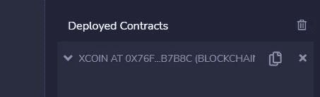

Contract address.

我们通过使用来自 web3dart， **DeployedContract 的 helper 类来获取契约。**这个类定义了一个与已经部署在以太坊区块链上的已知 ABI 的合同。它需要两个参数，ABI 和以太坊地址。

**query()** 函数将一个函数名和一列参数作为参数。它调用 loadContract()函数，将协定加载到一个变量中，并使用 functionName 参数从协定中提取函数。

最后，query()函数使用 Web3Client **调用方法**存储结果，该方法调用智能合约中定义的函数并返回其结果。

类似地，我们实现了**存款币**和**取款币**方法。

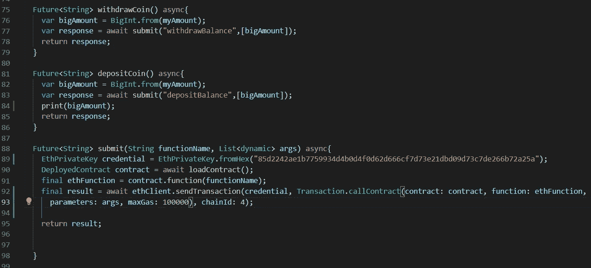

withdrawCoin(), depositCoin() and submit() methods.

**submit()** 函数实质上签署并发送一个事务到区块链网络，我们使用 web3dart 库中的 **sendTransaction()** 方法来实现这一点。为了签署合同，它需要一个私钥。这里我使用了一个随机的私钥。您可以使用元掩码钱包中的私钥或任何其他私钥。

sendTransaction()方法的 **chainId** 设置为 4，代表 Rinkeby 测试网络。您还应该小心地为契约设置一个 **maxGas** 值，否则它可能会给出一个错误消息，*RPC error:got code-32000 with msg“transaction under priced”。*

# 演示

正如我们所见，目前的余额已经是 15 Xcoins，因为我们直接从 remix.ethereum.org 存入和取出硬币。

我们现在将存入 10 枚硬币并刷新。现在当前余额变成 25 Xcoins。

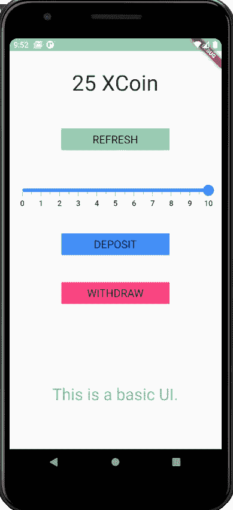

如果我们提取 5 个硬币，然后刷新，我们可以看到当前余额为 20 Xcoins。

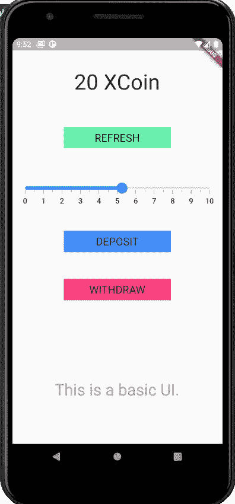

您可以检查 Infura 以了解您的智能合同的状态以及您的 flutter Dapp 向合同发送了多少请求。

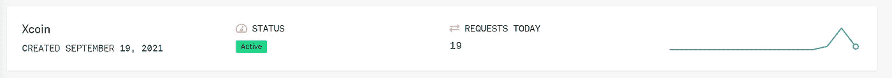

# 参考，

## [打造你的第一款区块链 Flutter App | Solidity | meta mask](https://www.youtube.com/watch?v=3Eeh3pJ6PeA)

 [## Dart 开发者以太坊| ethereum.org

### 了解如何使用 Dart 语言为以太坊开发

ethereum.org](https://ethereum.org/en/developers/docs/programming-languages/dart/)