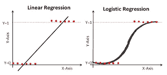
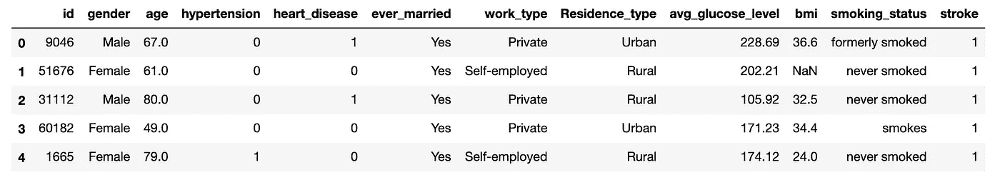
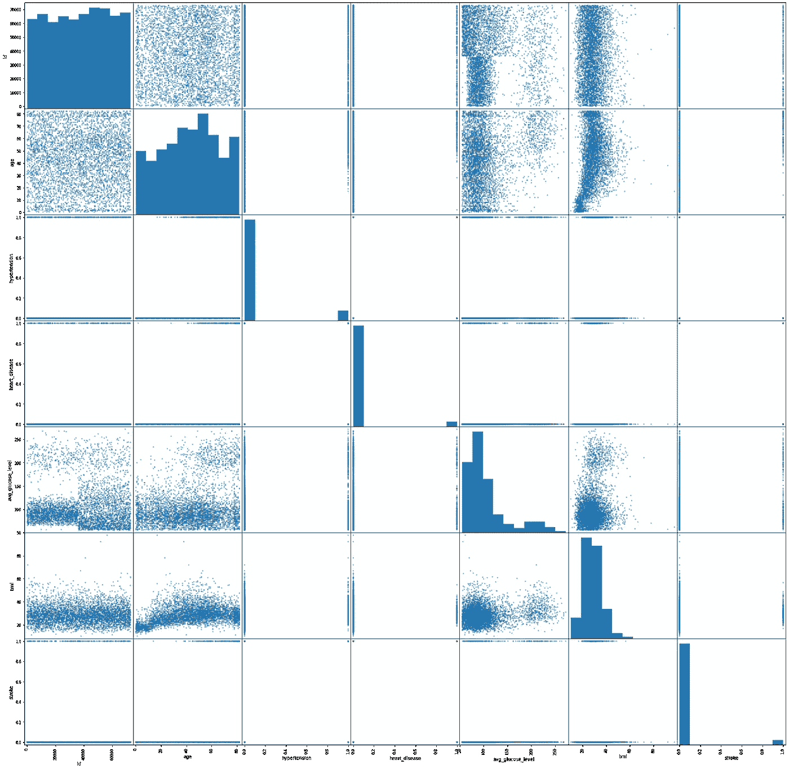
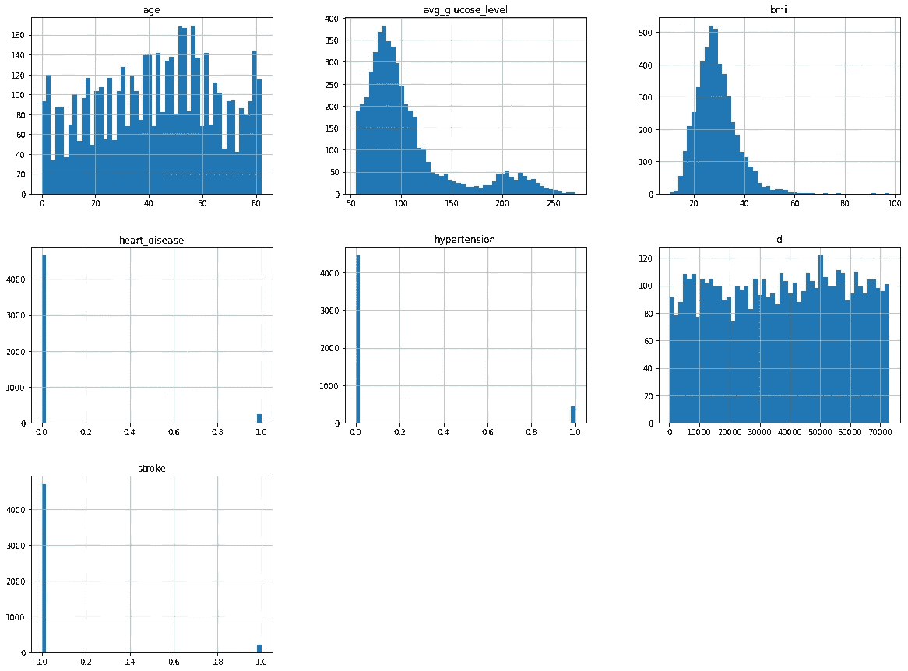
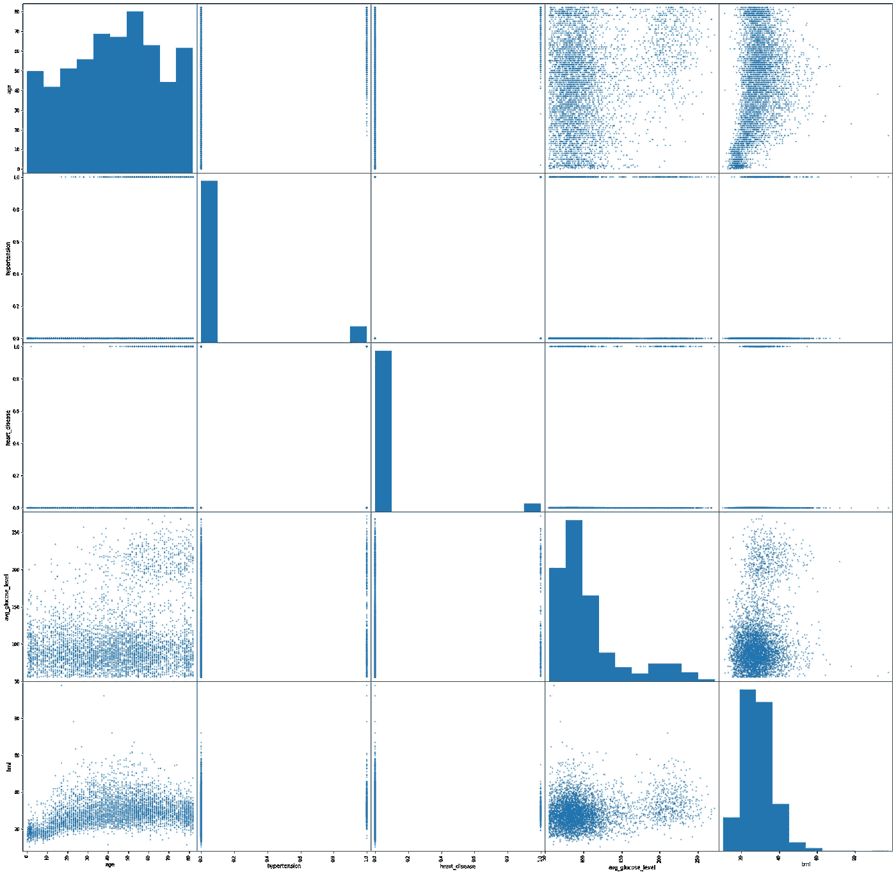
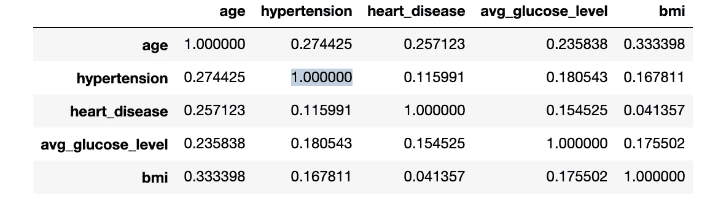
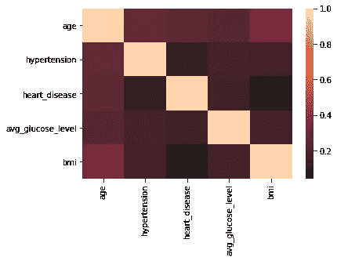
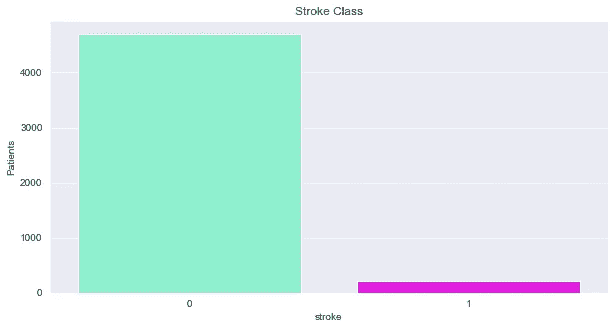
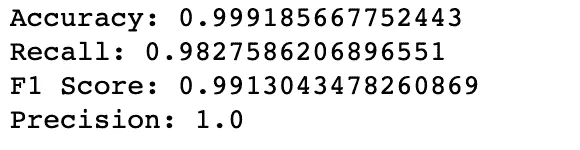
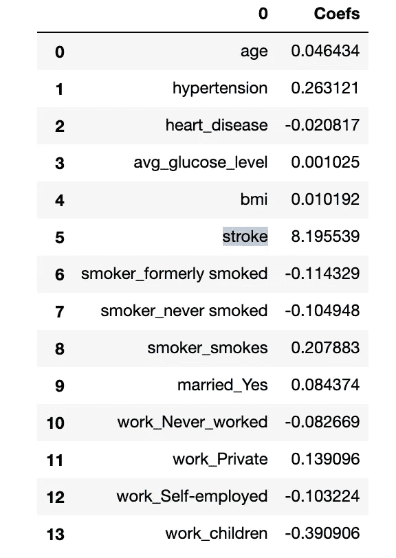

# 基线逻辑回归的简单数据清理和 EDA。

> 原文：<https://medium.com/geekculture/simple-data-cleaning-and-eda-for-a-baseline-logistic-regression-8b01e78e2f73?source=collection_archive---------6----------------------->

## 为逻辑回归准备 Kaggle 数据集



# 数据

对于这个快速演练，我从 Kaggle 选择了一个笔划数据集。美国每年有超过 70 万人患中风。有多种因素导致某人患中风的风险。了解患者中风的潜在风险可能有助于医生实施预防性护理。借助机器学习的力量，中风患者数据可以用来建立中风风险分类模型。这个模型可以作为一个应用程序或工具来帮助用户了解他们中风的风险。在这篇博客中，我将向你展示如何读入数据集，进行快速探索性数据分析，并为基线逻辑回归准备数据框架。

# 第一步

让我们从导入我们的包和读取熊猫数据集开始。

```
import pyforest
import warnings
warnings.filterwarnings("ignore")
from sklearn import metrics
from sklearn.metrics import accuracy_score
from sklearn.model_selection import train_test_split
from sklearn.metrics import mean_squared_error
from sklearn.dummy import DummyClassifier
from sklearn.preprocessing import StandardScaler
from sklearn import metrics
from sklearn.linear_model import LogisticRegression

pd.set_option('display.max_columns', 300)
```

对于我的包，我使用 pyforest 作为我的通用包，并导入必要的 sklearn 包用于逻辑回归。

下一步是读入数据并检查数据集的形状和类型。

```
df = pd.read_csv('healthcare-dataset-stroke-data.csv')
df.head()
```



```
df.shape
##########
df.dtypes
```

在对数据集有所了解之后，下一步是检查空值。

```
df.isna().sum()
```

bmi 中有 200 个缺失值。因为丢失的值只占整个数据集的 0.04%，所以我决定删除丢失的值。

```
df.dropna(inplace=True)
```

# 下一步 EDA

在一些简单的清理之后，是时候将数据可视化并理解某些值是如何分布的了。

首先是数据帧的散布矩阵。这是查看数据中是否有任何趋势的好方法。您还可以通过该图发现分类数据模式

```
pd.plotting.scatter_matrix(df, figsize = [30,30]);
plt.show()
```



通过该图，您可以看到每个特征之间的关系。

接下来，我检查了特征的直方图分布。

```
df.hist(bins=50, figsize=(20,15))
plt.show()
```



这是查看是否有分类数据或连续数据的另一个好方法。您还可以使用这种可视化来查看潜在的异常值。

接下来是与目标变量相比的所有特征的散布矩阵。在这种情况下，目标变量是中风或没有中风。

```
stroke_pred = df.drop(['id','stroke'],1)pd.plotting.scatter_matrix(stroke_pred, figsize = [30,30]);
plt.show()
```



这是查看特征与目标变量的相关性中是否有任何清晰模式的最佳方式。

为了获得良好的测量结果，我还检查了预测要素之间是否存在共线性。

```
stroke_pred.corr()
```



为了更好地显示关联表，您可以将其绘制为热图

```
sns.heatmap(stroke_pred.corr(), center=0);
```



这张热图表明所有的功能都是相互独立的。

接下来让我们仔细看看目标变量的分布。

```
sns.set_style('darkgrid')
plt.figure(figsize = (10,5))
sns.countplot(df['stroke'], alpha = 1, palette= ['aquamarine','magenta'])
plt.title('Stroke Class')
plt.ylabel('Patients')plt.show()
```



这个数据集中存在着巨大的阶级不平衡。在检查了基线模型后，我将最大胆地解决未来模型的不平衡。

# 为逻辑回归准备数据

在运行模型之前，我们需要对数据集做一些工作。数据集有几个包含分类字符串数据点的要素。这些不适用于逻辑回归，所以我们必须用二元选项来模拟这些特征。

```
#Dummy catagories dataframe
smoke_dummie = pd.get_dummies(df.smoking_status,prefix='smoker',drop_first=True)
married_dummie = pd.get_dummies(df.ever_married,prefix='married',drop_first=True)
work_dummie = pd.get_dummies(df.work_type,prefix='work',drop_first=True)
residnece_dummie = pd.get_dummies(df.Residence_type,prefix='residence',drop_first=True)
gender_dummie = pd.get_dummies(df.gender,prefix='gender',drop_first=True)dummie_data = pd.concat([smoke_dummie,married_dummie,work_dummie],axis=1)df_2 = df.drop(['work_type','ever_married',
                  'Residence_type','smoking_status',
                  'gender','id'],axis=1)df_3 = pd.concat([df_2,dummie_data],axis=1)
df_3.head()
```

在这段代码中，我模拟了分类数据，删除了那些列，并将模拟数据连接到原始数据帧。

我们的数据准备好了，是时候开始基线模型了。

```
X = df_3
y= df.strokeX_train, X_test, y_train, y_test = train_test_split(X, y, random_state=1)
```

首先我们做一个训练测试分割，这样我们就可以用测试集来衡量模型的有效性。

```
def evaluation(y_test, y_pred):
    print('Accuracy: '  + str(metrics.accuracy_score(y_test, y_pred)))
    print('Recall: ' + str(metrics.recall_score(y_test, y_pred)))
    print('F1 Score: ' + str(metrics.f1_score(y_test, y_pred)))
    print('Precision: ' + str(metrics.precision_score(y_test, y_pred)))
```

这是一些评估指标的快速函数，现在是时候运行我们的逻辑回归基线模型了。

```
lr = LogisticRegression()
lr.fit(X_train,y_train)y_pred = lr.predict(X_test)
evaluation(y_test, y_pred)
```



这个模型的指标非常高。这可能是由于分类不平衡造成的偏差，但这是创建有效中风风险分类模型的一个很好的切入点。

在进行更深入的建模过程之前，我的最后一步是检查逻辑回归的系数权重。

```
coef_table = pd.DataFrame(list(X_train.columns)).copy()
coef_table.insert(len(coef_table.columns),"Coefs",lr.coef_.transpose())
coef_table
```



从这个表中，我们可以看到逻辑回归的系数权重。从该表中可以看出，高血压、吸烟者吸烟和童工似乎是对分类影响最大的特征。

我希望你喜欢快速浏览一些简单的建模步骤。有一些更深入的数据清理和 EDA 可以做，但这些步骤应该足以让你快速基线模型。