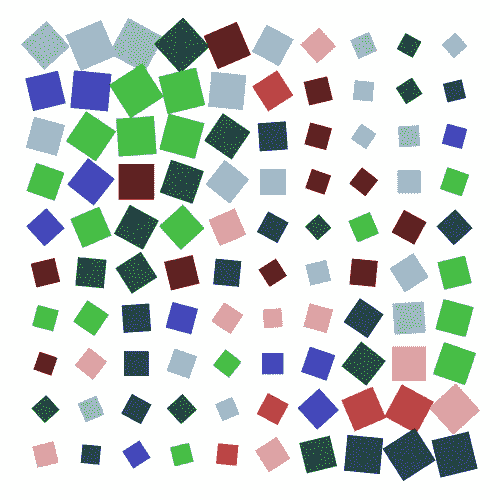

# 使用重复和变化的简单生成艺术

> 原文：<https://medium.com/geekculture/simple-generative-art-using-repetition-and-variation-70607479c0f3?source=collection_archive---------22----------------------->

Python 和 generativepy 开创了生成艺术的先河

在本帖中，我们将通过 Python 和 [generativepy](https://github.com/martinmcbride/generativepy) 来看看如何在生成艺术中使用非常简单的重复和变化。有关 generativepy 的更多信息，请参见 PythonInformer.com 的[。](https://pythoninformer.com/generative-art/)

我们将保持事情非常简单，只是使用简单的正方形和不同的颜色，大小和…