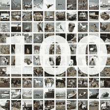
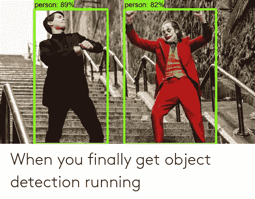
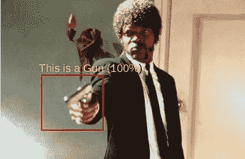
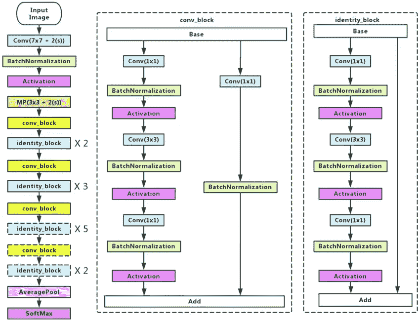
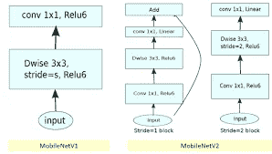
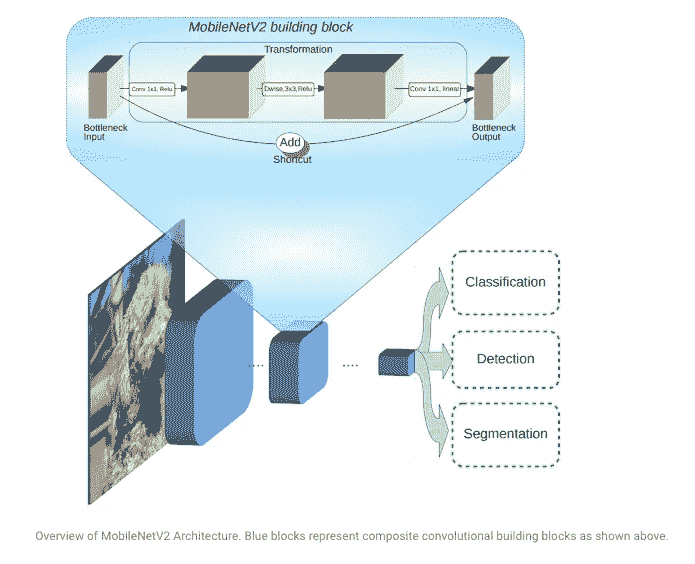
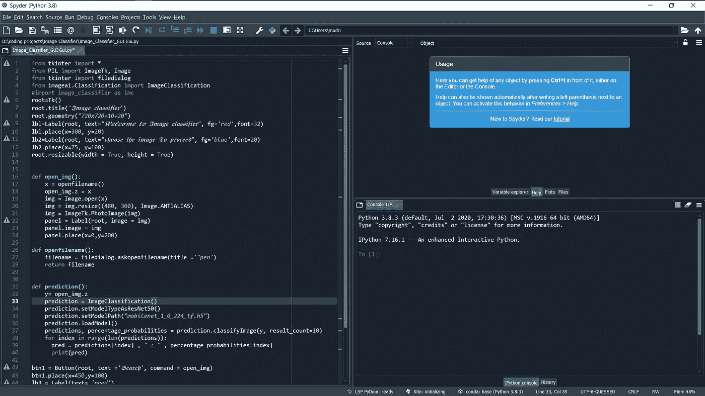
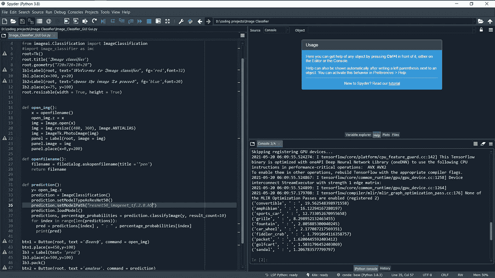
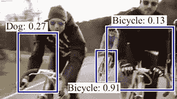

# 用 python 和 Tensorflow 实现简单的影像分类🚲🦼🛹🚛

> 原文：<https://medium.com/geekculture/simple-image-classification-with-python-and-tensorflow-6f7c2d9d6222?source=collection_archive---------12----------------------->

# 🛸什么是图像分类，如何在 Python 中实现？

图像分类可以被称为给图像分配标签的任务。组织病理学的大部分领域由各种分类任务组成。这是因为组织病理学主要关注基于基于载玻片的显微镜检查的诊断。组织结构和亚型的自动分类对于增加和改进组织病理学工作流程也非常有用..



图像分类的例子如下-:
a .)将 x 射线标记为癌症与否(二元分类)。

b.)对手写数字进行分类(多类分类)。

c.)给脸部照片命名(多类分类)。

# 基于张量流的图像分类。



## 🚲什么是 Tensorflow，它是如何工作的？


TensorFlow 是用于机器学习的免费开源软件库。它可以用于一系列任务，但特别侧重于深度神经网络的训练和推理。Tensorflow 是一个基于数据流和可微分编程的符号数学库。

## 🪂为什么是张量流？

**TensorFlow** 是谷歌大脑团队为 Python 创建的开源库。TensorFlow 将许多不同的算法和模型汇编在一起，使用户能够实现深度神经网络，用于图像识别/分类和自然语言处理等任务。TensorFlow 是一个强大的框架，它通过实现一系列处理节点来发挥作用，每个节点代表一个数学运算，整个系列的节点称为一个“图”。



Tensorflow 一般由 as↷
a .)resnet 50
b .)mobilenet v2
c .)yolo v3
等很多型号组成:

在我们的项目中，我们使用了 ResNet 50 和 MobileNet V2

# 什么是 Resnet 50？


**ResNet** - **50** 模型由 5 个阶段组成，每个阶段都有一个卷积和单位块。每个卷积块有 3 个卷积层，每个单位块也有 3 个卷积层。 **ResNet** - **50** 拥有超过 2300 万个可训练参数。



Resnet 50 model Architecture


## 🪂什么是 MobileNet V2？



*MobileNets 是 TensorFlow 的一系列移动优先计算机视觉模型，旨在最大限度地提高准确性，同时注意设备或嵌入式应用的有限资源。* mobilenet 是小型、低延迟、低功耗的模型，可参数化以满足各种用例的资源限制。根据该研究论文，MobileNetV2 提高了移动模型在多任务和基准测试以及不同模型规模范围内的一流性能。对于目标检测和分割，它是一个非常有效的特征提取器。例如，在检测方面，当与单次检测器 Lite 配合使用时，MobileNetV2 比 MobileNetV1 快 35 %,但精度相同。



与 MobileNetV1 相比，MobileNetV2 型号要快得多。它使用的运算次数减少了 2 倍，具有更高的精度，需要的参数减少了 30%。



## 🚕🚕实现这些惊人模型的代码

导入必要的库

```
from tkinter import *
from PIL import ImageTk, Image  
from tkinter import filedialog
from imageai.Classification import ImageClassification 
#import image_classifier as imc
```

创建用户界面并实现模型

```
root=Tk()
root.title('𝕴𝖒𝖆𝖌𝖊 𝖈𝖑𝖆𝖘𝖘𝖎𝖋𝖎𝖊𝖗')
root.geometry("720x720+10+20")
lbl=Label(root, text="𝓦𝓮𝓵𝓬𝓸𝓶𝓮 𝓽𝓸 𝕴𝖒𝖆𝖌𝖊 𝖈𝖑𝖆𝖘𝖘𝖎𝖋𝖎𝖊𝖗", fg='red',font=32)
lbl.place(x=300, y=20)
lb2=Label(root, text="𝖈𝖍𝖔𝖔𝖘𝖊 𝖙𝖍𝖊 𝖎𝖒𝖆𝖌𝖊 𝕿𝖔 𝖕𝖗𝖔𝖈𝖊𝖊𝖉", fg='blue',font=20)
lb2.place(x=75, y=100)
root.resizable(width = True, height = True)def open_img():
    x = openfilename()
    open_img.z = x
    img = Image.open(x)  
    img = img.resize((480, 360), Image.ANTIALIAS) 
    img = ImageTk.PhotoImage(img) 
    panel = Label(root, image = img) 
    panel.image = img
    panel.place(x=0,y=200)def openfilename(): 
    filename = filedialog.askopenfilename(title ='"pen')
    return filename

def prediction():
    y= open_img.z
    prediction = ImageClassification()
    prediction.setModelTypeAsResNet50()
    prediction.setModelPath("mobilenet_1_0_224_tf.h5")
    prediction.loadModel()
    predictions, percentage_probabilities = prediction.classifyImage(y, result_count=10)
    for index in range(len(predictions)):
      pred = predictions[index] , " : " , percentage_probabilities[index]
      print(pred)btn1 = Button(root, text ='𝕾𝖊𝖆𝖗𝖈𝖍', command = open_img)
btn1.place(x=450,y=100) 
lb3 = Label(text= 'pred')
lb3.place(x=500,y=100)
lb3.pack()
btn2 = Button(root, text ='𝖆𝖓𝖆𝖑𝖞𝖟𝖊', command = prediction)
btn2.place(x=560,y=100)root.mainloop()
```



如果你想尝试由全球开发者创造的新的图像分类模型-: [点击这里](https://paperswithcode.com/task/image-classification)



感谢您的阅读和
快乐学习😊😊😊