# 使用 Python 进行简单的线性回归分析

> 原文：<https://medium.com/geekculture/simple-linear-regression-analysis-using-python-c5b2f637942?source=collection_archive---------1----------------------->

Image downloaded from www.piexel.com

**回归分析**是应用最广泛的预测方法。**线性回归**用于数据集具有线性相关性的情况，顾名思义，**简单线性回归**有一个自变量(预测值)和一个因变量(响应值)。

简单线性回归方程表示为 **y = a+bx** 其中 x 为解释变量，y 为因变量，b 为系数，a 为截距。

在线性回归中，最佳拟合线将是与数据点垂直距离最小的线。最流行的方法之一是**最小二乘法**，这里通过最小化残差平方和来拟合最佳直线。其中残差是观测值(y)与估计的或拟合的线 ŷ(y-hat).之间的差

对于线性回归分析，我从 Kaggle 获取了工资数据集。这个数据集与工作年限和工资有线性相关性。

对于回归分析，首先我们必须导入库。

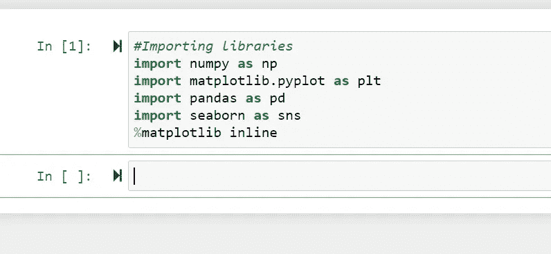

导入库后，数据集将被导入。要查看数据集的前五行，我们可以使用 **dataset.head()** 。在 Python 中，与 R 不同，索引从 0 开始。

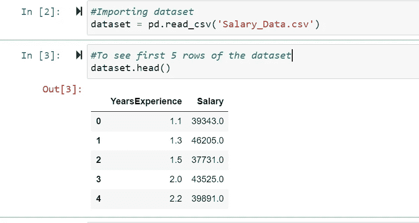

可以使用 **dataset.info()** 检查数据集的信息，如列名、非空计数和空计数的编号(如果有)以及数据类型。

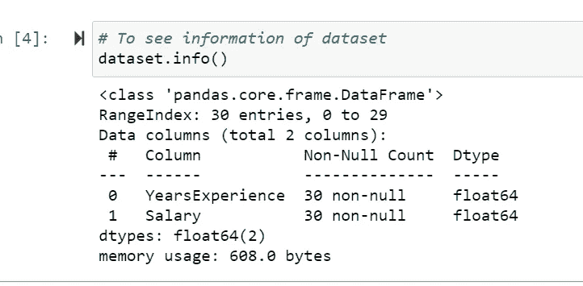

可以使用**数据集对数据集进行统计分析，如观察值、平均值、标准偏差和四分位值。**形容()。

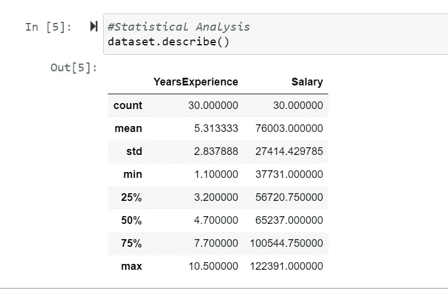

变量之间的关系可以用 **sns.pairplot()** 来看。对于多元线性回归，它将非常有用，因为它显示了每个特征与响应的关系。

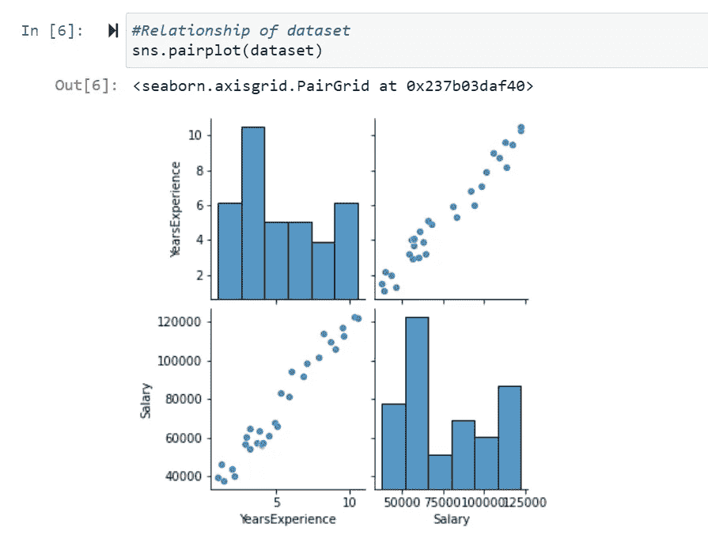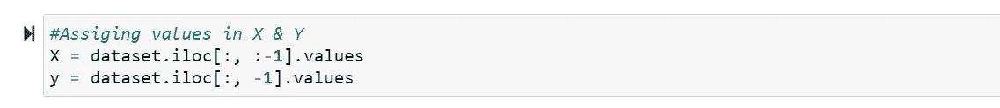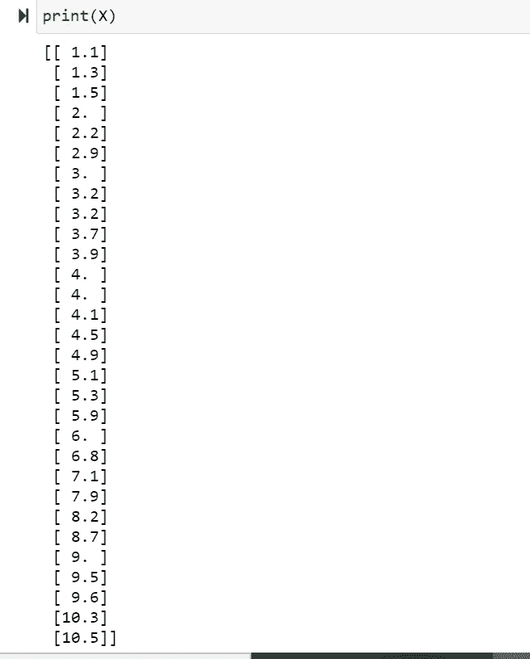

数据集必须分成训练集和测试集分析。这可以通过 **Scikit-learn** 库的 **Model_selection** 模块中的函数 **train_test_split 函数**来完成。

train_test_split 的语法在 **Jupyter 笔记本**中给出，如下图所示。

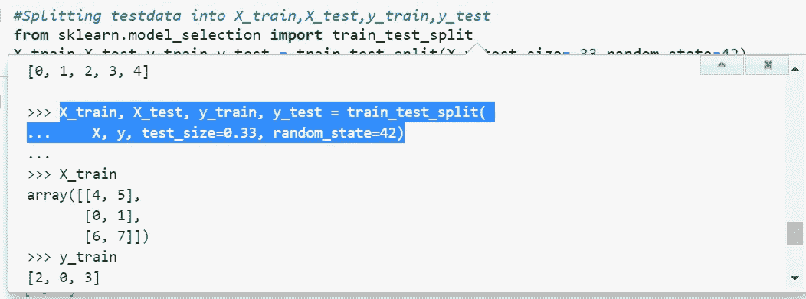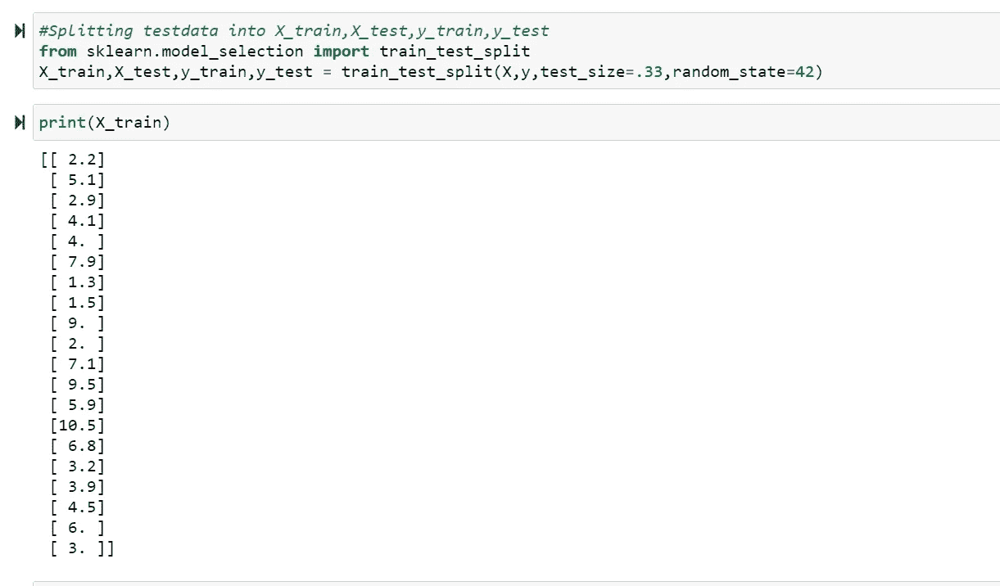

这里数据集有 30 个观察值，test_size 取为总观察值的 33%。这表明测试集应该有 33% * 30 =9.9 ~10 个观察值，而训练集应该有 20 个观察值。Random_state 被赋予某个值，以便数据集被随机分割。

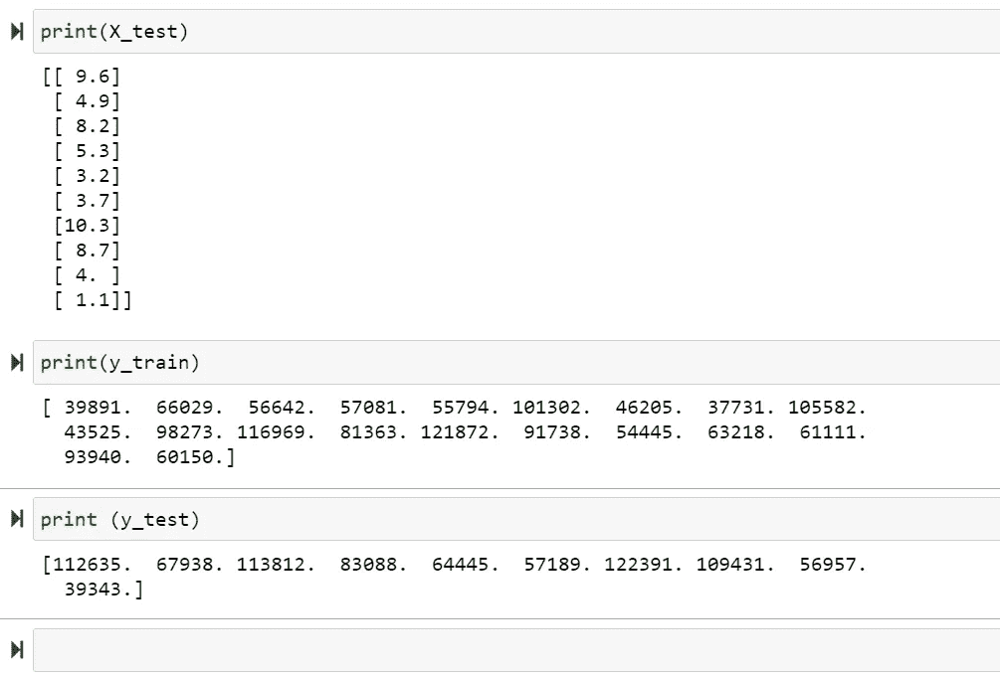

为了执行线性回归，从 **Scikit-learn** 库的模块 **linear_model** 中导入 **LinearRegression** 类。构建的简单回归模型将是 LinearRegression 类的一个实例。

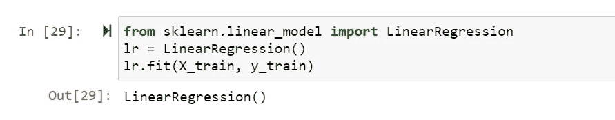

不需要将 l **r.fit(X_train，y_train)** 赋给变量，因为拟合是在实例本身上完成的。此外，这里我们将只拟合训练集，因为我们将使用测试集来验证模型。

我们的测试集有 10 个观察值，对于每个观察值，我们必须预测工资。因此，预测方法的输入将是测试集的经验年份，我们必须将预测的工资与其实际工资进行比较。

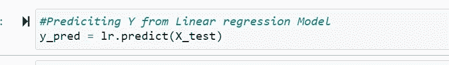

训练数据用 X_train 和 y_train 可视化，红色标记表示数据点，蓝色线表示回归线或最佳拟合线。

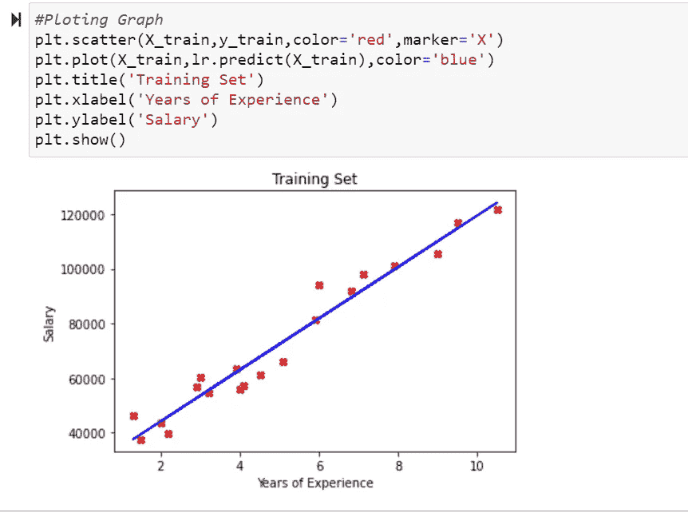

测试集用黑色标记可视化，这里我们可以数据点靠近回归线。回归模型是用训练集数据训练的，并且必须用测试集来验证模型。

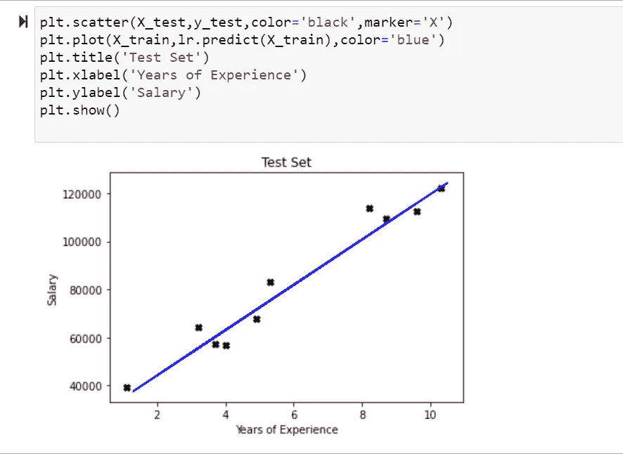

为了找到线性回归方程，需要计算**系数**和**截距**，这可以通过下面的方程来完成。

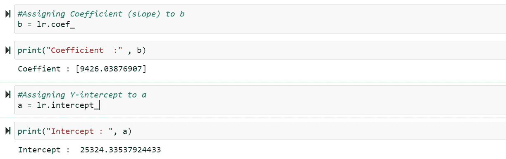

对于该模型，线性回归方程为

**预计薪资=9426.03876907×(工作经验年限)+24633**

对于 11 年的工作经验，预测工资可计算如下:

9426.03876907×(11)+25324.33537924433 = 129010.76183907

y(11)可以用下面的模型来预测。

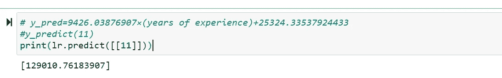

y(11)

**均方误差(MSE)** 是回归评价指标之一。它被计算为预测值和实际值之间的平均平方差。MSE 的数学公式如下:

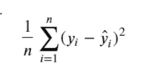

**MSE** 可以从 **Scikit-learn** 库的**度量**模块中计算。

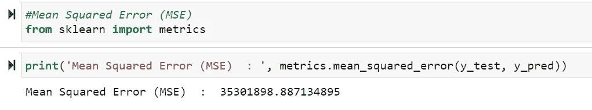

可以从 **statsmodels.api** 中调用普通最小二乘( **OLS** )估计器模块来获得回归汇总。

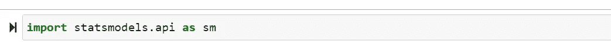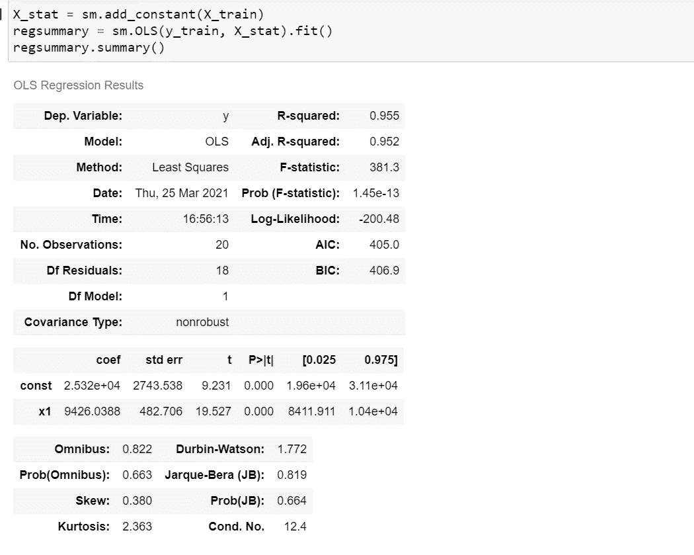

R-Square 或 Adj-R-Square 值可以如下获得。

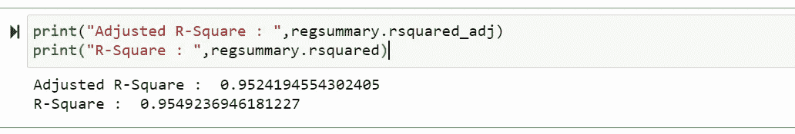

如果只对寻找 **R 平方值感兴趣，可以从 **Scikit-learn** 库的 **metrics** 模块导入** r2_score。

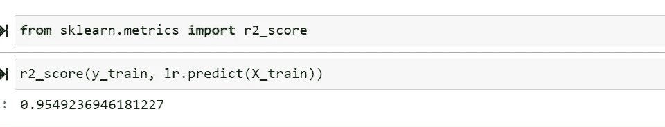

你可以从[这里](https://www.kaggle.com/sandhyakrishnan02/simple-linear-regression-salary-vs-experience)获得完整的代码。

喜欢这个内容请鼓掌！！！