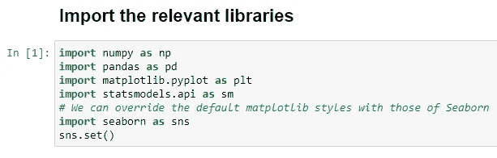
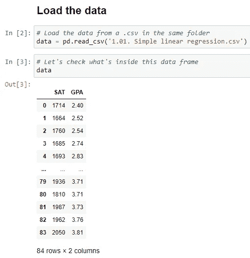
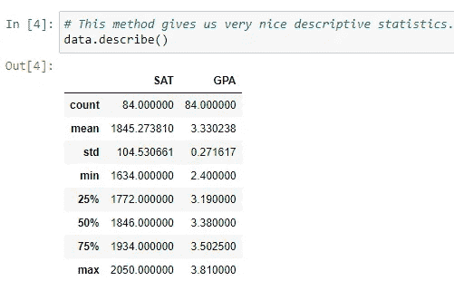
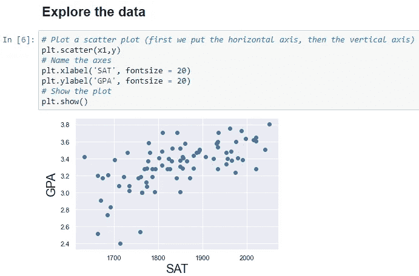
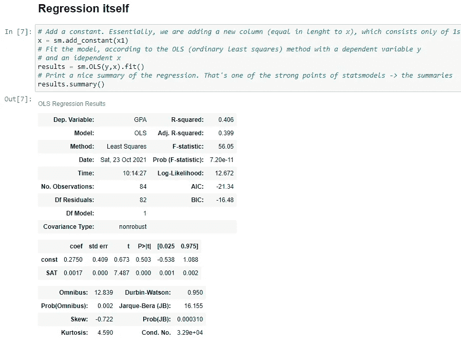
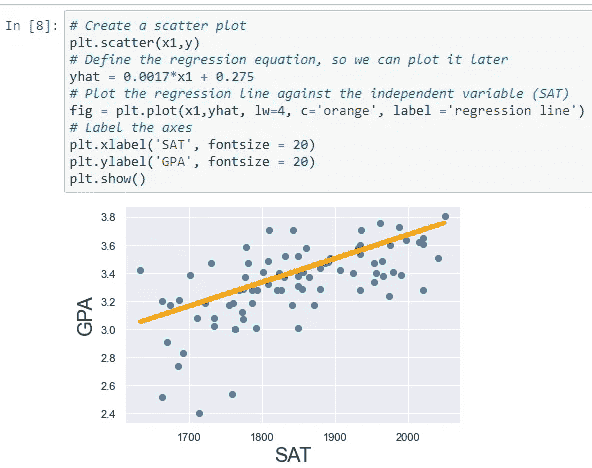

# 使用 Python 进行简单的线性回归

> 原文：<https://medium.com/geekculture/simple-linear-regression-bd4348e1ee62?source=collection_archive---------0----------------------->


Photo by [Emile Perron](https://unsplash.com/@emilep?utm_source=medium&utm_medium=referral) on [Unsplash](https://unsplash.com?utm_source=medium&utm_medium=referral)

# *先决条件*

*   熟悉 Anaconda 环境
*   熟悉 Python

要获得实践经验，我建议跟随这篇文章:

首先打开 Anaconda Navigator，点击 Jupyter 笔记本的*“发射”*按钮。它会在您的本地主机 web 浏览器上创建一个 Jupyter 笔记本。

创建笔记本后，导航到加载数据集的目录([链接到数据集](https://github.com/VIJAY-GADRE/1_Simple_Linear_Regression.git))。

最后，单击右上角的“新建”按钮并选择 Python，这将创建一个 Python-Jupyter 笔记本。

# 1.导入相关库

我们可以使用 Python 函数`import()`导入一个库。

要使用 StatsModels 编写简单的线性回归模型，我们需要 NumPy、pandas、matplotlib 和 statsmodels。

以下是对以下库的快速概述:

*   *NumPy* —主要使用多维数组进行数学运算。
*   *pandas* —用于数据操作和分析。
*   *matplotlib* —它是一个绘图库，是 NumPy 的一个组件
*   *statsmodels* —用于探索数据、估计统计模型和执行统计测试。



# 2.导入数据集

导入库后，您可以使用 pandas 方法`read_csv()`(对于 CSV 文件)或`read_excel()`(对于 excel 文件)将数据导入/加载到笔记本中。

它将导入数据，您可以使用存储导入数据的变量来验证它，在我们的例子中，它被称为`data`。



# 3.描述统计学

事先了解描述性统计是一个很好的做法，因为它有助于我们理解数据集(例如，是否存在任何异常值等)。)

我们可以使用以下命令执行描述性统计:

```
dataframe.describe()
```

如果您想查看包含不同数据类型的所有列变量的描述性统计，只需包含`dataframe.describe(include=‘all’)`



幸运的是，在我们的案例中，数据中没有任何异常值。我们可以使用以下步骤来确定异常值:

*   寻找列变量的平均值
*   寻找最小、25%、50%、75%和最大行变量。

25%、55%和 75%分别表示 25%的数据低于 1772.00，55%的数据低于 1864，75%的数据低于 1934 SAT 成绩。

*   如果变量的最大值远离平均值，那么我们可以说异常值出现在该特定列中。

SAT 和 GPA 变量没有任何异常值，因为最大观察值位于平均值附近。如果 SAT 的最大观测值是 40000.00，那么我们可以说存在异常值，我们必须移除该异常值。

# 4.创建您的第一个线性回归

## 声明因变量和自变量

要创建线性回归，您必须定义因变量(目标)和自变量(输入/特征)。

我们必须根据 SAT 分数来预测 GPA，所以我们的因变量是 GPA，自变量是 SAT。

要这样声明，我们可以使用以下命令:

```
dataframe[‘column_name’]
```


## 探索数据

我们可以使用以下公式绘制数据:

```
matplotlib.pyplot(independent variable, dependent variable) 
```

(pyplot 参数—第一个参数是要绘制在 x 轴上的数据，第二个参数是要绘制在 y 轴上的数据)。



我们可以看到，随着 SAT 成绩的提高，GPA 成绩也在提高。因此，我们可以说这两个变量之间存在线性趋势。

## 线性回归

现在让我们和我们最好的朋友 *statsmodels* 一起玩吧。

为了进行线性回归，我们应该总是加上偏差项或截距(b0)。我们可以使用以下方法来实现这一点:

```
 statsmodels.add_constant(independent_variable)
```

它会创建一个新的 bias 列，长度等于自变量，只包含 1。

让我们使用*普通最小二乘(OLS)* 模型拟合线性回归模型，以因变量和自变量作为自变量。

最后，让我们打印汇总表:



它会创建 3 个表，我们最感兴趣的是包含系数、p 值等的第二个表。

从汇总表中我们可以说截距(常数)系数为 0.275，自变量系数为 0.0017 *(表示 SAT 每增加 1 个单位，GPA 增加 0.0017 个单位)*

如果自变量/s 的 *p 值*大于 0.050，我们说该变量不显著，我们可能会丢弃该变量。在我们的例子中，SAT 的 p 值是 0.000，由于它小于 0.050，我们可以说这个变量是显著的。【另外，如果我们从逻辑上考虑，SAT 是预测 GPA 的一个重要变量】

最后， *R 的平方*，R 不过是模型的拟合优度。换句话说，我们的模型与观察结果吻合得有多好。r 的范围在 0 和 1 之间。最佳 R 值没有明确的通用范围，但它取决于具体情况。

*另一方面，调整后的 R* 是 R 平方的**修改版本，已经针对模型中预测器(输入)的数量进行了调整。当新的独立项对模型的改善程度超过偶然情况下的预期时，调整后的 R 平方增加。当预测者对模型的改进小于预期时，它会减少。**

# 5.绘制回归线

要在图上绘制回归线，只需定义线性回归方程，即 y_hat = b0 + (b1*x1)

b0 =偏差变量的系数

b1 =输入/s 变量的系数

最后，使用`matplotlib.pyplot()`绘制回归线，如下所示:



就这样，我们到达了文章的结尾。感谢阅读。

*更多内容看*[*plain English . io*](http://plainenglish.io/)