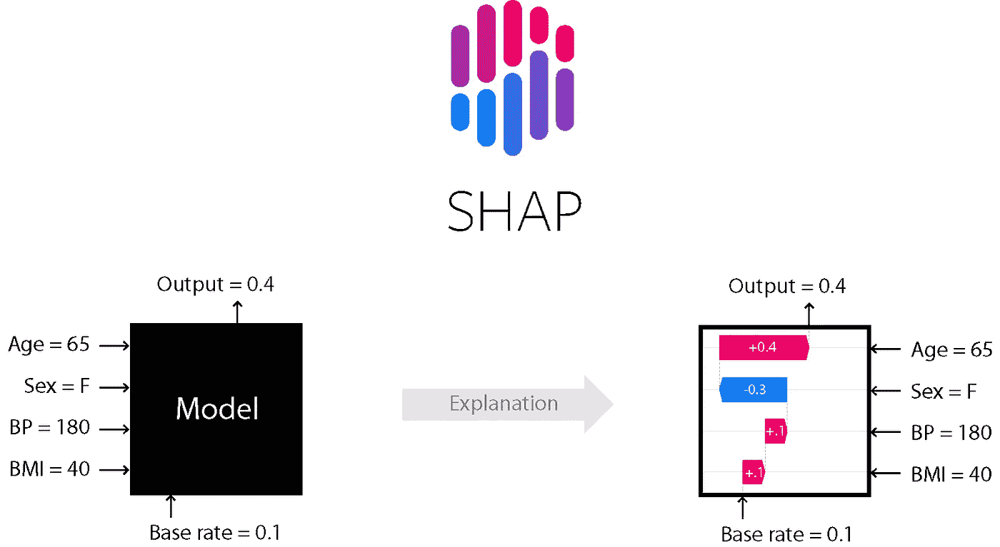

# Python 中简单的机器学习输出可解释性

> 原文：<https://medium.com/geekculture/simple-machine-learning-output-explainability-in-python-4867d42f0dde?source=collection_archive---------9----------------------->

[Image from SHAP Documentation](https://github.com/slundberg/shap)

我们已经了解了如何构建简单的分类预测模型以及优化超参数的方法。因此，这篇文章将着眼于如何解释预测模型的输出。