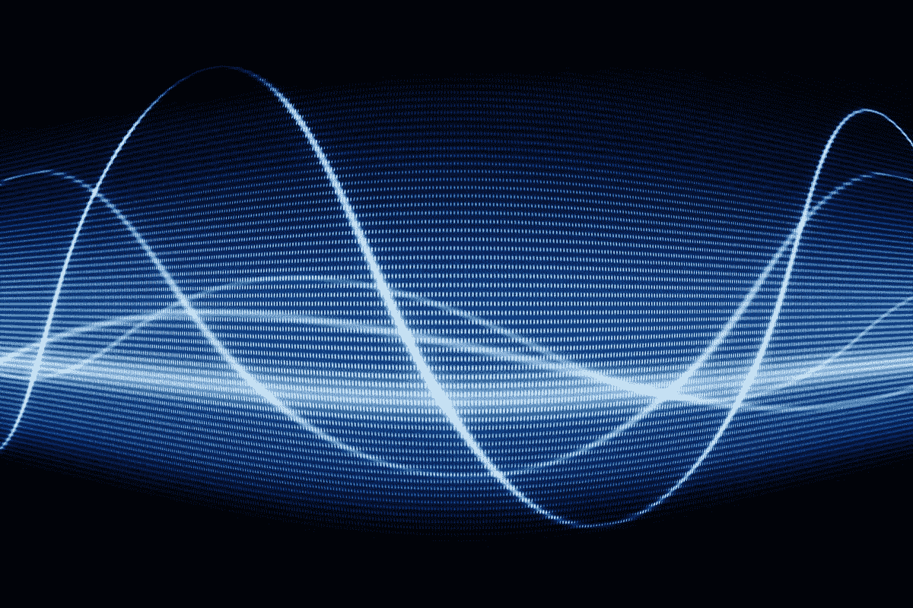

# 一些常见 AudioKit v5 控件的简单模块化类

> 原文：<https://medium.com/geekculture/simple-modular-classes-for-some-common-audiokit-v5-controls-fa5f264d376f?source=collection_archive---------47----------------------->



AudioKit 是为 iOS 和一些相关环境开发音频应用程序的一个非常优秀的包。它足够全面，有时令人不知所措。有时将它分解成模块化的类会有所帮助，然后您可以在您的视图模型或任何您可能用于 Swift 或 SwiftUI 的架构中使用这些类。我不会在这里描述安装 AudioKit，因为在其他地方已经讨论过了。

这里有一些我制作的简单的类，用于使用振荡器，回放样本和识别音高。出于您自己的目的，您可能希望进一步参数化它们。

我还使用以#@nnn 开头的字符串进行诊断，并使用#！错误消息的 nnn。您可以使用其他一些约定。

这是一个振荡器类:

```
import UIKit
import AudioKitclass Osc: NSObject {
    let engine = AudioKit.AudioEngine()
    let osc = AudioKit.PWMOscillator()

    override init() {
        super.init()
        engine.output = osc
    }

    func tune(_ freq: Float){
        osc.frequency = freq
        start() // adding this was necessary when using PWMOscillator but not with Oscillator
    }

    func start(){
        osc.start()

        do{
        try engine.start()
        } catch let err {
            print("#@25 engine did not start \(err.localizedDescription)")
        }
    }

    func stop(){
        osc.stop()
        engine.stop()
    }
}
```

示例播放器类别:

```
import AudioKitclass SamplePlayer: NSObject {
    let engine = AudioEngine()
    let player = AudioPlayer()

    var soundName = "Synth"
    var isPlaying = false
    var isRunning = false

    func setSoundName(_ s: String){
        soundName = s
    }

    func start(){
        if !isPlaying{
            let reverb = Reverb(player)
            reverb.dryWetMix = 0.25
            engine.output = reverb
            do {
                if (!isRunning)
                {
                    try engine.start()
                }
                isRunning = true
                player.start()
                let audioFile = Bundle.main.url(forResource: soundName, withExtension: "mp3")
                if let file = audioFile {
                    do {
                        try player.load(url: file)
                    } catch let err {
                        print("#!23 player problem err: \(err.localizedDescription)")
                    }
                    player.volume = 10.0
                    // add some reverb here and balance the volume vs. other apps without clipping noticeably
                    player.play()//not sure if it will loop
                    isPlaying = true
                } else {
                    print("#!18 problem with audioFile")
                }

            } catch let err {
                print("#!35 problem with engine err:\(err.localizedDescription)")
            }
        } else {
            print("#41 was already playing")
        }

    }

    func stop(){
        player.stop()
        isPlaying = false
        //engine.stop()
    }

}
```

音高检测类别:

```
import UIKit
import AudioKitstruct PitcherData {
    var pitch: Float = 0.0
    var amplitude: Float = 0.0
    var serial: Int = 0

}protocol PitcherProtocol {
    var pitcherData: PitcherData { get }

}class Pitcher: NSObject, ObservableObject {
    [@Published](http://twitter.com/Published) var pitcherData: PitcherData = PitcherData() // initialize
    var engine = AudioEngine()
    var silence: Fader // see below
    var mic: AudioEngine.InputNode

    var engineRunning = false
    var trackerRunning = false

    var tracker: PitchTap!
    var serial = 0

    func update(_ pitch: AUValue, _ amp: AUValue) {
        serial += 1
        pitcherData = PitcherData(pitch: pitch, amplitude: amp, serial: serial)

    }override init(){
        guard let input = engine.input else {
            fatalError()
        }
        mic = input
        silence = Fader(mic, gain: 0)

        super.init()
        tracker = PitchTap(mic) { [weak self] pitch, amp in
            if let self = self{
                if self.trackerRunning {
                    DispatchQueue.main.async {
                       self.update(pitch[0], amp[0])
                    }
                }
            }
        }
    }func start(){
        do {
            if !engineRunning {
                engine.output = silence
                try engine.start()
            }
            engineRunning = true
            if !trackerRunning {
                tracker.start()
                trackerRunning = true
            }
        } catch let ex {
            print("#@83 \(Date().toDateAndTimeStringWithMilliSeconds()) ex: \(ex.localizedDescription)")
        }
    }

    func stop(){
        trackerRunning = false
    }
}
```

然后在主代码中实例化它们来使用它们。

```
**let** osc = Osc()
```

我在这里使用 Combine with SwiftUI，特别是与音高检测器“Pitcher”一起使用。当我不使用 Combine 时，我也使用 delegate。