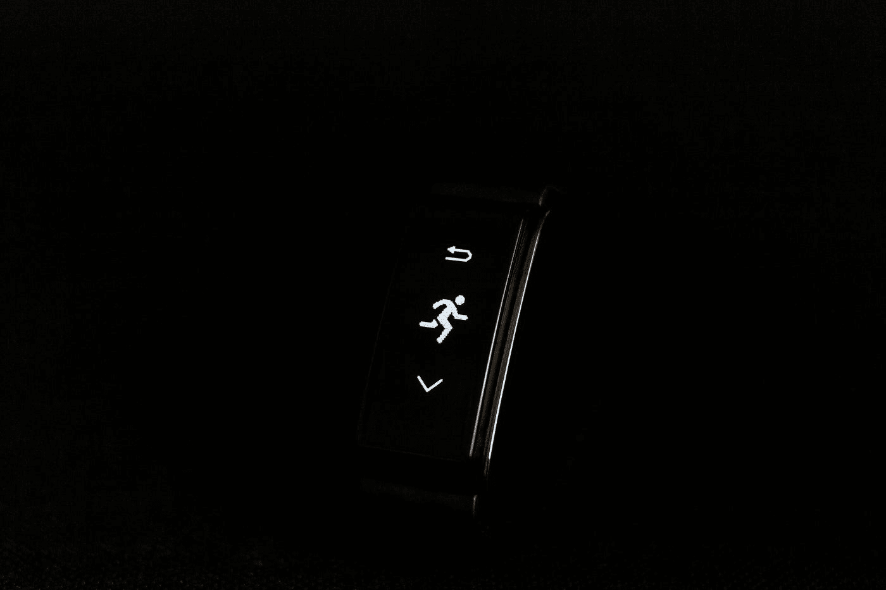
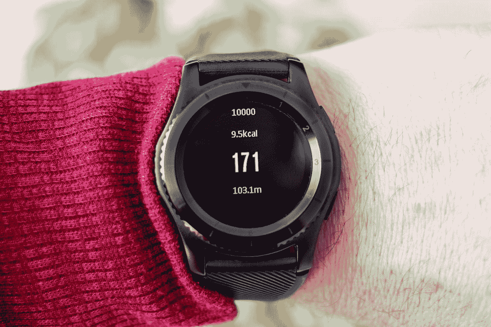
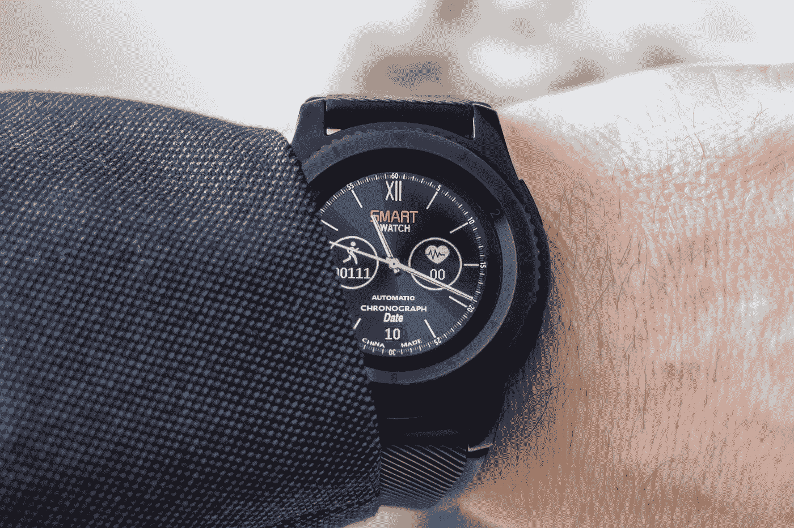

# Swift 中的简单计步器

> 原文：<https://medium.com/geekculture/simple-pedometer-in-swift-482099cf7bbd?source=collection_archive---------8----------------------->

学习在 Swift 中实现一个简单的计步器来计算步数。



Photo by [Artur Łuczka](https://unsplash.com/@artur_luczka?utm_source=medium&utm_medium=referral) on [Unsplash](https://unsplash.com?utm_source=medium&utm_medium=referral)

H 我大家。这是 yua，我是 WeWALK 的软件工程师。大约有一年多的时间，因为疫情，我们被隔离在家里。但是为了保持身材，我们不应该放弃散步和锻炼。在这个故事中，我们将在 Swift 中实现一个简单的计步器来记录我们的步数。您可以在任何项目中应用相同的方法。所以我们开始练习吧。

# 获得许可


Photo by [Danielle Cerullo](https://unsplash.com/@dncerullo?utm_source=medium&utm_medium=referral) on [Unsplash](https://unsplash.com?utm_source=medium&utm_medium=referral)

首先，我们必须获得用户的许可，以便跟踪他们的动作使用情况。为了实现这一点，我们应该将下面几行添加到我们的 **info.plist** 中。

```
<key>NSMotionUsageDescription</key><string>We are using motion usage in order to track your step count.</string>
```


太好了！就是这样。我们希望得到用户的许可。现在，我们可以转到代码部分了。

# 创建计步器



Photo by [Artur Łuczka](https://unsplash.com/@artur_luczka?utm_source=medium&utm_medium=referral) on [Unsplash](https://unsplash.com?utm_source=medium&utm_medium=referral)

这里我们需要做的第一件事是导入`[CoreMotio](https://developer.apple.com/documentation/coremotion)n`并创建`[CMMotionActivityManager](https://developer.apple.com/documentation/coremotion/cmmotionactivitymanager)`和`[CMPedometer](https://developer.apple.com/documentation/coremotion/cmpedometer)`。为了能够做到这一点，我们可以添加下面几行。

```
**import** CoreMotion/// Provides to create an instance of the **CMMotionActivityManager**.
**private** **let** activityManager = CMMotionActivityManager()/// Provides to create an instance of the **CMPedometer**.
**private** **let** pedometer = CMPedometer()
```

在这里，我们将使用`CMMotionActivityManager()`来监控活动类型，如步行和跑步，同时我们将使用`CMPedometer()`来获取当前的步数。下面就分别实现这些吧。

# 跟踪活动类型


Photo by [Arek Adeoye](https://unsplash.com/@areksan?utm_source=medium&utm_medium=referral) on [Unsplash](https://unsplash.com?utm_source=medium&utm_medium=referral)

我们可以用[**startActivityUpdates(to:with handler:)**](https://developer.apple.com/documentation/coremotion/cmmotionactivitymanager/1615945-startactivityupdates)来监控活动类型。这个方法为我们提供了获取当前运动数据的更新。通过下面的源代码，我们将获得当前的活动类型。

```
activityManager.startActivityUpdates(to: OperationQueue.main) { (activity: CMMotionActivity?) **in**
    **guard** **let** activity = activity **else** { **return** } DispatchQueue.main.async {
        **if** activity.stationary {
            print("Stationary")
        } **else** **if** activity.walking {
            print("Walking")
        } **else** **if** activity.running {
            print("Running")
        } **else** **if** activity.automotive {
            print("Automotive")
        }
    }
}
```

# 获取步数


Photo by [Jacek Dylag](https://unsplash.com/@dylu?utm_source=medium&utm_medium=referral) on [Unsplash](https://unsplash.com?utm_source=medium&utm_medium=referral)

最后但同样重要的是，我们将使用[**start updates(from:with handler:)**](https://developer.apple.com/documentation/coremotion/cmpedometer/1613950-startupdates)来获取更新后的步数。我们可以使用下面这段代码。

```
**if** CMPedometer.isStepCountingAvailable() {
    pedometer.startUpdates(from: Date()) { pedometerData, error **in**
        **guard** **let** pedometerData = pedometerData, error == **nil** **else** { **return** }

        DispatchQueue.main.async {
            print(pedometerData.numberOfSteps.intValue)
        }
    }
}
```

在这里，**cmpedometer . isstepcountingavailable()**将使用我们在上面的 **info.plist** 中写的描述，通过显示警告来试图获得用户的许可。通过**start updates(from:with handler:)**，它将从现在开始计算步数。如果我们不会遇到任何错误，并且数据不是**零**，我们将能够获得步数。

# 结论



Photo by [Artur Łuczka](https://unsplash.com/@artur_luczka?utm_source=medium&utm_medium=referral) on [Unsplash](https://unsplash.com?utm_source=medium&utm_medium=referral)

总之；我们学习了使用 CoreMotion 及其功能在 Swift 中逐步实现一个简单的计步器。

**更新:**我有个好消息要告诉你！你可能知道,“我们行走”曾被《时代》杂志评为年度最佳发明之一。现在，WeWALK 已经被亚马逊评选为 5 大创业公司之一。获胜者将在 7 月 7 日之前通过公众投票选出，并将由亚马逊宣布为“年度创业公司”凭借€100，000 奖金，我们将把它用于向世界各地更多的视障人士提供智能手杖。请投票支持我们的使命。

下面是链接:[www.wewalk.io/amazon](http://www.wewalk.io/amazon)

谢谢大家的支持！

祝大家有个健康的一天！

**# IOs # swift # coremotion #计步器**