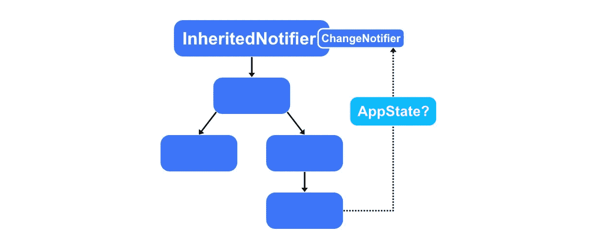

# 简单高效的状态管理，无需外部库

> 原文：<https://medium.com/geekculture/simple-performant-state-management-without-an-external-library-786f5d2b34a8?source=collection_archive---------4----------------------->

## 使用 Flutter 的继承通知程序



# 介绍

颤振中的状态管理很好玩！好吧，如果你有任何在 Flutter 中实现状态管理的经验，或者如果你目前正试图学习这个主题，你可能不同意这种说法。我不怪你！虽然我确实喜欢挑战，但这个挑战有时看起来相当令人畏惧和乏味。

幸运的是，有几个很棒的包可以让管理大型应用程序的状态变得更加容易。(向[供应商](https://pub.dev/packages/provider) / [riverpod](https://pub.dev/packages/riverpod) 和 [bloc](https://pub.dev/packages/bloc) 喊出！)它们还提供了支持可测试性的强大功能。如果你还不熟悉的话，`provider` is 基于`InheritedWidget` s，这是 Flutter 处理状态的内置方法，它允许我们在*窗口小部件树*中找到更高的对象，而不是一个窗口小部件一个窗口小部件地向下传递。`riverpod`是对需要重写的`provider`的改进，因此是一个新的包，`bloc`是一种状态管理方法，有助于实现 *BLoC* 设计模式，代表*业务逻辑组件*。是围绕`Stream` s 打造的。

同样，所有这些包都很棒，它们肯定对大型项目非常有用，尤其是它们提供的测试功能。`bloc`特别是，根据我的经验，集成了许多其他可以使开发过程更容易的包，例如， [hydrated_bloc](https://pub.dev/packages/hydrated_bloc) ，它处理对磁盘的持久状态更改。然而，对于固态管理解决方案来说，这些功能强大的软件包实际上并不是必需的。特别是，它们对于较小的项目来说是多余的，而且恰好 Flutter 已经具备了创建一个强大的状态管理解决方案所需要的一切。

我们当然会使用`InheritedWidget` s 来管理我们应用的状态。**等等！不要关闭标签页！如果您找到了这篇文章，我相信您已经对这种方法有了一些非常强烈的看法。*“太复杂了。”“可维护性差。”“样板文件太多了！”*我明白你的意思，但是如果我告诉你，用`InheritedWidget`的子类，我们要用 *40 行或更少的代码*编写一个 ***高性能的、适应性强的&可重用的*** 状态管理解决方案呢？回来了？很好！希望你在这个过程中也能学到一些很酷的东西。我们开始吧！**

# InheritedWidget

首先，让我们谈一点关于`InheritedWidget`的事情。这些只是专门的`Widget`，它们被设计用来保存数据，并使其容易被*小部件树*中`InheritedWidget`下面的任何`Widget`访问。这避免了我们必须通过 20 个`Widget`构造函数来传递数据，这样树中的第 21 个`Widget`才能访问它。相反，使用`InheritedWidget` s，我们可以通过遍历小部件树直接从第 21 个`Widget`开始查找数据。然而，`InheritedWidget` s 是*不可变的*，这意味着变量必须是 *final* ，所以考虑如何更新树中更下面的小部件的数据可能会很棘手。这意味着我们实际上必须将数据存储在`InheritedWidget`之上的`Widget`中，并且如果需要更改的话，以允许*可变性*的方式提供对它的访问。

```
**NOTE:** The conventional method used to provide access to InheritedWidget data throughout the tree is via a *static of(BuildContext)* method, as seen by Theme.of(context).
```

我不打算进入实现一个`InheritedWidget`的复杂过程，在这个过程中我们可以从它的依赖项中更新数据。这篇文章是关于一个更好(也更容易！)方法。但是我应该指出，当数据不会从下面改变时，`InheritedWidget`非常适合向后代提供数据。例如，向复杂的`Dialog`提供数据，或者定义一个主题供后代使用。我们都在 Flutter 中与`Theme`合作过，它实际上是一个做后者的`InheritedWidget`。如果您感兴趣，这里的是一个简单的`InheritedWidget`示例，它近似于`Theme`的行为。它与本文的其余部分没有关系。

如果我们希望为后代提供更新主题的能力，我们有两个同样难看的选项:

1.  我们向`InheritedWidget`传递一个回调，允许它调用`setState`，同时编写一堆额外的样板文件来处理数据的设置/获取。更糟糕的副作用是，我们必须从静态`of`函数返回`InheritedWidget`，而不是实际数据。
2.  我们将`State`作为数据传递给`InheritedWidget`，从`of`函数返回，并在整个应用程序中直接操作它。啊！

这两种方法都意味着访问数据的代码更难看、更冗长。还好有一个好得多的解决方案！

# 继承通知程序

`InheritedNotifier`是`InheritedWidget`的一个子类，专门用于存储一个`Listenable`对象，并在数据改变时更新其依赖对象。它的效率也很高。如果在两个帧之间发生多次更改，从属对象仍然只重建一次。至于我们的`Listenable`，我们可以用一个`ValueNotifier`来表示单个值，用一个`ChangeNotifier`来表示更复杂的数据类，甚至用一个`Animation`来同步多个对象之间的共享动画。后者的一个例子可以在 Flutter 文档[这里](https://api.flutter.dev/flutter/widgets/InheritedNotifier-class.html)找到。我们将扩展`ChangeNotifier`来创建我们的应用程序状态数据类。

```
**NOTE:** ValueNotifier is a subclass of ChangeNotifier, so our solution will accommodate both.
```

## 表演

如果你在迄今为止的状态管理研究中听说过`ChangeNotifier`，你可能已经遇到过与其他方法相比的性能讨论。`Listenable`的工作方式是存储一个`Listener`列表，并在发生变化时逐个通知它们。通知`Listener` s 为 O(N)。在我们的方法中，唯一被通知的`Listener`是`InheritedNotifier`，因此，我们的通知实际上是 O(1)。从一个后代访问一个`InheritedNotifier`也是 O(1 ),所以你可以看到，我们的方法当然是高性能的。下面我们来看看如何实现。

# 履行

首先，让我们制作我们的`MyInheritedNotifier`类。它非常简单，只需将其构造函数参数传递给它的超类`InheritedWidget`，并定义它将接受的`Listenable`类型。

```
class MyInheritedNotifier<T extends ChangeNotifier>
    extends InheritedNotifier<T> {
  const MyInheritedNotifier(
      {Key? key, required T notifier, required Widget child})
      : super(key: key, notifier: notifier, child: child);
}
```

我们使用*泛型*来使我们的解决方案具有适应性&可重用性。如果您不熟悉泛型，它们允许我们编写类和函数来处理一系列数据类型。在这里，我们定义`MyInheritedNotifier`与`ChangeNotifier`一起工作，以及它的任何子类与`<T extends ChangeNotifier>`一起工作。每当我们在下面使用`T`时，我们声明它将是*类型* `T`所代表的任何东西。当在我们的代码中使用它时，我们可以指定期望的类型，例如`MyInheritedNotifier<AppState>`，但是通过将`notifier`定义为*类型* `T`，它实际上是在调用构造函数时隐含的。因此，当使用我们的解决方案时，我们将自动成为类型安全的。

现在，让我们用一个`StatefulWidget`来包装我们的`MyInheritedNotifier`。这是我们的数据将被存储的地方。它必须是有状态的，因为`Listenable` s 应该被释放。

```
class MyProvider<T extends ChangeNotifier> extends StatefulWidget {
  const MyProvider(
      {Key? key, required this.create, required this.child})
      : super(key: key); final Widget child;
  final T Function() create; @override
  State<MyProvider<T>> createState() => _MyProviderState<T>();
}class _MyProviderState<T extends ChangeNotifier> extends
    State<MyProvider<T>> { late final T _notifier = widget.create(); @override
  void dispose() {
    _notifier.dispose();
    super.dispose();
  } @override
  Widget build(BuildContext context) =>
    _MyInheritedNotifier<T>(
       notifier: _notifier, child: widget.child);
}
```

这里，我们简单地提供了一个小部件来存储我们的应用程序状态数据对象。我们使用 create 函数来实例化对象，因为这个类负责处理对象。因此，它也应该是创建它的人。关键字`late`允许我们在实例化时访问`widget`。行`late final T _notifier = widget.create()`相当于

```
late final T _notifier;_MyStateProvider() {
  _notifier = widget.create();
}
```

这就是我们的`InheritedNotifier`设置！没那么糟吧。在大约 30 行代码中，我们创建了一个高性能的&可重用状态管理解决方案！要使用它，我们只需定义一个扩展`ChangeNotifier`的类，并定义我们的应用程序状态。

作为一个例子，我将为典型的颤动计数器应用程序定义一个`AppState`类。我不仅会存储计数，还会存储随着计数而变化的背景和文本颜色。

```
class AppState extends ChangeNotifier { int _count = 0;
  int get count => _count; void incrementCounter() {
    _count++;
    _backgroundColor = _colors[count % 5];
    notifyListeners();
  } Color _backgroundColor = Colors.blue;
  Color get backgroundColor => _backgroundColor; Color get textColor => _backgroundColor == Colors.yellow
      ? Colors.black87
      : Colors.white; static AppState of(BuildContext context) {
    final result = context.dependOnInheritedWidgetOfExactType<MyInheritedNotifier<AppState>>()!;
    assert(result != null, 'No MyInheritedWidget<AppState> in context');
    result.notifier!;}
```

如前所述，惯例是提供一个静态的`of`函数来访问`InheritedWidget`。这里，我们在应用程序状态数据类中这样做。它通过`BuildContext`的`dependOnInheritedWidgetOfExactType`方法找到正确的`InheritedNotifier`。我们检查在我们的小部件树的更高层确实有一个`MyInheritedNotifier`。如果没有，我们很可能忘记创建它，或者没有将它传递给当前的`context`。然后，我们从`MyInheritedNotifier`返回`AppState`通知符。

```
**NOTE:** MyProvider, _MyProviderState, and MyInheritedNotifier can be defined in the same file (library) and never touched again once we are done.
```

然后，我们可以在应用程序中使用它来访问其中的变量和方法。

```
@override
Widget build(BuildContext context) {
  final appState = AppState.of(context);
  return Scaffold(
    AppBar(
      title: Text(title,
          style: TextStyle(color: appState.textColor)),
      backgroundColor: appState.backgroundColor,
    ),
    body: Center(
      Column(
        mainAxisAlignment: MainAxisAlignment.center,
        children: <Widget>[
          const Text('You have pushed the button this many times:'),
          Text(appState.count.toString(),
              style: Theme.of(context).textTheme.headline4,
          ),
        ],
      ),
    ),
    floatingActionButton: FloatingActionButton(
      onPressed: appState.incrementCounter,
      tooltip: 'Increment',
      backgroundColor: appState.backgroundColor,
      child: Icon(Icons.add, color: appState.textColor,
    ),
  );
}
```

现在你知道了！如您所见，一切都如预期的那样运行。我们可以扩展`AppState`类来处理任意数量的状态，例如身份验证，或者我们可以嵌套`Provider`来提供有作用域的状态管理，将各种状态划分到它们自己的类中(例如`Counter`、`Auth`、`Layout`等)，每个状态只包含一个新的数据类。

我不知道你怎么想，但我不想为每个数据类编写一个`of`方法。随着项目的增长，我也不喜欢通过一遍又一遍地调用`of`来访问我的数据。是时候做一个专业的动作了…

# 扩展方法

Dart 2.7 中引入的*扩展方法*允许我们为现有类提供新的功能，这再简单不过了。与其将`BuildContext`传递给静态的`of`方法，不如让我们添加一个`extension`*`*on*`*`BuildContext`来为我们处理这个问题。我们可以使用*泛型*使它对于我们想要访问的任何数据类型都是可重用的。在与我们的类相同的库中定义一个`extension`。**

```
**extension ReadContext on BuildContext {
  T watch<T extends ChangeNotifier>() => dependOnInheritedWidgetOfExactType<MyInheritedNotifier<T>>()!.notifier!;
}**
```

**现在，我们可以不叫`final appState = AppState.of(context);`而叫`context.watch<AppState>();`。这也允许我们通过将`MyInheritedNotifier`重命名为`_MyInheritedNotifier`来使其私有，防止它在库之外被使用。漂亮！但是，如果我们想在应用程序的某个地方访问`AppState`一次，而不是每次更新都重新构建，那该怎么办呢？也许在一个`onPressed`函数中。我们可以通过向我们的扩展添加以下功能:**

```
**T read<T extends ChangeNotifier>() => findAncestorWidgetOfExactType<MyInheritedNotifier<T>>()!.notifier!;**
```

**这里，不是*依赖于*依赖于`MyInheritedNotifier`意味着我们想要在数据改变时重建，我们只是简单地查找一次。完美！三个类，一个扩展，仅仅 40 行之后，我们就完成了！**

# **结论**

**干得好！我们已经编写了一个非常优雅的状态管理解决方案，它简洁、适应性强、高性能。它非常适合单一的应用程序状态类、较小范围的状态类，以及(我个人最喜欢的)处理用户认证。在您的下一个项目中尝试一下吧！**

**虽然将这一小段代码复制/粘贴到每个项目中非常简单，但是为什么不创建一个包来使用呢？更好的是，克隆[简单状态管理](https://github.com/theLee3/simple_state_management.git)回购。它包括一些不错的附加功能，比如数据对象的惰性加载&有用的文档。其他特性也计划在未来的更新中实现，比如一个`MultiProvider`类来避免嵌套共享相同作用域的`Provider`的需要。如果你发现这个项目有益，不要忘了启动它！😃**

**一如既往的感谢阅读！掌声是受欢迎的，提问和评论也是。请关注我的专注于 Flutter 的文章，包括我的 *Flutter 案例研究*系列，其中我们研究了其他 Flutter 开发者遇到的问题。*案例分析*欢迎提出建议！**