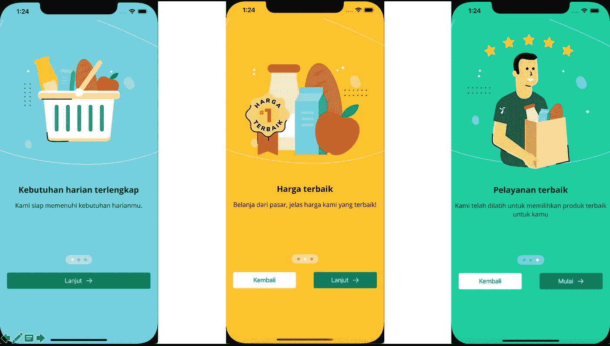

# 简单流畅的 SwiftUI Onboarding 视图

> 原文：<https://medium.com/geekculture/simple-slick-swiftui-onboarding-view-137369410314?source=collection_archive---------13----------------------->

Simple Onboarding View

显然，即使 SwiftUI 2.0 拥有足够强大的生产代码，但有时它们仍然缺乏像 PagingView 这样简单组件的文档。如你所知，SwiftUI 2.0 中现在有一个本地的`UIPageViewController`等价物，它将`.tabViewStyle`修饰符添加到`TabView`并传递`PageTabViewStyle`。