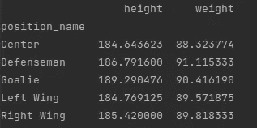
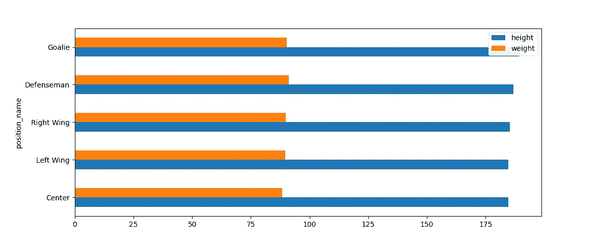
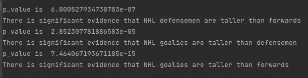
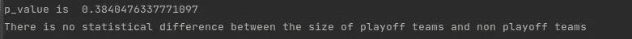
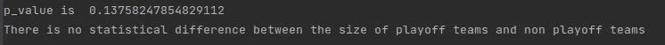

# 比较类别的简单统计测试

> 原文：<https://medium.com/geekculture/simple-statistical-tests-to-compare-categories-929498014630?source=collection_archive---------23----------------------->

测试 NHL 球员的身高和体重在不同位置以及季后赛和非季后赛球队中的重要性。

在我之前的文章( [here](/geekculture/data-exploration-in-python-height-and-weight-of-nhl-players-using-3-methods-bf33c52692ce) )中，我演示了一些关于 NHL 球员身高和体重的简单数据探索分析。这让我思考:曲棍球中不同位置的身高和体重有很大差异吗？此外，在 2021 年 NHL 季后赛中，关于两支决赛球队有多大，特别是在防守队员的位置上，已经有了很多噪音。所以，我想知道季后赛球队比非季后赛球队更大更高的说法是否属实。

下面使用的代码可以在[这里](https://gitlab.com/alexistats/nhl_players_exploration/-/blob/main/nhl_player_bio_test.py)找到。

**测试不同位置的身高和体重差异**

让我们把无聊的部分去掉吧。我们需要加载数据，并将身高和体重从英尺/英寸转换为厘米，从磅转换为千克。

```
import pandas as pd

## We have to reload the data
data = pd.read_csv("nhl_bio_2020.csv")
data.head()
data = data[['first_name', 'last_name', 'height','weight', 'position_name', 'team_name']]

## Need to perform data manipulation to set weight in kg and heigh in cm
data['weight'] = round(data['weight'] * 0.453592,1)
data['height'] = data['height'].str[0:1].astype(int)*30.48 + data['height'].str[2:5].replace('"','', regex=True).astype(int)*2.54
```

接下来，我想了解并想象每个位置的平均身高和体重，以了解我正在做的事情。

为此，我使用。groupby()方法按职位名称对我的数据进行分组，并使用。mean()方法按位置计算我的度量值的平均值。

凭直觉，我认为守门员应该是最高最瘦的一组，因为他们需要在快速运动的同时覆盖很多球网。在重量级，我希望防守队员更强壮，因为他们通常比前锋更注重身体对抗。

```
by_position = data.groupby('position_name').mean()
print(by_position)
```



Avg height (cm) and weight (kg) of NHL players by position

不出所料，守门员是最高的球员，但不是我预期的那样。他们比普通防守队员平均高不到 3 厘米，平均只比中锋高 5 厘米，这是数据显示的最小位置。

就重量而言，考虑到高度的微小差异，我预计守门员会更苗条。尽管如此，从一个位置(类别)到另一个位置(类别)的偏差非常小。

是时候建立图表了！

```
by_position = by_position.sort_values('height')
by_position.plot.barh(y=['height', 'weight'])
```



The chart shows just how close the averages are

上面的代码利用了。sort_values()方法按照高度从小到大对值进行排序。水平条形图非常适合于显示微小的差异。在这种情况下，虽然没有太多的差异！

接下来，我们从 scipy 导入统计包，这将有助于计算 Welch 的 t 检验。t 检验是一种假设检验工具，有助于比较两个样本均值之间的差异。我们首先要验证正态假设，然后才能进行测试。在这种情况下，我将为每个身高和体重变量测试 3 个假设:

*   前锋的身高、体重和防守队员的身高、体重有什么不同吗？
*   前锋的身高、体重和守门员的身高、体重有什么不同吗？
*   防守队员的身高、体重和守门员的身高、体重有什么不同吗？

```
from scipy import stats
data_defensemen = data[data['position_name'] == 'Defenseman']
data_goalies = data[data['position_name'] == 'Goalie']
forwards = ['Right Wing', 'Center', 'Left Wing']
data_forwards = data[data['position_name'].isin(forwards)]## Test 1
ttest, pval = ttest_ind(data_defensemen['height'], data_forwards['height'])
print('p_value is ', pval)

if pval < 0.05:
    print("There is significant evidence that NHL defensemen are taller than forwards")
else:
    print("There is no statistical difference between the size of NHL defensemen and forwards")## Test 2
ttest, pval = ttest_ind(data_defensemen['height'], data_goalies['height'])
print('p_value is ', pval)

if pval < 0.05:
    print("There is significant evidence that NHL goalies are taller than defensemen")
else:
    print("There is no statistical difference between the size of NHL goalies and defensemen")## Test 3    
ttest, pval = ttest_ind(data_forwards['height'], data_goalies['height'])
print('p_value is ', pval)

if pval < 0.05:
    print("There is significant evidence that NHL goalies are taller than forwards")
else:
    print("There is no statistical difference between the size of NHL goalies and forwards")
```

我首先过滤数据集 3 次，以获得前锋、防守队员和守门员的数据。我把打右翼、中锋、左翼位置的球员组合到“前锋”位置。执行这些测试的一个不太冗长的方法是对排列进行编码并遍历它们。我只有三个，所以简单地重复了一遍。

韦尔奇 t 检验的结果令人惊讶:



每次测试都意义重大！我认为这可以用玩家之间的小差异来解释。所以，这个测试表明，两个位置之间的高度确实存在差异。

我对重量做了同样的测试，并且:


似乎唯一有统计学意义的结果是 NHL 的防守队员比前锋更重。

**测试季后赛和非季后赛球队的身高和体重差异**

现在，这很有趣，但老派的球迷和分析师总是会说规模真的很重要，有助于球队获胜。这是真的吗？我假设如果规模是成为一支好球队的一个因素，那么季后赛球队会更高更大，对吗？(31 支 NHL 球队中有 16 支获得了季后赛资格)。

```
playoff_teams = ["New York Islanders", " Montréal Canadiens", "Toronto Maple Leafs", "Winnipeg Jets", "Edmonton Oilers", "Vegas Golden Knights", "Colorado Avalanche",
                "Washington Capitals", "Boston Bruins", "Florida Panthers", "Pittsburgh Penguins", "Carolina Hurricanes", "Nashville Predators", "Tampa Bay Lightning",
                "St. Louis Blues", "Minnesota Wild"]

data_playoffs = data[data['team_name'].isin(playoff_teams)]
data_not_playoff = data[~data['team_name'].isin(playoff_teams)]

ttest, pval = ttest_ind(data_playoffs['height'], data_not_playoff['height'], equal_var = False)
print('p_value is ', pval)

if pval < 0.05:
    print("There is significant evidence that playoff teams are taller than non playoff teams")
else:
    print("There is no statistical difference between the size of playoff teams and non playoff teams") ttest, pval = ttest_ind(data_playoffs['weight'], data_not_playoff['weight'], equal_var = False)
print('p_value is ', pval)

if pval < 0.05:
    print("There is significant evidence that playoff teams are heavier than non playoff teams")
else:
    print("There is no statistical difference between the size of playoff teams and non playoff teams")
```

首先，我输入了去年 NHL 季后赛球队的名单，建立了两个数据集:data _ 季后赛和 data _ not _ 季后赛。他们的名字很容易理解。

然后，我对这些样本进行了韦尔奇 t 检验。结果呢？不重要。



这表明，无论是否参加 NHL 季后赛，球队都不会更高或更重。