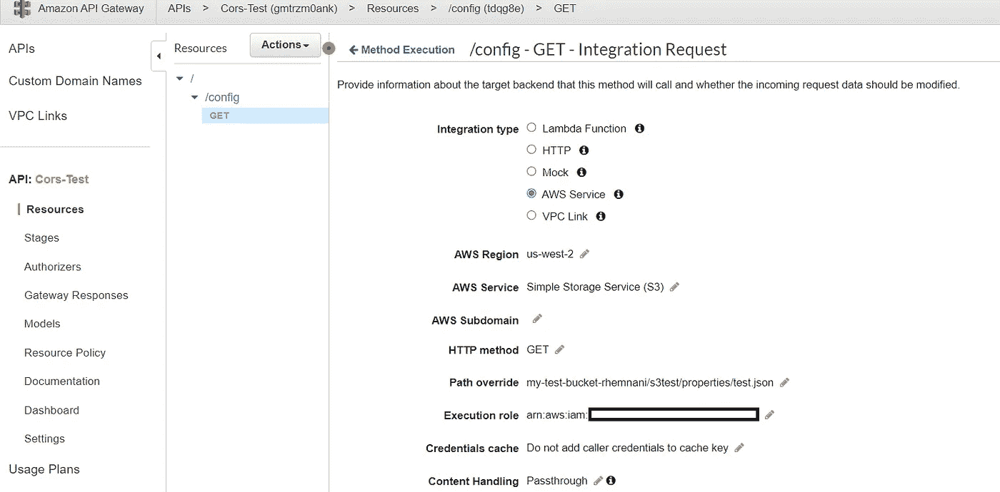
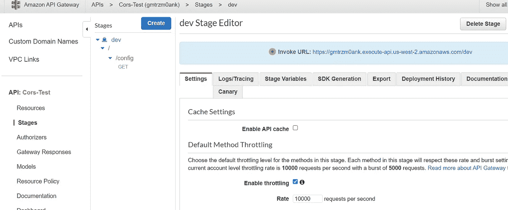
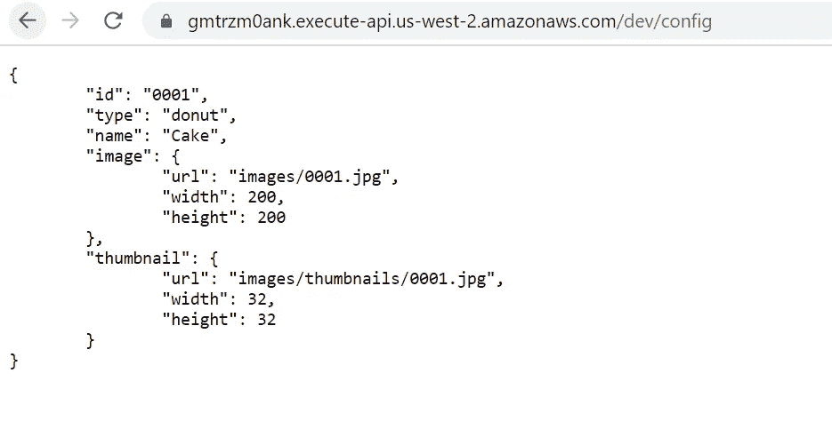
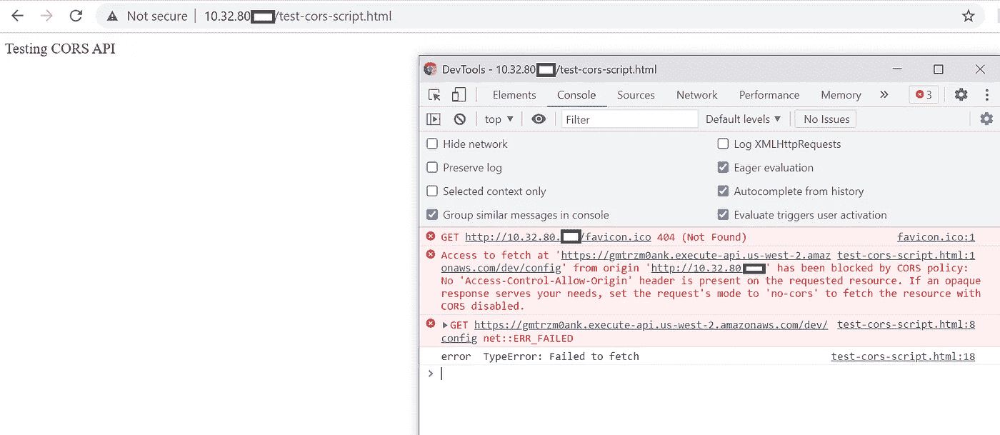
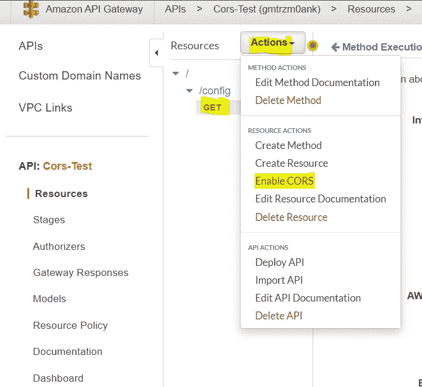
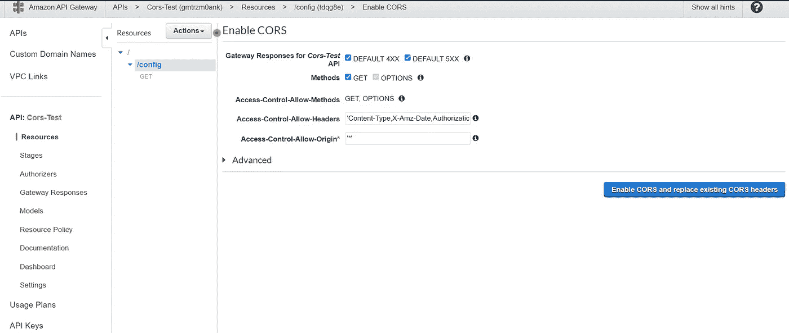
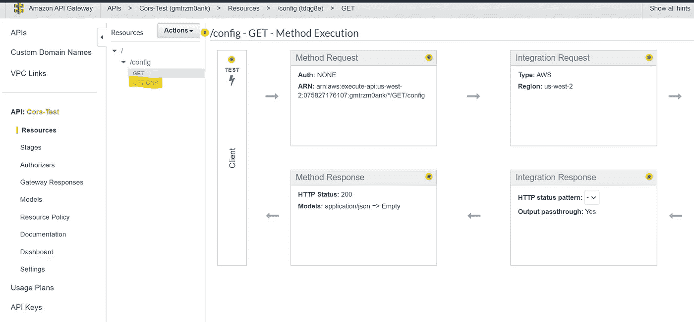
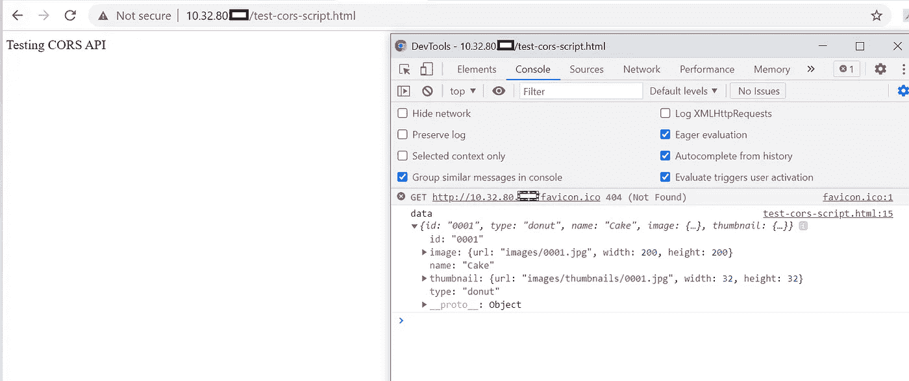
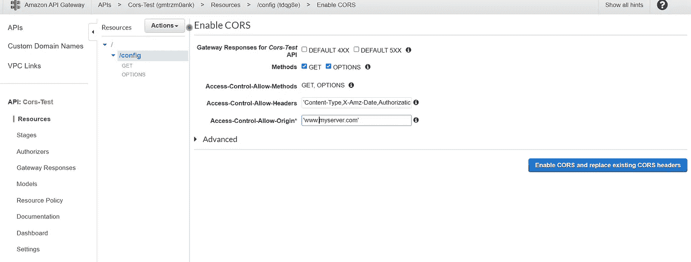
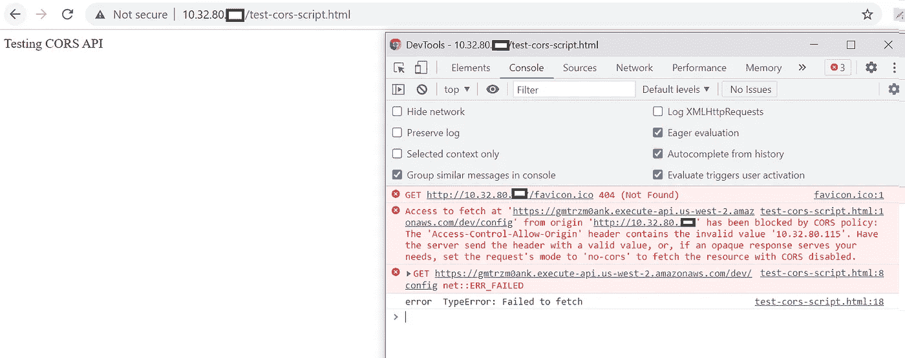

# 通过控制台/云结构在 API 网关中启用 CORS 的简单步骤

> 原文：<https://medium.com/geekculture/simple-steps-to-enable-cors-in-api-gateway-through-console-cloud-formation-c09d9df31c07?source=collection_archive---------4----------------------->

什么是 CORS？

**跨来源资源共享** ( [CORS](https://developer.mozilla.org/en-US/docs/Glossary/CORS) )是一种基于 HTTP 报头的机制，它允许服务器指示除了它自己以外的任何其他[来源](https://developer.mozilla.org/en-US/docs/Glossary/Origin)(域、方案或端口)，浏览器应该允许从这些来源加载资源。CORS 还依赖于一种机制，通过这种机制，浏览器向托管跨源资源的服务器发出“预检”请求，以检查服务器是否允许实际的请求。在该预检中，浏览器发送指示 HTTP 方法的标题和将在实际请求中使用的标题。

让我们看看如何启用 API 网关中的 CORS 来限制只能通过特定域访问 API。

我们有之前创建的 API，它基于 URI 路径返回文件。我们将使用这个 API 来配置 CORS 设置。

如果没有启用 CORS，可以通过公共 IP 和域访问该 API。但是，要通过私有服务器/域访问该 API 或限制通过特定服务器访问 API，我们必须通过控制台启用 CORS 设置。

我创建了一个简单的脚本来调用 AWS Rest API，并将其部署到一个私有 VM。我们将通过私有 IP 地址访问脚本，并研究启用和禁用 cors 时 API 的行为。

test-cors-script.html

```
<html>
  <head> </head>
  <body>
    <p>Testing CORS API</p>
    <script type="text/javascript">
      var apiUrl =
        "[https://gmtrzm0ank.execute-api.us-west-2.amazonaws.com/dev/config](https://gmtrzm0ank.execute-api.us-west-2.amazonaws.com/dev/config)";
      fetch(apiUrl, {
    method: "GET"
   })
        .then((response) => {
          return response.json();
        })
        .then((data) => {
          console.log("data ", data);
        })
        .catch((err) => {
          console.log("error ", err);
        });
    </script>
  </body>
</html>
```



部署了使用 S3 服务返回 test.json 文件内容的 API。



目前，我们刚刚部署了 API，还没有启用 cors，让我们首先检查从浏览器调用 API 时的行为。



当从浏览器调用时，API 会按预期返回文件的内容。

现在让我们通过从私有 VM 运行我们的脚本来调用相同的 API，我们将在开发人员的控制台中检查 API 的响应。



正如我们所看到的，当我们试图通过私有服务器访问它时，我们的脚本无法从同一个 API 获取响应。它给出了 CORS 标准误差。

现在，我们将为我们的 API 启用 CORS，然后将检查响应。要启用 CORS，请转到 API 网关，单击我们要启用 CORS 的方法。单击操作并启用 CORS。



选择所有选项来处理错误响应。如果您的 API 返回像 x-api-key 这样的额外头，您可以添加 access-control-allow-headers。您还可以在 access-control-allow-origin 中指定域，以限制 API 只能通过特定的服务器进行访问，或者如果您希望 API 可以从任何地方进行访问，也可以加上' * '。



当您使用 AWS 管理控制台启用 CORS 时，API Gateway 会创建一个“选项”方法，并尝试将 Access-Control-Allow-Origin 标头添加到现有的方法集成响应中。这个方法确保来自 API 的响应具有批准您的请求所需的头和域。启用 CORS 后，我们必须再次部署 API，以使更改对 API 产生影响。

正如您在下面看到的，现在我们能够从私有服务器通过脚本访问我们的 AWS API。



您还可以在 CORS 指定一个特定的域，以便只通过特定的服务器访问您的 API。



启用后，API 将只能从“www.myserver.com”访问它。当我们试图从不同的服务器或浏览器访问 API 时，它会给出如下所示的 CORS 错误。



所以这都是关于如何在 API 网关中启用 CORS。为了从云形成中配置相同的设置，我已经在[https://github.com/Rohan009/aws_s3_api_binary_files](https://github.com/Rohan009/aws_s3_api_binary_files)上传了所有需要的 YAML 和部署文件

上面的链接包含了 yaml 中配置 cors 的 allowedOriginHost 参数和 swagger 定义。

谢谢你。