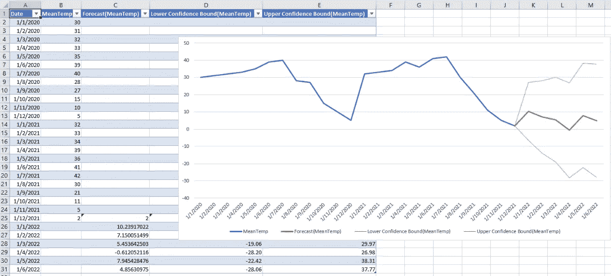

# Excel 中的简单时间序列预测

> 原文：<https://medium.com/geekculture/simple-time-series-forecasting-in-excel-876aa61e5d11?source=collection_archive---------5----------------------->

当对时间序列数据集执行数据分析时，人们希望根据可用的历史数据来预测给定值。然而，有大量不同的预测方法可用，其中最简单的一种方法只需在 Excel 中点击几次。

众所周知的传统预测方法是线性回归。线性回归非常好…