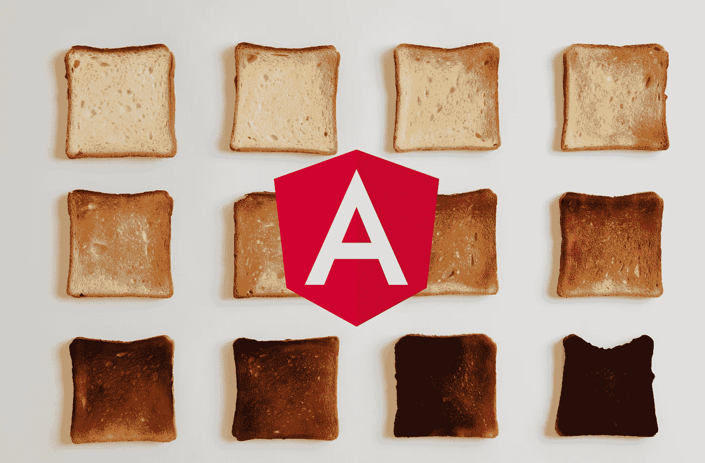
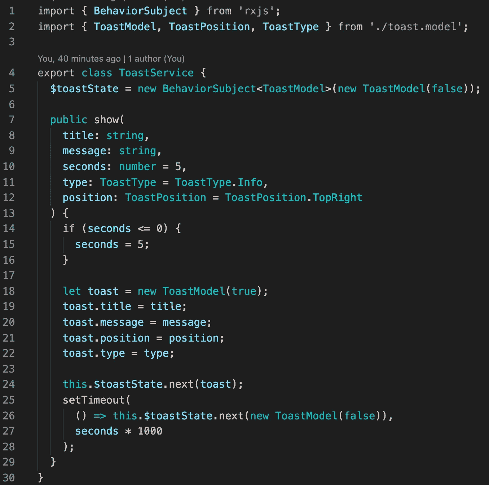
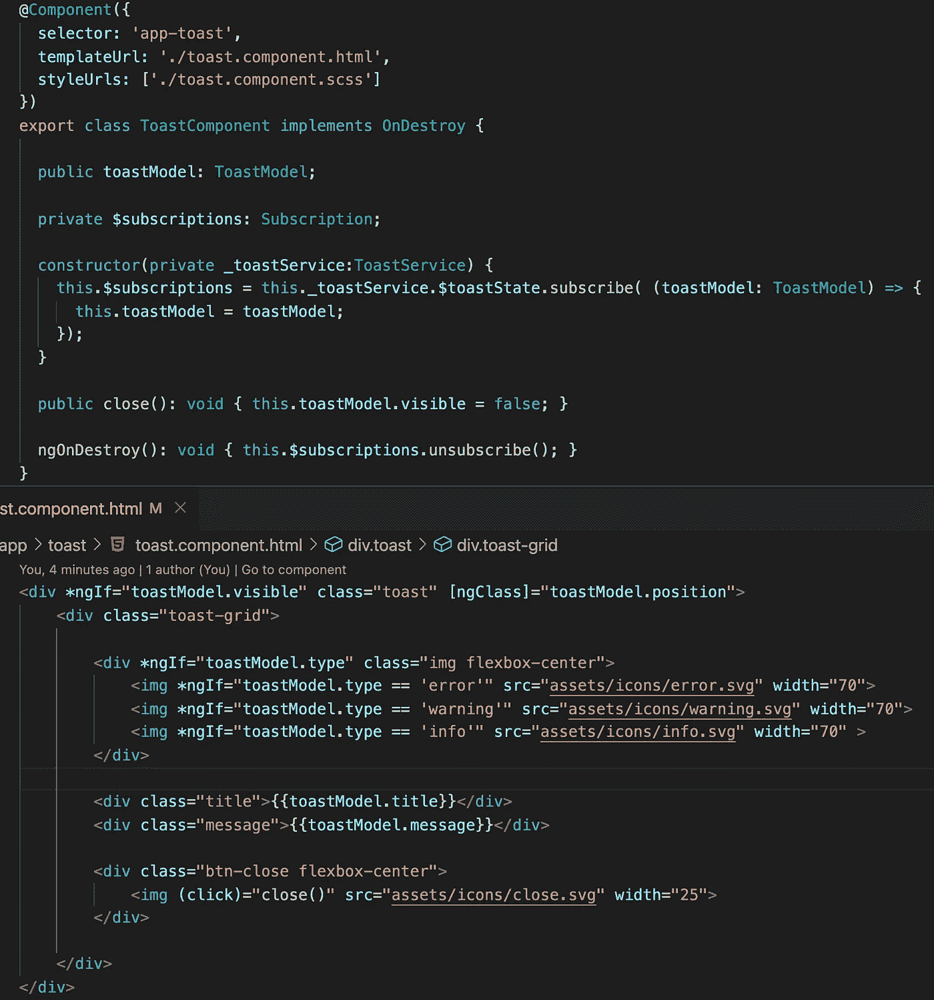
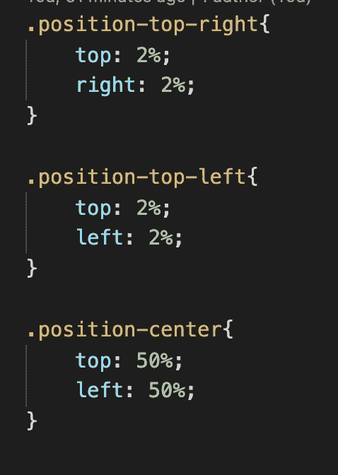
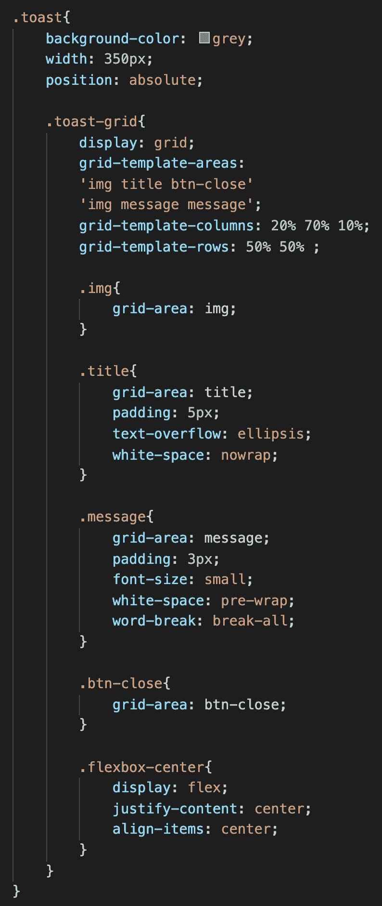
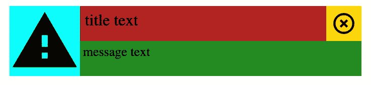
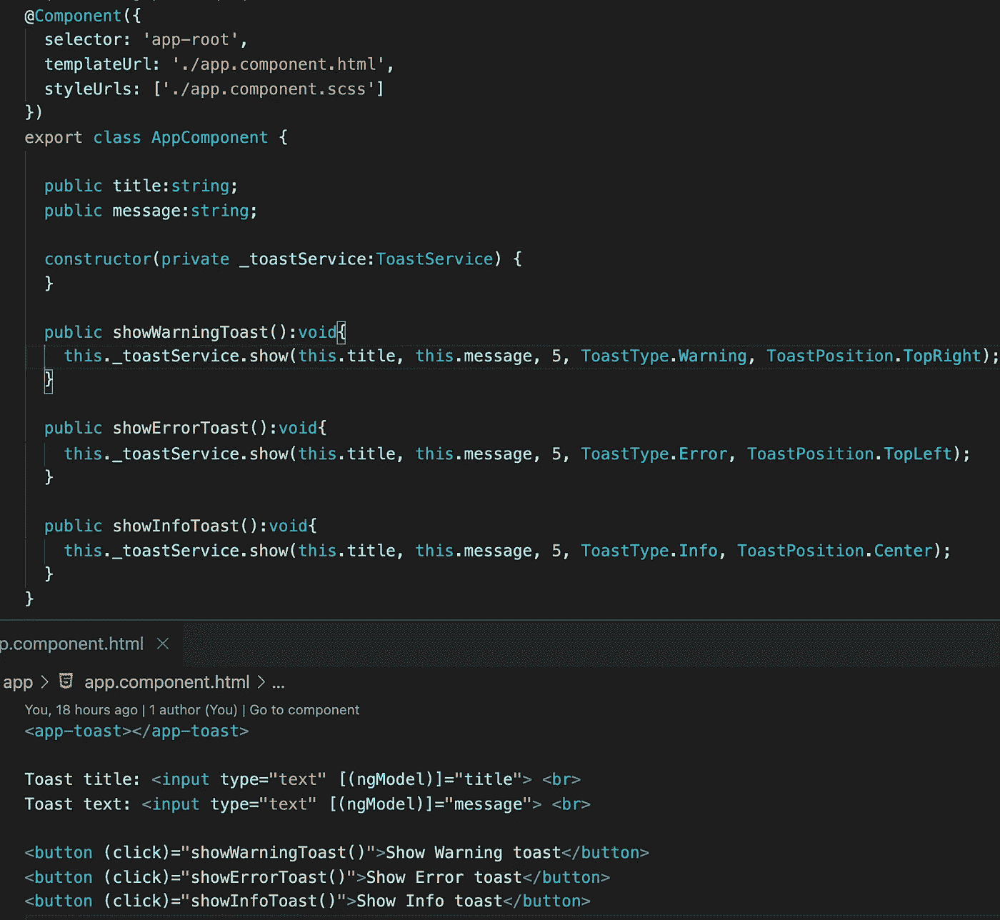
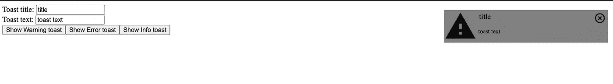

# 简单的 Toast 通知

> 原文：<https://medium.com/geekculture/simple-toast-notification-in-angular-f018b9aa3dc8?source=collection_archive---------6----------------------->

在本文中，我们将使用 Angular 制作我们自己的 toast 通知。

**型号**

我们的模型包含关于标题、消息、位置、通知类型的信息。

**服务**

toast 服务的主要部分是一个行为主体。使用此订阅，当我们需要显示 Toast 通知时，我们会收到通知。

**吐司分量**

在 toast 组件的类型脚本中，我们只进行订阅。此外，我们还有一个手动隐藏 toast 的额外方法。

HTML 文件非常简单。在这个文件中，我们有几个 ngIf 来显示不同通知类型的不同图标，我们显示标题和消息。我们从吐司模型中获取的所有信息。

最有趣的部分位于 CSS 文件中。这里我们定义了 toast 通知的位置。

为了让我们的 toast 通知更漂亮，我们使用了 CSS 网格方法。我们的网格有两行、三列和四个区域:不同通知类型的图标、标题、消息、关闭按钮。

如果我们在每个区域添加独特的颜色，我们的通知将如下所示。

**APP 组件**

在应用组件 HTML 中，我们使用 toast 组件，当然，在 typescript 中，我们使用 toast 服务来显示不同的 toast 通知。

因此，我们有一个简单的祝酒通知。

如果你需要仔细看看这个项目[，这里有链接](https://github.com/8Tesla8/angular-custom-toast-notification/)。

*原载于 2022 年 3 月 26 日 http://tomorrowmeannever.wordpress.com***。**