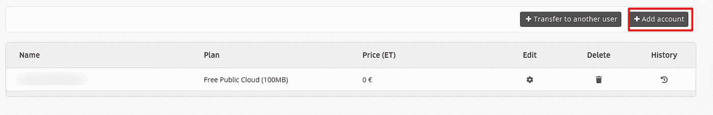
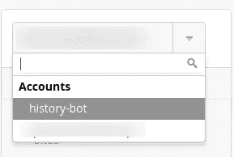
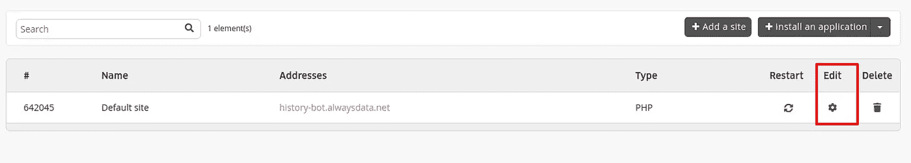
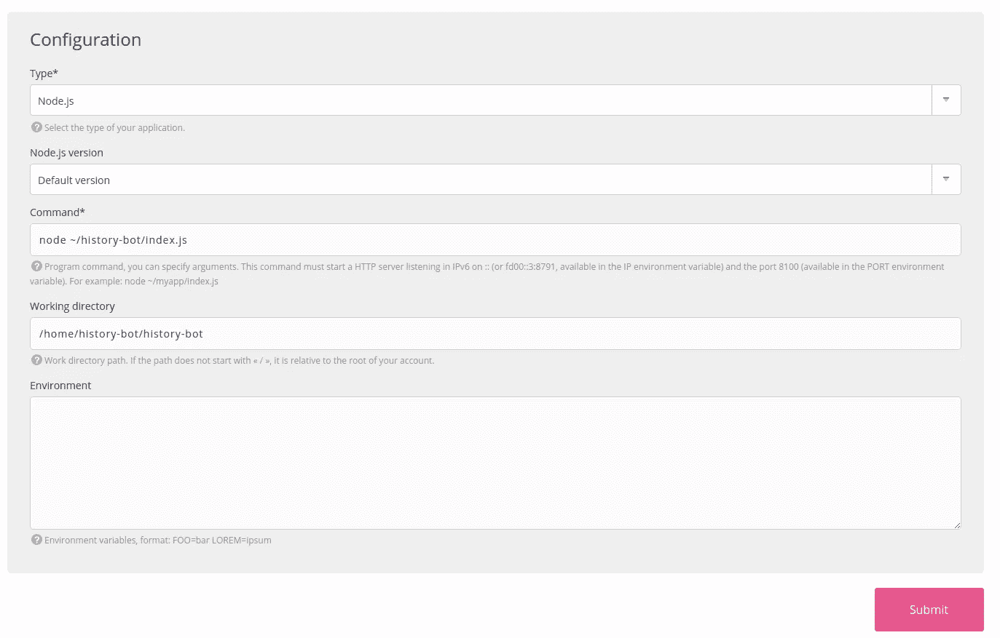
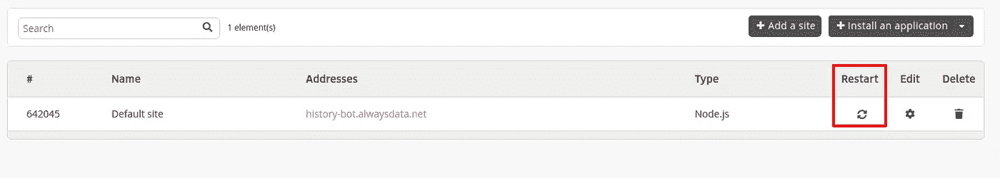
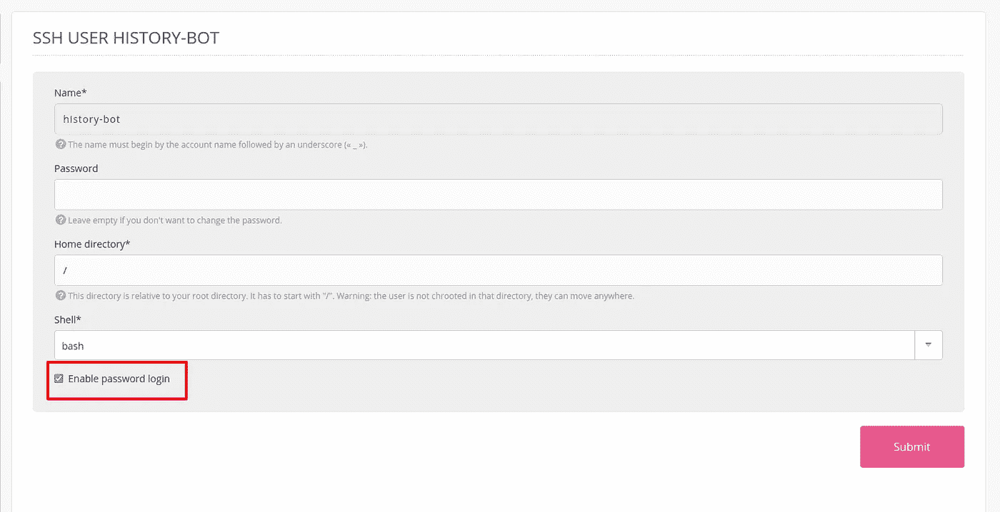
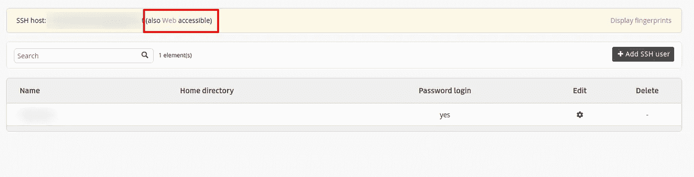
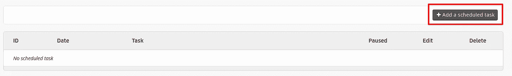
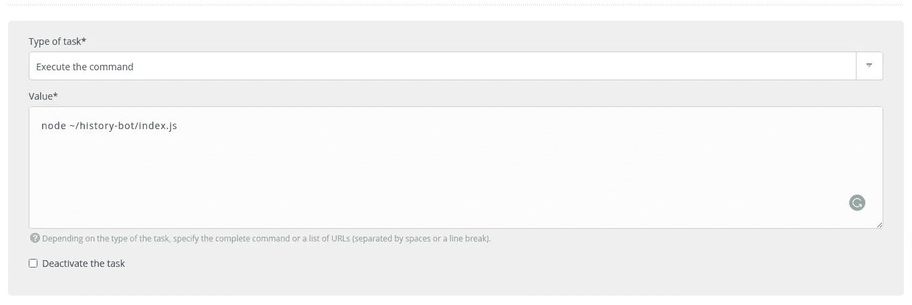

# 包含 Node.js 的简单 Twitter Bot 教程第 2 部分:部署到服务器并调度 Tweets

> 原文：<https://medium.com/geekculture/simple-twitter-bot-tutorial-with-node-js-part-2-deploy-to-server-and-schedule-tweets-bf093bbca1d9?source=collection_archive---------32----------------------->


*本文原载于* [*我的个人博客*](https://blog.shahednasser.com/simple-twitter-bot-tutorial-with-node-part-2/) *。*

你可以在这里查看第一部分。

在上一篇文章中，我们学习了如何用 Node.js 创建一个简单的 Twitter bot，它从 HistoryAPI 中的[T10 Today]获取数据，并在我们的帐户中发布。

在本文中，我们将介绍如何将 bot 部署到服务器上，并在一天中的特定时间运行 bot。

我还为历史机器人创建了一个新账户，而不是使用我的个人 Twitter 账户。可以在真人 [@HistoryBot7](https://twitter.com/HistoryBot7) 中查看

关于本教程的完整代码，可以查看 [GitHub 库](https://github.com/shahednasser/history-bot)。如果你还没有看完第一部分，我建议你再看一遍。

# 部署机器人

我将把我们上次创建的机器人部署到 [alwaysdata](https://shahednasserblog.herokuapp.com/simple-twitter-bot-tutorial-with-node-part-2/alwaysdata.com) 。它是免费的，提供了很多我们需要的选项，比如计划任务。但是，您可以自由地将 bot 部署到任何您想要的服务器上。

创建帐户后，如果您没有帐户，请转到侧栏“客户区”部分的帐户。如果您有帐户，您会找到一个帐户列表，或者您可以创建一个新的帐户。这些账号基本都是你自己主账号里的 app。如果您没有帐户，请点击“添加帐户”



然后你需要输入我们称之为“历史机器人”的帐户名称。alwaysdata 也将为您免费获得的子域使用此帐户名。然后在产品下拉列表中选择免费公共云。选中底部的复选框，完成后点击“提交”


单击“提交”后，将创建一个新帐户，您可以在其中添加机器人。确保在下拉字段的侧边栏菜单中选择了您创建的帐户。如果没有，请转到您创建的帐户。



现在转到侧边栏的网站下，你会发现一个新创建的网站。单击编辑以配置站点。



您可以更改网站的名称，并添加任何域名(如果您拥有任何域名的话)。然后，转到配置部分，将类型更改为“Node.js”。在命令字段中，输入`node ~/history-bot/index.js`，但要确保用您创建的应用程序的名称替换`history-bot`。在工作目录中输入`/home/history-bot/history-bot`,这背后的原因是我将把`history-bot`库克隆到`history-bot`应用中，所以你可以根据你所拥有的随意重命名它们。第一个是您创建的应用程序的名称，第二个是存储库的名称。



完成后，单击提交。然后在站点列表中，单击 Restart 以新的配置重新启动我们的站点。



重启站点后，我们需要将我们创建的 bot 部署到其中。为此，我们需要使用 SSH 来访问它。在侧边栏中，转到远程访问下的 SSH。然后，单击编辑，并在编辑屏幕中选中“启用密码登录”复选框。



如果您没有在“密码”栏中输入密码，您将使用您的 alwaysdata 帐户密码进行 SSH。要使用不同的密码，请在“密码”栏中输入。

完成后，点击提交。

用 SSH 访问你的站点有两种方法。一种是通过 web 界面 alwaysdata，您可以在主页的“SSH”部分看到它



当你点击它时，它会询问你的 SSH 名称和密码，如果你输入正确，你就可以使用网络终端。

另一种方法是使用`ssh`命令从终端访问:

```
ssh user@host
```

其中`user`可在表格中的`Name`下找到，而`host`可在表格上方的黄色警告中找到。然后系统会提示您输入密码，当您输入密码后，您将会登录。

进入后，输入以下命令来克隆您的存储库:

```
git clone [https://github.com/shahednasser/history-bot.git](https://github.com/shahednasser/history-bot.git)
```

如果你没有你的机器人库，你应该创建一个。

然后，转到克隆存储库的目录:

```
cd history-bot
```

并运行:

```
npm install
```

现在，我们需要用我们的密钥创建一个新的`.env`文件，所以复制`.env.sample`:

```
cp .env.sample .env
```

并编辑新的`.env`文件:

```
nano .env
```

您将需要输入您拥有的密钥，因此请确保它们已经保存并准备好供使用。

完成后，保存文件。

要确保 bot 正确运行，请运行以下命令:

```
node index.js
```

如果一切正常，一条新的 tweet 将被发送到密钥所属的帐户:


如果出现任何错误，请确保输入的密钥是正确的。要获得更多帮助，你可以检查[第 1 部分](https://blog.shahednasser.com/simple-twitter-bot-tutorial-with-node-js/)以确保一切配置正确。

# 安排推文

所以，这很好，但是机器人应该自己运行，而不是手动激活。因此，我们需要安排机器人每天运行。

返回到 alwaysdata，单击“高级”下的计划任务。然后点击“添加计划任务”



在第一部分中，选择“执行命令”作为任务类型，并在值类型中输入`node ~/history-bot/index.js`



在 Environment 部分，选择您正在使用的 SSH 用户，并输入我们之前输入的工作目录。

然后在“频率”部分，选择“每天”并输入您希望它运行的时间。请记住，这个时间是相对于您创建的应用程序的时区，默认情况下是在巴黎。要计算出应用程序所在时区的时间，请在 SSH 终端中运行以下命令:

```
date "+%H:%M:%S %d/%m/%y"
```

我建议现在测试它，在你读完本教程的几分钟后设置时间，这样你就可以检查它的工作情况

完成后，点击提交，并返回到网站下的网站部分，重新启动你的应用程序。

应该注意的是，由于我们用来创建机器人的简单性，我们总是发送我们从 API 接收的第一个事件。因此，如果您在创建这个任务之前运行了 bot，并且发出了一条 tweet，那么计划的任务将会运行，但是将会收到来自 Twitter 的错误消息“状态是重复的”。为了避免这种情况，请确保删除您之前测试机器人时发布的推文。

现在，你必须等到你选择的机器人运行的时间。一旦时间到了，给它几秒钟，检查你的帐户。如果你发现一条新的推文，那么这个机器人正在工作！

如果没有，您可以在您的应用程序中前往`~/admin/logs/jobs/2021`查看日志，并在那里查看日志。确保一切配置正确。

现在，每天在你发送的时间，一条历史上的今天推文将发送到你指定的帐户！


# 结论

在下一个教程中，我们将讨论如何转发其他用户制作的特定标签！

*原载于 2021 年 3 月 12 日 https://blog.shahednasser.com*[](https://blog.shahednasser.com/simple-twitter-bot-tutorial-with-node-part-2/)**。**