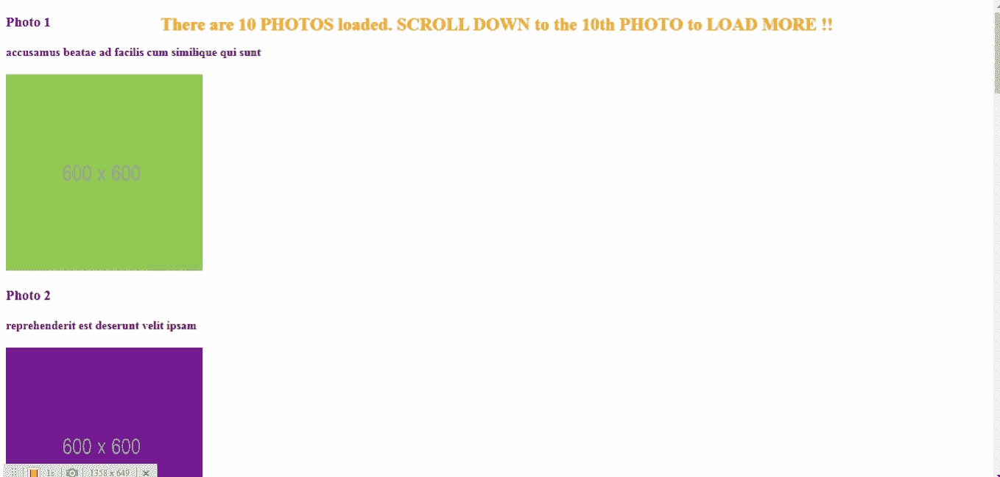

# 一种简单的方式来加载小块的数据，当你滚动角度

> 原文：<https://medium.com/geekculture/simple-way-to-load-small-chunks-of-data-as-you-scroll-in-angular-6a14ec498989?source=collection_archive---------1----------------------->

滚动时加载少量数据的概念也称为无限滚动。我在 Angular 中使用了**交叉点观察器 API** 来加载 5000 张照片，当我们滚动时，每 10 步加载一张。

当我第一次阅读它的文档时，这个 API 非常可怕。但它的整体概念相当简单。让我简单解释一下这个 API。假设您有一个父元素，在这个元素中有一个目标元素。这个 API 的任务是检测目标元素相对于父元素的交集的变化。当我说交集时，我的意思是**检测目标元素相对于父元素的可见性**。

这有什么用？你可能在 Youtube、Instagram、Twitter 等网站上遇到过这种情况，当你滚动到桌面/移动视窗上的最后一个视频、照片或推文时，应用程序就会加载下一组视频、照片或推文。调用服务器端点来获取大数据集的小块数据会更快，用户体验也会更好。

我已经创建了一个小角度的项目，将加载 10 个块的 **5000 张照片** **。最初只有 10 张照片加载。**当您滚动到第 10 张照片时，将加载接下来的 10 张照片。这将继续下去，直到所有 5000 个都装载完毕。****

下面是一个 1 分钟的演示我们将要建立什么。



让我们从显示照片的**album 组件**开始。

**AlbumComponent Template** :我们只是在一个相册中遍历一组照片 **albumData** 。这 5000 张照片的数组是从从 **album.ts** 导出的数组中检索的，而不是从任何服务器中检索的。在一个实际的应用程序中，您将通过 API 调用一次获取 10 张照片。

```
<div class=”message”>
<h2>
There are {{ albumData.length }} PHOTOS loaded. SCROLL DOWN to the
{{ albumData.length }}th PHOTO to LOAD MORE !!
</h2>
</div>

<ng-container *ngFor=”let album of albumData; let i = index”>
<div class=”box” appAmIVisible (elementVisible)=”getAlbumData($event)”
[isTargetElement]=”album.id == albumData.length”>

<h3>Photo {{ album.id }}</h3>
<h4>{{ album.title }}</h4>

</div>
</ng-container>
```

数组中的每个对象都有这样的结构。

```
{
“albumId”: 1,
“id”: 1,
“title”: “accusamus beatae ad facilis cum similique qui sunt”,
“url”: “https://via.placeholder.com/600/92c952",
“thumbnailUrl”: “https://via.placeholder.com/150/92c952"
},
```

请注意**<div class = " box ">**元素。每张照片都是这个元素及其所有内容，如照片标题、照片图像、照片 id 等。

我们为每个**<div class = " box ">**元素添加了一个带有选择器 **appAmIVisible** 的自定义指令 **AmIVisibleDirective** 。

该指令的目的是什么？这个指令会让我们知道用户何时可以看到屏幕上加载的最后一张照片。一旦我们有了这些信息，我们将获取下一组 10 张照片。

让我们把最后加载到屏幕上的这张照片称为**目标照片**。

我们已经向该指令传递了一个@Input() **isTargetElement** 。 **isTargetElement** 是一个布尔属性，告诉指令**屏幕上的目标照片**。只有当指令知道这一点时，它才能发现这个目标照片在屏幕上对用户是否可见。

从指令传递给组件的@Output() **elementVisible** 也是一个布尔值，它将告诉组件**目标照片对用户是否可见。**每当指令将该信息传递给组件时，在组件中使用参数 true/false 调用 **getAlbumData()** 。

参数 **true** 表示用户现在可以在屏幕上看到目标照片，组件可以继续获取下一组 10 张照片。

参数 **false** 表示用户在屏幕上看不到目标照片，组件现在必须什么都不做。

**白蛋白成分类别:**

```
export class AlbumComponent implements OnInit {
constructor(private dataService: DataService) {}

public albumData: any = [];

ngOnInit() {
window.scroll(0, 0);
this.getAlbumData(true); //for the first time
}

getAlbumData(fetchData: boolean) {
if (fetchData) {
this.dataService.fetchAlbums(this.albumData.length).subscribe(
(response) => {
this.albumData = this.albumData.concat(response);
},
(err) => {
console.log(err);
}
);
}}
}
```

在 **ngOnInit 生命周期挂钩**中，我们执行 2 个步骤:

1.  滚动到屏幕顶部的用户。

2.我们调用 **getAlbumData()，**传递 **true** 作为参数。参数 **fetchData** 决定是否需要从数据服务中获取照片。

这里 **true** 被传递给参数 **fetchData** ，因为我们需要向用户显示最初的 10 张照片。该参数可能是真/假，这由指令决定。我们将在后面的故事中看到这一点。

在这个方法中，我们调用**数据服务**的 **fetchAlbums()** 来获取从 **album.ts** 导出的数组中的前 10 张照片。

一旦获取了数据，我们**将这 10 张照片(1-10)连接到 **albumData** 的先前内容。这一步很重要，因为当我们滚动到第 10 张照片时，我们需要获取接下来的 10 张照片(11–20)，这些照片又需要与前面的 10 张照片(1–10)连接起来。**

```
this.albumData=this.albumData.concat(response);
```

让我们最终转向**amivisible direct。**

```
@Directive({selector: ‘[appAmIVisible]’})

export class AmIVisibleDirective {
constructor(private element: ElementRef) {}

@Output(‘elementVisible’) elementVisible = new EventEmitter<boolean>();
@Input(‘isTargetElement’) isTargetElement: boolean;

public intersectionOptions = {
root: null, //implies the root is the document viewport
rootMargin: ‘0px’,
threshold: [0, 0.5, 1],
};

ngAfterViewInit() {
let observer = new IntersectionObserver(
this.intersectionCallback.bind(this),
this.intersectionOptions
);

if (this.isTargetElement) {
observer.observe(this.element.nativeElement);
}
}

intersectionCallback(entries, observer) {
entries.forEach((entry) => {
if (entry.intersectionRatio === 1) {
this.elementVisible.emit(true); //element is completely visible in the viewport
} else {
this.elementVisible.emit(false);
}
});
}
}
```

在这个指令中，我们**建立了交叉点观察器 API 来检测用户滚动时目标照片在视窗中的可见性的变化。**

我们首先在属性 **intersectionOptions 中定义了交叉点观察器 API 选项。**

```
public intersectionOptions={
root:null, //implies the root is the document viewport
rootMargin:”0px”,
threshold:[0, 0.5, 1]
}
```

**root:null** 表示根或父元素是文档视窗。

**rootMargin** 暗示根元素周围的空白空间。

**threshold:[0，0.5，1]** 表示一旦目标元素(根元素)在视口中的可见性超过 0%或 50%或达到 100%，API 就会发出通知。

```
ngAfterViewInit() {
let observer = new IntersectionObserver(
this.intersectionCallback.bind(this),
this.intersectionOptions
);

if (this.isTargetElement) {
observer.observe(this.element.nativeElement);
}
}
```

在**ngafterviewit()生命周期钩子**中，我们通过调用其构造函数创建了一个名为 **observer** 的交集观察器，并传递了回调函数 **intersectionCallback()** 和属性 **intersectionOptions** 作为参数。

```
if (this.isTargetElement) {
observer.observe(this.element.nativeElement);
}
```

接下来，我们调用一个方法 **observe()** 在这个 observer 上，只有当当前的< div class="box" >元素是目标元素的时候。如前所述,@ Input()**isTargetElement**属性为我们提供了这些信息。

如果 **isTargetElement** 为**真，**那么当前元素就是目标元素，**我们已经给了观察者一个要观察的目标元素。**

之前提到的回调函数 **intersectionCallback()** 会在 threshold 跨过 0%或 50%或 100%时执行。

```
intersectionCallback(entries, observer) {
entries.forEach((entry) => {

if (entry.intersectionRatio === 1) {
this.elementVisible.emit(true); //element is completely visible in the viewport
} else {
this.elementVisible.emit(false);
}
});
}
```

在这个回调函数中，我们传递了前面定义的观察者和一个名为 entries 的参数，该参数给出了目标元素相对于 viewport(根元素)的交集细节。

这里我们检查目标元素的交集细节的 **intersectionRatio** 属性的值是否为 1。这个比率可以取 0 到 1 之间的任何值，因为我们前面为 threshold 定义的值的范围在 0 到 1 之间。

当 **intersectionRatio** 为 1 时，这意味着目标照片在视口中完全可见，并且@ Output()**element visible**将通过将 **true** 传递给组件中的 **getAlbumData()** 来将这一点传达给组件。

如果 **intersectionRatio** 不是 1，这意味着目标照片在视口中不完全可见，并且@ Output()**element visible**将通过将 **false** 传递给组件中的 **getAlbumData()** 来将这一情况传达给组件。

只有当 **getAlbumData()** 收到的参数为 **true** 时，它才会获取下一组 10 张照片。

您可以在下面找到完整的工作示例。

[](https://stackblitz.com/edit/angular-9a25dh?file=src/app/album/album.component.ts) [## 角形(叉形)堆叠

### 基于@angular/animations、@angular/common、@angular/compiler、@angular/core、@angular/forms 的 angular-cli 项目…

stackblitz.com](https://stackblitz.com/edit/angular-9a25dh?file=src/app/album/album.component.ts)